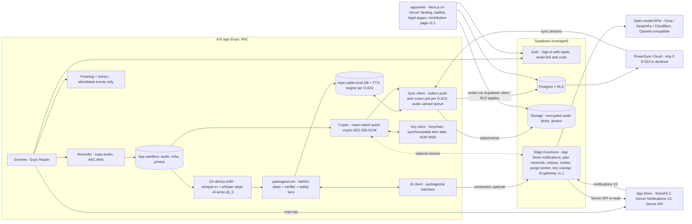

# Early Letters (`scribe`) — System Architecture

Status: Proposed, 1 October 2026; **updated 3 October 2026** (see the status box below). Owner: founder. Audience: founder, Claude Code sessions, future engineers.
Every factual claim about a model, library, licence, price or limit cites a page opened on 1 Oct 2026 (see Sources, numbered [S#]). Anything not backed by an opened page is marked **Unverified**. Prices change; re-check before committing money.

> **Status update, 3 Oct 2026. Read this before anything below.** Later decisions win over this document where they differ (PRD.md 1.3, `docs/DECISIONS.md`, TDD 01 to 10). Agents must not rebuild what was removed.
>
> | Topic in this document | Current position | Source |
> |---|---|---|
> | Payments through RevenueCat (diagram `RC`, section 7, section 10) | **Superseded.** Plus ships in v1.0 through the App Store only: StoreKit 2 via `expo-iap`, App Store Server Notifications V2 to an Edge Function, App Store Server API re-reads, random `appAccountToken`; no RevenueCat | ADR 0013, D-001, PRD K-34 |
> | Printed books, Lulu, card payments (`LULU`, `PAY`, "print orders") | **Future launch.** v1 is digital only | PRD K-32 |
> | `safety_events` server row (section 4 step 4) | **Removed.** Tiers are computed and stored on the device only; the table is dropped | PRD K-06, LEGAL-REQ-015 |
> | PowerSync with op-sqlite (sections 1, 3, 4, 5, 8, 10; R4) | **Under review.** Recommended for v1.0: outbox push and cursor pull on expo-sqlite (already shipped), one visibility table `book_access`; ADR 0004 stands until the founder confirms | D-023, D-024, PRD K-39 |
> | Encrypted backup with per-child keys, iCloud Keychain sync and escrow (ADR 0006; `KC`, step 8) | **Reduced for v1.0 (pending D-032).** One per-file key wrapped by a server-held key; Free uploads recordings in shared books, Plus uploads all; Vault mode and member key grants later | D-032, PRD K-40 |
> | "Auth - magic link" | Sign in with Apple plus email link and 6-digit code at v1.0; Google in v1.1 | PRD A, D-044 |
> | Web contribution page on `apps/web` | **v1.1.** v1.0 family members write from the iOS app | D-002, PRD K-35 |
> | AI gateway and cloud transcription (`AIC`, `OAI`, step 3 model pass) | **Not in v1.0.** On-device transcription and rules-only fixes; gateway in v1.1 with consent | PRD section 3.0 |
> | Analytics (`OBS`) | PostHog and Sentry, opt-in only, at launch | D-003, PRD K-01 |
> | Speech model in the app sandbox | Model in Application Support, excluded from backup; recordings stay in a backed-up directory | ADR 0001, D-033 |
> | Section 7 cost model | See TDD 06 section 4 and TDD 10 section 5.2 for the current estimates (model egress, PowerSync clients) | TDD 06, TDD 10 |

---

## 1. Context

Early Letters lets parents and invited close family speak or type notes and letters to a child. The app transcribes, repairs only mechanical mistakes, keeps the audio, and assembles a memory book by the child's month of age. "Read together" plays a letter in the author's voice with words highlighted.

What is already built and stays:

| Piece | State | Keep? |
|---|---|---|
| `apps/ios` Expo SDK 57, Expo Router, RN 0.86, TS | scaffold | Yes |
| `packages/core` faithful-edit engine: typed edits against the immutable raw transcript, verifier rejects meaning-adding edits, `ENGINE_VERSION` stamped on entries | 36 tests | Yes. It is the product's moat and is pure TS, so it runs on phone, server and web |
| `supabase/migrations` profiles, children, child_members, hashed invites, entries (immutable raw, machine_edits, tombstones, version trigger, FTS), dictionary_terms, safety_events, private photo bucket, RLS | 36 access tests | Yes |
| `experiments/` whisper.cpp kit (base, small, large-v3-turbo-q5_0, Silero VAD) | ready | Yes; it becomes the ASR evaluation harness |
| Planned: whisper.rn, expo-sqlite, Supabase, Vercel | — | whisper.rn yes; **expo-sqlite replaced by op-sqlite** because the chosen sync engine requires it (ADR 0004); Supabase and Vercel yes |

Two designers are choosing the UI library; this document does not touch UI.

## 2. Quality attributes (ranked)

1. **Durability of the keepsake.** Nothing a parent records is ever lost or silently changed. Raw transcript immutable, audio kept, open formats, export always works. Beats every other attribute.
2. **Fidelity.** The machine repairs, never rewrites (enforced by `packages/core` verifier, not by prompt).
3. **Privacy.** Content stays on the phone by default. Anything that leaves is disclosed and consented (Apple requires explicit permission before sharing personal data with third-party AI, guideline 5.1.2(i) [S20]).
4. **Offline-first reliability.** Record, transcribe, review, save and read without network. Sync is eventual.
5. **Low cost** now and at 100k families; no per-minute cloud ASR as the default path.
6. **Operability by a solo non-engineer.** Few mainstream managed components, each with a documented exit.
7. **Evolvability.** Swap models and providers by config; web later without a rewrite.

## 3. Component diagram



## 4. Data flow: capture to read together

| Step | Where | What happens | Stored |
|---|---|---|---|
| 1. Capture | Phone | expo-audio records AAC-LC mono M4A (ADR 0005). Typed entries skip to step 3. | `audio/<entry_id>.m4a` in app sandbox; local row `status=recorded` |
| 2. Transcribe | Phone | whisper.rn runs large-v3-turbo q5_0 (or small q5_1 on low-memory devices) with the family dictionary rendered into the initial prompt, Silero VAD, token timestamps on. If the model is not downloaded yet, the entry waits in a queue; the audio is safe. | `raw_transcript` (immutable), `stt_meta` {engine, model, version, prompt hash, per-token timestamps, avg log-prob} |
| 3. Clean | Phone (rules) + optional model | `faithfulClean()` applies dictionary fixes, fillers, repeats. If the edit pass is enabled, the AI gateway proposes typed edits as JSON; the verifier accepts or rejects each one. | `machine_edits` (accepted + rejected, with source), `final_text`, `engine_version` |
| 4. Safety tier | Phone | Deterministic tiers in `packages/core/safety.ts`, behind `safety_card_enabled` (D-034). Never blocks the save; may show a gentle resource card. | Local database only; no server row (PRD K-06) |
| 5. Review | Phone | Author sees cleaned text with every edit visible and undoable; can lock phrases and add dictionary terms (which teach future transcriptions). | Updated `machine_edits`, `entry_versions` via trigger |
| 6. Save | Phone | Single local transaction. App is now "done" from the user's view. | local DB |
| 7. Sync | Phone ↔ Supabase | v1.0 (recommended, D-023): an outbox pushes batches through one idempotent RPC under RLS; a cursor pull fetches own rows and rows `book_access` allows. (ADR 0004 alternative: PowerSync uploads through the Supabase client [S27] and downloads through Sync Streams.) | Postgres |
| 8. Shared voice and backup | Phone → Storage | Audio encrypted on device (per-file key, AES-256-GCM); the file key is wrapped by a server-held key (D-032, pending). Free uploads recordings of letters in shared books; Plus uploads all. Own upload queue, retried until success. | `audio_blobs` row (path, size, sha256, wrapped file key), ciphertext in Storage |
| 9. Book | Phone / web | Entries where `in_book = true` (author's choice; family contributions need parent approval) grouped by child's month of age. PDF rendered from a shared HTML book template in `packages/book`. | PDF on device; nothing extra server-side |
| 10. Read together | Phone (web later) | Plays the M4A; highlights words using timestamps mapped from raw tokens to final text through the stored edit offsets (fillers removed by an edit simply have no highlight). | `alignment` JSON (word → start/end ms, source, quality score) |

The key design move in step 10: because every edit is stored as an offset range against the raw transcript, the ASR's raw-token timestamps can be projected onto `final_text` deterministically. No second alignment pass is needed when the ASR timestamps are good enough (ADR 0009).

## 5. On-device vs server split

| Capability | Default location | Server role | Why |
|---|---|---|---|
| Recording, playback, storage of audio | Device | Encrypted backup only (opt-in) | Privacy, offline, cost |
| ASR | Device (whisper.rn) | Fallback when device cannot (old iPhone, model not downloaded and user wants text now, re-transcribe with a better model) | Cost near zero; offline |
| Faithful clean (rules) + verifier | Device (also runs on server/web, same code) | Re-derive on engine upgrade | Deterministic, reproducible |
| JSON edit pass (LLM) | Hosted open-weights via gateway, opt-in | Gateway holds keys, logs nothing but token counts | Small on-device LLMs are large downloads; see ADR 0003 |
| Safety tier 1 | Device | Optional small classifier later via gateway | Must work offline, never block |
| Search | Device FTS (op-sqlite) + Postgres FTS (already in schema) | Semantic search later | Simple first |
| Book PDF | Device / browser | Print-ready PDF for Lulu later (server) | Free export without infra |
| Key escrow | — | Edge Function wraps family key with a server secret (opt-out) | Recovery for non-technical parents (ADR 0006) |

## 6. AI model plan

Assumptions for cost columns: an active family makes **20 spoken entries/month, 2 min each = 40 audio-minutes**; 20% of minutes go to server fallback; edit pass on every spoken entry at ~1,000 input + 200 output tokens. Hosted prices are list prices on the cited pages.

| Capability | Model | Runs where | Licence | Cost per active family per month |
|---|---|---|---|---|
| ASR primary | Whisper large-v3-turbo, ggml q5_0, 574 MB [S3] (+ Core ML encoder optional, 1.17 GB zip [S3]) | Device via whisper.rn (MIT, iOS 15+, Core ML, VAD, initial prompt, token timestamps, Expo via prebuild/dev client) [S1] | whisper.cpp MIT [S2]; Whisper weights MIT (Unverified, not opened this session) | $0 |
| ASR low-memory | Whisper small q5_1, 190 MB [S3] | Device | same | $0 |
| ASR server fallback | Whisper large-v3-turbo | Groq: $0.04/audio hour, 10 s minimum billed, word timestamps, 224-token prompt [S10] | — | 8 min × $0.04/60 ≈ **$0.0053** |
| ASR fallback (cheaper alt) | Whisper large-v3-turbo | DeepInfra: $0.0002/min, "zero retention" [S12] | — | 8 × $0.0002 ≈ **$0.0016** |
| Hinglish upgrade (v1.x, evaluate) | `Trelis/whisper-hinglish-preview` (large-v3 fine-tune): 13.67% vs 29.74% WER for base large-v3 on CoSHE-500 Hinglish [S9] | Self-hosted or a host that accepts custom weights (Unverified) | Apache 2.0 [S9] | Unknown until hosted |
| Edit pass (JSON) | Qwen3.5-9B | DeepInfra: $0.10 / $0.15 per M tokens in/out [S33] | Qwen family Apache 2.0 (Qwen3-1.7B card [S22]; 3.5-9B licence Unverified) | 20k in + 4k out ≈ **$0.0026** |
| Edit pass alt | gpt-oss-20b / Qwen3 30B | Cloudflare Workers AI: $0.20/$0.30 and $0.051/$0.335 per M [S11] | Unverified | ≈ $0.005 |
| Edit pass on-device (later) | Apple Foundation Models (on-device, guided generation via `@Generable`, Apple Intelligence devices only) [S21]; or Qwen3-1.7B (Apache 2.0, 32k ctx) [S22] via llama.rn (MIT, Metal, JSON-schema/GBNF constrained output, Expo plugin) [S23] | Device | Apple proprietary, free; Apache 2.0 | $0 |
| Safety second pass (later) | Same small hosted model with a fixed label schema | Gateway | as above | < $0.001 |
| Word alignment | Whisper token timestamps (whisper.cpp marks word-level timestamps "experimental") [S2]; server: Groq word granularity [S10] | Device first | — | $0 (included in ASR) |

**Licence summary.** Prefer Apache 2.0 / MIT weights: Whisper/whisper.cpp (MIT), Qwen3 (Apache 2.0) [S22], Gemma 4 (now Apache 2.0, released 2 Apr 2026) [S24][S25], IndicWhisper/Vistaar and IndicConformer (MIT) [S6][S32], Hinglish Whisper fine-tune (Apache 2.0) [S9]. Avoid in v1: Llama 3.x community licence (custom terms incl. a 700M-MAU clause and attribution; licence page redirect could not be opened, so details **Unverified**), NVIDIA Parakeet/Canary (CC-BY-4.0, fine commercially, but **no Hindi**) [S4][S31], Moonshine legacy non-English weights (non-commercial community licence) [S5].

## 7. Cost model

### Assumptions
- Active family = 2.2 members (MAU), 40 audio-min/month, 20 entries/month.
- Audio AAC-LC mono 64 kbps → 0.48 MB/min (arithmetic: 64,000 bit/s × 60 / 8) → ~19 MB/family/month. 50% opt into cloud backup.
- Analytics: ~300 events/family/month.
- Supabase Pro $25/month includes 100k MAU then $0.00325/MAU, 8 GB DB then $0.125/GB, 100 GB files then $0.0213/GB, 250 GB egress then $0.09/GB [S13][S14].
- PowerSync Pro from $49/month: 30 GB sync, 10 GB storage, 1,000 concurrent clients; $1/GB and $30 per 1,000 extra clients [S16].
- Apple commission 15% under Small Business Program (≤ $1M proceeds) [S19]. RevenueCat free to $2.5k MTR then 1% [S18] (no longer used: ADR 0013).

### Monthly run-rate

| Line | 1k families | 100k families (end of year 1) |
|---|---|---|
| Supabase Pro base | $25 | $25 |
| Supabase MAU overage | $0 (2.2k MAU) | 220k − 100k = 120k × $0.00325 = **$390** |
| Supabase Storage (cumulative audio backup) | ~115 GB after 12 mo → ~$0.30 | ~11.4 TB → ~$241, growing ~$20/month |
| Supabase DB size | < 8 GB → $0 | ~150 GB → ~$18 |
| Supabase egress (read-together of backed-up audio, restores) | $0 | ~1 TB → ~$68 |
| Supabase compute upgrade | $0 (credits) | **Unverified**; budget $100–$400 |
| PowerSync | $0 (Free in dogfood) → $49 | $49 + ~2k extra concurrent ($60) + ~20 GB ($20) ≈ $130 |
| Server ASR fallback (Groq) | ~$5 | ~$530 (DeepInfra: ~$160) |
| LLM edit pass (DeepInfra Qwen3.5-9B) | ~$3 | ~$260 |
| PostHog | $0 (300k events < 1M free) [S35] | ~30M events: overage **Unverified**; cut to ~50 events/family to stay small |
| Sentry | $0 Developer (5k errors, 1 user) or $26 Team (50k errors) [S36] | $26 + overage |
| Vercel (web) | **Unverified** (Hobby is reportedly non-commercial; assume Pro ~$20) | Unverified |
| **Total** | **≈ $85–$135 / month (~$0.10 per family)** | **≈ $1.8k–$2.4k / month (~$0.02 per family)** |

Not included: Apple Developer fee ($99 a year, individual or organisation, Apple enrollment page opened 3 Oct 2026), Lulu print costs (pass-through to buyer, future launch). RevenueCat's 1% no longer applies (ADR 0013). The dominant 100k costs are MAU and the cumulative audio store, not AI. Moving server ASR to a self-hosted GPU only makes sense once fallback spend is a meaningful share of the bill (GPU pricing **Unverified**, not researched).

## 8. Security and privacy architecture

**Data classes**
| Class | Examples | At rest on phone | In transit | At rest on server | Who can read server copy |
|---|---|---|---|---|---|
| C1 Voice | M4A audio | App sandbox, iOS Data Protection (Unverified class default) | TLS | Client-encrypted ciphertext in private bucket | Nobody without the family key (Vault mode) or the service via escrow (default mode) |
| C2 Words | raw transcript, final text, edits | op-sqlite, optionally SQLCipher (op-sqlite SQLCipher support Unverified; expo-sqlite has `useSQLCipher` [S30]) | TLS | Postgres, RLS per child membership | Authors and family members per RLS; service role |
| C3 Identity | email, names, child DOB | local | TLS | Postgres | RLS |
| C4 Telemetry | allowlisted events, crashes | — | TLS | PostHog / Sentry | Founder |

**Controls**
- RLS is the single access model. Sync Streams in PowerSync must mirror it; add a parity test to the existing 36 access tests (each RLS-visible row set equals the stream's row set for fixture users).
- Writes never bypass RLS: PowerSync uploads go through the Supabase client [S27].
- AI gateway is a Supabase Edge Function: holds provider keys, strips user ids, sends only the text needed, logs token counts and latency but no content. Providers chosen for retention terms: Groq does not retain inference data by default, may log up to 30 days for reliability/abuse unless Zero Data Retention is enabled in Data Controls [S26]; Cloudflare does not use customer content to train or improve services [S28]; DeepInfra states zero retention [S12]. Enable Groq ZDR.
- Consent: first time any content would leave the device for AI, a plain-language sheet asks; the choice is stored per profile. Without consent, server fallback and the LLM pass are off and the app still works (rules-only clean, on-device ASR).
- Telemetry carries no content: typed event allowlist (ADR 0008).
- Deletion: tombstones sync; a scheduled job hard-deletes tombstoned rows and blobs after 30 days; account deletion in-app.
- Export: one button produces a ZIP: `entries.json` (raw, edits, final, timestamps), `audio/*.m4a`, `book.pdf`, `README.txt` describing formats. Works offline from local data.

## 9. Provider-agnostic AI gateway

One interface in a new pure-TS package `packages/ai`, used by the app (client side) and by the Edge Function (server side). Providers are selected by environment config, never by code changes.

```ts
// packages/ai/src/types.ts
export type Capability = 'transcribe' | 'edit_pass' | 'safety_classify' | 'suggest_prompt' | 'align';

export interface TranscribeRequest {
  audio: { uri: string; mime: 'audio/mp4' | 'audio/wav' | 'audio/ogg' };
  languageHint?: 'en' | 'hi' | 'auto';
  vocabulary: string[];            // from dictionary_terms, rendered into the prompt
  wantWordTimestamps: boolean;
}
export interface TranscribeResult {
  text: string;
  words?: { text: string; startMs: number; endMs: number; p?: number }[];
  language?: string;
  engine: { provider: string; model: string; version: string };
}

export interface JsonTaskRequest<TSchemaName extends string = string> {
  task: 'edit_pass' | 'safety_classify' | 'suggest_prompt';
  schema: TSchemaName;             // JSON Schema registered in packages/ai/schemas
  input: Record<string, unknown>;  // structured input only; never free-form chat
  maxOutputTokens: number;
}
export interface JsonTaskResult<T = unknown> {
  output: T;                       // validated against schema before return
  usage: { inputTokens: number; outputTokens: number };
  engine: { provider: string; model: string; version: string };
}

export interface AIProvider {
  readonly id: string;             // 'whisper-rn' | 'apple-fm' | 'openai-compatible:groq' | ...
  readonly runsOn: 'device' | 'server';
  supports(cap: Capability): boolean;
  transcribe?(req: TranscribeRequest, signal?: AbortSignal): Promise<TranscribeResult>;
  json?<T>(req: JsonTaskRequest, signal?: AbortSignal): Promise<JsonTaskResult<T>>;
}

export interface AIRouter {
  /** Ordered fallback chain per capability, from config. */
  route(cap: Capability): AIProvider[];
}
```

Config (`AI_ROUTES` env on the server, remote-config JSON on the device):

```json
{
  "transcribe": ["whisper-rn:large-v3-turbo-q5_0", "whisper-rn:small-q5_1", "openai-compatible:groq/whisper-large-v3-turbo"],
  "edit_pass": ["openai-compatible:deepinfra/Qwen/Qwen3.5-9B", "openai-compatible:cloudflare/@cf/openai/gpt-oss-20b"],
  "providers": {
    "groq": { "baseUrl": "https://api.groq.com/openai/v1", "keyEnv": "GROQ_API_KEY" },
    "deepinfra": { "baseUrl": "https://api.deepinfra.com/v1/openai", "keyEnv": "DEEPINFRA_API_KEY" }
  }
}
```

Base URLs above are **Unverified** (from general knowledge); confirm when wiring. One adapter, `OpenAICompatibleProvider`, covers every hosted open-model vendor; device adapters wrap whisper.rn, llama.rn and (later) a small Expo module for Apple Foundation Models / SpeechAnalyzer. Every result records `engine` so entries can be re-derived. Every `edit_pass` output still goes through `verifyEdits()`; the model can never write to `final_text` directly.

## 10. Phased roadmap

**Phase 0 — Dogfood (now to ~6 weeks; founder family + 5–10 families)**
- Run `experiments/` on 30+ real family recordings incl. Hindi-English; measure WER, name accuracy with dictionary prompt, latency on the oldest supported iPhone. Decide turbo vs small default.
- whisper.rn integration in a dev build; first-run model download on Wi-Fi; queue entries until ready.
- op-sqlite + PowerSync Free; writes via Supabase; parity tests.
- Rules-only clean. LLM edit pass behind a flag, off by default.
- Audio local only; manual ZIP export.
- Sentry (Developer) + PostHog with allowlist.

**Phase 1 — Public v1 (iOS)**
> 3 Oct 2026: the v1.0 scope is now `docs/ROADMAP.md` section 5 and PRD.md section 3.0. Backup and server ASR below are reduced or moved to v1.1; family and Plus ship at v1.0.
- Encrypted backup with iCloud Keychain + escrow default, Vault mode option, Recovery Kit.
- Family invites, approvals, memory book, on-device PDF export.
- Read together using Whisper token timestamps with a quality gate (hide highlighting when alignment confidence is low rather than show wrong highlights).
- Server ASR fallback (Groq, ZDR on) with consent. Edit pass on only if Phase 0 shows rules miss a meaningful share of errors.
- Plus paywall through StoreKit 2 direct (ADR 0013, replaces RevenueCat); sync per D-023 (PowerSync Pro only if declined); Supabase Pro.

**Phase 1.x**
- `apps/web` Next.js: landing, waitlist, then browser book reader.
- Printed books via Lulu with card payment outside IAP.
- Hinglish-tuned ASR (server, then on-device if a turbo-sized fine-tune proves out).
- Apple SpeechAnalyzer as an English-only on-device option for iOS 26+ if it beats Whisper on our set.
- Small safety classifier; prompt suggestions from structured data; semantic search.

## 11. Risks and open questions

| # | Risk | Likelihood / impact | Mitigation |
|---|---|---|---|
| R1 | Hindi-English code-switching accuracy on device is poor. Base Whisper large-v3 scores 29.74% WER on Hinglish (CoSHE-500) [S9] and 32.4% on the LAHAJA Hindi benchmark [S8]; specialised models do far better (13.67% [S9]; IndicWhisper 13.6% avg Hindi [S6]). | High / High for Indian families | Dictionary prompt + `stt_fix` edits; measure in Phase 0; server Hinglish model for families who opt in; never auto-translate or transliterate. |
| R2 | 574 MB model download and RAM pressure on older iPhones | Medium / Medium | small q5_1 tier; download on Wi-Fi with progress; audio-first so nothing is lost while waiting. |
| R3 | Family key loss makes backups unreadable | Low with escrow, real in Vault mode / High | Escrow default; Recovery Kit; periodic "can you still open your backup" check. |
| R4 | PowerSync Sync Streams drift from RLS | Medium / High (privacy) | Parity tests in CI; exit path to self-hosted Open Edition (FSL) [S15] or a hand-rolled pull. |
| R5 | Word timestamps from whisper.cpp are "experimental" [S2]; DTW accuracy reports are mixed [S34] | Medium / Medium | Quality gate; server re-alignment with Groq word timestamps; evaluate Qwen3-ForcedAligner (Apache 2.0, 11 languages, Hindi coverage Unverified) [S7]. |
| R6 | Vendor drift: free tiers and prices change | Medium / Low | Gateway config; OpenAI-compatible adapters; keep two providers wired. |
| R7 | App Review: AI data sharing and payments | Medium / Medium | Consent sheet per 5.1.2(i) [S20]; IAP for digital unlocks [S20]; non-IAP for printed books per 3.1.3(e) [S20]. |

Open questions: Does a meaningful share of target families code-switch? Is the LLM edit pass needed at all once dictionary prompting is in? One-time vs subscription (affects RevenueCat and whether backup is a paid feature)? Minimum iOS version for v1 (SpeechAnalyzer needs iOS 26 [S17])?

## 12. Decisions index

ADRs in `docs/adr/`: 0001 on-device ASR, 0002 server ASR fallback, 0003 edit-pass model strategy, 0004 sync engine, 0005 audio format, 0006 encrypted backup, 0007 payments and printed books, 0008 analytics and crash reporting, 0009 word alignment, 0010 web app placement, 0011 requirements and agent workflow, 0012 open models for transcription and grammar (2026 refresh), 0013 Apple-native subscriptions (StoreKit 2 direct; supersedes 0007's digital half), 0101 UI component library. Dated product and architecture decisions: `docs/DECISIONS.md`. Milestones: `docs/ROADMAP.md`.

## Sources (opened 1 Oct 2026)

- [S1] whisper.rn — https://github.com/mybigday/whisper.rn
- [S2] whisper.cpp — https://github.com/ggml-org/whisper.cpp
- [S3] whisper.cpp model files — https://huggingface.co/ggerganov/whisper.cpp/tree/main
- [S4] Parakeet TDT 0.6B v3 — https://huggingface.co/nvidia/parakeet-tdt-0.6b-v3
- [S5] Moonshine — https://github.com/moonshine-ai/moonshine ; docs https://moonshine-voice.readthedocs.io/en/stable/
- [S6] AI4Bharat Vistaar — https://github.com/AI4Bharat/vistaar
- [S7] Qwen3-ASR-0.6B — https://huggingface.co/Qwen/Qwen3-ASR-0.6B
- [S8] LAHAJA paper — https://arxiv.org/html/2408.11440v1
- [S9] Trelis whisper-hinglish-preview — https://huggingface.co/Trelis/whisper-hinglish-preview
- [S10] Groq speech-to-text docs — https://console.groq.com/docs/speech-to-text
- [S11] Cloudflare Workers AI pricing — https://developers.cloudflare.com/workers-ai/platform/pricing/index.md ; model page https://developers.cloudflare.com/workers-ai/models/whisper-large-v3-turbo/
- [S12] DeepInfra whisper-large-v3-turbo — https://deepinfra.com/openai/whisper-large-v3-turbo
- [S13] Supabase pricing — https://supabase.com/pricing
- [S14] Supabase storage pricing — https://supabase.com/docs/guides/storage/pricing
- [S15] PowerSync open source — https://powersync.com/open-source
- [S16] PowerSync pricing — https://powersync.com/pricing
- [S17] Apple SpeechAnalyzer — https://developer.apple.com/documentation/speech/speechanalyzer.md ; SpeechTranscriber https://developer.apple.com/documentation/speech/speechtranscriber.md ; WWDC25 session 277 https://developer.apple.com/videos/play/wwdc2025/277/
- [S18] RevenueCat pricing — https://www.revenuecat.com/pricing
- [S19] App Store Small Business Program — https://developer.apple.com/app-store/small-business-program/
- [S20] App Review Guidelines — https://developer.apple.com/app-store/review/guidelines/
- [S21] Apple Foundation Models — https://developer.apple.com/documentation/foundationmodels.md
- [S22] Qwen3-1.7B — https://huggingface.co/Qwen/Qwen3-1.7B
- [S23] llama.rn — https://github.com/mybigday/llama.rn
- [S24] Gemma 4 Apache 2.0 — https://opensource.googleblog.com/2026/03/gemma-4-expanding-the-gemmaverse-with-apache-20.html
- [S25] Gemma 4 on Hugging Face — https://huggingface.co/blog/gemma4 ; E2B GGUF https://huggingface.co/google/gemma-4-E2B-it-qat-q4_0-gguf
- [S26] Groq data — https://console.groq.com/docs/your-data
- [S27] PowerSync + Supabase — https://docs.powersync.com/integration-guides/supabase-+-powersync ; RN/Expo SDK https://docs.powersync.com/client-sdks/reference/react-native-and-expo
- [S28] Cloudflare Workers AI data usage — https://developers.cloudflare.com/workers-ai/platform/data-usage/
- [S29] PowerSync attachments — https://docs.powersync.com/integration-guides/supabase-+-powersync/handling-attachments
- [S30] Expo SQLite — https://docs.expo.dev/versions/latest/sdk/sqlite/
- [S31] Canary-1B-v2 — https://huggingface.co/nvidia/canary-1b-v2
- [S32] IndicConformer — https://huggingface.co/ai4bharat/indic-conformer-600m-multilingual ; https://github.com/AI4Bharat/IndicConformerASR
- [S33] DeepInfra Qwen pricing — https://deepinfra.com/blog/qwen-api-pricing-2026-guide
- [S34] whisper.cpp DTW discussion — https://github.com/ggml-org/whisper.cpp/discussions/2307
- [S35] PostHog pricing — https://posthog.com/pricing ; RN SDK https://posthog.com/docs/libraries/react-native
- [S36] Sentry pricing — https://sentry.io/pricing/ ; scrubbing https://docs.sentry.io/platforms/react-native/guides/expo/data-management/sensitive-data/
- [S37] WhisperKit — https://github.com/argmaxinc/WhisperKit ; paper https://arxiv.org/html/2507.10860v1 ; Argmax vs Apple https://www.argmaxinc.com/blog/apple-and-argmax
- [S38] sherpa-onnx RN binding — https://github.com/XDcobra/react-native-sherpa-onnx ; sherpa-onnx https://github.com/k2-fsa/sherpa-onnx
- [S39] distil-large-v3.5 — https://huggingface.co/distil-whisper/distil-large-v3.5
- [S40] Expo Audio — https://docs.expo.dev/versions/latest/sdk/audio/
- [S41] Opus recommended settings — https://wiki.xiph.org/Opus_Recommended_Settings
- [S42] Expo SecureStore — https://docs.expo.dev/versions/latest/sdk/securestore/
- [S43] kSecAttrSynchronizable — https://developer.apple.com/documentation/security/ksecattrsynchronizable.md
- [S44] react-native-quick-crypto — https://github.com/margelo/react-native-quick-crypto
- [S45] Electric pricing — https://electric.ax/pricing
- [S46] expo-iap — https://github.com/hyochan/expo-iap
- [S47] Lulu Print API fees — https://help.api.lulu.com/en/support/solutions/articles/64000254631-are-there-fees-to-use-lulu-s-print-api- ; docs https://api.lulu.com/docs/ ; cost example https://blog.lulu.com/print-on-demand-costs-for-authors/
- [S48] WhisperX — https://github.com/m-bain/whisperX
- [S49] Fireworks serverless pricing — https://docs.fireworks.ai/serverless/pricing
