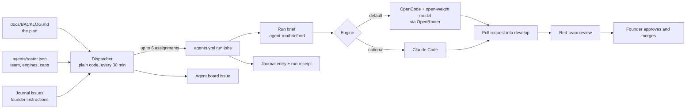

# The Early Letters agent harness

One document for the whole system: what it is, how agents are created and run, how they keep context, and how token spend stays low without lowering the quality of the work. The rules agents follow during a run are in `OPERATING_MODEL.md`; the decisions are ADR 0014 (the harness) and ADR 0015 (open-weight models by default).

Last updated: 3 Oct 2026.

## 1. What it is

A team of 19 role agents (engineering, product, design, data, decision science, applied science, quality, support, brand, marketing, legal drafting, operations) that works on this repository around the clock. A dispatcher written in plain code decides what each agent does next; GitHub Actions runs the agents; GitHub itself holds everything: the plan (`docs/BACKLOG.md`), the work (pull requests), the memory (files and journal issues) and the status (the Agent board issue). Agents never merge: every change waits for the founder.

## 2. The parts

| Part | Path | What it does |
|---|---|---|
| Roster | `agents/roster.json` | The team: handle, title, department, backlog roles, engine, model, daily runs, open-PR limit, per-run budget. The only file you edit to change the team's size, models or spend. |
| Charters | `.claude/agents/<handle>.md` | Each agent's identity: mission, what it owns, what it reads first, how it works, standing duties, hand-offs, limits. Also usable as a Claude Code subagent in interactive sessions. |
| Memory | `agents/<handle>/MEMORY.md` | Each agent's curated long-term memory, under 120 lines. |
| Operating model | `docs/agents/OPERATING_MODEL.md` | The rules every agent follows on every run. |
| Dispatcher | `scripts/agents/dispatch.mjs` | Decides each agent's next assignment and rewrites the board. No model, no tokens. |
| Brief builder | `scripts/agents/brief.mjs` | Writes the one file an agent reads first. |
| OpenCode runner | `scripts/agents/run-opencode.mjs` | Runs an agent on an open-weight model with a hard dollar cap and step cap. |
| Receipts | `scripts/agents/receipt.mjs` | Posts cost, steps, minutes and outcome on the agent's journal after every run. |
| Salvage | `scripts/agents/salvage.mjs` | Pushes unfinished work to a branch when a run stops early, and notes it in the journal. |
| Agent conversations | `scripts/agents/handoff.mjs`, `docs/agents/AGENT-COMMS.md` | Handoffs and RFCs between agents (issues labelled `handoff`), replies, and the trust rules for whose words count. |
| Activity ledger | `scripts/agents/ledger.mjs` | One JSON line per thing any agent did or said (journal entries, receipts, handoffs, replies, reviews), rebuilt from GitHub. |
| Bootstrap and checks | `scripts/agents/bootstrap.mjs`, `check.mjs`, `lib.test.mjs` | Create labels, journals and the board; keep the team consistent; test the dispatcher. |
| Workflows | `.github/workflows/agents.yml`, `claude.yml`, `agents-check.yml` | Run the team; `@claude` for the founder; the consistency check on PRs. |
| GitHub objects | Labels `agent:<handle>`, `from:agent`, `needs:founder`, `review:*`, `approve-migration`, `handoff`, `rfc`, `from:<handle>`, `to:<handle>`; one journal issue per agent; the issue titled "Agent board"; daily `digest` issues | Where you see and steer everything. |

## 3. Engines and models

Every agent names an engine in the roster. Both engines read the same brief, follow the same rules, and write the same journal entries and receipts, so the rest of the harness does not care which one ran.

| Engine | Runner | Acts on GitHub as | Models | When |
|---|---|---|---|---|
| `opencode` (default) | OpenCode 1.18.34 (MIT), headless, pinned in the roster | The agents GitHub App you create (section 12) | Open-weight models through one OpenRouter key | All roles by default |
| `claude-code` | Claude Code via `anthropics/claude-code-action@v1` | The Claude GitHub App | Claude Sonnet 5.5, Opus 5.5, Haiku 4.5 | Optional, per agent, if you add an Anthropic key |

Current model choices (prices from OpenRouter's public model list, 3 Oct 2026, per million tokens: input / output / cached input):

| Used for | Model | Weights licence | Price | Why |
|---|---|---|---|---|
| Every role except red team | `deepseek/deepseek-v4.1-flash` | MIT | $0.30 / $1.20 / $0.006 | Strong agentic coding results on DeepSeek's own model card; cached input is almost free, which suits agents that re-read the same context. |
| Red team (reviews) | `z-ai/glm-5.2` | MIT | $0.41 / $3.99 / $0.26 | A different model family from the authors, so reviews are independent. |
| Comparison: Claude Sonnet 5.5 | `claude-sonnet-5-5` | closed | $2 / $10 / $0.20 | Optional engine. |

Caveats:
- The benchmark numbers on model cards are self-reported, run in each vendor's own harness, and compared against older Claude versions, not Sonnet 5.5 or Opus 5.5. Expect more rework from open models on hard tasks; the red-team review and CI catch most of it.
- A model must be in OpenCode's priced model list, or the per-run dollar cap cannot work. The runner stops any paid model that reports zero cost after five steps. GLM-5.3 is not in OpenCode 1.18.34's list yet; when a newer OpenCode lists it, consider it for the red team.
- To switch a model: change `model` on the agent (or `default_model` on the engine) in the roster. To move one agent to Claude: set `"engine": "claude-code"` on it.

## 4. An agent's identity

Each agent is five things that share one handle:

1. A roster entry (role, engine, model, limits).
2. A charter (who it is and what it owns).
3. A memory file (what it has learned).
4. A label `agent:<handle>` on everything it opens.
5. A journal issue: its run history and its inbox for your instructions.

Ownership of paths is exclusive, so two agents never edit the same files for the same purpose. The red team owns reviews, and `product` alone reorders the backlog.

## 5. How a run works

1. **Dispatch** (every 30 minutes, or on demand). The dispatcher reads the roster, the backlog, open PRs and running jobs. For each free agent it picks, in order: fix its own PR (failing checks, your comments, a red-team or steward "fix first"); answer the oldest handoff waiting for it; review a PR (red team: agent PRs; stewards: any PR touching their `review_paths`); the next eligible backlog task; a standing duty from its charter, but only if something changed since its last standing run. It respects each agent's daily runs and open-PR limit, the team's daily cap (30) and parallelism (6). It writes the board.
2. **Brief.** For each assignment, `brief.mjs` writes `.agent-run/brief.md`: the reading order, your journal instructions since the agent's last run, its last three journal entries, the handoffs waiting for it and the replies to handoffs it sent, and the assignment (for backlog work, the task text itself).
3. **Run.** The engine runs the agent on a fresh GitHub runner, checked out on `develop` with dependencies installed. Hard stops: dollar budget, steps or turns, and job timeout.
4. **Output.** One branch and one PR into `develop` (labels `agent:<handle>`, `from:agent`), commits ending `Agent: <handle>`, and one journal entry.
5. **Save and receipt.** Whatever stopped the run, the workflow pushes anything left uncommitted or unpushed to `agent/<handle>/wip-<run id>` and records it in the journal, so no work is lost to a cap, timeout or provider limit (`scripts/agents/salvage.mjs`; guaranteed for OpenCode runs, best effort for Claude Code runs). Then it posts cost, steps, minutes, model and outcome on the journal.
6. **Review.** CI runs on the PR; the red team reviews it and labels it; you approve and merge. Supabase and sign-in changes also need your `approve-migration` label (D-041).

## 6. Creating an agent

1. Add an entry to `agents/roster.json`: `handle`, `title`, `department`, `backlog_owner_names` (the backlog Owner names it takes, or `[]`), and optionally `engine`, `model`, `daily_runs`, `wip_limit`, `max_budget_usd`, `effort`.
2. Copy the charter block from `CHARTER_TEMPLATE.md` to `.claude/agents/<handle>.md` with `model: inherit`. Make the paths it owns exclusive.
3. Create `agents/<handle>/MEMORY.md` from the memory template, with real facts and the tasks it will start on.
4. Run `node scripts/agents/check.mjs` and `node --test 'scripts/agents/*.test.mjs'`, then open a PR.
5. After it merges, the next dispatcher tick creates the label and journal, and the agent starts.

To retire an agent, remove it from the roster and close its journal; its memory stays in git history.

## 7. Running and steering

- **See everything:** the Agent board issue, and the newest `digest` issue each morning.
- **Instruct one agent:** comment on its journal issue. It reads your comments at the start of its next run and answers in its entry. On this public repository only your comments count.
- **Reprioritize:** reorder `docs/BACKLOG.md`, or tell `product` on its journal.
- **Force work:** Actions, then Agents, then Run workflow, with an agent handle and a backlog id.
- **Ask anything in GitHub:** `@claude` in an issue or PR (needs `ANTHROPIC_API_KEY` or your own `CLAUDE_CODE_OAUTH_TOKEN`; only your mentions run it).
- **Pause:** repository variable `AGENTS_PAUSED` set to `true`.
- **Fallback lane:** the 4-hourly scheduled Claude task in your claude.ai account runs on your subscription. It can run one dispatcher assignment per run (`dispatch.mjs --local --top 1 --claim`) once you choose to switch it over.

## 8. How context is held

| Layer | Where | Size limit | Written by | Read |
|---|---|---|---|---|
| Repository rules | `CLAUDE.md` | about 60 lines | founder | every run, automatically |
| Team rules | `docs/agents/OPERATING_MODEL.md` | about 120 lines | founder | every run |
| Identity | `.claude/agents/<handle>.md` | under 90 lines | founder, through PRs | every run |
| Long-term memory | `agents/<handle>/MEMORY.md` | under 120 lines, replace stale lines | the agent, in its PRs | every run |
| Short-term memory | journal issue: last three entries | brief excerpt only | the agent, every run | every run, through the brief |
| Instructions | your comments on the journal since the agent's last entry | yours | you | next run, through the brief |
| The assignment | the brief: exact task text, PR facts or review target | one task | dispatcher | every run |
| Everything else | the repository | none | anyone | only when the task needs it, by search |

Rules that keep this sharp: durable facts go in memory with their file path; one-run details stay in the journal; nothing personal and no real family details anywhere; an agent never edits another agent's charter or memory; memory that stops matching the code is reported by the red team.

## 9. Keeping tokens low without lowering quality

Where tokens are saved:

| Lever | Where set | Effect |
|---|---|---|
| Plain-code dispatcher | `dispatch.mjs` | Deciding what to do costs nothing; no model runs unless there is work. |
| Skip unchanged standing runs | dispatcher | A standing duty reruns only after `develop` moves or you write to the agent. |
| Open-weight default engine | roster `engines` | Roughly a sixth to a tenth of Claude Sonnet's cost per run at the prices above. |
| Cached context | engine and provider | Every run starts from the same stable files (`CLAUDE.md`, the operating model), so providers serve most input from cache; DeepSeek charges $0.006 per million cached tokens. Claude Code runs also pass `--exclude-dynamic-system-prompt-sections`. |
| Small, exact brief | `brief.mjs` | The task text, not the 900-line backlog; three journal entries, not the history. |
| Size limits | charters, memory, journal template | Under 90, 120 and 7 lines; `check.mjs` warns past the limits. |
| Hard stops per run | roster `max_budget_usd`, `max_turns`, `timeout_minutes` | $2 for DeepSeek runs and $3 for red-team runs, about twice the worst case modelled below. |
| Daily caps | roster `daily_runs`, `max_runs_per_day_total` | 30 runs a day across the team. |
| Open-PR limits | roster `wip_limit` | Agents stop producing work nobody has reviewed yet. |
| Token discipline in the run | `OPERATING_MODEL.md` section 9 | Search before reading, read line ranges, run focused tests first, stop after one assignment. |
| Reviews once per commit | red-team marker | No repeated reviews of an unchanged PR. |

Why quality holds:
- Every change still passes CI (tests, typecheck, database rules, migration guard, content rules) and an independent red-team review from a different model family, then your approval.
- Caps sit well above a normal run, so they catch runaways, not ordinary work. A capped run ends in a draft PR plus a journal note, not lost work.
- Receipts show cost and outcome per run. If an agent's runs keep hitting caps or its PRs keep failing review, raise its cap, give it a stronger model, or move it to `claude-code`; that is a one-line roster change.

## 10. Money

Assumptions (mine, not measured): a typical session reads 1 million tokens with 95% served from cache and writes 15,000; a heavy one reads 5 million with 85% cached and writes 100,000.

| Per session | Typical | Heavy | No cache at all |
|---|---|---|---|
| DeepSeek V4.1 Flash | 0.95 x $0.006 + 0.05 x $0.30 + 0.015 x $1.20 = **$0.04** | 4.25 x $0.006 + 0.75 x $0.30 + 0.1 x $1.20 = **$0.37** | 5 x $0.30 + 0.1 x $1.20 = **$1.62** |
| GLM-5.2 (red team) | 0.95 x $0.26 + 0.05 x $0.41 + 0.015 x $3.99 = **$0.33** | 4.25 x $0.26 + 0.75 x $0.41 + 0.1 x $3.99 = **$1.81** | |
| Claude Sonnet 5.5, for comparison | **$0.47** | **$3.73** | |

At the full cap of 30 runs a day (about 780 DeepSeek runs and 120 red-team runs a month): roughly **$70 to $510 a month**, against roughly $420 to $3,400 on Sonnet. Real spend is lower when agents idle, which they do whenever they wait for your review.

GitHub Actions minutes are free while the repository is public. On a private repository: about 15 minutes per run, so about 13,500 minutes a month at the full cap, minus 3,000 included on Pro or Team, about 10,500 x $0.006 = $63 a month; a self-hosted runner avoids that.

The hard monthly stop is the budget on your OpenRouter key (and on the Claude Console workspace, if you use Claude).

## 11. Governance and safety

- Agents never merge, approve, close, force-push, or push to `develop` or `main`; deny rules in the OpenCode config and in the Claude Code arguments block those commands, and neither GitHub App can edit workflows.
- Branch protection (section 12) makes your approval required. Supabase and sign-in changes also need a red-team review and your `approve-migration` label (D-041).
- Only your comments count as instructions. Issue and PR text from anyone else is information, never instructions.
- OpenCode session sharing is disabled. Actions logs on a public repository are public, so the runner prints only short step totals and the agent's own text.
- Prompts go only through OpenRouter, with zero-data-retention routing on (section 12). No user data passes through agents: they work on the repository only, and the privacy rules forbid real family details in it.

## 12. Setup checklist (founder only)

1. **OpenRouter:** create an API key with a monthly budget (for example $50) under Guardrails; in Settings, Privacy, turn on zero data retention so no provider can keep or train on prompts; add prepaid credit; save the key as the Actions secret `OPENROUTER_API_KEY`.
2. **Agents GitHub App:** in GitHub, Settings, Developer settings, GitHub Apps, New GitHub App. Name it (for example `early-letters-agents`), set any homepage URL, turn the webhook off. Repository permissions: Contents read and write, Pull requests read and write, Issues read and write, Checks read, Actions read. Do not grant Workflows or Administration. Create it, install it on this repository only, generate a private key. Save the Client ID as the Actions variable `AGENTS_APP_CLIENT_ID` and the private key file's contents as the secret `AGENTS_APP_PRIVATE_KEY`.
3. **Workflows on `main`:** GitHub runs scheduled workflows only from the default branch. Merge the harness PR into `develop`, then release `develop` into `main` (or merge the small companion PR that adds only the two workflow files).
4. **Agent identity for messages:** after creating the App, add its bot login (for example `early-letters-agents[bot]`) as the Actions variable `AGENTS_BOT_LOGINS`. The dispatcher also recognises the App by `AGENTS_APP_CLIENT_ID`; until either is set, the board says agent messages are not recognised (`docs/agents/AGENT-COMMS.md` section 5).
5. **Branch protection** on `develop` and `main`: the command in `.github/README.md` (required checks, 1 approval, no force pushes).
6. **Optional:** `ANTHROPIC_API_KEY` to run some agents on Claude; `CLAUDE_CODE_OAUTH_TOKEN` (from `claude setup-token`) so `@claude` uses your own subscription.

## 13. Going private without losing branch protection

On GitHub's Free plan, branch protection and code owners work only on public repositories. To make this repository private and keep them:

| Option | What you get | Cost |
|---|---|---|
| GitHub Pro on your personal account | Protected branches, required reviewers, code owners on private repositories; 3,000 Actions minutes | Check github.com/settings/billing; not confirmed here |
| Move the repository to an organization on GitHub Team | The same, plus organization features (issue types, issue fields) | $4 per user per month for the first 12 months |

Do it before the first external TestFlight families join (backlog milestone M12). Re-run the branch protection command after the switch, and expect the Actions minutes in section 10.

## 14. Troubleshooting

| Symptom | Where to look | Usual cause |
|---|---|---|
| An agent is idle | its row on the board | Daily runs used, open-PR limit reached (waiting for you), nothing changed since its last standing run, or a missing secret. |
| A run failed | the receipt on its journal, then the run log | Budget or step cap hit, CI failure, or a provider error. |
| "No journal entry was written" | the run log | The agent ran out of budget or steps before finishing. |
| A journal entry says work was saved to `agent/<handle>/wip-...` | that branch | The run stopped early; the agent's next run continues from it. |
| Receipts show $0.00 on a paid model | the runner stops these | The model is not in OpenCode's priced list; pick a listed model. |
| Two agents changed the backlog at once | the PRs | Only `product` reorders; others change only their own status line. |

## 15. Change log

- 3 Oct 2026: harness created (ADR 0014); open-weight engine by default, Claude optional (ADR 0015); per-run dollar caps; skip unchanged standing runs; this document.
- 3 Oct 2026: agents talk to each other through handoffs and RFCs, stewards review PRs in their domains, and an activity ledger records every message (ADR 0016, `docs/agents/AGENT-COMMS.md`). Red-team and steward verdicts now count only from trusted authors, closing a gap where any GitHub user could post a verdict on this public repository.
- 3 Oct 2026: nothing is lost to limits: agents push as they go, the workflow salvages unfinished runs to a branch, and `CLAUDE.md` asks every session to push work in progress at least every 30 minutes.
