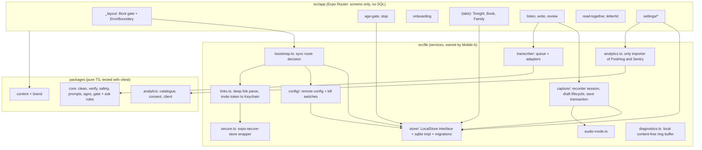
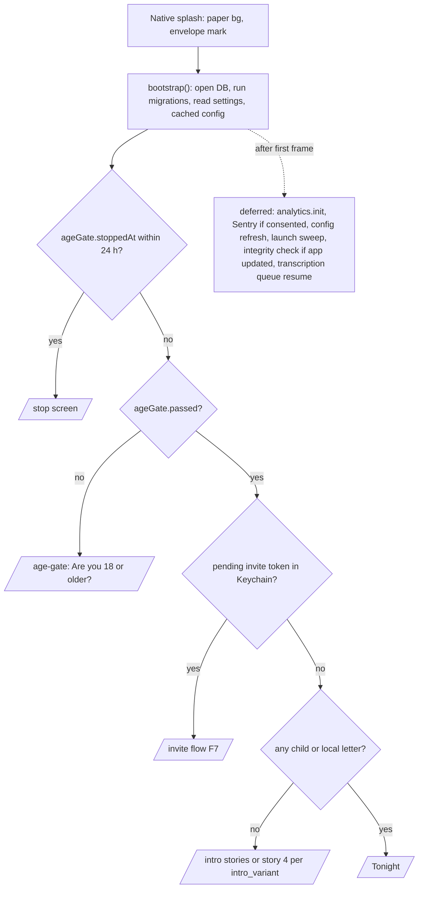

# TDD 01: Mobile client (iOS first, Android later)

> **Note, 4 Oct 2026 (D-051, `docs/DECISIONS.md`):** the founder changed the business model. Plus is now the membership that unlocks the product: the free version is the first 2 letters per account, then new letters need Plus; letters already made stay readable, playable and exportable; one membership covers the book. Anywhere this file treats writing as free or Plus as optional, that is superseded; open edges are listed in D-051 and not decided here. Mobile impact: the save path needs the letter gate and the never-discard rule (PRD-REQ-024, -025); Read together counting interplay is open (D-037, D-051 edge 5). Task list: TDD 08 section 14.

Status: Proposed, 3 Oct 2026. Author: mobile client architect (Claude Code session). Branch read: `develop` at `2ab1de9`.
Audience: founder, Claude Code sessions, future mobile engineers.
Inputs read: `CLAUDE.md`, `docs/prd/PRD.md` 1.2 and appendices A, B, C, `docs/ARCHITECTURE.md`, `docs/adr/0001` to `0012` and `0101`, `docs/legal/ENGINEERING_REQUIREMENTS.md`, `DATA_CLASSIFICATION.md` 1.1.0, `data-policy.md`, `DELETION_AND_EXPORT_SPEC.md`, `docs/analytics/TRACKING_PLAN.md`, `supabase/APPLY.md`, `supabase/migrations/*`, `docs/BACKLOG.md`, and every file under `apps/mobile/src`, plus `packages/analytics`, `packages/core` (index, safety, prompts), `packages/brand`, `packages/content` (`ageGate`).

How to read this document. Every statement is tagged where it matters:
- **Fact**: what the code or a repo document says today (file cited).
- **Assumption**: believed true, not verified in this session.
- **Rec**: my recommendation.
- **Risk**, **OQ** (open question), **Conflict** (two sources disagree; never silently resolved here).
- **Unverified**: an external API or platform behaviour I did not confirm against docs for Expo SDK 57.

Precedence used: LEGAL-REQ and DATA-REQ win over PRD; PRD.md wins over A, B, C; ADRs win over code until superseded. Where code disagrees with a requirement, the requirement wins and the gap is a backlog item (section 9).

---

## 0. Summary (the ten things that matter)

1. **The capture path is not yet safe enough to dogfood outside the founder.** Recording does not stop and save when the app is backgrounded (LEGAL-REQ-011, checklist 6.3), the draft row is created only after Stop (a kill while recording orphans an L4 file with no row), and save is two statements with no transaction, hash or fsync (DATA-REQ-048). Fix first: section 3.4.
2. **The 18+ gate violates LEGAL-REQ-002 / PRD-REQ-019.** "No" stores nothing and offers "I answered by mistake", so the 24-hour stop screen does not exist; the gate lives inside onboarding, so a future invite deep link would bypass it. Move it to a root-level boot gate with a stored No timestamp (section 3.3).
3. **Spoken letters cannot be saved in a release build today.** `transcribe-whisper.ts` always reports `decoder-missing`; Review then offers only "type it". PRD 7.4 requires "save the audio, transcribe later". Ship a voice-only save path and a transcription queue before any on-device ASR work (section 3.6).
4. **Decide the local store now, behind an interface.** ADR 0004 says op-sqlite + PowerSync; the code ships expo-sqlite (BL-032 needs-decision). Rec: keep expo-sqlite for dogfood, but put every SQL call behind a `LocalStore` repository with a real schema-version migrator, and make the PowerSync swap its own task with a spike (section 3.2).
5. **Remote config and kill switches have no home.** Read together's free count is a hardcoded constant (`FREE_READ_TOGETHER_SESSIONS = 3`), counted per phone, at screen open, against PRD-REQ-020 and C-NFR-009. Rec: Supabase `remote_config` table (audited), bundled defaults, cached last-known values, never awaited at launch (section 3.9). This also answers BL-022.
6. **No launch-time boot logic exists.** Routing decisions are made by screens redirecting after render (Tonight renders null, then redirects). Rec: one synchronous `bootstrap()` that runs before the splash hides and decides the first route (gate, stop window, pending invite, first run, Tonight) (section 3.1).
7. **Build and release are unconfigured.** No `eas.json`, no `app.config.ts`, no `expo-updates`, no bundle id, scaffold name `lumira-letters`, scheme `lumiraletters`, Expo-blue splash, default microphone purpose string. Rec: `app.config.ts` generated from `packages/brand` and `packages/content`, three EAS profiles, fingerprint runtime versions, and a strict OTA policy (section 3.10).
8. **Analytics package is ready; the app is not wired.** `packages/analytics` is well built (39 tests pass) but needs a KV adapter, a router `screen_view` hook, AppState flush, the ask sequencer, and Sentry gated on the same consent. Crash visibility before consent is near zero; rely on TestFlight/App Store Connect crash logs plus a local, content-free diagnostics ring buffer (section 3.11).
9. **Android parity breaks in small, known places**: `Alert.alert` used as a child picker (Android shows at most 3 buttons), single-file haptics, iOS-only recording assumptions, `expo-symbols` still a dependency (ADR 0101 bans SF Symbols). Section 3.12.
10. **Cross-team conflicts to resolve** (section 2.3): server `create_child` generates the child id but the phone creates children offline; C-REQ-009 lock-screen names default on vs DATA_CLASSIFICATION open issue 4 (default off); `ageAttestedAt` stored vs "boolean only"; `ageGate.stopBody` hardcodes the brand name; Review's free-text edit breaks the version-replay invariant (DATA-REQ-041).

---

## 1. Scope

### 1.1 In scope
App structure (Expo Router tree, state model, local-first SQLite store, multi-child scoping, drafts), navigation and the boot sequence, startup time, offline behaviour, audio session and background/foreground handoff while recording and playing, iOS/Android parity, build and release (EAS, OTA policy, config generation), error handling, remote config and kill-switch consumption, and wiring `packages/analytics` consent and Sentry.

### 1.2 Out of scope (owned elsewhere, referenced only)
Server schema and RLS (data architect), sync streams and PowerSync server config (sync owner), the faithful-edit engine (`packages/core`), ASR model choice (ADR 0001/0012), encryption key hierarchy (ADR 0006; I only define the client-side boundaries), paywall and RevenueCat (C), web contribution page (B, `apps/web`), copy (content owner).

### 1.3 Premature for v1 (say no for now)
| Idea | Why not now |
|---|---|
| SQLCipher for the local DB | iOS Data Protection already covers device theft at rest; SQLCipher adds key management, migration and a perf cost. Decide in Phase 0 per LEGAL-REQ-022(d); my Rec is no for v1 with claims written to match. |
| Background recording | LEGAL-REQ-011 forbids it without counsel review. |
| Chunked crash-proof recording (segmenting the M4A) | Real engineering for a rare event (OS kill while foreground recording). Measure first (risk R-03). |
| A state library (Redux, Zustand, Jotai) | The store is the source of truth; a tiny `useStoreQuery` hook over SQLite plus `subscribe` is enough. Revisit if screens start caching. |
| Feature-flag vendor SDK (PostHog flags, LaunchDarkly) | Would pull a network SDK before consent and add a subprocessor. A Supabase table does the job (3.9). |
| Expo web build of the app | Design preview only (`src/dev/store-ready.web.ts`). Never shipped; the web product is `apps/web` (ADR 0010). |
| Android release | Specified, not shipped (PRD 2.2). We keep it building in CI from day one so parity debt is visible. |

### 1.4 Requirement traceability

Legend: **Met** (code satisfies it today), **Partial**, **Gap** (not built or wrong), **Design** (this TDD specifies it; nothing to judge yet). Section = where in this document.

| Requirement | P | What the client must do | Status today (fact) | Section |
|---|---|---|---|---|
| A-REQ-001 | P0 | Branded splash on paper background | Gap: splash `#208AEF`, Expo icon (`app.json`) | 3.1, 3.10 |
| A-REQ-002, A-NFR-002 | P0 | Splash never waits on network, model or sync; analytics only after consent and after first frame | Partial: no network on launch (none exists yet); splash hides in a root `useEffect`; route decided by screens after render | 3.1 |
| A-NFR-001 | P0 | Cold start p50 1.2 s, p90 2.0 s on iPhone SE 3; warm p50 400 ms | Unmeasured | 3.1, 5, 7.5 |
| A-REQ-011, C-NFR-009 | P1/P0 | `intro_variant` and other values from remote config with audit log | Gap: no remote config | 3.9 |
| A-REQ-012, A-REQ-014, A-REQ-030 | P0 | Letter first, works locally and offline | Partial: typed letters yes; spoken letters only with transcription (fails in release) | 3.5, 3.6 |
| A-REQ-015 | P0 | Re-own local rows to the user id in one transaction | Gap (no sign-in); store has `author_id` column | 3.2.5 |
| A-REQ-022, A-REQ-028, A-NFR-008, A-NFR-010 | P0 | Universal links, invite token to Keychain before UI, scheme from brand | Gap: scheme `lumiraletters`, no link handling, no `expo-secure-store` | 3.1, 3.10 |
| A-REQ-033 | P0 | Sign out only after unsynced letters sync | Design (no sign-in yet) | 3.2.6 |
| B-REQ-004, PRD-REQ-011, PRD-REQ-012 | P0 | One book per child; switcher; "To {child}" changeable before save; last child per device | Partial: `children` table, `activeChildId`, Review child picker via `Alert.alert` | 3.2.3, 3.12 |
| PRD-REQ-013 | P0 | Per-child settings in three scopes | Partial: per-child fields on `children` (`reminders_on`, `family_can_read`); no person-per-child table locally | 3.2.3 |
| PRD-REQ-015 | P0 | First-run children free; later books need Plus; server enforces | Partial: `newChildNeedsPlus()` client rule; no first-run batch flag recorded for the server | 3.2.3 |
| B-NFR-008, B-NFR-009 | P0 | First-run screens interactive 300 ms; first run offline | Met offline; perf unmeasured | 3.1 |
| PRD-REQ-019, LEGAL-REQ-002 | P0 | 18+ entry gate before any first-run screen, story action or invite flow; 24 h stop; boolean only; Declared Age Range | **Gap**: No stores nothing, "I answered by mistake" allows instant retry; gate inside onboarding only; no Declared Age Range; `ageAttestedAt` stored | 3.3 |
| PRD-REQ-001 | P0 | One ask per session after the first letter, fixed order | Gap | 3.11.3 |
| PRD-REQ-016, PRD-REQ-018, LEGAL-REQ-003, LEGAL-REQ-017 | P0 | Opt-in analytics and crash reports; nothing queued before consent; withdrawal within session | Partial: package done and tested; not wired in app | 3.11 |
| PRD-REQ-020 | P0 | Read together free sessions from remote config, per Free book, session starts at highlight playback | **Gap**: hardcoded 3, per phone, counted on screen open | 3.9, 8 |
| PRD-REQ-005, LEGAL-REQ-059 | P0/P1 | `child-input` flag off in production; no `together` prompt reachable | Met by accident: Tonight passes `together: false`; no flag exists | 3.9 |
| LEGAL-REQ-007 | P0 | Mic permission only after an in-app explanation; counsel purpose string; no other permissions | Partial: Listen requests mic on open with no primer; purpose string is the plugin default | 3.5, 3.10 |
| LEGAL-REQ-011 | P1 (P0 by checklist 6.3) | Recording stops and is saved on background; never records in background | **Gap**: no AppState handling | 3.4 |
| LEGAL-REQ-014, A-NFR-012, C-NFR-005 | P0 | No content in logs, URLs, crash reports, pushes | Partial: no logging today; route params carry only ids; no scrubber wired | 3.8, 3.11 |
| LEGAL-REQ-015 | P0 | Safety tiers on device only | Partial: no server table (good); tiering not wired on device at all | 3.5 |
| LEGAL-REQ-016 | P0 | No ad/attribution SDKs; CI denylist | Met today (none present); CI check missing | 7.7 |
| LEGAL-REQ-021 | P0 | No ATS exceptions, no Android cleartext | Met by default (no exceptions configured); CI check missing | 7.7 |
| LEGAL-REQ-022(b),(d) | P0 | Device DB and audio at least "complete until first user authentication"; SQLCipher decision | Assumption: iOS default class applies; not asserted or recorded | 4.2 |
| LEGAL-REQ-040 | P0 | Kill switches within 5 min; local features keep working | Gap | 3.9 |
| LEGAL-REQ-043 | P0 | Privacy manifest matches data map | Gap | 3.10 |
| LEGAL-REQ-050, C-NFR-004 | P0 | Write, read, play, export never call entitlement | Met (no entitlement calls exist); must be kept by design | 3.9 |
| DATA-REQ-010, DATA-REQ-013 | P0 | Tombstone/restore via server functions; server clock | Partial: local `undeleteEntry` sets `deleted_at = NULL` (server will refuse with `SCTMB`) | 3.2.4 |
| DATA-REQ-011, DATA-REQ-032 | P0 | Launch sweep deletes local files of letters tombstoned over 30 days (TC-20) | Gap | 3.2.4 |
| DATA-REQ-023, DATA-REQ-024 | P0/P1 | Device wipe after account deletion; delete-on-phone without account | Gap | 3.2.6 |
| DATA-REQ-040 | P0 | Immutable columns never change | Partial: local upsert updates `child_id` on conflict | 3.2.2 |
| DATA-REQ-043, DATA-REQ-044 | P0 | Rejected writes kept, queue continues; idempotent UUIDv7 inserts | Partial: UUIDv7 yes; no `rejected_writes` | 3.2.6 |
| DATA-REQ-046 | P0 | Audio SHA-256 at stop; `PRAGMA integrity_check` after update and weekly | Gap | 3.4, 3.2.1 |
| DATA-REQ-048 | P0 | Letter, audio reference, dictionary in one transaction; audio fsynced and hashed before commit | **Gap** | 3.4 |
| DATA-REQ-050 to 053, 056, LEGAL-REQ-034, C-REQ-017 | P0 | Offline export ZIP with manifest hashes, under 2 min for 230 MB | Gap (Settings row disabled) | 3.7 |
| PRD 7.1, 7.3, 7.4, 7.7 | P0 gates | Budgets in section 5 | Unmeasured | 5 |
| A-NFR-005, B-NFR-006, LEGAL-REQ-051 | P0 | AX5 Dynamic Type, VoiceOver, Reduce Motion | Partial: labels and `useMotion()` exist; several `maxFontSizeMultiplier={2}` caps conflict with AX5 | 7.6, 8 |

---

## 2. Current state (facts) and conflicts

### 2.1 What exists in `apps/mobile`
- Expo SDK 57 (`expo ~57.0.26`), RN 0.86.3, React 19.2, Expo Router 57 with `typedRoutes` and `reactCompiler` on, Uniwind, Reanimated 4.5.1, `expo-audio`, `expo-sqlite`, `whisper.rn ~0.7.4`, `@expo/ui`, Phosphor icons. No `ios/` or `android/` (CNG). `npm run typecheck -w @scribe/mobile` passes. **No tests exist in `apps/mobile`.**
- Routes (`src/app`): `_layout` (Stack), `(tabs)` with `index` (Tonight), `book`, `family`; modals `write`, `listen` (full screen), `review`, `read-together`; `letter/[id]`; `onboarding`; `settings/*` (index, appearance, reminders, recordings, children/new, children/[id]).
- Store (`src/lib/store.ts`): synchronous expo-sqlite, file `scribe.db`, WAL. Tables `settings`, `entries`, `children`, `drafts`. Ad hoc `ALTER TABLE` migration via `PRAGMA table_info`; no schema version. Change notification through a module-level `subscribe()` that fires on every write.
- Capture: Listen records AAC-LC mono 64 kbps M4A into the document directory (ADR 0005 met); on Stop it creates a draft and replaces to Review. Review transcribes (if possible), runs `faithfulClean`, lets the author undo edits, edit text, pick a child, then `saveEntry` + `deleteDraft`. Write autosaves typed text to a draft every 500 ms.
- Transcription: `getTranscriber()` returns whisper only when `availability()` is null, which it never is (`decoder-missing` is returned unconditionally); in `__DEV__` it returns a sample transcriber that produces fixed words.
- Audio session: `src/lib/audio-mode.ts` owns three modes (idle ambient, recording doNotMix, playback doNotMix), matching `docs/design/SOUND.md` 5.
- Plus and Read together: `newChildNeedsPlus()`, `hasPlus() = false`, `FREE_READ_TOGETHER_SESSIONS = 3` stored as `readTogether.sessions` in settings.
- Copy: `src/lib/copy.ts` re-exports `@scribe/content` but also holds `pendingCopy` (about 35 strings outside the content rules test), and screens contain literals (`'your child'`, English weekday names, `"1 / 4"` counter).

### 2.2 What does not exist yet
Boot sequence, deep links, secure storage, sign-in, sync, remote config, analytics wiring, Sentry, error boundary, AppState handling, export, notifications (`expo-notifications` is not installed), safety tiering in the app, model download, M4A to PCM decoder, `eas.json`, `app.config.ts`, `expo-updates`, privacy manifest, tests.

### 2.3 Conflicts found (flagged, not resolved here)
| # | Conflict | Sources | Rec / owner |
|---|---|---|---|
| X-1 | Local DB engine: op-sqlite (required by PowerSync) vs expo-sqlite in code | ADR 0004, ARCH 1 table vs `store.ts`; BL-032 needs-decision | Rec in 3.2: interface now, swap with the sync task. Founder decides (BL-032). |
| X-2 | ARCH section 4 step 4 writes a `safety_events` row | ARCH vs PRD K-06, LEGAL-REQ-015, migration drops table | ARCH is stale. Client stores tiers locally only. Owner: architecture doc. |
| X-3 | 24-hour stop vs "I answered by mistake" button and no stored state | LEGAL-REQ-002, PRD-REQ-019 vs `onboarding.tsx`, `ageGate.mistakeButton` | LEGAL-REQ wins. Remove instant retry; content owner rewrites the stop copy. |
| X-4 | "Yes is stored as a boolean only" vs `ageAttestedAt` timestamp in settings | PRD-REQ-019, checklist 6.1 vs `onboarding.tsx`, DATA_CLASSIFICATION 4.5 (lists both) | Rec: drop `ageAttestedAt`; keep `ageGate.passed=1` and, only after a No, `ageGate.stoppedAt` (DATA_CLASSIFICATION 4.6 allows this, L2). Data owner to align 4.5. |
| X-5 | `ageGate.stopBody` contains the literal "Early Letters" | CLAUDE.md (name only in `packages/brand`) vs `strings.en.ts` | Content owner: use a brand placeholder the rules test allows (BL-037 notes the `{app}` problem). |
| X-6 | Lock-screen child names default on | C-REQ-009 vs DATA_CLASSIFICATION open issue 4 ("must default off") | Product plus counsel decide. Client implements a default read from remote config so it can flip without a release. |
| X-7 | Server `create_child(p_name, p_date_of_birth)` generates the id; the phone creates books offline with UUIDv7 ids that entries already reference; no due date or first-run batch parameter | `20260930000000_scribe_core.sql` vs A-REQ-015, PRD-REQ-015, B-REQ-005 | Data architect: `create_child(p_id uuid, p_name, p_dob, p_due, p_first_run_batch uuid)` idempotent on `p_id`. Without it, re-ownership needs an id remap across every local table (error-prone). |
| X-8 | Review "Change words" free edit stores `final_text` that is not `applyEdits(raw, machine_edits)` | DATA-REQ-041 replay test vs `review.tsx` | Core owner: model author edits (an `author_edits` list or "final_text authoritative after author edit" rule). Client blocks nothing meanwhile. |
| X-9 | Read together session definition | PRD-REQ-020 ("starts when playback with word highlight begins", per Free book) vs `read-together.tsx` (counts on open, per phone, text only) | Requirement wins; see 3.9 and BL-M13. |
| X-10 | Listen asks for the mic as the screen opens without a primer | LEGAL-REQ-007 ("after an in-app explanation") vs `listen.tsx` | Add a one-time primer card before the OS prompt (3.5). |
| X-11 | `expo-symbols` and `expo-glass-effect` are dependencies | ADR 0101 bans SF Symbols and direct platform imports outside wrappers | Remove unused deps (they appear unused by grep; Assumption) to keep the privacy manifest and binary small. |
| X-12 | Analytics consent stored by `packages/analytics` KV vs legal record in `policy_acceptances` | TRACKING_PLAN 7, POLICY_VERSIONING | Not a conflict if both are written: KV drives behaviour on device, `record_policy_act` is the legal record (only when signed in; queued otherwise). See 3.11. |

---

## 3. Design

### 3.0 Module map



Rules (Rec, enforced by lint in BL-M01):
1. Screens never import `expo-sqlite`, `expo-audio` recorder APIs, `posthog-react-native`, `@sentry/react-native`, `expo-secure-store` or `expo-haptics` directly; they go through `src/lib`.
2. Any decision logic that can be pure (gate window, ask sequencer, Read together allowance, child ordering, launch route) lives in `packages/core` or a pure `src/lib/*.logic.ts` with vitest tests. This is the main lever for testability without a phone.
3. Route params carry ids only (L3), never names or text (LEGAL-REQ-014). `screen_view` sends route templates only.

### 3.1 Boot sequence and navigation

**Fact**: `RootLayout` hides the splash in a `useEffect`; Tonight returns `null` until it reads the store, then `<Redirect href="/onboarding" />` when there is no child. There is no gate, no link handling and no error boundary.

**Rec**: one synchronous `bootstrap()` called from the root layout before first render. It only reads local state (SQLite settings, Keychain flag for a pending invite, cached remote config). It never awaits network, model or sync (A-REQ-002).



- The initial route is passed as the Stack's `initialRouteName` via a guarded group (`(gate)`, `(app)`), so there is no render-then-redirect flash. Expo Router supports redirect in layouts; the exact "protected routes" API in Router 57 is **Unverified**, so the fallback is `<Redirect>` in the group layouts, which still happens before the splash hides.
- Splash hides on the first layout of the chosen route (`onLayout` of the root view), not in an effect of an unrelated component.
- Deep links (`/i/<token>`, `/auth/confirm`) are parsed in `links.ts` from `Linking.getInitialURL()` and the URL listener; the invite token is written to Keychain before any UI (A-REQ-028). Token-bearing URLs are never logged and never passed as route params; the route gets a boolean `hasInvite`.
- An invite link still hits the age gate first (PRD-REQ-019).
- `export function ErrorBoundary` in the root layout (Expo Router convention) shows a calm full-screen error with "Try again" and "Export what is on this phone" (export works without the rest of the app). Errors are recorded in the local diagnostics ring buffer with route template and error class only.

**Navigation tree (target)**:
| Group | Routes | Presentation |
|---|---|---|
| `(gate)` | `age-gate`, `stop` | full screen, no back gesture |
| `(intro)` | `intro`, `onboarding` | stack, back within first run only |
| `(app)/(tabs)` | Tonight, Book, Family | JS tabs (same on both platforms, keep) |
| `(app)` modals | `listen` (fullScreenModal, no gesture), `write`, `review` (modal, no gesture), `read-together` | as today |
| `(app)` sheets | `whose-book`, `keep-the-book`, `consent/analytics`, `consent/sensitive`, `plus` | `presentation: 'formSheet'` via `sheetScreenOptions()` (ADR 0101) |
| `(app)/settings` | as today plus `privacy`, `your-data`, `help-legal`, `about` | stack |

**Startup budget plan** (A-NFR-001: p50 1.2 s, p90 2.0 s cold on iPhone SE 3):
| Phase | Budget (p90) | How |
|---|---|---|
| Process start to JS start | 600 ms | Hermes bytecode (Expo default); keep native modules lazy (`whisper.rn` already lazily required; keep it that way) |
| JS bundle eval to `bootstrap()` done | 250 ms | No top-level imports of heavy modules in `_layout` (PostHog, Sentry, crypto, whisper, export); dynamic `import()` after first frame. DB open plus migrations measured; target under 30 ms |
| First route render | 300 ms | Tonight reads one child, one prompt, drafts count; no list of entries on first frame |
| Fonts | 0 ms | Embedded at build time via the `expo-font` config plugin, not `useFonts` (A-NFR-002). Today system fonts are used (`global.css`), so nothing to load yet |
| Total | 1.2 s p50 / 2.0 s p90 | Measured per release (7.5) |

### 3.2 Local-first store

#### 3.2.1 Engine decision (BL-032)
**Fact**: ADR 0004 picks op-sqlite because the PowerSync RN SDK requires it; code uses expo-sqlite (sync API, works in Expo Go). No sync exists.

**Rec** (opinionated):
1. **Now**: keep expo-sqlite for dogfood. Wrap it behind `LocalStore` (TypeScript interface, one implementation file per engine). Screens and hooks call repository functions only (already mostly true through `store.ts`).
2. **Add a real migrator now**: `PRAGMA user_version`, ordered migration functions, each in a transaction, tested against fixture DB files from every previous version. The current `ALTER`-if-missing code becomes migration 1 to 2.
3. **Durability pragmas**: `journal_mode=WAL`, `synchronous=FULL` (WAL with NORMAL can drop the last commits on power loss; durability is quality attribute 1), `foreign_keys=ON`.
4. **Swap with sync, not before**: the PowerSync task (owner: sync) starts with a one-day spike: does PowerSync's current RN SDK work with our tables (its "raw tables" or view-based schema; **Unverified**), and is there an expo-sqlite adapter (**Unverified**)? If op-sqlite is required, the migration is a one-time copy of rows from `scribe.db` into the PowerSync-managed DB inside one transaction per table, verified by row counts and `raw_transcript` SHA-256 comparisons, with the old file kept until the next launch confirms. Founder-only data exists today, so the risk window is small if it happens before any non-founder TestFlight.
5. **SQLCipher**: no for v1 (LEGAL-REQ-022(d) decision to record). Rationale: iOS Data Protection on a passcode-locked device already encrypts at rest; SQLCipher's key would live in the same Keychain. Claims in `packages/content` must not say the local database is encrypted beyond "protected by your phone's lock".

#### 3.2.2 Local schema (v3 target)
Column names mirror Postgres so the sync mapping is direct. Levels from DATA_CLASSIFICATION 4.5; new columns need a row there and in data-policy in the same PR (DATA-REQ-001).

| Table | Columns (new in bold) | Notes |
|---|---|---|
| `entries` | as today plus **`stt_meta` (L4, JSON), `audio_sha256` (L4 derived), `audio_bytes` (L2), `prompt_library_version` (L2), `raw_sha256` (L4), `safety_tier` (L4, local only, never synced), `sync_state` (L2: local, queued, synced, rejected)** | `child_id`, `raw_transcript`, `captured_at`, `author_id` immutable after first sync: upsert must not update `child_id` once `synced_at` is set (fixes DATA-REQ-040 gap) |
| `entry_versions` | **new**: `id`, `entry_id`, `final_text`, `machine_edits`, `in_book`, `created_at` | Local history so a later sync conflict never loses the author's text (DATA-REQ-041, -043) |
| `children` | as today plus **`due_date` exists, `first_run_batch` (L2 uuid), `created_by` (L3), `photo_path` (L3)** | `first_run_batch` lets the server accept every first-run book without Plus (PRD-REQ-015) |
| `child_member_prefs` | **new**: `child_id`, `profile_id`, `signs_as`, `include_in_reminders`, `celebrations_paused` | Mirrors server; person-per-child scope of PRD-REQ-013. Today these sit on `children`, which is wrong once a co-parent shares the book |
| `dictionary_terms` | **new**: `id`, `owner_id`, `child_id`, `term` (L4), `kind`, `heard_as` (L4) | Today the dictionary is derived on the fly from child name and signature; B-REQ-006 and DATA-REQ-048 need stored terms |
| `drafts` | as today plus **`state` (recording, recorded, transcribing, ready), `audio_sha256`, `transcript_engine`** | Created before recording starts (3.4) |
| `transcription_jobs` | **new**: `draft_or_entry_id`, `state`, `attempts`, `last_error_class`, `not_before` | The queue in 3.6 |
| `rejected_writes` | **new**: op payload, SQLSTATE, `created_at` | DATA-REQ-043; content stays on phone and in export |
| `settings` | key/value as today | Keys and levels in 4.1 |
| `diagnostics` | **new**: ring buffer, 500 rows: `at`, `kind` enum, `route` template, `code` enum, `duration_ms` | L2 only. Never text. Shown in Settings > Help as "Share diagnostics" only on user action |

#### 3.2.3 Multi-child scoping
- Every query that returns letters, drafts, prefs or dictionary takes a `childId` parameter; there is no "all entries" query outside export and the launch sweep. A unit test asserts that no repository function selects from `entries` or `drafts` without a `child_id` predicate (static check over the SQL strings).
- Active child: `settings.activeChildId` (L3), fallback to the oldest visible book (current behaviour, keep).
- Switch child p95 300 ms offline (PRD 7.1): switching only changes the setting and re-runs the current screen's queries; Book uses a projection without `raw_transcript` and `machine_edits` (they are parsed today for every row on every change; 3.8).
- "To {child}" in Review: replace the `Alert.alert` child list with the `whose-book` form sheet (Android parity, 3.12). Changing the child updates the draft (`setDraftChild`) and is allowed only before save.
- First run: all children created in one transaction with one shared `first_run_batch` id. `newChildNeedsPlus()` moves to `packages/core` as `canCreateBook()` (BL-036) and the client still shows the sheet; the server decides (PRD-REQ-015).

#### 3.2.4 Deletion and restore on device
- Delete: local tombstone with the device time for display only; sync calls `delete_entry()` and stores the server `deleted_at` back (DATA-REQ-013).
- Restore: calls `restore_entry()` through the sync queue; the local row becomes live only after the server confirms, or immediately while never synced. Direct `deleted_at = NULL` writes are removed from the upload path (APPLY.md "App changes").
- Launch sweep (deferred, after first frame): delete local audio, photos and cached decrypted copies whose entry is tombstoned more than 30 days by synced `deleted_at` (TC-20, DATA-REQ-011). Local-only (never synced) tombstones use local time.
- Orphan sweep: audio files in `document/` with no draft or entry row and older than 24 hours move to a `recovery/` folder surfaced in Settings > Recordings as "Recordings without a letter" (never silently deleted; durability over tidiness).

#### 3.2.5 Re-ownership on sign-in (A-REQ-015)
One SQLite transaction: set `author_id` and `created_by` on every local row, `owner_id` on dictionary terms, then mark rows `queued`. If X-7 is not fixed, the transaction must also remap child ids, which is why X-7 is a blocker for BL-052. A crash mid-transaction leaves nothing changed (tested by fault injection, 7.2).

#### 3.2.6 Sync boundary (contract for the sync owner)
The client exposes `pendingUploadCount()`, `onRejected(op, sqlstate)`, and `markSynced(id, serverFields)`. Rules the client enforces:
- Permanent SQLSTATEs (`SC***`, `23***`, `42501`, and APPLY.md's `SCIMM`, `SCTMB`, `SCLPG`, `SCDEL`, `SCPAR`) move the op to `rejected_writes`; the queue continues; the user is told once (DATA-REQ-043).
- Sign-out and Apple revocation wait for `pendingUploadCount() == 0` (A-REQ-033); if offline, the user stays signed in with a plain note.
- Account deleted (auth failure with the deletion marker): show "Your account was deleted on {date}", offer one local export, then wipe DB, audio, photos, Keychain items and analytics ids (DATA-REQ-023).
- `safety_tier`, `drafts`, `diagnostics`, `transcription_jobs` are never uploaded.

### 3.3 18+ entry gate (PRD-REQ-019, LEGAL-REQ-002)

Pure module `packages/core/src/age-gate.ts`:
```ts
export type GateState = { passed: boolean; stoppedAt: string | null }; // ISO, device clock
export type GateDecision = 'ask' | 'stop' | 'pass';
export function gateDecision(s: GateState, now: Date): GateDecision; // stop if now - stoppedAt < 24 h
export function onAnswer(answer: 'yes' | 'no' | 'under18_signal', now: Date): GateState;
```
- Stored in `settings` as `ageGate.passed = '1'` or `ageGate.stoppedAt = <iso>`; nothing else (resolves X-4). Both L2 per DATA_CLASSIFICATION 4.6. Never in analytics, logs or Sentry.
- Shown by the boot gate before intro, onboarding, story 4 actions and invite flows. The stop screen has no retry control; it closes the gate for 24 hours. A clock moved backwards does not shorten the window: if `now < stoppedAt`, treat as stopped and reset `stoppedAt = now` (Rec).
- No answer path creates a child, letter, recording, dictionary term, auth user or network request (checklist 6.1). Test: after No, the DB has zero rows in content tables and no file in `document/`.
- Declared Age Range: needs a native call (an Expo module or library; availability for SDK 57 **Unverified**). Rec: a small `age-range` Expo module behind `src/lib/age-range.ts` returning `'adult' | 'minor' | 'unknown'` in memory; `unknown` falls back to the question. Called only where required (Texas now); the region decision must not store location (LEGAL-REQ-058). **OQ-1**: how to know "where required" without location; Rec: call it for every iOS user where the API is available and treat only an explicit minor signal as stop.
- At sign-in, `age_attested: true` goes into the `terms` acceptance context (PRD-REQ-002); it is derived from `ageGate.passed`, not from a stored timestamp.

### 3.4 Capture: recording, background handoff and the atomic save

**Facts**: draft created after Stop; no AppState handling; cleanup on unmount stops the recorder but saves nothing; save is `saveEntry` then `deleteDraft` as separate statements; no hash.

**Design**:

```mermaid
sequenceDiagram
  participant U as Parent
  participant L as Listen screen
  participant R as Recorder session (src/lib/capture)
  participant DB as LocalStore
  participant FS as App sandbox
  U->>L: Tap Speak
  L->>L: First time: mic primer card (LEGAL-REQ-007)
  L->>R: start(childId, promptKey)
  R->>DB: insert draft {state: recording, audio_uri: planned path}
  R->>R: setAudioMode(recording); prepare; record
  Note over R: AppState -> background, or audio interruption ends the take
  R->>R: stop() (finalizes M4A)
  R->>FS: hash file (SHA-256), size
  R->>DB: update draft {state: recorded, duration, audio_sha256}
  R->>R: setAudioMode(idle)
  L->>U: On return: "Saved what you said so far" and Review
  U->>L: Save in Review
  L->>DB: BEGIN; insert entry (id = draft id); dictionary updates; delete draft; COMMIT
```

Rules:
1. **Draft first**: the draft row exists before `record()` with the planned file path. A process kill leaves a `recording` draft; the boot sweep finds it, checks the file (exists, size > 0, playable via a metadata probe) and marks it `recorded` or moves it to `recovery/`. **Risk R-03**: an AAC M4A whose writer was killed may lack its index and be unplayable (**Unverified** for `expo-audio` on iOS). Measured in the kill test; segmenting is the fallback if loss is real.
2. **Background**: on `AppState` `background`, stop and finalize (LEGAL-REQ-011). On `inactive` (Control Center, notification shade, incoming call banner) do nothing; a real interruption (call) pauses via the OS and the screen shows Paused. Background recording is not enabled in the `expo-audio` config plugin (no `UIBackgroundModes: audio`). The exact `expo-audio` 57 interruption events are **Unverified**; the design depends only on AppState plus recorder status polling, which exist today.
3. **Playback** (Review mini player, Read together): `playback` mode, `shouldPlayInBackground: false`; on background, pause and restore `idle`. Leaving any screen restores `idle` (already true).
4. **Atomic save (DATA-REQ-048)**: the audio file is closed and hashed before the transaction; the transaction inserts the entry, writes dictionary updates and an `entry_versions` row, deletes the draft. `synchronous=FULL` gives durability at commit. **Fsync of the audio file**: `expo-file-system` exposes no fsync (**Unverified**); AVAudioRecorder closes the file at stop, which flushes to the OS. Rec: accept OS-level flush plus the SHA-256 check at next launch (DATA-REQ-046 scrub) and note this residual risk in the data map.
5. **Hashing**: SHA-256 of a 2-minute file (about 1 MB) on the JS thread via `expo-crypto` digest of the bytes is acceptable (target under 50 ms, **Unverified**); export-size hashing (230 MB) uses a streaming native hash (`react-native-quick-crypto`, already chosen in ADR 0006).
6. **Low storage**: before recording, if free space is under 1 GB, show the gentle warning (PRD 7.7); never block typed letters.
7. **Mic denied**: typed path plus Open Settings, no repeated OS prompt (LEGAL-REQ-007, already implemented).
8. Tap record to mic live p95 500 ms: prepare the recorder on Listen mount while the primer or countdown-free intro shows; the haptic fires before the session activates (already done).

### 3.5 Review, cleaning and safety on device
- `faithfulClean` and `verifyEdits` from `packages/core` (unchanged; constitution).
- `classify(final_text)` runs at save; the tier is stored in `entries.safety_tier` locally only and drives the resource card (LEGAL-REQ-015). Patterns are pending clinician review (`safety.ts` header): the card stays behind a `safety_card` flag off for non-founder builds until review is linked.
- The one-time "it can make mistakes" note already exists (`review.firstNoteSeen`, K-14). Keep.
- **Sample transcriber (dev)**: today Review saves the sample words as `raw_transcript` in a dev build (only the draft is protected by `isSample`). Dogfood will run dev-client builds because whisper.rn needs a dev build, so this can write fake words into a real letter. Rec: never allow Save while `isSample`; show "Keep the recording only" instead.

### 3.6 Transcription queue and the voice-only save
**Fact**: release builds cannot transcribe (decoder missing) and have no way to save a spoken letter except typing.

**Rec**:
- Review offers **Keep the recording only** whenever transcription is unavailable or fails: saves an entry with `capture_mode = 'spoken'`, `raw_transcript = ''`, `final_text = ''`, `in_book` as chosen, and a `transcription_jobs` row. **OQ-2** (data architect): server `entries.raw_transcript` is `not null` and immutable; an empty raw transcript set once can never be filled in. Options: (a) keep voice-only letters local until transcribed, then insert; (b) a separate nullable column. Rec: (a), so immutability stays simple; such letters are marked "Not sent yet" and still exported.
- Queue runs only in the foreground, after first frame, on power or above 30% battery, one job at a time, never during recording or playback. Model download (ADR 0001): Wi-Fi by default, resumable, SHA-256 verified, stored in Application Support excluded from backup.
- Server transcription only with `ai-processing` consent; the gateway enforces it (LEGAL-REQ-004); web-contributor audio never (LEGAL-REQ-005).

### 3.7 Export on device (C-REQ-017, DATA-REQ-050 to 056)
- Built from local data only; works offline and in every plan state; never calls entitlement (LEGAL-REQ-050).
- Streaming ZIP writer in a native-backed library (choice **OQ-3**; must support ZIP64 and streaming from file paths so 230 MB never sits in JS memory). Manifest hashes computed while streaming; re-read verification before "Your export is ready" (DATA-REQ-051).
- Temp file deleted when the share sheet closes (DATA-REQ-056). Others' raw transcripts are never present locally (they never sync, PRD-REQ-004), so they cannot leak into export.
- Budget: 230 MB in under 2 minutes on iPhone SE 3 (gate). Progress UI; the screen stays awake; if backgrounded, the job pauses and resumes (iOS background time is not relied on).

### 3.8 State model and rendering
- Source of truth is SQLite. Screens read through `useStoreQuery(fn, deps)` that re-runs `fn` on `subscribe` events filtered by table (today every write re-runs every subscriber, including Book's full parse).
- Book uses `listBookRows(childId)` returning id, dates, kind, `final_text`, `in_book`, `author_signs_as`, audio presence; no `raw_transcript` or `machine_edits` (less L4 in memory, no JSON parse per row). Keep `SectionList` until a 60-letter chapter misses p95 500 ms, then FlashList (already in ADR 0101 companions).
- Synchronous SQLite on the JS thread is fine for single-row reads and saves; anything that can scan more than about 500 rows (export, sweep, search) uses the async API off the render path.

### 3.9 Remote config, feature flags and kill switches (answers BL-022)
**Rec: a Supabase table, not PostHog flags.** PostHog flags would need the network SDK before consent (LEGAL-REQ-003) and person properties; ADR 0008 forbids both.

- Server: `remote_config(key text primary key, value jsonb, updated_at, updated_by)` plus an append-only `remote_config_audit` (C-NFR-009); readable by `anon` and `authenticated` (L1/L2 values only, no per-user targeting in v1); writes service-role only. Owner: data architect.
- Client: bundled defaults in `packages/content` or `src/lib/config/defaults.ts` (typed); cached last-known JSON in `settings` with `fetched_at`; fetched after first frame, on foreground at most every 5 minutes (meets LEGAL-REQ-040's 5-minute switch effect for active users), never awaited. Unknown keys ignored; invalid values fall back to defaults and are recorded in diagnostics.
- Keys at launch:

| Key | Type, default | Requirement | Fail-safe direction |
|---|---|---|---|
| `read_together_free_sessions` | int, 3 | PRD-REQ-020 | Cache, else 3 |
| `intro_variant` | enum four, three, none; four | A-REQ-011 | four |
| `child_input_enabled` | bool, false; ignored unless `approved_by_counsel` link present in the row | PRD-REQ-005, LEGAL-REQ-059 | false, always, if missing or malformed |
| `ai_gateway_enabled` | bool, true | LEGAL-REQ-040 | on-device only |
| `sync_enabled`, `backup_enabled`, `signed_urls_enabled` | bool, true | LEGAL-REQ-040 | local features keep working |
| `force_reauth_epoch` | int | LEGAL-REQ-040 (revoke sessions) | none; server also revokes |
| `lock_screen_names_default` | bool | C-REQ-009 vs X-6 | false |
| `analytics_sample_rates` | map | TRACKING_PLAN 5.3 | empty |
| `min_supported_build` | int | release policy 3.10 | none (never blocks local use; shows a gentle update card) |
| `safety_card_enabled` | bool, false | clinician review gate | false |

- Kill switches only ever turn server-dependent features off. Nothing in remote config can disable recording, reading, playback or export (LEGAL-REQ-040, -050).
- Read together allowance: per Free book. Count stored in `settings` keyed by child (`readTogether.sessions.<childId>`, L2 count with an L3 key) until the server holds it; a session is counted when highlighted playback starts, not on open (X-9). Plus check reads the cached entitlement (7-day cache, C-NFR-004).

### 3.10 Build, release and OTA policy

**Facts**: `app.json` name and slug `lumira-letters`, scheme `lumiraletters`, splash `#208AEF`, no `ios.bundleIdentifier`, no `eas.json`, no `expo-updates`, mic purpose string is the plugin default. `packages/brand` has `scheme: 'scribe'`, `bundleId()` derived from `company.domain` which is still `example.com` (bundle id cannot change after the first App Store Connect upload).

**Rec**:
1. `app.config.ts` replaces `app.json` and reads `@scribe/brand` (name, scheme, bundle id, colours) and `@scribe/content` (purpose strings approved by counsel, LEGAL-REQ-007). No literal brand name in the config. Splash and icon from the design assets on paper `#FBF8F3` / `#161412`.
2. **Do not run the first App Store Connect upload until `company.domain` is final** (PRD 9 Q5, BL-053). Dev and preview builds use a separate bundle id suffix (`.dev`, `.preview`) so the real id is untouched.
3. `eas.json` profiles: `development` (dev client, internal), `preview` (release config, internal TestFlight for the founding family, `__DEV__` false), `production` (store). Each profile sets `EXPO_PUBLIC_ENV` and the remote-config/Supabase endpoints; no secrets in the bundle (LEGAL-REQ-026). Secrets in EAS secrets.
4. Runtime version policy: `fingerprint` (native fingerprint) so an OTA update can never target a binary with different native modules. **Unverified** exact option name in SDK 57; the alternative is `appVersion`.
5. **OTA (EAS Update) policy**:
   - Allowed: JS and asset fixes, copy changes already approved, config default changes, bug fixes that do not change data handling.
   - Not allowed by OTA (store release only): anything that changes what data is collected, sent or to whom (new network host, new SDK, new analytics event, consent text), anything that changes the privacy label or manifest (LEGAL-REQ-042, -043), local schema migrations that cannot be rolled back, permission changes, Plus pricing or disclosure text (LEGAL-REQ-046). Reason: App Review guideline on code changes plus our disclosures must match the reviewed build. 
   - Updates download in the background and apply on the next cold start; never reload mid-session (a parent may be recording).
   - Channels: `preview` and `production`; a staged rollout percentage for production OTA where supported (**Unverified**), and an immediate rollback by republishing the previous update.
   - Every OTA must pass the same release gates as a binary except device-matrix and store checks (7.9).
   - `expo-updates` makes a network request at launch (update check). This is not analytics, but it is a network destination: list it in the data map and privacy label review (LEGAL-REQ-041). Check after first frame (`checkAutomatically: 'ON_LOAD'` with `fallbackToCacheTimeout: 0`, names **Unverified**) so launch never waits.
6. Release tags `ios-v<major>.<minor>.<patch>` (CLAUDE.md). Build number auto-incremented by EAS.
7. Privacy manifest (`PrivacyInfo.xcprivacy`) generated in `app.config.ts` from `docs/legal/data-map.yaml` once it exists; until then a checked-in list reviewed per release. Required-reason APIs used by Expo modules (UserDefaults, file timestamps, disk space for the low-storage check) declared.
8. CI builds Android on every PR (no release) so parity breaks show up immediately.

### 3.11 Analytics, crash reporting and the ask sequencer

#### 3.11.1 Wiring `packages/analytics`
- `src/lib/analytics.ts` is the only importer of `posthog-react-native` and `@sentry/react-native` (ADR 0008 lint rule). It builds the client exactly as the package README shows, with `REQUIRED_POSTHOG_OPTIONS` spread last and `posthogBeforeSend`.
- KV storage adapter: the `settings` table (consent status and ids are L2; keeps one durable store; survives app updates; wiped with the account).
- `init()` after first frame; never before. With consent `unknown` or `denied`, the PostHog client should not even be constructed (Rec: lazy `import()` on grant or when stored status is `granted`), so no SDK code can send.
- Router hook maps route templates to the `route` enum and calls `track('screen_view')`. `useSegments()`/`usePathname()` give templates or concrete paths depending on API (**Unverified**); map through a static table keyed by file route, never by the concrete path with ids.
- `AppState` background calls `analytics.flush()`; the 60 s timer is built in.
- `setChildCount(n)` on child list change; children only as ordinals.
- Account deletion: send `analyticsIds()` with the request, then `forgetIds()` (PRD-REQ-018).

#### 3.11.2 Sentry
- Initialised only when `analytics.consent() === 'granted'` (one switch, LEGAL-REQ-003); `sendDefaultPii: false`; `beforeSend` and `beforeBreadcrumb` use the scrubbers from BL-021; no console breadcrumbs, no HTTP bodies or query strings, URLs containing `token_hash` or `/i/` dropped (A-NFR-012). Source maps uploaded by EAS build.
- Withdrawal calls `Sentry.close()` and disables the integration within the session.
- **Risk R-07: crash visibility.** Opt-in after the first letter means no first-run crashes and few crashes overall reach Sentry. Mitigations: (a) TestFlight and App Store Connect crash logs (collected by Apple from users who share diagnostics with developers at the OS level; whether this needs mention in our privacy label is **OQ-4** for counsel); (b) the local `diagnostics` ring buffer (content-free) that a user can choose to attach to a support email; (c) release gates that do not depend on field crash data (7.9).

#### 3.11.3 One ask per session (PRD-REQ-001)
Pure `nextAsk(state)` in `packages/core` (BL-023). Inputs: first letter saved, Keep the book answered, reminder prime answered, analytics answered, asks shown this session, current route class (recording, review, export are blocking). Output: at most one of `keep_the_book`, `reminder_prime`, `analytics_consent`, or none. "Session" = cold start or foreground after 30 minutes away (same definition as `app_opened`). The sheet host in the `(app)` layout asks `nextAsk` on Tonight focus only.

#### 3.11.4 Legal record of consents
Consent sheets write `policy_acceptances` through `record_policy_act` when signed in; before sign-in, the act is queued locally (document, version, method, `client_recorded_at`, rendered hash) and flushed after the `terms` row on account creation (LEGAL-REQ-001 requires `terms` first). Analytics behaviour never waits for that server write.

### 3.12 iOS and Android parity
| Area | iOS now | Android later | Action |
|---|---|---|---|
| Child picker in Review | `Alert.alert` with one button per child | Android dialogs show at most 3 buttons, so a third child plus Cancel breaks | Replace with `whose-book` form sheet (BL-M08) |
| Haptics | `lib/haptics.ts` uses iOS calls | Needs `haptics.android.ts` (ADR 0101) | Split file before Android |
| Audio focus | AVAudioSession modes in `audio-mode.ts` | Audio focus and ducking differ; no silent switch | Android audio-mode file; SOUND.md ringer guard |
| Back gesture | `gestureEnabled: false` on Listen and Review | Hardware back must not discard a recording; `predictiveBackGestureEnabled: false` is set | `BackHandler` in Listen: back = Pause and confirm, never discard silently |
| Recording format | `IOSOutputFormat.MPEG4AAC` | `mpeg4` + `aac` already in options | Verify AAC-LC mono 64 kbps on device |
| Date picker | `display: 'compact'` | Dialog picker | Already branched by `Platform.OS` |
| Sign in with Apple | Native | OAuth with PKCE via in-app browser (A-REQ-020) | Later |
| Secure storage | Keychain (`expo-secure-store`) | Keystore-backed | Same API |
| Data protection | iOS file protection class | Android file-based encryption by default | Record both in data map |
| Synchronizable Keychain (ADR 0006) | Custom module | Block Store or equivalent (**Unverified**) | Out of scope here; flag for ADR 0006 |
| Icons, tabs | Phosphor, JS tabs | Same | Keep; remove `expo-symbols` |

---

## 4. Data and classification handling on the device

Levels per `DATA_CLASSIFICATION.md` 1.1.0. Highest wins: the SQLite file and the `document/` audio folder are handled as **L4**.

### 4.1 Device stores
| Store | Contents and level | Protection | Leaves the device? | Deleted when |
|---|---|---|---|---|
| `scribe.db` (expo-sqlite, later PowerSync DB) | Entries, children, drafts, dictionary, prefs (L4 max) | iOS Data Protection, at least "complete until first user authentication" (LEGAL-REQ-022(b)); no SQLCipher in v1 (decision to record) | Synced rows after sign-in and sensitive-data consent (LEGAL-REQ-006); never `safety_tier`, `drafts`, `diagnostics`, jobs | Author delete (tombstone, purge sweep), account deletion wipe (DATA-REQ-023), delete-on-phone (DATA-REQ-024) |
| `settings` keys | `activeChildId` (L3); `appearance`, `readingSize`, `reminders.*`, `review.firstNoteSeen`, `ageGate.passed`, `ageGate.stoppedAt`, `readTogether.sessions.*`, analytics consent status and ids, cached remote config (L2) | as above | Analytics ids only inside PostHog requests after consent | Wiped with the account; analytics ids reset at sign-out and deletion |
| `document/*.m4a` | Audio (L4) | Same class; included in the user's own iPhone backup (Documents folder) | Only via opt-in encrypted backup (ADR 0006) or consented server ASR | As DB rows |
| `recovery/` | Orphaned audio (L4) | as above | Never | User action only |
| Application Support `models/` | Whisper models (L1) | Excluded from iCloud backup | Downloaded only | Removable in Settings |
| Keychain | Session and refresh tokens, invite token, CCK, X25519 private key (L4) | `AfterFirstUnlock` accessibility; CCK synchronizable per ADR 0006 | Never unwrapped | Invite token after acceptance; all at account deletion |
| Temp | Export ZIP (L4, plaintext by design) | App temp | Only through the user's share sheet | When the share sheet closes (DATA-REQ-056) |
| Notification centre (later) | Local reminder text; child name only if the toggle allows (L4) | OS | No (local notifications) | Rescheduled on change; removed on hide-book (B-REQ-014) |

**Assumption A-1**: app container files get iOS's default protection class (complete until first user authentication). Rec: set it explicitly for the DB and audio directories via a config plugin entitlement (`com.apple.developer.default-data-protection`), record it in the data map, and verify on device with a locked-phone test (7.7). The `Complete` class is rejected because background sync and notification scheduling need the DB while the phone is locked.

**OQ-5** (counsel, privacy policy): audio in Documents rides in the user's iCloud device backup. Rec: keep it (durability attribute 1; the user controls that backup), say so in the Privacy Policy (data-policy 4.4 marks it **Unverified**, C OQ5).

### 4.2 Handling rules the client enforces
1. L3/L4 never in route params beyond ids, logs, analytics, Sentry, diagnostics, push payloads or URLs (LEGAL-REQ-014). `console.*` is stripped from release builds (Babel plugin) and banned by lint outside `__DEV__` blocks.
2. Errors carry codes and enums. Never `String(error)` from SQLite into anything that leaves the phone (SQLite error messages can quote values).
3. Pre-account letters are local only; nothing uploads before `terms` acceptance and sensitive-data consent (LEGAL-REQ-001, -006). The sync engine is not even started before both.
4. Others' raw transcripts, machine edits and STT metadata never reach the phone (PRD-REQ-004; enforced server-side, asserted client-side by a test that member sync rows lack those fields).
5. Test fixtures use the "Asha" family only (CLAUDE.md); the log canary (LEGAL-REQ-014) scans device logs from E2E runs for Asha strings.
6. New device store, key or SDK ships with its DATA_CLASSIFICATION 4.5/4.6 row and data-policy row in the same PR (DATA-REQ-001).

---

## 5. Interfaces, contracts and performance budgets

### 5.1 Internal service contracts (TypeScript, `src/lib`)
```ts
// store/LocalStore.ts (the only SQL boundary)
interface LocalStore {
  bootstrapState(): BootState;                        // sync, < 30 ms p95
  listChildren(opts?: { includeHidden?: boolean }): Child[];
  createChildren(input: NewChild[], firstRunBatch?: string): Child[]; // one transaction
  listBookRows(childId: string): BookRow[];           // projection, no raw/edits
  getEntry(id: string): Entry | null;                 // author's own full row
  createRecordingDraft(i: { childId: string; promptKey: string | null }): Draft; // before record()
  finalizeRecording(id: string, f: { durationMs: number; sha256: string; bytes: number }): void;
  saveLetter(draftId: string, e: LetterInput, dict: DictionaryTerm[]): Entry; // one transaction
  saveVoiceOnly(draftId: string, inBook: boolean): Entry;
  tombstone(id: string): void;
  requestRestore(id: string): void;
  pendingUploadCount(): number;
  subscribe(tables: Table[], fn: () => void): () => void;
}

// capture/recorder.ts
interface RecorderSession {
  start(childId: string, promptKey: string | null): Promise<Draft>;   // p95 500 ms to mic live
  pause(): void; resume(): void;
  stop(reason: 'user' | 'background' | 'interruption'): Promise<Draft>; // finalizes + hashes
  discard(): Promise<void>;                                              // user-confirmed only
}

// config/remote.ts
interface RemoteConfig {
  get<K extends ConfigKey>(k: K): ConfigValue<K>;    // sync, cached or default
  refresh(): Promise<'updated' | 'unchanged' | 'offline'>; // never awaited at launch
}
```

### 5.2 Server calls the client makes (owned by other teams; client-side budgets)
Payload sizes are request bodies over the wire, gzip where supported. Budgets from PRD 7.2 unless marked New.

| Call | When | Payload | p50 / p95 (client-measured, US LTE) | Offline behaviour |
|---|---|---|---|---|
| `GET remote_config` (REST, anon or user JWT) | After first frame; foreground every 5 min max | Response under 4 KB | 150 ms / 300 ms | Use cache, else bundled defaults; no UI |
| `signInWithIdToken`, `verifyOtp` | Sign-in sheet | under 4 KB | 700 ms / 1.5 s | Buttons disabled with offline copy; Later stays (A F8) |
| `record_policy_act` | After each consent act | under 2 KB | 200 ms / 500 ms | Queued locally, flushed in order after `terms` |
| `policy_actions_needed` | Foreground with network | under 1 KB req, under 4 KB resp | 150 ms / 300 ms | Skip; never gates export or deletion (LEGAL-REQ-009) |
| `create_child` (X-7 signature) | First sync of a new book | under 1 KB | 250 ms / 500 ms | Book usable locally; queued |
| PowerSync `uploadData` batch | Background sync | up to 50 ops, under 256 KB (New) | 400 ms / 800 ms | Queue persists across kill and reboot; "Not sent yet" state |
| `delete_entry` / `restore_entry` | Via upload queue | under 1 KB | 250 ms / 500 ms | Local tombstone shown immediately; restore waits for server if synced |
| `accept_child_invite` | Invite flow | under 1 KB | 250 ms / 500 ms | Token stays in Keychain; retried on reconnect |
| Model download (CDN or Storage) | Wi-Fi, after first run | 574 MB or 190 MB, ranged requests | n/a; resumable, background-friendly | Typed letters and voice-only saves work meanwhile |
| AI gateway transcribe (consented only) | Queue | up to 2 min audio, about 1 MB | 2 s / 4 s | Job waits; on-device path preferred |
| PostHog batch (consented only) | Every 60 s foreground and on background | under 64 KB per batch; queue cap 1 MB | best effort | Dropped beyond cap, oldest first |
| `expo-updates` check | After first frame | small manifest | best effort | Skipped |

### 5.3 On-device budgets (gates per PRD 7)
| Metric | Budget | Gate | Measured by |
|---|---|---|---|
| Cold start to first interactive frame | p50 1.2 s, p90 2.0 s (iPhone SE 3); Android p50 2.0 s, p90 3.0 s | Yes | Device perf run, 200 samples (7.5) |
| Warm start | p50 400 ms | Yes | same |
| `bootstrap()` | p95 30 ms with 2 years of data (500 entries) | New, Yes | Unit timing on a fixture DB plus device trace |
| Screen transitions | Start within 100 ms, complete 350 ms, no UI-thread frame over 16.7 ms | Yes | Reanimated frame callback logger in perf build |
| First-run screens interactive | 300 ms | Yes | perf run |
| Tap record to mic live | p95 500 ms | Yes | timestamp from tap to first non-silent metering sample |
| Local save commit | p95 200 ms incl. hash of a 2-min file | Yes | instrumented save |
| Switch child | p95 300 ms offline | Yes | perf run |
| Book chapter of 60 letters | p95 500 ms | No | perf run |
| Settings open | under 300 ms | Yes | perf run |
| 1-year export (230 MB) offline | under 2 min on SE 3 | Yes | fixture library export |
| App download size without model | 80 MB or less | Yes | EAS build artifact size check |
| Memory while transcribing (turbo) | to be set by BL-043 (Unverified) | Later | device |
| Idle battery drain | 1% per day or less; no background work except OS-scheduled sync and local notifications | Yes | 24 h device run |

### 5.4 Offline behaviour summary (PRD 7.4)
Works offline: gate, intro, first run, record, typed letters, voice-only save, on-device transcription once the model exists, review, save, book, playback of local audio, Read together on local audio within the allowance (cached entitlement), export, settings that do not need the server. Needs network with honest copy and nothing lost: sign-in, invites, approvals (queued visibly), backup, purchases and restore, remote config refresh, model download.

---

## 6. Failure modes

| # | Failure | Detection | Behaviour | Data safe? | Test |
|---|---|---|---|---|---|
| F-01 | App backgrounded while recording | AppState `background` | Stop, finalize, hash, draft `recorded`; on return "Saved what you said so far" | Yes | E2E 7.3 E-05 |
| F-02 | Process killed while recording | Boot sweep finds `recording` draft | Probe file; recover to Review, or move to `recovery/` if unplayable | Partial (R-03) | Device kill test |
| F-03 | Killed during save | Transaction atomicity | Either entry exists or draft exists, never a row pointing at a missing file | Yes | 500-iteration kill test (PRD 7.4 gate) |
| F-04 | Phone call interrupts recording | Recorder status not recording while phase is recording | Show Paused; Resume continues same file | Yes | Manual device script |
| F-05 | Mic permission denied | Permission result | Typed path plus Open Settings; no repeat OS prompt | n/a | Unit plus E2E |
| F-06 | Disk full | Free-space check, write error code | Warn before recording; on failure keep the draft, show `errors.storage_low` | Yes | Simulated in integration |
| F-07 | Transcription unavailable or fails | `availability()` or throw | Voice-only save offered; job queued | Yes | Integration |
| F-08 | SQLite corruption | `PRAGMA integrity_check` after update and weekly | Stop writes, build recovery export, offer resync (DATA-REQ-046) | Best effort | Fault-injected DB fixture |
| F-09 | Migration throws on update | Migration runner per-step transaction | Roll back that step, keep old schema, read-only mode with export, diagnostics code | Yes | Fixture DBs from every version |
| F-10 | Remote config malformed or unreachable | Schema validation | Defaults; kill-switch keys fail safe (table 3.9) | n/a | Unit |
| F-11 | JS render error | Root `ErrorBoundary` | Calm screen with Try again and Export | Yes | Unit (render throws) |
| F-12 | Native crash | OS | Next launch normal; Sentry if consented; diagnostics marks unclean exit | Yes (atomic saves) | Crash test on device |
| F-13 | Sync rejects an op permanently | SQLSTATE class | `rejected_writes`, told once, content kept and exportable | Yes | Integration (TC-16) |
| F-14 | Membership revoked with queued writes | RLS error | As F-13 | Yes | Integration |
| F-15 | Account deleted elsewhere | Auth failure with marker | Notice, one local export, wipe (DATA-REQ-023) | User choice | Integration |
| F-16 | Clock skew / clock set back | Compare with last seen time | Gate window conservative (3.3); tombstone times come from server | n/a | Unit |
| F-17 | OTA update broken | Crash on launch after update | expo-updates rollback to embedded bundle on repeated launch failure (**Unverified** behaviour in SDK 57); republish previous update | Yes | Staged rollout to preview channel first |
| F-18 | Model file corrupt or partial | SHA-256 mismatch | Delete and re-download; jobs wait | n/a | Unit |
| F-19 | Hidden book while notifications scheduled | Store event | Cancel that child's local notifications in the same transaction callback (B-REQ-014) | n/a | Unit |
| F-20 | Invite link arrives for an under-18 install within the stop window | Boot gate | Stop screen; token discarded from Keychain | n/a | E2E |

---

## 7. Test strategy

Principle: push logic into pure TypeScript so most proof runs in vitest on CI without a phone; keep device tests few, scripted and gating. Test titles start with the requirement ID in brackets (ADR 0011), for example `it('[PRD-REQ-019] No closes the gate for 24 hours')`.

### 7.1 Unit (vitest, `packages/core` and `apps/mobile/src/lib/*.logic.ts`)
| Area | Cases | IDs |
|---|---|---|
| Age gate | Yes passes forever; No stops 24 h; under-18 signal stops; clock set back keeps stop; no age or date ever in the stored state | PRD-REQ-019, LEGAL-REQ-002 |
| Boot route decision | Every combination of gate, invite, children, intro variant; never `tonight` without a child | A-REQ-002, A-REQ-028 |
| Ask sequencer | Never two asks per session; order fixed; never during record, review, export | PRD-REQ-001 |
| Read together allowance | Per book; counted at highlight start; remote value respected; playback never limited; Plus bypass | PRD-REQ-020, LEGAL-REQ-050 |
| `canCreateBook` | First-run batch free; joined books excluded; hidden counted | PRD-REQ-015 |
| Remote config parsing | Defaults, malformed values, fail-safe kill switches, `child_input_enabled` needs counsel link | C-NFR-009, LEGAL-REQ-040, LEGAL-REQ-059 |
| Analytics route map | Every file route maps to a `route` enum value; no concrete paths | PRD-REQ-016, LEGAL-REQ-017 |
| Sync error classifier | Permanent vs transient SQLSTATEs | DATA-REQ-043 |
| Diagnostics | Only enum fields accepted; strings rejected | LEGAL-REQ-014 |

### 7.2 Integration (Node with a real SQLite engine)
Run the `LocalStore` implementation against `better-sqlite3` or the expo-sqlite web/wasm build in Node (**Assumption**: the SQL is portable; any engine-specific pragma is isolated). Cases:
- Migrations: open fixture DBs from every past schema version (including the pre-multi-child `family` setting) and assert row counts, content hashes and `user_version` after migrating (F-09).
- `[DATA-REQ-048]` save transaction: inject a throw after each statement; assert either full entry or intact draft, never both or neither.
- `[DATA-REQ-040]` upsert never changes `child_id`, `raw_transcript`, `captured_at` after `synced_at` is set.
- `[PRD-REQ-011]` no repository query on `entries`/`drafts` lacks a `child_id` predicate (static SQL scan plus behavioural test with two children).
- `[A-REQ-015]` re-ownership is all-or-nothing under fault injection.
- `[DATA-REQ-011]` launch sweep deletes files only for tombstones older than 30 days; orphan sweep moves, never deletes.
- `[DATA-REQ-051]` export manifest hashes match; a flipped byte is flagged `integrity: "mismatch"` (TC-17).
- `[DATA-REQ-043]` rejected op goes to `rejected_writes` and the queue continues (TC-16, with a fake upload connector).
- `[LEGAL-REQ-003]` with a recording provider: zero provider calls before grant; revoke clears within the session.

### 7.3 End-to-end (Maestro flows on simulator in CI, on device for gates)
Rec: Maestro (YAML flows, works with Expo dev and release builds, readable by a non-engineer; **Assumption** it supports our RN 0.86 build). Detox is the fallback.
| ID | Flow | IDs |
|---|---|---|
| E-01 | Fresh install offline: gate Yes, first run, typed letter saved, Keep the book sheet, Later; zero network requests to PostHog/Sentry (proxy log) | A-REQ-012, A-REQ-030, LEGAL-REQ-003 |
| E-02 | Gate No: stop screen; relaunch within 24 h still stopped; DB has no content rows | PRD-REQ-019 |
| E-03 | Invite link on fresh install goes to gate first, then invite flow; token survives app kill | A-REQ-028, PRD-REQ-019 |
| E-04 | Spoken letter with transcription unavailable: voice-only save, appears in Book as "Not sent yet" | PRD 7.4 |
| E-05 | Background during recording: audio saved, Review opens on return | LEGAL-REQ-011 |
| E-06 | Two children: "To {child}" change in Review saves to the chosen child only | PRD-REQ-012 |
| E-07 | `child-input` off: no `together` prompt reachable | PRD-REQ-005 |
| E-08 | Read together: N sessions then Plus sheet; remote value change alters N without a release | PRD-REQ-020 |
| E-09 | Every Settings row incl. each consent within 2 taps | C-REQ-016, LEGAL-REQ-008 |
| E-10 | Analytics consent: third ask only; grant then withdraw stops traffic within session | PRD-REQ-001, PRD-REQ-018 |
| E-11 | Offline export of a fixture library opens and verifies | C-REQ-017, LEGAL-REQ-034 |

### 7.4 Device matrix
| Device | OS | Why | Used for |
|---|---|---|---|
| iPhone SE (3rd gen) | oldest iOS we support (minimum version **OQ-6**; Expo SDK 57 floor **Unverified**) | Budget reference (PRD 7) | All perf gates, kill tests, AX5 |
| Current-generation iPhone | latest iOS | PRD checklist second device | Smoke, Declared Age Range sandbox |
| A 4 GB RAM iPhone (e.g. iPhone 11) | mid | Whisper turbo vs small tier (ADR 0001) | Transcription memory and heat |
| iPad (compatibility mode) | latest | Not a target, but App Review runs on iPad | Layout sanity only |
| Mid-tier 60 Hz Android (e.g. Pixel 6a class) | Android 14+ | Android budgets, parity | CI build plus manual parity pass before Android release |
| Low-end Android (4 GB) | Android 13 | Audio focus, back behaviour | Pre-Android-release only |

### 7.5 Performance
- A `perf` build profile (release JS, markers on) logs cold start (process start to first frame via native timestamp and `onLayout`), warm start, transition frames, save commit, switch child. 200 samples per metric per release candidate, run by a script on the SE 3 (human task until device farm, BL-044 pattern).
- Bundle size check in CI: JS bundle and asset totals; intro images 250 KB each, 1.5 MB total (A-NFR-003; note `home-kitchen-steel-vessels-bw.jpg` is 363 KB, over budget if used in the intro).
- `bootstrap()` timing against a 500-entry fixture DB in CI (Node) as an early warning.

### 7.6 Accessibility
- Automated: render tests at the largest content size category asserting no `numberOfLines` truncation on primary text, labels on every `Pressable` and `Button`, 44 pt minimum hit areas (lint rule plus snapshot).
- Finding: `maxFontSizeMultiplier={2}` caps on letter text in Review, Write and Read together conflict with AX5 (A-NFR-005, LEGAL-REQ-051) unless Large Print sizing compensates; design lead decision, then test.
- Manual per release: VoiceOver script for gate, first run, capture, review edits list, sheets, Settings, consent sheets (focus moves to sheet title; errors announced), Reduce Motion on.

### 7.7 Security and privacy
- Manifest lint: only `NSMicrophoneUsageDescription` (plus photo picker keys later) and notifications; no ATS exceptions; Android no cleartext; no HealthKit (LEGAL-REQ-007, -021, -060).
- Dependency denylist: ad, attribution, tracking SDKs; no AdSupport/AppTrackingTransparency imports (LEGAL-REQ-016).
- Secret scan of repo and built bundle (LEGAL-REQ-026).
- Network host allowlist: an E2E run behind a proxy records every host; CI fails on a host missing from the data map (LEGAL-REQ-041).
- Log canary: E2E with Asha fixtures, device logs and Sentry test events scanned for fixture strings (LEGAL-REQ-014).
- Locked-device test: with the phone locked after first unlock, background tasks can read the DB; before first unlock, the files are unreadable (A-1).
- Deep link fuzzing: malformed `/i/` and `/auth/confirm` URLs never crash and never log the token.

### 7.8 Which tests gate a release
| Gate | Blocks | Runs |
|---|---|---|
| `npm test`, `npm run typecheck`, `npm run test:db`, trace check | Every PR and every release | CI |
| Mobile unit and integration suites (7.1, 7.2) | Every PR touching `apps/mobile` or `packages/core` | CI |
| Manifest lint, denylist, secret scan, bundle size | Every PR | CI |
| Maestro E-01 to E-11 on simulator | Release candidate and every OTA | CI |
| Network host allowlist and log canary | Release candidate | CI behind proxy |
| Perf budgets marked Gate (5.3) on SE 3 | Binary release | Human, scripted |
| Kill-during-save 500 iterations; kill-while-recording 50 iterations (report) | Binary release | Human, scripted |
| VoiceOver manual script; AX5 visual pass | Binary release | Human |
| Privacy label and manifest match data map; evidence saved | Binary release (LEGAL-REQ-042, -043) | Human plus script |
| PRD section 6 checklist lines owned by mobile | Public launch | Mixed |

---

## 8. Critique of the current code and docs

Severity: **Critical** (data loss or legal P0 breach if shipped beyond the founder), **High** (P0 requirement unmet or likely incident), **Medium** (quality, parity or maintainability debt that will bite before launch), **Low**.

### 8.1 Code (`apps/mobile`)
| # | Severity | Finding | Evidence | Fix (task) |
|---|---|---|---|---|
| C-01 | Critical | Recording is not stopped and saved on background; LEGAL-REQ-011 and checklist 6.3 | `listen.tsx` has no AppState handling | BL-M05 |
| C-02 | Critical | Draft created only after Stop; a kill while recording leaves an L4 audio file with no row and the take is invisible | `listen.tsx` `finish()` | BL-M05 |
| C-03 | Critical | 18+ gate: No stores nothing and "I answered by mistake" re-asks immediately; gate is inside onboarding, so other entry points bypass it | `onboarding.tsx` `answeredByMistake`, `next()` | BL-M03 |
| C-04 | High | Save is not atomic, no audio hash, no dictionary in the transaction (DATA-REQ-048, -046) | `review.tsx` `save()` calls `saveEntry` then `deleteDraft` | BL-M05 |
| C-05 | High | Spoken letters cannot be saved in release builds: transcriber always unavailable and no voice-only path | `transcribe-whisper.ts` `availability()` returns `decoder-missing`; `getTranscriber` returns null in release | BL-M06 |
| C-06 | High | Dev sample transcriber text can be saved as a real letter's `raw_transcript` in dev-client builds used for dogfood | `review.tsx` saves `raw` even when `isSample` | BL-M06 |
| C-07 | High | Read together allowance hardcoded, per phone, counted on open (PRD-REQ-020) | `lib/read-together.ts`, `read-together.tsx` | BL-M13 |
| C-08 | High | No schema version; migrations are "add column if missing"; legacy `JSON.parse` without guard can throw on open and brick launch | `store.ts` `open()` | BL-M02 |
| C-09 | High | Upsert updates `child_id` on conflict; immutable on the server after first insert (DATA-REQ-040) | `saveEntry` `ON CONFLICT ... child_id = excluded.child_id` | BL-M02 |
| C-10 | High | Local restore sets `deleted_at = NULL`; server refuses (`SCTMB`), so restore will become a rejected write | `undeleteEntry` | BL-M02 (and sync task) |
| C-11 | High | No boot logic, no error boundary; a thrown error in the root or the store open gives a blank screen with the splash hidden | `_layout.tsx` | BL-M04 |
| C-12 | High | `app.json` scaffold identity: `lumira-letters`, scheme `lumiraletters` (A-NFR-010), Expo-blue splash (A-REQ-001), default mic string (LEGAL-REQ-007), no bundle id | `app.json` | BL-031, BL-M10 |
| C-13 | Medium | Mic requested on screen open without an in-app primer (LEGAL-REQ-007) | `listen.tsx` `start()` in mount effect | BL-M05 |
| C-14 | Medium | Child picker via `Alert.alert`; breaks on Android with 3+ children (3-button limit) | `review.tsx` `pickChild` | BL-M08 |
| C-15 | Medium | Per-person settings (`signs_as`, `reminders_on`) stored on the shared `children` row; wrong once a co-parent shares the book (PRD-REQ-013 scopes) | `store.ts` children schema | BL-M07 |
| C-16 | Medium | Every store write re-runs every subscriber; Book reloads and JSON-parses all rows with raw transcripts | `subscribe`, `listEntriesForChild` `SELECT *` | BL-M02 |
| C-17 | Medium | About 35 user-facing strings in `pendingCopy` plus literals ("your child", English weekday names, "n / m") bypass the content rules test (CLAUDE.md, Definition of Done 4) | `lib/copy.ts`, `onboarding.tsx`, `(tabs)/index.tsx`, `read-together.tsx` | Content owner plus BL-M12 |
| C-18 | Medium | `ageAttestedAt` stored though PRD-REQ-019 says boolean only (X-4) | `onboarding.tsx` `finish()` | BL-M03 |
| C-19 | Medium | `maxFontSizeMultiplier={2}` on letter text vs AX5 | `review.tsx`, `write.tsx`, `read-together.tsx` | Design decision then BL-M12 |
| C-20 | Medium | No tests in `apps/mobile`; no test script, so `npm test` never covers the app | `apps/mobile/package.json` | BL-M01 |
| C-21 | Medium | Safety tiering not wired; the resource card path does not exist | grep `classify` finds nothing in the app | BL-M06 (flag off) |
| C-22 | Low | `expo-symbols`, `expo-glass-effect` dependencies appear unused and conflict with ADR 0101 | `package.json` | BL-M01 |
| C-23 | Low | Appearance override applied in an effect after first render (theme flash when the user forced light or dark); navigation theme reads the system scheme via `useColorScheme`, which may disagree with the Uniwind override (**Unverified**) | `_layout.tsx` | BL-M04 |
| C-24 | Low | `whisper.rn` word timings built from segments (`s.t0 * 10`), not tokens; Read together alignment needs token timestamps (ADR 0009) | `transcribe-whisper.ts` | ASR task |
| C-25 | Low | Hardcoded `MAX_FIRST_RUN_CHILDREN = 6`, 60/30 character limits not in content or config | `onboarding.tsx` | BL-M12 |

What is good and should be kept: the draft-before-Review idea and set-once raw transcript (`setDraftTranscript ... WHERE raw_transcript IS NULL`); UUIDv7 on device; the audio-mode module matching SOUND.md; metering on the UI thread; route params carrying only ids; typed copy through `@scribe/content`; Reduce Motion through one hook; `packages/analytics` design (consent epoch, retired ids, queue cap, sanitizer) is ready to wire.

### 8.2 Docs
| # | Severity | Finding | Fix owner |
|---|---|---|---|
| D-01 | High | ARCHITECTURE section 4 step 4 still writes `safety_events`; section 1 says op-sqlite replaces expo-sqlite while code uses expo-sqlite (X-1, X-2) | Architecture doc owner |
| D-02 | High | BL-022 (remote config source) and BL-032 (DB engine) are `needs-decision` and block P0 work; this TDD recommends answers (3.9, 3.2.1) | Founder |
| D-03 | High | No backlog tasks exist for: background stop, draft-first recording, voice-only save, boot gate, error boundary, EAS/OTA, migrator, mobile test harness. Week 3 BL-042 bundles too much | Backlog owner; section 9 adds BL-M tasks |
| D-04 | Medium | `src/lib/README.md` says "under 18 is stopped in onboarding and nothing is stored", which contradicts LEGAL-REQ-002's 24-hour rule | Mobile A |
| D-05 | Medium | DATA_CLASSIFICATION 4.5 matches today's device schema, but the target schema (3.2.2) adds `stt_meta`, hashes, `safety_tier` and new tables that need rows; 4.5 also lists `ageAttestedAt` L3 while 4.6 calls gate state L2 boolean | Data owner |
| D-06 | Medium | C-REQ-009 default on vs DATA_CLASSIFICATION open issue 4 default off (X-6) | Product plus counsel |
| D-07 | Medium | No document defines minimum iOS version; it affects Declared Age Range, SpeechAnalyzer and the device matrix (ARCH open question) | Founder |
| D-08 | Low | `apps/mobile/README.md` is the Expo template text | Mobile A |
| D-09 | Low | ADR 0101 and `CLAUDE.md` still reference `apps/ios` in places; the app lives at `apps/mobile` | Doc owners |

---

## 9. Build plan

Sizes: **S** under half a day, **M** one to two days, **L** three to five days (for a Claude Code session plus founder review). New mobile tasks are numbered `BL-M##` as proposals for the backlog owner to renumber into `BL-###`; existing BACKLOG IDs are reused where they fit. Order is the recommended execution order.

| Order | Task | Size | Maps to | Depends on | Satisfies | Mode |
|---|---|---|---|---|---|---|
| 1 | **BL-M01** Mobile test harness: vitest for `src/lib/*.logic.ts` and Node SQLite integration tests; `test` script so root `npm test` covers the app; lint rules from 3.0 (banned imports, no `console` in release); remove unused `expo-symbols`, `expo-glass-effect` | M | new; supports BL-002 | none | LEGAL-REQ-014 (lint), DoD 1 | agent |
| 2 | **BL-M02** `LocalStore` interface, `user_version` migrator with fixture DBs, `synchronous=FULL`, immutable-after-sync guard, projection queries, table-filtered `subscribe` | L | BL-032 (expo-sqlite path) | BL-M01, founder answer on BL-032 | DATA-REQ-040, -044, -048 (part), PRD-REQ-011 | pair, then agent |
| 3 | **BL-M03** Root-level 18+ gate as pure module plus `(gate)` routes; store `ageGate.passed` / `ageGate.stoppedAt` only; remove instant retry; Declared Age Range spike | M | BL-037 | BL-M02 | PRD-REQ-019, LEGAL-REQ-002, A-REQ-012 | agent (DAR: human sandbox) |
| 4 | **BL-M04** `bootstrap()`, route groups, splash on first layout, root `ErrorBoundary`, diagnostics ring buffer, appearance applied before first render | M | BL-040 | BL-M02, BL-M03 | A-REQ-001, A-REQ-002, A-NFR-001, -002 | agent, then human device check (BL-044) |
| 5 | **BL-M05** Recorder session: draft-first, background stop and save, interruption pause, mic primer, low-storage warning, atomic save transaction with SHA-256, boot recovery sweep for `recording` drafts | L | BL-042 (part) | BL-M02 | LEGAL-REQ-011, LEGAL-REQ-007, DATA-REQ-048, DATA-REQ-046, PRD 7.4 | agent plus human kill test |
| 6 | **BL-M06** Transcription queue and voice-only save; block Save on sample transcripts; on-device safety tier stored locally behind `safety_card_enabled` | M | BL-042 (part), BL-043 consumer | BL-M05 | PRD 7.4, LEGAL-REQ-015, A-REQ-030 | agent |
| 7 | **BL-031** Scheme from brand (existing) folded into **BL-M10** `app.config.ts` from brand and content, counsel purpose string, paper splash, `eas.json` three profiles with suffixed bundle ids, `expo-updates` with fingerprint runtime and the OTA policy in 3.10 documented in `docs/` | M | BL-031 | none (store submission waits on BL-053) | A-NFR-010, A-REQ-001, LEGAL-REQ-007, LEGAL-REQ-026 | agent plus human (EAS account, secrets) |
| 8 | **BL-M07** Local schema for `child_member_prefs`, `dictionary_terms`, `entry_versions`, `first_run_batch`; first run creates all children in one transaction | M | BL-033, BL-035 (data part) | BL-M02 | PRD-REQ-013, PRD-REQ-015, B-REQ-006, DATA-REQ-041 | agent |
| 9 | **BL-036** `canCreateBook` pure rule (existing) | S | BL-036 | none | PRD-REQ-015 | agent |
| 10 | **BL-M08** `whose-book` form sheet replaces `Alert.alert` picker; switcher p95 300 ms | S | BL-034 | BL-M07 | PRD-REQ-012 | agent |
| 11 | **BL-M09** Remote config client (defaults, cache, refresh after first frame and on foreground, fail-safe kill-switch semantics); server table spec handed to data architect | M | BL-022 | founder answer on BL-022 (Rec: Supabase table) | C-NFR-009, LEGAL-REQ-040, A-REQ-011, PRD-REQ-005 | agent plus data architect |
| 12 | **BL-M13** Read together allowance per book, counted at highlight start, from remote config | S | Later list item (PRD-REQ-020) | BL-M09 | PRD-REQ-020, LEGAL-REQ-050 | agent |
| 13 | **BL-023** Ask sequencer (existing) plus sheet host on Tonight focus | M | BL-023 | BL-020, BL-M04 | PRD-REQ-001 | agent |
| 14 | **BL-M11** `src/lib/analytics.ts` wiring: settings KV adapter, lazy PostHog on grant, router `screen_view` map, AppState flush, Sentry gated on consent with BL-021 scrubbers, Settings > Privacy toggle, queued `record_policy_act` | M | Later list "Vendor wiring" | BL-020, BL-021, BL-023, counsel approval of copy | PRD-REQ-016, -018, LEGAL-REQ-003, -017, A-NFR-012 | agent (vendor keys: human) |
| 15 | **BL-M12** Content and accessibility debt: move `pendingCopy` and literals into `packages/content`; resolve `maxFontSizeMultiplier` caps; locale-aware weekday | M | none | content owner | CLAUDE.md content rules, A-NFR-005, B-NFR-007 | agent |
| 16 | **BL-M14** Links and secure storage: `expo-secure-store`, deep link parser, invite token to Keychain before UI, token never logged | M | BL-053 dependent part of A-REQ-022 | BL-M04 | A-REQ-028, A-NFR-008, LEGAL-REQ-026 | agent |
| 17 | **BL-M15** Launch sweep, orphan sweep, integrity check after update and weekly | S | new | BL-M02 | DATA-REQ-011, DATA-REQ-046, TC-20 | agent |
| 18 | **BL-M16** Maestro E2E suite E-01 to E-11 in CI on simulator; network proxy host allowlist; log canary | L | new; supports BL-004 | BL-M03 to BL-M06 | LEGAL-REQ-003, -014, -041, PRD checklist 6.x | agent plus human CI setup |
| 19 | **BL-M17** Offline export (streaming ZIP64, manifest, verify, temp cleanup) | L | Later list "Export" | BL-M02, OQ-3 | C-REQ-017, LEGAL-REQ-034, DATA-REQ-050 to -053, -056 | agent |
| 20 | **BL-M18** Perf build profile and SE 3 measurement script | M | BL-044 | BL-M04, BL-M10 | A-NFR-001, PRD 7.1 | human |
| 21 | **BL-M19** PowerSync spike then store swap (decides op-sqlite), sync boundary from 3.2.6, re-ownership (BL-052), rejected writes | L (spike S, then L) | BL-032, BL-052 | X-7 fixed server-side, BL-M02 | ADR 0004, A-REQ-015, DATA-REQ-043 | pair |
| 22 | **BL-M20** Android parity pass: `haptics.android.ts`, audio-mode Android, BackHandler in Listen, CI Android build | M | new | BL-M05 | PRD 2.1 portability | agent |

Not before launch decisions land: Declared Age Range module (needs OQ-1), sign-in UI (BL-050, BL-051 after BL-053), notifications (C-REQ-001+), backup and key grants (ADR 0006).

---

## 10. Risks

| # | Risk | Likelihood / impact | Mitigation |
|---|---|---|---|
| R-01 | Dogfood families run dev-client builds and hit dev-only paths (sample transcriber, dev Plus bypass) | High / High | Dogfood on the `preview` profile (`__DEV__` false) only; whisper.rn works in release builds; block sample saves (BL-M06) |
| R-02 | Store engine swap to op-sqlite later corrupts or loses rows | Medium / Critical | Interface now; copy-and-verify migration with hashes; old file kept one launch; do it before non-founder TestFlight |
| R-03 | M4A from a killed recorder is unplayable | Medium / Medium | Measure; recovery folder; segmenting fallback |
| R-04 | OTA ships a data-handling change that diverges from the reviewed privacy label | Low / High | OTA policy in 3.10; release checklist asks "does this change collection or destinations?" |
| R-05 | Remote config fetch on launch creeps into the critical path | Medium / Medium | Lint: `remote.refresh()` callable only from the deferred phase; `bootstrap()` timing test |
| R-06 | Gate placement drifts as new entry points appear (widgets, notifications, links) | Medium / High | Boot gate in the root layout; E2E E-02, E-03, F-20 |
| R-07 | Near-zero crash visibility | High / Medium | 3.11.2 mitigations |
| R-08 | Whisper turbo memory or heat on older iPhones (ADR 0001 R2) | Medium / Medium | Small model tier; queue only when charging or above 30%; BL-043 numbers |
| R-09 | Synchronous SQLite on the JS thread janks long books | Low now, Medium in year 2 | Projections; async API for scans; perf gate on 60-letter chapter |
| R-10 | Bundle id frozen on an `example.com`-derived id | Medium / High | No App Store Connect upload until BL-053; suffixed ids for dev and preview |

---

## 11. Open questions

| # | Question | Who | My recommendation |
|---|---|---|---|
| OQ-1 | How to decide "where required" for Declared Age Range without storing location? | Counsel | Call wherever the API exists; act only on an explicit minor signal |
| OQ-2 | Voice-only letters: server `raw_transcript` is NOT NULL and immutable. Keep them local until transcribed, or add a nullable column? | Data architect | Keep local until transcribed |
| OQ-3 | Which streaming ZIP64 library for export (native, Expo-compatible, MIT)? | Mobile | Spike in BL-M17; must stream from file paths |
| OQ-4 | Do App Store Connect crash logs (OS-level opt-in) need mention in our privacy label or policy? | Counsel | Ask; likely a disclosure line, not a consent |
| OQ-5 | Audio in the user's iCloud device backup: keep and disclose, or exclude? | Counsel plus founder | Keep and disclose |
| OQ-6 | Minimum iOS version for v1 | Founder | The Expo SDK 57 floor (**Unverified**); no higher unless a feature needs it |
| OQ-7 | BL-022: remote config source | Founder | Supabase table with audit log (3.9) |
| OQ-8 | BL-032: local engine now | Founder | expo-sqlite behind `LocalStore` now; op-sqlite with the PowerSync task |
| OQ-9 | SQLCipher for the local DB (LEGAL-REQ-022(d)) | Founder plus counsel | No for v1; claims say "protected by your phone's lock" |
| OQ-10 | Lock-screen child names default (X-6) | Product plus counsel | Off by default, remote-config flippable |
| OQ-11 | Can a voice-only letter be added to the book before it has text (Book shows a "voice letter" card)? | Product | Yes, the recording is the true original (K-09 reasoning) |
| OQ-12 | Should the free Read together count live on the server (per book, survives reinstall) once sync exists? | Product plus data architect | Yes; local count is the offline cache |

## Changelog
| Version | Date | Change |
|---|---|---|
| 0.1 | 2026-10-03 | First draft from a read of `develop` at `2ab1de9`. |

