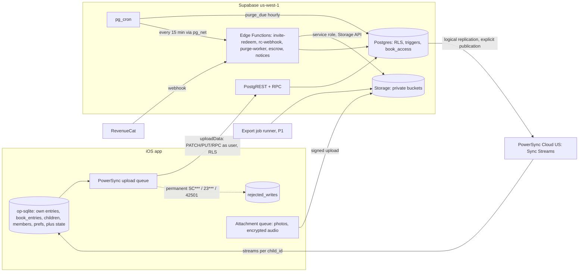

# TDD 02: Sync and backend (Supabase, Postgres, PowerSync, Edge Functions)

> **Note, 4 Oct 2026 (D-051, `docs/DECISIONS.md`):** the founder changed the business model. Plus is now the membership that unlocks the product: the free version is the first 2 letters per account, then new letters need Plus; letters already made stay readable, playable and exportable; one membership covers the book. Anywhere this file treats writing as free or Plus as optional, that is superseded; open edges are listed in D-051 and not decided here. Backend impact: a server rule for letter creation beside `create_child`, an allowance read from `app_config`, and offline-letter handling (D-051 edges 4 and 7). `create_child` rules in 2.5 are under review (edges 2 and 6). Task list: TDD 08 section 14; `supabase/**` is owned by other agents and was not changed.

Status: Proposed, 3 Oct 2026. Persona: staff backend and sync engineer. Audience: founder, Claude Code sessions, future engineers.
Inputs read: `CLAUDE.md`, `docs/prd/PRD.md` 1.2 and A, B, C, `docs/ARCHITECTURE.md`, `docs/adr/0002`, `0004` to `0007`, `0010`, `docs/legal/ENGINEERING_REQUIREMENTS.md`, `DATA_CLASSIFICATION.md`, `data-policy.md`, `DELETION_AND_EXPORT_SPEC.md`, `POLICY_VERSIONING.md` (grep), `docs/analytics/TRACKING_PLAN.md` (grep), `docs/BACKLOG.md`, `supabase/APPLY.md`, all four migrations, all `supabase/tests/*`, `apps/mobile/src/lib/store.ts`.

Labels used throughout: **Fact** (read in the repo or an opened vendor page), **Assumption** (believed, not verified), **Rec** (my recommendation), **Risk**, **OQ** (open question). **Unverified** marks vendor claims not confirmed on an opened page this session.

---

## 0. Ten findings that matter most

1. **P0 security hole still open.** `create_child_invite(uuid)` lets any member, including a contributor, mint a **parent** invite (role defaults to `parent`). `20261002020000_data_governance.sql` does not replace it. LEGAL-REQ-024 and B-REQ-007 require the fix before any non-founder family data. (Fact)
2. **Family visibility rules are not implemented, and a test asserts the wrong behaviour.** `book_entries` shows every in-book letter to every member. Contributors see the whole book even with `family_can_read = false` (B-REQ-011), contributors can put their own letters straight into the book by setting `in_book` (B-REQ-009), and parents cannot see pending family letters (B F9). `data_governance.test.mjs` line 92 asserts that a contributor sees all 3 in-book letters. (Fact)
3. **PowerSync cannot sync from `book_entries`.** PowerSync replicates tables through logical replication, and Sync Streams query tables, not views (Assumption, strongly held; the docs list tables and joins, never views). `APPLY.md` and `DATA_CLASSIFICATION.md` 4.8 say member streams "select from `book_entries`". That cannot be built as written. Rec: member streams select an explicit column list from `entries`, gated by a trigger-maintained `book_access` table (section 3.3).
4. **Re-ownership collides with server-generated ids.** The app makes UUIDv7 child ids on the device. `create_child` ignores them and returns a new `gen_random_uuid()`, so every local entry's `child_id` would have to be rewritten at sign-in, and retries are not idempotent (A-REQ-015, DATA-REQ-044). Rec: `create_child(p_id, ...)` accepts the client id. (Fact)
5. **Local store writes the server would reject as permanent errors.** `saveEntry` upserts `child_id` on conflict (server: immutable, `SCIMM`). `undeleteEntry` clears `deleted_at` (server: `SCTMB`; must call `restore_entry()`). Local `children` mixes book-level and per-person columns. (Fact)
6. **Anonymous web contributors get the `authenticated` role** (Assumption, from Supabase's anonymous-auth design; POLICY_VERSIONING marks it Unverified). With today's grants, an anonymous web session could call `create_child`, `create_child_invite` and `request_account_deletion`, and insert dictionary terms. Every RPC and policy needs an `is_anonymous` guard before the web page ships (K-08).
7. **Server-side consent gates are missing.** LEGAL-REQ-001 (no row syncs before a `terms` row) and LEGAL-REQ-006 (no content upload without `sensitive-data` consent) are enforced only by the client. Rec: a trigger-maintained `profiles.content_sync_allowed` flag that RLS `WITH CHECK` reads.
8. **Entitlements, the `create_child` Plus rule, invite expiry by role, invite rate limits, `ops_audit_log`, escrow unwrap logging and every Edge Function do not exist yet.** All are P0 (PRD-REQ-015, K-18, K-28, B-NFR-004, LEGAL-REQ-023, -025, -047, DATA-REQ-020).
9. **Storage ownership will block account deletion.** Supabase refuses to delete a user who owns Storage objects [D6]. Child photos (and later web inbox objects) uploaded by one parent into a shared book stay owned by that parent after the book survives their deletion. Neither `prepare_account_purge` nor the spec handles it. (Fact for the rule, OQ for the fix.)
10. **Retention and audit drift between documents.** `audit_events` is kept 24 months (DATA-REQ-066), but LEGAL-REQ-033 says ops and security logs are kept 12 months. The invite hash is kept 90 days (K-18), but LEGAL-REQ-033 still says 30. The RevenueCat app user id is the profile uuid in `data-policy.md` 4.6, but a random id in K-28 and C. Each needs one owner decision.

---

## 1. Scope

**In scope.** Postgres schema evolution and migration process; RLS; PowerSync Sync Streams and the client upload contract; conflict resolution; invites and membership; multi-child scoping; entitlements; Edge Functions (`purge-worker`, account deletion execution, server export, RevenueCat webhook, invite redemption, notice scheduler hooks); Storage buckets; backups and PITR; environments; test strategy for all of it.

**Out of scope** (other TDDs): mobile UI and local query layer (TDD 01), the AI gateway internals, crypto key management on the device (I only define the server tables ADR 0006 needs), and analytics SDK wiring.

**Premature for v1** (Rec, explicit):
- Self-hosting PowerSync. Keep the Open Edition as the documented exit only (ADR 0004).
- Server-side semantic search, any server LLM pass (out of launch scope, PRD 2.2).
- Read replicas and table partitioning. 150 GB at 100k families fits one Postgres. Revisit at 50k families.
- Multi-region. US-only launch, us-west-1 (DATA-REQ-005).
- Sealed letters (B-REQ-018, P1), merge and move (B-REQ-021, P1), gifts (C-REQ-030, P1), server-built export (DATA-REQ-054, P1). The schema leaves room for them; do not build them now.
- PITR (OQ-3 default: off at launch, on at 7 days after 1,000 paying families).

### 1.1 Requirement traceability

| Requirement | What this design does | Section | Status today |
|---|---|---|---|
| ADR 0004, LEGAL-REQ-024, B-NFR-003, DATA-REQ-032 | Sync Streams mirror RLS; parity test TC-15 | 3, 7.4 | Not built |
| PRD-REQ-004, K-09 | Member streams omit `raw_transcript`, `raw_sha256`, `machine_edits`, `stt_meta`, `deleted_reason` | 3.3 | View done; stream not built |
| PRD-REQ-011, -014, DATA_CLASSIFICATION 3 | Every stream is parameterised by `child_id` from `book_access`; cross-child leak test in parity suite | 3.3, 7.4 | Postgres leak test exists |
| B-REQ-009, B-REQ-011, B F9 | `entries.approval`, `review_family_letter()`, `family_can_read` honoured in `book_access` | 2.3, 3.3 | **Not built; test asserts the opposite** |
| B-REQ-007, B-NFR-002, B-NFR-004, K-18, LEGAL-REQ-024 | Parent-only invites with explicit role, 7 or 14 day expiry, code hash, revocation, rate limits | 2.4, 4.3 | **Vulnerable function live** |
| B-REQ-010, B-REQ-016, DATA-REQ-014 to -017 | `leave_child`, `remove_child_member`, last-parent guard | 2.4 | Guard done; functions not built |
| PRD-REQ-015, K-12, K-28, C-REQ-021, C-REQ-028 | `entitlements`, `book_entitlements`, `create_child` Plus rule and first-run batch | 2.5 | Not built |
| LEGAL-REQ-050, C-NFR-004 | No RLS or core path reads entitlements except `create_child` | 2.5 | n/a |
| LEGAL-REQ-047, -049, PRD-REQ-003, C-NFR-001, -002 | RevenueCat webhook function, idempotent event table, notice queue | 4.4 | Not built |
| A-REQ-015, DATA-REQ-044 | Client-supplied ids for children and entries; upserts | 2.2, 3.4 | Entries yes; children no |
| DATA-REQ-043, TC-16 | Upload error classes, `rejected_writes`, field-level PATCH | 3.4, 3.5 | Not built |
| LEGAL-REQ-001, -006, -009 | `content_sync_allowed` server gate; streams paused on decline | 2.6 | Client-only today |
| LEGAL-REQ-015, K-06 | No safety table; stream allowlist excludes it | 2.1 | Done (dropped) |
| DATA-REQ-006, -010, -011, -020, -034, -036, LEGAL-REQ-029, -031 | `purge_due` batching, `purge-worker` step machine, verification, alerts | 4.1, 4.2 | SQL done; worker not built |
| DATA-REQ-030, -031, LEGAL-REQ-031 | Pro daily backups (7 days), PITR off or 7 days, ledger replay, quarterly drill | 6 | Not configured |
| DATA-REQ-047, LEGAL-REQ-013, -022 | Bucket path-prefix rule, size and MIME limits, ciphertext-only audio | 5 | Photos done; others planned |
| LEGAL-REQ-023 | Escrow key only in function secret; `escrow_unwraps` log; per-child rate limit | 4.6 | Not built |
| LEGAL-REQ-025, -037, -057 | `ops_audit_log`, runbook wrapper, preservation script | 2.7 | Not built |
| LEGAL-REQ-040 | `kill_switches` table read by functions and clients | 2.7 | BL-022 needs-decision |
| LEGAL-REQ-012, -041, PRD-REQ-010, DATA-REQ-001 | Column comments (exists) plus `data-map.yaml` diff in CI | 8 | Comments gate exists |
| LEGAL-REQ-014, DATA-REQ-004 | No content in function logs; log canary over function output | 4, 7.6 | Not built |
| K-08, PRD-REQ-007, LEGAL-REQ-005, -010 | Anonymous web identity guard; `entries.source`; return links | 2.4, 4.3 | Not built |
| DATA-REQ-054 (P1), LEGAL-REQ-034 | Server export job (not an Edge Function, see 4.5) | 4.5 | Not built |
| PRD 7.2, 7.3, 7.8 | Budgets and load tests at 1k and 100k families | 6, 7.5 | Read-path perf test exists |

---

## 2. Design: schema and data handling

### 2.1 Architecture



Facts this rests on: writes go through supabase-js so RLS and triggers stay the only authority (ADR 0004); deletions are tombstones then purges (data governance migration); Storage objects must be deleted through the Storage API [D7].

### 2.2 Schema changes (new migrations only, never edit applied ones)

Proposed migration sequence. Each is one PR, one concern, with tests and column comments (classification gate).

| # | File (proposed name) | Content | Severity it fixes |
|---|---|---|---|
| M5 | `20261005000000_invites_and_roles.sql` | Replace `create_child_invite` with `create_child_invite(p_child, p_role, p_signs_as, p_relation, p_large_print)`: parent only, explicit role, expiry 7 days (parent) or 14 days (contributor), returns token plus 8-char code (both hashed); add `child_invites.revoked_at`, `code_hash`, `signs_as`, `relation`; `revoke_invite()`; `accept_child_invite` refuses revoked invites and deleted books; `drop function create_child_invite(uuid)` | P0 security |
| M6 | `20261005010000_family_approval.sql` | `entries.approval` (`not_needed`, `pending`, `added`, `set_aside`), `reviewed_by`, `reviewed_at`, `source` (`app`, `web`); trigger sets approval from author role at insert; contributors cannot set `in_book` (it means "sent"); `review_family_letter(p_entry, p_decision)` (parents, first action wins); `leave_child(p_child, p_keep_in_book)`; `remove_child_member(p_child, p_member, p_set_aside)`; `book_access` table and triggers (3.3); rewrite `book_entries` on top of it | P0 privacy |
| M7 | `20261005020000_client_ids.sql` | `create_child(p_id uuid, p_name, p_date_of_birth, p_due_date, p_first_run_batch boolean)` idempotent on `p_id`; `children` check `date_of_birth is not null or due_date is not null`; `birth_date_precision`; `entries_author_insert` also requires `child_is_live(child_id)` | P0 data integrity |
| M8 | `20261005030000_consent_gates.sql` | `profiles.content_sync_allowed` (L2), maintained by trigger on `policy_acceptances` (terms accepted and sensitive-data accepted and not withdrawn); RLS `WITH CHECK` on `entries`, `dictionary_terms`, `child_member_prefs` and `create_child` requires it; `is_anonymous()` helper and guards | P0 legal |
| M9 | `20261006000000_entitlements.sql` | `billing_customers`, `entitlements`, `entitlement_events`, `book_entitlements`, `has_plus()`, `book_has_plus()`, Plus rule in `create_child` (2.5) | P0 Plus |
| M10 | `20261006010000_ops_and_worker.sql` | `ops_audit_log`, `kill_switches`, `deletion_request_steps.next_attempt_at`, `storage_purge_queue.next_attempt_at` and `last_error_code`, `purge_due(p_limit)` batching, re-enqueue on conflict with a done row, `rate_limits` table | P0 ops |
| M11 | `20261007000000_profile_settings_dictionary.sql` | `profile_settings` (owner only), `profiles.avatar_path`, dictionary unique `(owner_id, child_id, term)` and shared-read for child-level `child`, `nickname`, `family` kinds (B-REQ-006) | P0 first run |
| M12 | later, with backup | `audio_blobs`, `child_keys` (escrow-wrapped CCK, L4), `child_key_grants`, `escrow_unwraps`, `entry-audio` and `inbox` buckets | P0 before backup ships |
| M13 | later, with web page | `member_return_links`, anonymous identity linking, `inbox` policies | P0 before web page ships |

Rule: M5 to M8 must be applied before any non-founder family data exists (LEGAL-REQ-024 says so for the invite fix). M6 also replaces the wrong assertion in `data_governance.test.mjs` line 92 with the B F9 matrix (the test proves current behaviour, not the requirement; changing it is a requirement fix, not a weakening, and the PR must say so).

### 2.3 Visibility model (B F9) as data

| Reader role | Own letters | Co-parent's letters | Family letters | Private letters of others |
|---|---|---|---|---|
| Parent | `entries` (all columns) | `book_entries` where `in_book` and live | `book_entries` where `approval in ('pending','added','set_aside')` (pending and set aside shown only to parents) | never |
| Contributor | `entries` | `book_entries` only if `children.family_can_read` | Others' `added` letters only if `family_can_read` | never |
| Left or removed member | `entries` (own, read, export, delete) | none | none | never |

Semantics fix (Rec): for contributors `in_book` is derived: trigger sets `in_book = (approval = 'added')`. For parents `approval = 'not_needed'` and `in_book` stays the author's choice. This keeps every existing index (`entries_book_page_idx` on `in_book`) valid.

### 2.4 Invites, membership, multi-child

- One invite names exactly one child (PRD-REQ-014). Multi-book picker (P1) creates N invites sharing a `group_id`, never one invite for several books.
- Redemption goes through the `invite-redeem` Edge Function, not PostgREST directly, so it can rate-limit per device and per IP (B-NFR-004: 10 code attempts per hour per device) before calling `accept_child_invite` as the user. Tokens arrive in the request body (they travel in URL fragments, B-NFR-002); the function never logs them (LEGAL-REQ-014).
- Code entropy: an 8-character code from a 31-symbol alphabet is about 40 bits. Safe only with the rate limit and the 7 or 14 day expiry (Rec: also a global limit of 1,000 failed code attempts per hour, then the code path pauses and alerts).
- Invite creation: 20 per parent per day (B-NFR-004), checked inside `create_child_invite` against `rate_limits`.
- `accept_child_invite` must refuse when the book is tombstoned, the invite is revoked, or the caller is anonymous and the role is `parent` (web contributors can only be contributors).
- Removal (`remove_child_member`): parents remove contributors only (F8: parents are equals); deletes the membership, revokes the member's return links, optionally sets their letters `set_aside`, writes `member_removed` audit, and enqueues a CCK rotation flag for the book (`children.key_epoch` bump, consumed by devices; ADR 0006).
- Multi-child: no row in any stream is keyed by anything other than a `child_id` the reader has in `book_access` (or their own `profile_id`). The parity suite runs the cross-child leak fixture (Nani invited to Asha's book only, a sibling book exists).

### 2.5 Entitlements (K-28, PRD-REQ-015)

| Table | Columns | Level | Who writes |
|---|---|---|---|
| `billing_customers` | `profile_id` pk, `rc_app_user_id uuid unique` (random, generated server-side at first purchase intent) | L3 | RPC `billing_app_user_id()` |
| `entitlements` | `profile_id`, `entitlement` (`plus`), `status` (`active`, `grace`, `billing_retry`, `expired`, `refunded`, `revoked`), `period_type` (`trial`, `intro`, `normal`), `product_id`, `store` (`app_store`, `play_store`, `promo`), `expires_at`, `grace_expires_at`, `will_renew`, `environment`, `last_event_at`; unique `(profile_id, entitlement)` | L2 product and dates, L3 profile | `rc-webhook` only (service role) |
| `entitlement_events` | `rc_event_id` unique (idempotency), `profile_id`, `type`, `product_id`, `event_at`, `received_at`, `processed_at`; no price, no store receipt | L3 | `rc-webhook` |
| `book_entitlements` | `child_id` pk, `plus_until timestamptz`, `source` (`parent`, `gift`) | L2 | triggers on `entitlements`, `child_members`, later `book_gifts` |

- `has_plus(p)`: status in (`active`, `grace`) and `coalesce(grace_expires_at, expires_at) > now() - interval '5 minutes'`.
- `book_has_plus(c)`: `book_entitlements.plus_until > now()`. The co-parent learns only a boolean and a date for that book, never product, store or who pays (minimises L3 exposure to co-members).
- `create_child` Plus rule (server is the authority, PRD-REQ-015): allow when (a) the caller has started no non-deleted book (`created_by = uid and deleted_at is null`, hidden counts), or (b) `has_plus(uid)`, or (c) `p_first_run_batch` and `profiles.first_run_batch_closed_at is null`. The first call that creates a book closes the batch at the end of that call's transaction unless the client sends the whole batch in one call. Rec: `create_children_batch(p_children jsonb)` (max 6 rows, sanity cap; OQ for the founder) used at first sign-in for every first-run child, then `first_run_batch_closed_at = now()` forever. This keeps re-own idempotent and stops delete-and-recreate abuse.
- Lapse never closes a book (C-REQ-028): nothing else reads entitlements. LEGAL-REQ-050 test: revoke `has_plus` and run write, read, play, export paths with the entitlement tables locked; all succeed.
- Client: the device caches the last known `book_entitlements` for 7 days (C-NFR-004) and RevenueCat's own customer info; the server row wins after sync.
- Conflict to resolve (OQ-B1): `data-policy.md` 4.6 says RevenueCat app user id = profile uuid; K-28, C and TRACKING_PLAN say random id. Rec: random id (this design); the data-policy row needs the owner's edit.

### 2.6 Consent gates on the server

- `content_sync_allowed` is true only when the latest `terms` act is `accept` and current, and the latest `sensitive-data` act is `accept`. Maintained by an `after insert` trigger on `policy_acceptances` and recomputed by `policy_actions_needed` effective dates through the hourly cron.
- RLS `WITH CHECK` on content writes reads it through a `stable` security-definer helper. Effect: a client bug cannot upload a letter before Terms or after withdrawal (LEGAL-REQ-001, -006). Upload returns `42501`; the client treats it as "paused by consent", not as a rejected write (3.5).
- Downloads: streams for a user without the flag are still allowed for books they already belong to? Rec: no. A user who declined sensitive-data consent has no server content and no books; a withdrawing user stops uploading but keeps downloading until they delete (withdrawal offers export and deletion, LEGAL-REQ-006). Counsel to confirm (OQ-B2).
- Anonymous web sessions: `is_anonymous()` reads `auth.jwt() ->> 'is_anonymous'`. Every RPC except `record_policy_act` (web method only), web contribution insert and return-link functions refuses anonymous callers. Policies `to authenticated` add `and not is_anonymous()` where the anonymous identity has no business (children update, invites, deletion RPCs, dictionary).

### 2.7 Operations tables

- `ops_audit_log` (LEGAL-REQ-025): `id`, `at`, `operator` (L3 staff identity), `runbook` enum, `target_type`, `target_ids uuid[]`, `reason_code`, `ticket_ref`; append-only trigger; no content; 12 months retention (LEGAL-REQ-033). Every service-role script runs through one wrapper (`scripts/runbook.mjs`) that writes the row first and refuses to run without a ticket reference.
- `kill_switches` (LEGAL-REQ-040): `key` (`ai_gateway`, `web_contribution`, `signed_urls`, `escrow_unwrap`, `invite_redeem`), `on`, `changed_by`, `changed_at`. Edge Functions read it with a 60 s cache (meets "within 5 minutes"). Session revocation uses the Supabase admin API, logged to `ops_audit_log`. Rec for BL-022: this table is also the remote-config source (C-NFR-009 audit log via a trigger into `ops_audit_log`); PostHog flags would make config depend on analytics consent, which breaks for decliners.
- `rate_limits` (`bucket text`, `key_hash bytea`, `window_start`, `count`), L2 with hashed keys (device id and IP are hashed with a daily rotating salt, never stored raw; LEGAL-REQ-058 forbids IP-derived location).

### 2.8 Data and classification handling

| Data | Level | Where it may go | Where it must never go | Control |
|---|---|---|---|---|
| `raw_transcript`, `raw_sha256`, `machine_edits`, `stt_meta`, `entry_versions` | L4 | `entries` (author only), author's own stream | member streams, function logs, audit `detail`, PowerSync streams of others | Column allowlist in `book_entries` and member streams; parity test asserts absent columns |
| `final_text`, `search`, photos | L4 | `book_entries` and member streams while in the book and the book is live | logs, URLs, push | `book_access`; photos via `can_read_entry_photo` |
| Child name, birthday, due date, nickname | L4 | `children` stream to members | analytics, logs, push (except local notifications with the C-REQ-009 toggle) | Stream to members only; OQ-B3: contributors see due date (DATA_CLASSIFICATION 6.3) |
| Profile ids, memberships, invite hashes, entitlements | L3 | RLS paths, own streams, `book_access` | URLs, logs, analytics | Ids never in function log lines; log request ids instead |
| `book_entitlements`, approval, flags | L2 | streams | analytics with ids | |
| Audit, deletion requests, ops log, rate limits | L2/L3 | service role, owner read of own rows | streams (except own deletion request status) | Excluded from the PowerSync publication |
| Escrow key, Apple refresh token | L4 secret | Edge Function secrets; Apple token encrypted in a service-only table | DB backups in plaintext, logs | LEGAL-REQ-023 dump test |

PowerSync Cloud is a processor holding L4 replicated rows (DATA_CLASSIFICATION 4.8). Rec: the replication publication lists only the tables streams need (`entries`, `children`, `child_members`, `child_member_prefs`, `profiles`, `dictionary_terms`, `book_access`, `book_entitlements`, `entitlements`, `deletion_requests`, `audio_blobs` later). `legal_holds`, `audit_events`, `ops_audit_log`, `policy_acceptances`, `storage_purge_queue`, `purge_ledger`, `deletion_request_steps`, `rate_limits` are never published. Fact from the PowerSync docs: adding a table to a publication triggers a full re-replication of it, so plan the list once.

---

## 3. Sync design (PowerSync)

### 3.1 Facts and assumptions

- Fact (PowerSync docs, opened 2-3 Oct): Sync Streams are YAML, each stream a SQL-like query; `auth.user_id()` is the JWT `sub`; nested subqueries and `INNER JOIN` with simple equality are supported; `with` CTEs share filters across queries; `auto_subscribe: true` syncs on connect; every synced row needs a single text `id` column (composite keys must be concatenated in the query); PowerSync does not validate id uniqueness.
- Fact: adding a column with a non-NULL default does not propagate to already-replicated rows until each row is updated; dropping a table is not detected (truncate first or remove it from streams); renaming a table re-replicates it.
- Assumption: views are not replicated, so streams cannot read `book_entries`. Verify in a Phase 0 spike (S task SYNC-1); the design does not depend on views either way.
- Assumption: PowerSync Cloud US region exists and meets DATA-REQ-005 (Unverified in data-policy).
- Assumption: `@powersync/service-sync-rules` (the rules compiler from the open-source service) can evaluate streams against fixture rows in Node, which makes a fast parity test possible. Verify in SYNC-1; fallback is the self-hosted Open Edition in Docker in CI.

### 3.2 Why a `book_access` table

Visibility depends on role, `family_can_read`, approval, book liveness and membership. Encoding all of that twice (RLS and streams) is how the two drift (ARCH R4). Rec: one trigger-maintained table that both read.

```sql
create table public.book_access (
  id text primary key,                 -- child_id || ':' || profile_id (PowerSync needs one text id)
  child_id uuid not null references public.children(id) on delete cascade,
  profile_id uuid not null references public.profiles(id) on delete cascade,
  role text not null check (role in ('parent', 'contributor')),
  sees_book boolean not null,          -- parent, or contributor with family_can_read
  sees_pending boolean not null,       -- parent only
  unique (child_id, profile_id)
);
-- Rows exist only for live memberships of live books. Maintained by triggers on
-- child_members (insert, delete, role), children (deleted_at, family_can_read).
-- Not writable by clients; readable by the row's profile only.
```

`book_entries` is rewritten to join `book_access` (same predicate as the streams), and the RLS helpers `is_child_member` and `can_read_entry_photo` read it too. Cost: one indexed lookup per query, the same as today's `child_members_profile_idx` path; the perf test must show no regression.

### 3.3 Streams (proposed `powersync/streams.yaml`)

Illustrative; exact syntax to be validated in SYNC-1.

```yaml
streams:
  my_entries:                # author's own letters, all columns, any state (Recently deleted needs tombstones)
    auto_subscribe: true
    query: SELECT * FROM entries WHERE author_id = auth.user_id()

  book_entries:              # other people's letters, no working material
    auto_subscribe: true
    with:
      readable: SELECT child_id FROM book_access WHERE profile_id = auth.user_id() AND sees_book = true
      pending: SELECT child_id FROM book_access WHERE profile_id = auth.user_id() AND sees_pending = true
    queries:
      - SELECT id, child_id, author_id, author_signs_as, kind, occurred_on, captured_at, capture_mode,
               edit_level, prompt_key, engine_version, final_text, in_book, approval, photo_path,
               audio_kept_on_device, created_at, updated_at
          FROM entries
         WHERE child_id IN readable AND in_book = true AND deleted_at IS NULL
      - SELECT id, child_id, author_id, author_signs_as, kind, occurred_on, captured_at, capture_mode,
               edit_level, prompt_key, engine_version, final_text, in_book, approval, photo_path,
               audio_kept_on_device, created_at, updated_at
          FROM entries
         WHERE child_id IN pending AND approval IN ('pending', 'set_aside') AND deleted_at IS NULL

  books:                     # child rows, members, access, Plus state for my books
    auto_subscribe: true
    with:
      mine: SELECT child_id FROM book_access WHERE profile_id = auth.user_id()
    queries:
      - SELECT * FROM children WHERE id IN mine
      - SELECT child_id || ':' || profile_id AS id, child_id, profile_id, role, joined_at FROM child_members WHERE child_id IN mine
      - SELECT * FROM book_entitlements WHERE child_id IN mine   # needs id = child_id alias
      - SELECT id, display_name, signs_as FROM profiles WHERE id IN (SELECT profile_id FROM child_members WHERE child_id IN mine)

  me:                        # person-scoped rows
    auto_subscribe: true
    queries:
      - SELECT * FROM book_access WHERE profile_id = auth.user_id()
      - SELECT child_id || ':' || profile_id AS id, * FROM child_member_prefs WHERE profile_id = auth.user_id()
      - SELECT * FROM dictionary_terms WHERE owner_id = auth.user_id()
      - SELECT id, status, scheduled_for, kind, child_id FROM deletion_requests WHERE profile_id = auth.user_id()
```

Notes:
- The author's own in-book letter arrives in both `my_entries` (local table `entries`) and `book_entries` (local table `book_entries`). Rec: the client `book_entries` local table excludes nothing; the book screen reads `entries` for own rows and `book_entries WHERE author_id != me` for others (one SQL `UNION ALL`). Own optimistic edits are then visible at once.
- A tombstone, an approval change to `set_aside` for a contributor reader, a `family_can_read` switch-off, a removal or a book tombstone makes the row stop matching, and PowerSync sends REMOVE (DATA-REQ-032, LEGAL-REQ-032). The client deletes cached photos and decrypted audio on REMOVE (TDD 01).
- `children.deleted_at` is handled by `book_access` (rows exist only for live books); no stream reads `children.deleted_at` directly.
- `child_members` and `child_member_prefs` have composite keys; the concatenated `id` is unique because the source has a primary key on the pair.
- Dictionary shared-read for child-level terms (B-REQ-006, M11) adds one query: `SELECT ... FROM dictionary_terms WHERE child_id IN mine AND kind IN ('child','nickname','family')`.
- Sizing: one parameter value per book per user. A user with 3 books has about 6 buckets; well inside limits at 11k concurrent clients (PRD 7.8). Assumption: bucket count limits are per user and not hit; check in SYNC-1.

### 3.4 Upload contract (`uploadData`)

| Local op | Server call | Notes |
|---|---|---|
| Insert own entry | `upsert` on `entries` by `id` (UUIDv7 from device) | Idempotent (DATA-REQ-044). Server sets `raw_sha256`, `deleted_reason`, `approval`. Batched up to 50 ops (PRD 7.2: p95 800 ms) |
| Update own entry | `PATCH` with only changed columns: `final_text`, `machine_edits`, `edit_level`, `in_book` (parents), `photo_path`, `sounds_like_me` | Never send `child_id`, `raw_transcript`, `captured_at`, `created_at`, `engine_version`, `author_id`. The client must not offer a child change after first save (PRD-REQ-012 says "before save"). P1 `move_entry` RPC for later moves |
| Delete own entry | `delete_entry(id)` RPC, or PATCH `deleted_at` | Server clock wins |
| Restore own entry | `restore_entry(id)` RPC only | Direct un-delete is `SCTMB` |
| Create child | `create_child(p_id, ...)` or `create_children_batch` at first sign-in | Idempotent on `p_id` |
| Book settings | `PATCH children` (parents) | `SCPAR` for contributors |
| Per-person prefs | upsert `child_member_prefs` | |
| Approval | `review_family_letter(id, decision)` | First action wins: second parent gets a no-op success with the current state |
| Leave, remove, invites, deletion | RPCs, online only, queued visibly (B-NFR-009) | Not through the CRUD queue: they are not row edits |

Local mapping fixes required in `store.ts` (TDD 01 owns the code; listed here because they break the contract): stop upserting `child_id` on conflict; replace `undeleteEntry` with an RPC-backed restore; split local `children` into `children` (book-level: name, birthday, due date, nickname, family can read, hidden) and `child_member_prefs` (`signs_as`, `include_in_reminders`); rename `birthday` to `date_of_birth` to match the server; `updated_at` is display-only, never trusted by the server.

### 3.5 Error classes

| Class | Codes | Client action |
|---|---|---|
| Permanent, data rule | `SCIMM`, `SCTMB`, `SCLPG`, `SCDEL`, `SCPAR`, `23xxx` | Move op to `rejected_writes` with the code; continue the queue; tell the user once with a recovery action ("Restore and apply my edit" for `SCTMB`) (DATA-REQ-043, TC-16) |
| Permanent, access | `42501` (RLS) when membership is gone | `rejected_writes`; content stays local and in export |
| Paused, consent | `42501` with `content_sync_allowed = false` (client knows from `me` stream / `policy_actions_needed`) | Pause the queue, do not reject; show the consent sheet (LEGAL-REQ-009) |
| Transient | network, `5xx`, `429`, `40001`, `40P01`, `57014` | Retry with backoff (1 s to 5 min, jitter), keep order |
| Auth | `401`, JWT expired | Refresh session; on account deleted, run DATA-REQ-023 flow |

Distinguishing the consent pause from a lost membership by error code alone is fragile. Rec: raise a custom SQLSTATE `SCCON` from the helper (`raise exception ... using errcode = 'SCCON'`) instead of returning false inside RLS. That means a trigger check, not a policy check, for content tables.

### 3.6 Conflict resolution

| Case | Rule | Where enforced |
|---|---|---|
| Same author, two devices edit `final_text` offline | Last writer by server arrival wins per field; the loser is preserved in `entry_versions` (`superseded_by`) | Field-level PATCH, version trigger (DATA-REQ-043) |
| Edit vs delete | Delete wins; edit gets `SCTMB` and goes to `rejected_writes` | `entries_guard_immutable` |
| Restore vs delete | Last arrival wins; both audited | RPCs |
| Two parents review one family letter | First action wins; second sees current state | `review_family_letter` with `where approval = 'pending'` |
| Membership revoked with queued writes | Insert fails RLS; `rejected_writes` | RLS |
| Book tombstoned with queued writes | Insert refused (M7 adds `child_is_live` to the insert check) | RLS |
| `machine_edits` and `final_text` from different devices interleave | Risk: a PATCH of `final_text` from device 1 and of `machine_edits` from device 2 produce a pair that never existed together. Rec: always PATCH `final_text`, `machine_edits` and `edit_level` together as one unit; versions keep both | Client rule plus a server check that the three arrive together (trigger rejects a PATCH changing only one of them, `SCIMM`-class code `SCPAIR`) |
| Clock skew | Server clock for `deleted_at`, `updated_at`, `accepted_at`; client clocks only for `captured_at` and `occurred_on` (immutable) | Triggers |

No CRDT, no merge of text. Fidelity (ARCH attribute 2) beats convenience: a person's words are never machine-merged.

---

## 4. API and interface contracts

Budgets are measured at the client, US, good LTE (PRD 7.2) unless marked server-side. Payload caps protect cost and logs. "Offline" says what the app does without network.

| Interface | Kind | Caller | p50 / p95 | Payload cap | Rate limit | Offline |
|---|---|---|---|---|---|---|
| Sync download (streams) | PowerSync | app | new phone book list p95 10 s; one year of text (about 240 letters) p95 30 s; co-parent sees new letter p95 5 s, p99 30 s (PRD 7.3) | row cap: `final_text` 20,000 chars, raw 40,000 (existing checks); about 60 KB worst row | PowerSync plan limits | Reads local DB |
| `uploadData` batch | PostgREST | app | 300 ms / 800 ms, p99 2 s, up to 50 ops | 256 KB per batch | 60 batches per user per minute (Supabase rate limiting, Assumption) | Queued, survives kill |
| `create_child`, `create_children_batch` | RPC | app | 200 / 500 ms | 6 children | 20 per user per day | Local child exists; RPC at sign-in |
| `create_child_invite` | RPC | parent | 200 / 500 ms | small | 20 per parent per day (B-NFR-004) | Queued visibly |
| `invite-redeem` | Edge Function | app, web | 300 / 600 ms, p99 1.5 s cold | 1 KB | 10 per device per hour; global failure breaker | Needs network; token kept in Keychain (A-REQ-028) |
| `accept_child_invite` | RPC, called by `invite-redeem` | function as user | 100 / 300 ms server-side | | | |
| `review_family_letter`, `leave_child`, `remove_child_member` | RPC | parent / member | 200 / 500 ms | | 120 per user per hour | Queued visibly |
| `delete_entry`, `restore_entry` | RPC | author | 150 / 500 ms | | | Local tombstone first, RPC on sync |
| `request_account_deletion`, `cancel_*`, `request_book_deletion` | RPC | user | 300 / 500 ms (one transaction; a 5,000-letter account updates 5,000 rows, about 200 ms server-side, Assumption) | | 10 per user per day | Online only, honest copy |
| `record_policy_act`, `policy_actions_needed` | RPC | app, web | 100 / 300 ms | context 512 B | 60 per user per hour | Queued (acts carry `client_recorded_at`) |
| `rc-webhook` | Edge Function | RevenueCat | entitlement row written p95 5 s after store success, reconcile p99 60 s (C-NFR-002) | 64 KB | Authorization header shared secret; 300 per minute at 100k (PRD 7.8) | n/a |
| `notice-scheduler` | Edge Function, cron | system | batch of 500 notices under 60 s | | idempotency key `(subscription, notice_kind, due_date)` | n/a |
| `purge-worker` | Edge Function, cron every 15 min | system | one run under 150 s wall clock; resumes next run | 1,000 objects per run | | n/a |
| `escrow-unwrap` (M12) | Edge Function | app, export job | 300 / 600 ms | 1 KB | 100 per child per hour, then refuse and alert (LEGAL-REQ-023) | Vault mode never escrowed |
| Storage signed upload | Storage API | app attachment queue | first byte p95 1 s | photos 10 MB, audio 25 MB ciphertext | 10 uploads per second at 100k (PRD 7.8) | Attachment queue retries |
| `export-request` (P1) | Edge Function enqueue + job runner | web, app | enqueue 500 ms; ready within 15 min for a 1-year book | ZIP parts of 2 GB max | 3 per user per day | App export is local and offline (LEGAL-REQ-034) |

### 4.1 `purge_due` (exists) changes

- Add `p_limit int default 500` per category so one hourly run is bounded (today one call can purge every due book and letter in a single transaction; at 100k families a backlog after an outage would produce a long transaction and a WAL burst into PowerSync). Loop in the cron until it returns zero, up to 10 calls.
- Re-enqueue on conflict with a done row (`on conflict (bucket_id, object_path) do update set done_at = null, attempts = 0 where storage_purge_queue.done_at is not null`). Today `on conflict do nothing` silently skips a path whose earlier queue row is done but not yet housekept.
- Skip-locked loops are correct; keep them.

### 4.2 `purge-worker` Edge Function

Every 15 minutes (pg_cron plus pg_net calling the function URL with the service key from Vault; Assumption that Supabase Cron supports this, [D11] says jobs can call Edge Functions).

1. Read `kill_switches`; abort if `purge_worker` is off.
2. Drain `storage_purge_queue` where `done_at is null and next_attempt_at <= now()`: prefixes are listed page by page through the Storage API and removed in batches of 100; exact paths removed directly. A 404 counts as done (DATA-REQ-044). Backoff 1 min to 6 h on failure, `last_error_code` is the HTTP status only.
3. For each `deletion_requests` row in `executing`: run steps in DATA-REQ-020 order, each idempotent, each recording status and attempts. `auth_user` runs only after `storage_objects` is `done` and the ownership sweep (step 3a) found no other objects owned by the user.
   - 3a (new, finding 9): query `storage.objects where owner = uid` across all buckets. For objects in shared areas (`child-photos` of a surviving book, later `inbox`), Rec: copy the object to a new path, point `children.photo_path` at it, delete the old one through the Storage API. Copy creates an object owned by the service role. Updating `storage.objects.owner` by SQL is Unverified and should not be relied on.
4. Run DATA-REQ-034 verification (scan of every uuid column in `public` named in the inventory; Storage listing of enqueued prefixes is empty; RevenueCat GET 404); only then `finalize_account_deletion`.
5. Once a day append `purge_ledger` rows to `ops-ledger/purges/YYYY-MM-DD.jsonl` (ids only).
6. Alert (LEGAL-REQ-038, DATA-REQ-036): any request `executing` over 7 days, any step `failed`, any tombstone older than 31 days not held, queue rows with attempts over 20. Alerts go to the founder's phone through a webhook (provider OQ-B4); alert text carries counts and request ids only.
7. Logs: run id, counts, durations only. Object paths contain `child_id` and `author_id` (L3), so the worker logs queue row ids, never paths (DATA_CLASSIFICATION 2: L3 never in log streams).

Limits (Unverified, from Supabase docs as remembered, re-check before building): Edge Functions have about 256 MB memory, about 2 s of CPU time per request (async I/O excluded) and a wall clock of 150 s (free) or 400 s (paid). The worker stays inside them by doing I/O only and stopping at 120 s.

### 4.3 `invite-redeem` Edge Function

Input `{ token | code }` in the body. Checks the rate limit (hashed device id header plus hashed IP), the kill switch, then calls `accept_child_invite` with the caller's JWT (so `auth.uid()` is the invitee, not the service role). Returns `{ child_id, role }` or a generic error class (`expired`, `used`, `not_found`, `rate_limited`); never says which part of a code was wrong. For the web page, it creates the anonymous session first only when the contributor taps Send (K-08), not on page load (LEGAL-REQ-010).

### 4.4 `rc-webhook` Edge Function

- Verify the shared authorization header; reject otherwise (401, no body logged).
- Insert into `entitlement_events` with `on conflict (rc_event_id) do nothing`; if nothing inserted, return 200 (idempotent, zero double grants, C-NFR-002).
- Map `app_user_id` to `profile_id` through `billing_customers`; unknown id: store the event unprocessed and retry for 24 h (purchase before first sync).
- Apply state with "newer `event_at` wins" so out-of-order webhooks cannot regress a status.
- Refund or revocation sets `status = 'refunded'`; nothing else changes (C-REQ-029).
- Enqueue notices into `notice_queue` (`kind`, `due_on`, idempotency key) for the K-04 schedule; `notice-scheduler` sends email and in-app, push only at day 3 (PRD-REQ-003). LEGAL-REQ-049 reconciliation: a nightly job checks each purchase event has one `auto-renewal-terms` acceptance within 10 minutes and alerts otherwise.
- Sandbox events go to dev and staging only (`environment` column; production rejects sandbox).

### 4.5 Server export (DATA-REQ-054, P1): not an Edge Function

A one-year book is about 230 MB and Standard-mode audio must be decrypted. That exceeds the Edge Function CPU budget above. Rec: a queued job (`export_jobs` table) run by a small container worker (for example a scheduled job on a managed container host; vendor choice is OQ-B5 and becomes a subprocessor) that streams a ZIP64 per child-year to the `exports` bucket, writes the manifest hashes (DATA-REQ-051) and an `export_created` audit row, and issues a 7-day signed URL. Vault-mode audio is listed `audio_missing.reason = "vault_mode"`. Until then, the device export (LEGAL-REQ-034, offline, free) is the only P0 export path, and the web deletion page offers "export from your phone" plus support-assisted export.

### 4.6 Escrow and keys (M12, with backup)

- Tables: `child_keys` (`child_id`, `epoch`, `escrow_wrapped_cck` bytea L4, `mode` `standard` or `vault`), `child_key_grants` (`child_id`, `epoch`, `profile_id`, `device_public_key`, `wrapped_cck`), `audio_blobs` (`entry_id`, `object_path`, `bytes`, `ciphertext_sha256`, `wrapped_file_key`, `epoch`).
- The escrow key lives only in the function secret store (LEGAL-REQ-023); the database holds only wrapped CCKs, so a dump contains no key material. Test: dump the staging database and grep for the secret's bytes.
- `escrow_unwraps` log (`profile_id`, `child_id`, `reason_code`, `at`), 12 months; rate limit 100 per child per hour; alert on breach.
- Crypto-shred at purge: `purge_due` deletes the `audio_blobs` row (wrapped file key) in the same transaction that enqueues the ciphertext path (comment already in `purge_due`).

---

## 5. Storage buckets

All private. Path rule (DATA-REQ-047): the first segment is the `child_id` (or `profile_id` for person-scoped buckets), the second the uploader, the last the owning row id; a check constraint on the pointing column enforces it, and an access test covers each bucket.

| Bucket | Path | Content | Level | Size and MIME | Read | Write | Retention |
|---|---|---|---|---|---|---|---|
| `entry-photos` (live) | `{child}/{author}/{entry}.{jpg,jpeg,heic,png}` | Photos, EXIF stripped on device (LEGAL-REQ-013) | L4 | 10 MB; jpeg, heic, png | author, or member via `can_read_entry_photo` | author into own folder | life of entry |
| `entry-audio` (M12) | `{child}/{author}/{entry}.m4a.enc` | AES-256-GCM ciphertext (ADR 0006) | L4 | 25 MB; `application/octet-stream` only | author; members with a key grant once the letter is in the book | author | life of entry; kept after Plus lapse (C-NFR-008) |
| `inbox` (M13) | `{child}/{contributor}/{entry}.enc` | Web contributor audio encrypted in the browser (B-NFR-005) | L4 | 25 MB; octet-stream | parents of the child | anonymous contributor into own folder | until moved into the entry |
| `child-photos` | `{child}/{uuid}.{ext}` | Child profile photo | L4 | 10 MB | members | parents | life of book |
| `avatars` | `{profile}/{uuid}.{ext}` | Member photo | L3 | 5 MB | co-members | owner | life of account |
| `exports` (P1) | `{profile}/{export}.zip` | Server-built export, plaintext | L4 | 2 GB parts | owner via signed URL | service role | 7 days |
| `ops-ledger` | `purges/YYYY-MM-DD.jsonl` | Purged ids | L3 | | service role | service role | 60 days |

Facts and risks:
- Storage objects are not in database backups and deleted objects cannot be restored [D1]. Risk: a bad purge or bucket deletion is permanent. Rec (OQ-4 in the spec): nightly copy of `entry-audio` ciphertext to a second provider with 35-day versioning, disclosed as a processor; photos too (they are not client-encrypted, so the copy is L4 plaintext; counsel and founder decide).
- Photos are L4 but not client-encrypted. PRD 7.10 item 3 blocks release while any L4 store lacks a recorded encryption control; Supabase at-rest encryption is still Unverified (LEGAL-REQ-022(c)). Human task: get it in writing and record it in the data map.
- Signed URLs for reads: 1 hour expiry, issued only through RLS-checked paths; issuance counts per account are logged for LEGAL-REQ-037 and the `signed_urls` kill switch.

---

## 6. Environments, migrations, backups

### 6.1 Environments

| Env | Supabase | PowerSync | RevenueCat | Data | Who deploys |
|---|---|---|---|---|---|
| local | `supabase start` (CLI) or PGlite for unit tests | Open Edition in Docker (CI integration) | none, fake webhook payloads | Asha fixtures only | developer |
| dev | `early-letters` (the existing live project, us-west-1) | Cloud Free | sandbox | founder family only | founder |
| staging | new project, same region and plan as prod | Cloud Pro instance | sandbox | synthetic Asha families, load data | CI after main is green, founder approves |
| prod | new project, Pro, us-west-1 | Cloud Pro, US | production | real families | founder, via release checklist |

Rec: do not promote the current `early-letters` project to production. It has hand-applied migrations, founder data, and a history that already diverges from the repo (APPLY.md inserts `schema_migrations` rows by hand). Create prod clean from the migration folder. Supabase branching is an option for preview databases; not needed in v1.

### 6.2 Migration process

1. A migration is a new file; applied files are never edited (CLAUDE.md).
2. Each migration must be expand-then-contract safe for a mobile fleet that updates slowly: add nullable columns (or NULL defaults, then backfill with an `update`, because PowerSync does not see new defaults on old rows); keep old RPC signatures for two app releases; drop only in a later migration after the minimum supported app version moves (remote config `min_app_version`).
3. CI runs: `npm run test:db` against all migrations in order (exists), plus a **migration test** (7.3) that applies the previous release's migrations, loads fixtures, applies the new ones, and runs the full suite again (upgrade path, not just fresh install).
4. Destructive statements (`drop`, `alter type`, `truncate`) need a label in the PR and a written rollback, like APPLY.md does.
5. Apply order per environment: staging by CI (`supabase db push` with the linked staging project, secrets in CI), then prod by the founder with the same command after the release checklist. The SQL editor plus manual `schema_migrations` inserts is a one-time bridge for `early-letters` only.
6. Any migration touching a published table re-validates `streams.yaml` (PowerSync deploys streams separately; a stream referencing a missing column fails the deploy, Assumption) and reruns the parity suite.
7. Agent rule stays: agents never apply migrations to remote projects (BACKLOG run protocol).

### 6.3 Backups and PITR

- Fact: Supabase Pro keeps 7 days of daily backups; PITR offers 7, 14 or 28 days; Storage is not in backups [D1][D9].
- Rec: prod on Pro with daily backups; PITR off at launch, on at 7 days when paying families exceed 1,000 (spec OQ-3). Any longer window breaks the published 38-day promise (data-policy 5) unless the policy changes first (DATA-REQ-030).
- Restore runbook: restore into a new project or branch, never in place; before clients reconnect, replay `ops-ledger` ids dated after the restore point (DATA-REQ-030), then re-point PowerSync (a restore is a new replication slot, so PowerSync re-replicates; Assumption) and accept a full client resync.
- Quarterly drill (DATA-REQ-031): RPO 24 h, RTO 4 h targets, measured and written down.
- Consent pepper (APPLY step 6): Rec move to Supabase Vault in M10 if Vault is confirmed readable from security-definer functions; never rotate.

---

## 7. Failure modes

| # | Failure | Detection | Effect | Mitigation |
|---|---|---|---|---|
| FM1 | Streams drift from RLS (a member gets a row RLS would refuse, or a raw transcript column) | Parity suite in CI; nightly parity run against staging | Privacy breach (ARCH R4) | `book_access` single source; column allowlist test; parity is a release gate |
| FM2 | Upload op rejected forever and silently dropped | `rejected_writes` count metric (L2), TC-16 | Lost letter (durability attribute 1) | No op is ever discarded; permanent errors move to `rejected_writes`, visible to the user, included in export |
| FM3 | Queue blocked by one poison op | Queue age metric | Nothing syncs | Permanent classes move out of the queue; transient retries keep order but cap at 5 min backoff |
| FM4 | PowerSync Cloud outage | Sync status in app; vendor status | Others' new letters arrive late; writes still upload (they go to PostgREST, not PowerSync) | Offline-first UI; no feature blocks on sync (PRD 7.3) |
| FM5 | Replication slot lag or WAL growth on Supabase (PowerSync down for days) | Slot lag alert at 1 GB | Database disk fills | Alert; PowerSync docs on slot recovery; worst case drop the slot and re-replicate (clients resync) |
| FM6 | Purge backlog after an outage creates a huge transaction | `purge_due` duration metric | Lock contention, WAL burst | `p_limit` batching (4.1) |
| FM7 | Storage deletion fails (API errors, ownership) | Queue attempts, step `failed` | Published 31-day promise missed | Backoff, alert at 7 days, ownership sweep (4.2 step 3a) |
| FM8 | Webhook lost or out of order | Nightly reconcile against RevenueCat REST | Wrong Plus state | Idempotent events, newer-wins, 7-day client cache, entitlement never gates core (LEGAL-REQ-050) |
| FM9 | Invite code brute force | Failure counter, breaker | Stranger joins a book | Rate limits, short expiry, single use, parent sees who joined and can remove |
| FM10 | Anonymous web session abuses authenticated RPCs | Access tests per RPC with an anonymous JWT | Fake books, spam | `is_anonymous()` guards (2.6); CAPTCHA option (K-08) |
| FM11 | Restore from backup resurrects purged letters | Restore runbook check | Deleted content returns (legal breach) | Ledger replay before reopening (DATA-REQ-030) |
| FM12 | Client clock wrong | n/a | Mis-ordered history | Server clock on every lifecycle column |
| FM13 | Account deletion half-done (auth user deleted, finalize failed) | Step statuses | Request stuck | `finalize_account_deletion` is idempotent on `executing`; verification before completion |
| FM14 | Schema change with a non-NULL default unseen by PowerSync | Migration checklist | Clients see null where the server has a value | Backfill `update` in the same migration (6.2) |
| FM15 | Edge Function logs leak L3 or L4 | Log canary (7.6) | Classification breach (LEGAL-REQ-014) | Structured logger with an allowlist of fields |

---

## 8. Test strategy

### 8.1 Layers

| Layer | Tool | What | Runs |
|---|---|---|---|
| Unit (SQL) | PGlite harness (exists) | Every function, trigger, policy, error code; one file per migration concern | every PR |
| RLS and access | PGlite, `as(uid)` (exists), plus an anonymous-JWT helper | Matrix test: roles {author, co-parent, contributor with and without `family_can_read`, left member, removed member, stranger, anonymous, service} x objects {entries, book_entries, children, child_members, prefs, dictionary, invites, deletion rows, audit, entitlements, book_access, each bucket} x verbs. Generated from one table so a new role or table fails until covered | every PR |
| Classification | `classification.test.mjs` (exists) plus `data-map.yaml` diff (BL-016) | Every column labelled; views reviewed; buckets listed | every PR |
| Parity (TC-15) | `@powersync/service-sync-rules` in Node against the same PGlite fixtures (Assumption, SYNC-1) | For each fixture user, rows and columns delivered by streams equal what `entries` (own) and `book_entries` (others) return through RLS. Includes tombstones, deleted books, approval states, `family_can_read` on and off, leavers, removed members, cross-child leak fixture, absent working-material columns | every PR |
| Integration | Supabase CLI local stack plus PowerSync Open Edition in Docker plus a headless PowerSync JS client | End to end: write on client A appears on client B; REMOVE on tombstone; upload error classes; re-own at sign-in | nightly and before release |
| Edge Functions | Deno tests with fake vendors (Storage, RevenueCat, Apple, PostHog returning 200, 404, 429, 500) | Idempotent steps (TC-19), backoff, ordering (DATA-REQ-020), webhook dedupe and ordering, invite rate limits | every PR touching `supabase/functions` |
| Purge with clock control | PGlite, `purge_due(p_now)` (exists) | Every retention row in LEGAL-REQ-033 and DATA-REQ-066 past and within retention | every PR |
| Migration | PGlite | Apply release N migrations, load fixtures, apply N+1, rerun all suites; also fresh install | every PR with a migration |
| Chaos and conflict | Integration stack with fault injection (drop network mid-batch, kill client during upload, duplicate delivery, reorder webhooks, PowerSync restart) | DATA-REQ-043 table, zero loss in 500 kill-during-save iterations (PRD 7.4 gate) | nightly, release gate |
| Load | k6 against staging plus PowerSync test clients | 1k and 100k profiles (8.3) | before launch (1k x2), before 25k families (100k x2) |
| Restore drill | runbook script | TC-18 ledger replay | quarterly |
| Log canary | run the integration suite with debug logs, grep for Asha fixture strings, letter text, tokens, person ids in function logs | LEGAL-REQ-014 | nightly, release gate |
| Deletion verification | staging script across Postgres, Storage, RevenueCat sandbox, PostHog | LEGAL-REQ-029 acceptance | release gate |

### 8.2 Specific new tests (titles carry requirement ids, BACKLOG DoD 1)

- `[LEGAL-REQ-024] contributor cannot create any invite`; `[B-REQ-007] parent invite carries explicit role and 7-day expiry; family 14-day`.
- `[B-REQ-011] contributor with family_can_read off receives only own entries` (replaces line 92).
- `[B-REQ-009] contributor cannot set in_book; letter is pending for both parents; first review wins`.
- `[A-REQ-015] create_child with a client id is idempotent`; `[PRD-REQ-015] second book refused without Plus; first-run batch accepted once; joined books do not count`.
- `[LEGAL-REQ-006] entry upload refused with SCCON before sensitive-data consent`; `[LEGAL-REQ-001] no content row accepted before a terms acceptance`.
- `[K-08] anonymous session cannot call create_child, create_child_invite, request_account_deletion`.
- `[LEGAL-REQ-050] core paths succeed with entitlement tables locked`; `[C-NFR-002] duplicate RevenueCat event grants once`.
- `[DATA-REQ-020] auth_user step never runs while the user owns any Storage object`.
- `[DATA-REQ-032] purged letter is absent for a fresh client after compaction` (integration).
- `[PRD-REQ-004] member stream has no raw_transcript, raw_sha256, machine_edits, stt_meta, deleted_reason column` (parity).

### 8.3 Load profiles (PRD 7.8)

| Profile | 1k families (gate x2) | 100k families (gate x2 before 25k) |
|---|---|---|
| Concurrent sync clients | 400 | 22k |
| Entry writes, sustained 15 min | 10 per s | 100 per s |
| Write RPCs | 4 per s | 40 per s |
| Encrypted uploads | 2 per s | 20 per s |
| Webhooks | 20 per min | 600 per min |
| Dataset | 1.3k books, 400 letters each (perf test already seeds 1k x 400) | 130k books; 52M letters is too big for PGlite: use a staging Postgres seeded by `generate_series`, about 150 GB |
| Pass criteria | All PRD 7.2 and 7.3 budgets; 5xx under 0.1%; replication lag p95 under 5 s; no seq scan on `entries`, `children`, `child_members`, `book_access` | same, plus PowerSync concurrent-client plan sized (PRD 7.8) |

The existing PGlite perf test stays as the plan-regression guard (fast, every PR); it does not replace load tests.

### 8.4 Release gates

Must pass for any TestFlight beyond the founding family (which LEGAL-REQ counts as public): unit SQL, RLS matrix, classification, parity, migration, purge clock tests, Edge Function tests, log canary, chaos (500 kill-during-save), deletion verification in staging, 1k x2 load. The 100k x2 load test gates passing 25k families. Restore drill gates nothing but must have run once before launch.

---

## 9. Critique of the current schema, migrations and tests

| # | Severity | Finding | Evidence | Fix |
|---|---|---|---|---|
| C1 | Critical | Any member mints parent invites | `create_child_invite(uuid)` in core migration, not replaced | M5 |
| C2 | Critical | Contributors bypass approval by setting `in_book`; contributors read the whole book regardless of `family_can_read`; parents cannot see pending letters | `entries_author_update`, `book_entries` predicate; test line 92 asserts it | M6; replace the test |
| C3 | High | Member sync design references a view PowerSync cannot replicate | APPLY.md "App changes", DATA_CLASSIFICATION 4.8 | `book_access` plus column-list streams (3.3) |
| C4 | High | `create_child` ignores device ids and has no Plus rule | core migration | M7, M9 |
| C5 | High | No server consent gate | no policy reads acceptances | M8 |
| C6 | High | Anonymous role not distinguished | every policy `to authenticated` | M8 guards, before the web page |
| C7 | High | Shared-area Storage ownership blocks `deleteUser` | `prepare_account_purge` covers only `{child}/{uid}/` prefixes | worker step 3a |
| C8 | Medium | `purge_due` unbounded per run | loops without limit | `p_limit` |
| C9 | Medium | `storage_purge_queue` `on conflict do nothing` can skip a path with a done row | `unique (bucket_id, object_path)` | re-enqueue on conflict |
| C10 | Medium | Entries can be inserted into a tombstoned book | `entries_author_insert` has no `child_is_live` | M7 |
| C11 | Medium | `deletion_request_steps` and queue lack `next_attempt_at` for the 1 min to 6 h backoff the spec requires | table definitions | M10 |
| C12 | Medium | Invite expiry is one 7-day default; no revocation, no code hash, no rate limit; `accept_child_invite` accepts invites to deleted books | core migration | M5 |
| C13 | Medium | `cancel_account_deletion` restores letters with a bulk update that fires one `entry_restored` audit row per letter | `entries_audit` | skip audit when `auth.uid()` equals the request owner inside the cancel function, log one `account_deletion_cancelled` with a count |
| C14 | Medium | `audit_events` 24 months vs LEGAL-REQ-033 12 months for ops and security logs; `ops_audit_log` absent | migration, LEGAL-REQ-025 | founder or counsel picks; build `ops_audit_log` |
| C15 | Medium | `children` row (with due date, L4 health data) readable by contributors | `children_member_select` | OQ-B3; if restricted, contributors get a column-limited stream and view |
| C16 | Low | `child_invites` purge uses only `expires_at`; accepted or revoked invites should count from acceptance or revocation (K-18 "after expiry, use or revocation") | `purge_due` step 4 | use `greatest(expires_at, accepted_at, revoked_at)` |
| C17 | Low | `policy_acceptances_pseudonymise` uses `current_setting('app.consent_pepper', true)` and silently hashes with an empty pepper if unset | migration | raise if the pepper is unset in prod |
| C18 | Low | Harness grants table privileges after migrations, so tests cannot catch a migration that forgets grants or relies on Supabase's default grants to `anon` | `harness.mjs` | mirror Supabase defaults (grants to anon and authenticated) before migrations, then assert `anon` reads nothing it should not |
| C19 | Low | `rls.test.mjs` duplicates the harness instead of using it | file | fold into the matrix test |
| C20 | Info | `APPLY.md` relies on hand inserts into `supabase_migrations.schema_migrations` | APPLY steps 1 and 3 | one-time bridge only; prod built clean (6.1) |
| C21 | Info | Local store diverges from server names and immutability (`birthday`, `child_id` upsert, direct un-delete) | `store.ts` | 3.4 list, TDD 01 |

What is good and should stay: immutability and tombstone guards with custom SQLSTATEs, server-clock tombstones, version history with `superseded_by`, the last-parent guard, the no-cascade-across-authors fix, legal holds threaded through purge, enum-only audit with a size cap, classification comments with a CI gate, and a perf test that asserts plans. That is a strong base.

---

## 10. Build plan

Sizes: S (under a day), M (1 to 3 days), L (a week). Existing BACKLOG ids where they fit; new work is labelled `SB-##` as a proposal for the backlog owner to number (this TDD does not edit BACKLOG.md). Order is dependency order.

| Order | Task | Size | Backlog | Satisfies | Depends on |
|---|---|---|---|---|---|
| 1 | CI running `test:db` | S | BL-004 | LEGAL-REQ-024 | BL-002 |
| 2 | SYNC-1 spike: streams syntax, views, `service-sync-rules` in Node, US region, bucket limits | M | SB-01 (new, pair) | ADR 0004 | none |
| 3 | M5 invites and roles, with tests | M | SB-02 (new) | LEGAL-REQ-024, B-REQ-007, B-NFR-004, K-18 | 1 |
| 4 | M6 approval, `book_access`, `leave_child`, `remove_child_member`, view rewrite, test line 92 replaced | L | SB-03 (new) | B-REQ-009, -010, -011, DATA-REQ-016, -017 | 3 |
| 5 | M7 client ids for children, `child_is_live` on insert | S | SB-04 (new; unblocks BL-052) | A-REQ-015, DATA-REQ-044 | 1 |
| 6 | M8 consent gates and anonymous guards | M | SB-05 (new; pairs with BL-054) | LEGAL-REQ-001, -006, K-08 | 1 |
| 7 | Harness mirrors Supabase default grants; RLS matrix test generator | M | SB-06 (new) | LEGAL-REQ-024 | 1 |
| 8 | Apply M3 to M8 to dev, founder | S | BL-015 (extend) | DATA-REQ-006 | 3 to 6 |
| 9 | `streams.yaml` and parity suite TC-15 | L | SB-07 (new) | ADR 0004, DATA-REQ-032, PRD-REQ-004, -014 | 2, 4 |
| 10 | Upload contract and error classes (with TDD 01), `rejected_writes` | M | BL-032 (decision) then SB-08 | DATA-REQ-043, TC-16 | 9 |
| 11 | M10 ops tables, `kill_switches`, `purge_due` batching, queue fixes | M | BL-022 (decision: table), SB-09 | LEGAL-REQ-025, -040, DATA-REQ-006 | 1 |
| 12 | `invite-redeem` function | M | SB-10 | B-NFR-004, A-REQ-028 | 3, 11 |
| 13 | M9 entitlements, `create_child` Plus rule and batch | M | BL-036 then SB-11 | PRD-REQ-015, K-28, C-REQ-021 | 5 |
| 14 | `rc-webhook`, notice queue, reconcile job | L | SB-12 | LEGAL-REQ-047, -049, C-NFR-002, PRD-REQ-003 | 13 |
| 15 | `purge-worker`: queue drain, account steps, ownership sweep, verification, alerts | L | SB-13 ("Later: purge-worker") | DATA-REQ-011, -019 to -023, -033, -034, -036, LEGAL-REQ-029, -031 | 11 |
| 16 | Environments: staging and prod projects, PowerSync instances, secrets, `db push` from CI | M | SB-14 (human) | DATA-REQ-005, -030 | 8 |
| 17 | Integration stack (Supabase CLI plus PowerSync Docker), chaos suite, log canary | L | SB-15 | DATA-REQ-043, LEGAL-REQ-014, PRD 7.4 | 9, 10 |
| 18 | Load test 1k x2 | M | SB-16 | PRD 7.8 | 16, 17 |
| 19 | M11 profile settings, dictionary sharing | S | SB-17 (with BL-033) | B-REQ-003, -006 | 4 |
| 20 | Server business aggregates | S | BL-024 | PRD-REQ-017 | 4 |
| 21 | M12 backup tables, `entry-audio`, escrow function and log | L | SB-18 (with backup work) | LEGAL-REQ-022, -023, ADR 0006 | 15 |
| 22 | M13 web identity, `inbox`, return links | L | SB-19 (with web page) | K-08, LEGAL-REQ-005, -010, -035 | 6, 12 |
| 23 | Restore drill and ledger replay script | M | SB-20 | DATA-REQ-030, -031 | 15, 16 |
| 24 | Server export job (P1) | L | SB-21 | DATA-REQ-054 | 21 |
| 25 | Load test 100k x2 | L | SB-22 | PRD 7.8 | before 25k families |

Critical path to a safe co-parent beta: 1, 3, 4, 5, 6, 8, 9, 10, 15, 16, 17, 18.

---

## 11. Open questions

| # | Question | Owner | Proposed default |
|---|---|---|---|
| OQ-B1 | RevenueCat app user id: profile uuid (data-policy 4.6) or random id (K-28, C, TRACKING_PLAN)? | Founder, data owner | Random id via `billing_customers` |
| OQ-B2 | After sensitive-data withdrawal, keep downloading others' letters, or stop all sync? | Counsel | Stop uploads, keep downloads until the user deletes |
| OQ-B3 | Should contributors see the child's due date and birthday? | Founder, counsel (K-25) | Name and nickname only for contributors; dates parents only |
| OQ-B4 | Alerting channel for the founder's phone | Founder | Simple webhook to a paging app; becomes a processor only if it receives ids (send counts only) |
| OQ-B5 | Where the P1 export job runs (Edge Function limits) | Founder | Small container worker in a US region, listed as a subprocessor |
| OQ-B6 | `audit_events` retention: 24 months (DATA-REQ-066) or 12 (LEGAL-REQ-033)? | Counsel | 12 months for security and ops logs; 24 for deletion evidence moves into `deletion_requests` (already 3 years) |
| OQ-B7 | First-run batch cap (twins, triplets, siblings) | Founder (PRD 9 Q9) | 6 |
| OQ-B8 | Read together free-session count: per book on the server, or per device? | Founder (PRD-REQ-020) | Per book, server counter row in the `books` stream; local cache offline |
| OQ-B9 | Shared-area Storage objects of a deleted account: copy to service ownership, or delete the child photo with the uploader's account? | Founder, counsel | Copy and keep (the photo belongs to the book) |
| OQ-B10 | Is updating `storage.objects.owner` by SQL supported on hosted Supabase? | Engineering spike | Do not rely on it; use copy |
| OQ-B11 | Does PowerSync re-replicate cleanly after a database restore to a new project? | Engineering, restore drill | Assume full resync; test in the first drill |
| OQ-B12 | Second consent at first family share (PRD 9 Q10) | Counsel | Add a `family-share` document and gate `create_child_invite` on it only if counsel asks |

## Sources

Repository files listed at the top. Vendor pages opened this session: PowerSync Sync Streams overview (docs.powersync.com/usage/sync-streams), queries (docs.powersync.com/sync/streams/queries), client id requirement (docs.powersync.com/sync/advanced/client-id), schema changes (docs.powersync.com/usage/lifecycle-maintenance/implementing-schema-changes). Supabase and other vendor facts cite data-policy.md [D1] to [D11]. Edge Function limits in 4.2 are Unverified (the limits page could not be opened this session).
