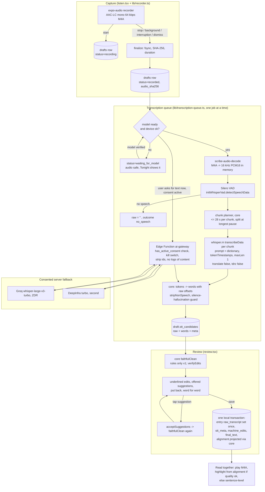

# TDD 03: Audio capture, transcription and the faithful-edit path

Status: Proposed, 3 October 2026. Persona: staff audio and speech engineer. Branch read: `develop`.
Scope owner: Mobile A (capture services in `apps/mobile/src/lib`), core owner (`packages/core`), gateway owner (Edge Function `ai-gateway`, not yet built).
Inputs read: `CLAUDE.md`, `docs/prd/PRD.md` 1.2 and A, B, C, `docs/ARCHITECTURE.md`, ADR 0001, 0002, 0003, 0005, 0009, 0012, `docs/legal/ENGINEERING_REQUIREMENTS.md`, `DATA_CLASSIFICATION.md`, `data-policy.md`, `DELETION_AND_EXPORT_SPEC.md` section 5, `docs/analytics/TRACKING_PLAN.md`, `docs/BACKLOG.md`, `packages/core/src/*`, `experiments/`, `apps/mobile/src/lib/transcribe*.ts`, `audio-mode.ts`, `app/listen.tsx`, `app/review.tsx`, `app/read-together.tsx`, `components/capture/*`, and the installed `whisper.rn` 0.7.4 source in `node_modules/whisper.rn`.

**Evidence key** (same spirit as ADR 0012). **F** = fact I checked in this repo or in the installed library source on 3 Oct 2026. **V-prior** = verified by ADR 0001 to 0012 sources (not re-opened here). **E** = my engineering estimate, to be measured. **A** = assumption. **R** = recommendation. **U** = unverified. Every budget number marked E is a target to measure in BL-043, not a promise.

The constitution applies to everything below: the machine may remove and repair, never add meaning. Nothing in this design writes a person's words. ASR output becomes `raw_transcript` once and never changes; every later change is a typed `Edit` that passed `verifyEdits`.

---

## 0. Summary of decisions in this TDD

1. **Record** AAC-LC mono 64 kbps M4A with expo-audio (ADR 0005, unchanged), but the draft row is written **when recording starts**, not on Finish, and backgrounding, interruptions and swipe-dismiss all **stop and keep** the take (LEGAL-REQ-011, DATA-REQ-048).
2. **Decode** M4A to 16 kHz mono PCM16 **in memory only** through a small Expo module (`scribe-audio-decode`, AVAudioFile + AVAudioConverter), returned as bytes and passed to `whisper.rn` `transcribeData`. No PCM file ever touches disk (LEGAL-REQ-018).
3. **VAD first.** Silero VAD (via `initWhisperVad`, F) plans speech chunks. No speech means an empty transcript, never a Whisper guess. Each chunk is transcribed in its own `transcribeData` call **with the dictionary prompt**, because whisper.rn forces `no_context = true` and does not expose `carry_initial_prompt` (F), so a single long call only biases the first 30 s window.
4. **Word timings** come from `tokenTimestamps: true, maxLen: 1` (per-token segments, F: both options are wired in the JSI layer) merged into words, with exact character offsets into `raw_transcript`. A new pure function in `packages/core` projects them through accepted edits onto `final_text` (ADR 0009) with a quality gate.
5. **Model management**: one `ModelManager` with device tiers (turbo q5_0 or small q5_1), resumable Range-request download to `Application Support/models/*.part`, SHA-256 verified before rename, excluded from backup, removable in Settings. Context released when idle.
6. **Server fallback** only with an active server-checked `ai-processing` consent (LEGAL-REQ-004), streamed through the gateway without touching Storage, Groq turbo with ZDR then DeepInfra (ADR 0002 and 0012).
7. **Faithful-edit pipeline**: rules only for v1 (ADR 0003, 0012). The verifier accepts **eight meaning-changing edits I reproduced across four edit types** (section 7.1); they must close before any model edit pass or the punctuation rule provider is switched on (rules shipped today cannot produce them).
8. **Suggestions UX**: `CleanResult.suggestions` shown as offered marks the parent taps to accept; acceptance re-runs `faithfulClean` via `acceptSuggestions`, so nothing bypasses the verifier.

---

## 1. Scope and traceability

### 1.1 In scope
Recording, audio session, interruption and background handling, local audio integrity, M4A decode, VAD, on-device ASR (whisper.rn), model download and lifecycle, word timings and alignment for Read together, server ASR fallback with consent, the raw-to-final faithful-edit path on device, Review suggestions UX, ASR telemetry, and the test strategy for all of it.

### 1.2 Out of scope (owned by other TDDs)
Sync and upload of entries and encrypted audio backup (TDD 02, ADR 0004, 0006), the Read together player UI and Plus gate (TDD 01), web contributor recording in the browser (B F6; only its transcription rule is here), the LLM edit-pass provider wiring beyond its verifier preconditions.

### 1.3 Traceability

| Requirement | What it demands of this area | Where satisfied here | Status today (F) |
|---|---|---|---|
| A-REQ-012 | First letter saved with no OS prompt except the microphone | 3.1, 3.2 | Partly: listen.tsx asks at mount |
| A-REQ-030, PRD 7.4 | Offline entry; record, transcribe (once the model is present), review, save offline | 3.4, 3.6 | Not met: no queue, release build has no transcriber |
| A-REQ-002 | Splash never waits on network, model or sync | 3.5.4 (lazy context, no model load on launch) | Met by lazy `require` |
| B-REQ-003 | Languages and Hindi script drive transcription; never translate or transliterate | 3.5.6, 6.4, OQ-2 | Not met: `language` never passed from Review |
| B-REQ-006 | Automatic dictionary terms from names and signatures | 3.5.5 (prompt), 3.7 | Met for prompt; prompt only biases first window |
| B-REQ-017 (P1) | Name check: say it three times; clips deleted | 3.9 | Not built |
| PRD-REQ-004, K-09 | `raw_transcript`, `machine_edits`, `stt_meta` author-only; alignment readable by members | 4.3, 4.4 | Schema has `stt_meta`; no `alignment` column (F) |
| PRD-REQ-020 | Read together session starts when playback with word highlight begins | 3.8 (alignment availability flag) | Read together has no audio yet |
| K-14 | One-time "it can make mistakes" card before first save | 3.7 (unchanged, `review.firstNote`) | Met |
| PRD 7.1 | Tap record to microphone live p95 500 ms; local save p95 200 ms | 5.1 | Unmeasured |
| PRD 7.2 | Server transcription up to 2 min: p95 4 s, p99 10 s | 5.4 | Not built |
| PRD 7.7 | Model 574 MB, Wi-Fi default, resumable, removable; 2-min letter in 30 s and 2% battery on SE 3; warn below 1 GB free | 3.5, 5.1 to 5.3 | Not built |
| PRD 7.5 | Letters lost or silently changed: zero | 3.2, 3.3, 6 | Not met (section 8) |
| LEGAL-REQ-004 | Server-checked per-feature AI consent; 403 and silent on-device path | 3.6 | Not built |
| LEGAL-REQ-005 | Web contributor audio never to AI on a parent's consent | 3.6.3 | Not built |
| LEGAL-REQ-007 | Mic requested at moment of use after in-app explanation; never speech-recognition permission | 3.1, OQ-6 | Partly |
| LEGAL-REQ-011 (P1) | Never record in background; stop and save on background | 3.2 | Not met |
| LEGAL-REQ-014 | No content in logs, URLs, crash reports | 4.5, 7.6 | Error paths are code-only today (good) |
| LEGAL-REQ-018 | 16 kHz decode buffers and name clips never persisted | 3.4, 3.9 | Met by default (decoder not built); `transcribe(filePath)` path would break it |
| LEGAL-REQ-019 | No diarization, voiceprints or synthesis | 3.5.5 (`tdrzEnable` forced false, lint), 3.6 | Met (not set); add lint |
| LEGAL-REQ-020 | Zero retention, no training, ids stripped, content-free gateway logs | 3.6 | Not built |
| LEGAL-REQ-022(a)(b) | Uploaded audio client-encrypted; device files Data Protection | 3.6.2, 4.2 | See conflict C-3 |
| LEGAL-REQ-040 | Kill switch for the AI gateway; local features keep working | 3.6.4 | Not built |
| DATA-REQ-040 | `raw_transcript`, `engine_version` immutable after insert | 3.7 | Met in DB; draft semantics need a change (C-4) |
| DATA-REQ-041, -042 | Edits reversible and versioned; replay equals `final_text` | 3.7, 8 (Review free-text edit) | Partly |
| DATA-REQ-046 | Audio SHA-256 computed when recording stops | 3.3 | Not met |
| DATA-REQ-048 | Audio fsynced and hashed before the row commits; never a row pointing at a missing file | 3.3 | Not met |
| DATA-REQ-001/002 | Every new column or device store classified in the same PR | 4 | `alignment` and `stt_candidates` need rows |
| CLAUDE.md constitution | Every machine edit through `verifyEdits`; no rewrite | 3.7, 7 | Holds for rules; verifier holes (7.1) |
| TRACKING_PLAN `transcription_completed`, `model_download`, `machine_edit_reverted`, `capture_discarded` | Content-free capture telemetry | 4.5 | Catalogue exists (F); enum gaps (4.5) |
| ADR 0001, 0002, 0005, 0009, 0012 | Engine, fallback, format, alignment decisions | throughout | This TDD implements them; deviations listed in 10 |

---

## 2. Design overview



**Design principles for this area**
- Audio first. The recording is the true original (K-09). Every failure path ends with the audio safe and visible, never with an error that loses it.
- One engine interface. The app sees `Transcriber`; the queue owns sequencing; core owns all text logic (pure TS, testable in Node).
- Raw is a record of what the recogniser heard in speech regions, nothing else. Non-speech annotations and VAD-silent output never become raw (they go to `stt_meta.dropped` for debugging, content-free counts only on the server side).
- Degrade honestly: no highlight beats a wrong highlight; no transcript beats an invented one.

---

## 3. Detailed design

### 3.1 Permission and audio session
- **F** `listen.tsx` calls `requestRecordingPermissionsAsync` on mount. That is "at the moment of use" (the parent tapped Speak), but LEGAL-REQ-007 also wants an in-app explanation first. **R** On the very first Speak tap, show a one-screen primer (copy in `packages/content`, counsel-approved purpose string) then the OS prompt; later taps go straight to recording. Denied keeps the existing typed path plus Open Settings, with no repeated OS prompt (already built, good).
- **F** `audio-mode.ts` sets `doNotMix` while recording, `shouldPlayInBackground: false`. Keep. **R** Add `allowsBackgroundRecording: false` explicitly if the expo-audio option exists in SDK 57 (**U**), and assert in a config test that `UIBackgroundModes` does not contain `audio` (LEGAL-REQ-011: no background recording without counsel review).
- Never request `NSSpeechRecognitionUsageDescription` (LEGAL-REQ-007). This rules out SFSpeechRecognizer and probably SpeechAnalyzer without a legal change (OQ-6).

### 3.2 Recorder lifecycle (new `lib/recorder.ts`, used by `listen.tsx`)

State machine (pure reducer in `packages/core/src/capture.ts` so it is unit-testable; the RN side only feeds events):

| State | Entered by | Draft row | Exit events |
|---|---|---|---|
| `asking` | screen opens | none | permission granted -> `recording`; denied -> `denied` |
| `recording` | `record()` succeeded | **created now**: `status='recording'`, `audio_uri`, `capture_mode='spoken'`, `child_id` | pause, finish, discard, `background`, `interruption`, `unmount`, `disk_low` |
| `paused` | user pause, or interruption began | `status='recording'` | resume (user only, never automatic), finish, discard, background |
| `finalizing` | finish, background, interruption > 0 s while app inactive, unmount, disk_low | | finalize done -> `recorded` |
| `recorded` | `stop()` resolved, file fsynced, hashed | `status='recorded'`, `audio_sha256`, `audio_duration_ms` | queue picks it up |
| `discarded` | user confirmed discard | row and file deleted in one step | |

Rules:
1. **Background** (`AppState` -> `background` or `inactive` for more than 1 s): stop, finalize, keep the take. On return, Tonight shows the letter as waiting to be read back (existing draft UI). This is the PRD checklist line "Recording stops and is saved when the app is backgrounded" and LEGAL-REQ-011.
2. **Interruption** (phone call, FaceTime, Siri, alarm): treat as user pause, persist duration so far, and never auto-resume (LEGAL-REQ-011 forbids auto-start). If the app is backgrounded during the interruption, rule 1 applies. **U** expo-audio 57 surfaces interruptions through recorder status; if it does not, a 30-line Expo module observing `AVAudioSession.interruptionNotification` is task BL-A04.
3. **Swipe-dismiss or navigation away** (`useEffect` cleanup): finalize and keep, never silently drop. Today the cleanup stops the recorder and leaves an orphan file with no row (section 8, H-2).
4. **Crash or kill mid-recording**: the row already exists with `status='recording'`. On next launch, `recoverDrafts()` checks the file: if it opens with AVAudioFile and has a duration, mark `recorded` (hash it); if the M4A has no `moov` atom (AVAudioRecorder writes it on stop, **A**, verify), mark `unrecoverable` and keep the file for the export ZIP and the parent's decision, never delete it automatically. **R** Measure in BL-043 how often a killed recording is unreadable; if it is common, evaluate recording ADTS AAC (stream format survives truncation) and remuxing to M4A on stop. That would amend ADR 0005; not for v1 unless the kill test fails.
5. **Low storage**: before `record()`, read free space. Below 1 GB show the PRD 7.7 warning (copy exists as `errors.storage_low` analytics code; string needed) but still allow recording. Below 50 MB (about 100 minutes of audio) refuse to start and say why. While recording, check every 30 s; under 20 MB finalize automatically. Audio never fails silently.
6. **Tap to mic live p95 500 ms** (PRD 7.1): call `prepareToRecordAsync` as soon as permission is known, set the audio mode in parallel with the haptic, and do not wait on any store write before `record()`; the draft insert happens right after `record()` resolves (synchronous SQLite, under 5 ms **E**).

Recording options stay as in `listen.tsx` (F: AAC, mono, 44.1 kHz, 64 kbps, metering on). **R** Move the file from `Documents` to `Application Support/audio/<draft_id>.m4a` (not user-visible via Files, still in device backup, which C OQ5 relies on). The file name uses the draft id, which becomes the entry id at save (UUIDv7, DATA-REQ-044).

### 3.3 Audio integrity (DATA-REQ-046, DATA-REQ-048)
- On `recorded`: open the file once, `fsync` (Expo module call, **U** whether expo-file-system exposes it; otherwise part of `scribe-audio-decode`), compute SHA-256 streaming in 1 MB blocks natively (not in JS), store `audio_sha256` on the draft and later on the entry. Target under 150 ms for a 10-minute file (4.8 MB) on iPhone 12 (**E**).
- Save transaction (owned by BL-032): entry row with `audio_sha256` commits only after the hash exists. A row never points at a missing file; the recovery queue covers the reverse case.
- The decoder verifies the hash before every transcription attempt; a mismatch stops the job with `outcome=failed` and never alters the file.

### 3.4 Decode: M4A to 16 kHz PCM16, in memory (ADR 0005, LEGAL-REQ-018)

**F** whisper.rn 0.7.4 `transcribe(filePath)` needs a WAV file; `transcribeData(ArrayBuffer)` takes raw samples, and the native side (`decodePcm16` in `cpp/jsi/RNWhisperJSI.cpp`) reads **16-bit signed little-endian** samples, while the JS doc comment says "float32 PCM". Treat the native code as the contract and pin it with a test (T-DEC-03). Writing a temp WAV would breach LEGAL-REQ-018, so the file path API is banned for user audio (lint rule).

New local Expo module `modules/scribe-audio-decode` (Swift, about 200 lines):

```ts
// apps/mobile/modules/scribe-audio-decode/index.ts
export interface DecodeInfo { durationMs: number; sampleRate: number; channels: number }
export function probe(uri: string): Promise<DecodeInfo>;
/** 16 kHz mono PCM16 LE for [startMs, endMs). Memory only; caller drops the buffer. */
export function decodeRange(uri: string, startMs: number, endMs: number): Promise<Uint8Array>;
export function sha256File(uri: string): Promise<string>;   // hex, streamed natively
export function fsyncFile(uri: string): Promise<void>;
```

- Implementation: `AVAudioFile(forReading:)`, `AVAudioConverter` to `AVAudioFormat(commonFormat: .pcmFormatInt16, sampleRate: 16000, channels: 1, interleaved: true)`, read in 1 s frames, append to `Data`, return as `Uint8Array` (**U**: Expo Modules returning `Data` as a typed array without a copy; measure; worst case one copy).
- Memory: 16,000 samples/s x 2 bytes = 32 KB/s, so 1 min = 1.92 MB, 10 min = 19.2 MB (arithmetic). The whole-file decode for VAD is acceptable up to 30 minutes (58 MB); above that the planner runs VAD over 5-minute windows (BL-A06). Buffers are released (`= null`) as soon as each chunk is transcribed.
- Resampling quality: AVAudioConverter default (`.normal` sample rate converter quality) is fine for ASR (**A**); measured indirectly by the WER gate.
- Rejected: a parallel expo-audio 16 kHz stream while recording (doubles the mic pipeline, ties transcription to the recording session, breaks re-transcription of old audio). Revisit only for live captions, which v1 does not have.

### 3.5 On-device ASR (whisper.rn)

#### 3.5.1 Facts about the installed binding that shape the design (F, `node_modules/whisper.rn` 0.7.4)
| Fact | Consequence |
|---|---|
| `TranscribeResult.segments` carries only `text`, `t0`, `t1` (centiseconds); no tokens, no probabilities, no no-speech score | Token probability cannot feed the ADR 0009 quality gate on device; gate uses timing heuristics only (3.8). Word timings need `maxLen: 1` |
| JSI maps `tokenTimestamps`, `maxLen`, `wordThold`, `offset`, `duration`, `prompt`, `language`, `translate`, `beamSize`, `bestOf`, `temperature`, `tdrzEnable`; `split_on_word` is not exposed | `maxLen: 1` gives one token per segment; we merge sub-word tokens ourselves (3.8) |
| `config.params.no_context = true` is forced; `carry_initial_prompt` defaults false and is not exposed | The dictionary prompt conditions the first 30 s window of each call only. Chunking per call keeps names right in long letters |
| VAD is a separate context (`initWhisperVad`, `detectSpeechData`) with Silero options (threshold, min speech/silence, max speech, padding) | We run VAD ourselves and plan chunks; `whisper_full` built-in VAD is not reachable from JS |
| `transcribeData` returns `{ stop, promise }`; abort is cooperative | Cancellation on navigation and on backgrounding is supported |
| `initWhisper` defaults `useGpu: true`, `useCoreMLIos: true` | Set `useCoreMLIos: false` explicitly until the 1.17 GB Core ML encoder is evaluated (ADR 0001), else init looks for an encoder that is not there |

#### 3.5.2 Engine interface (replaces `lib/transcribe.ts` types; additive)

```ts
export interface TranscribeInput {
  audioUri: string;
  audioSha256: string;                 // verified before decode
  durationMs: number;
  dictionary: DictionaryTerm[];
  language: 'auto' | 'en' | 'hi';      // from the author's B-REQ-003 choice
  script?: 'devanagari' | 'roman' | 'as_spoken';
  source: 'app' | 'web';               // web contributions never go to the server without the contributor's own consent
}
export interface SttWord { text: string; start: number; end: number; startMs: number; endMs: number } // start/end: UTF-16 offsets into raw
export interface SttMeta {
  engine: 'whisper-rn' | 'server';
  provider?: 'groq' | 'deepinfra';
  model: 'large-v3-turbo-q5_0' | 'small-q5_1' | 'large-v3-turbo';
  modelSha256?: string;                // on-device model file hash
  bindingVersion?: string;             // whisper.rn version
  language: string | null;
  promptSha256: string;                // hash of the rendered prompt (L4, derived)
  chunks: Array<{ startMs: number; endMs: number; words: number }>;
  dropped: Array<{ startMs: number; endMs: number; reason: 'non_speech_tag' | 'silence_hallucination' }>;
  flags: Array<{ start: number; end: number; reason: 'repetition_loop' }>;
  timingQuality: 'word' | 'segment' | 'none';
  createdAt: string;
}
export interface TranscribeResult { raw: string; words: SttWord[]; meta: SttMeta }
export type Outcome = 'ok' | 'no_speech' | 'queued_for_model' | 'failed' | 'interrupted';
```

#### 3.5.3 Chunk planner (pure, `packages/core/src/asr-plan.ts`)
Input: VAD segments (ms), total duration. Output: chunks.
1. Pad each VAD segment by 200 ms both sides (Silero default padding is 30 ms, F; Whisper cuts word onsets with tight padding, **A**).
2. Merge segments separated by under 600 ms.
3. Greedily pack into chunks of at most 28 s; split at the largest internal pause. A single continuous speech run over 28 s with no pause of 200 ms or more is passed whole (Whisper windows internally; the prompt then biases only its first 30 s, which is accepted for this rare case).
4. Drop chunks shorter than 300 ms of speech.
Times map back by adding `chunk.startMs`. The planner is deterministic so re-running a job yields the same chunks.

#### 3.5.4 Context lifecycle
- One `WhisperContext` at a time, created lazily by the queue, never on launch (A-REQ-002).
- Released after 45 s idle, on `AppState` background, and on the iOS memory warning. **F** today `context` is a module-level promise that is never released (section 8, H-5).
- One job at a time through `lib/transcription-queue.ts` (FIFO, persisted as draft `status`). Review subscribes to the queue instead of calling the transcriber directly, so reopening Review never starts a second job on the same context.
- Thermal: if `ProcessInfo.thermalState` is `serious` or `critical` (**U** exposure in Expo; `expo-device` does not have it, small module method), pause between chunks and resume when it drops. Low Power Mode: keep going but at `maxThreads: 2`.
- Backgrounding mid-job: stop the job at the next chunk boundary (abort the current one), persist completed chunks into `draft.stt_partial`, resume on foreground from the next chunk. No background task API is used (PRD 7.7: no background work except OS sync and notifications).

#### 3.5.5 Decode parameters (per chunk)
`language` from input; `translate: false`; `tdrzEnable: false` (LEGAL-REQ-019, lint); `tokenTimestamps: true`; `maxLen: 1`; `prompt` = dictionary prompt; `temperature: 0`, `temperatureInc: 0.2` (whisper.cpp default fallback, **V-prior** behaviour); `beamSize` unset (greedy) for speed unless BL-043 shows beam 5 materially improves names; `maxThreads` default.

Prompt rendering (`packages/core/src/asr-prompt.ts`, replaces `dictionaryPrompt`): unique terms in a stable order (child, nicknames, family, self, places, words), joined `", "`, ending `"."`, capped at 200 Whisper tokens (Groq caps at 224, V-prior; whisper.cpp caps prompt at half the text context, 224, **V-prior**). Estimate tokens as `ceil(chars / 3)` and drop lowest-priority terms first. Same function serves server fallback so both engines see identical biasing; its SHA-256 goes to `stt_meta.promptSha256`.

#### 3.5.6 Language and script (B-REQ-003)
| Author choice | `language` | Expected output | Risk |
|---|---|---|---|
| Skipped | `auto` | Whisper detects per call; with chunking, per chunk | Language can flip between chunks; acceptable, every chunk keeps its own script |
| English only | `en` | Latin | Hindi words get anglicised spellings; dictionary catches names |
| Hindi + Devanagari | `hi` | Devanagari for Hindi | **Whisper with `hi` may write English words in Devanagari**, which reads as transliteration and conflicts with "nothing transliterated" (**A**, measure on recordings 6 to 10). If it does, use `auto` per chunk instead |
| Hindi + Roman | `auto` | Base turbo does not produce Roman-script Hindi reliably (ADR 0012: Oriserve fine-tune exists for that) | B-REQ-003 cannot be fully met with turbo; OQ-2 |
| Hindi + As spoken | `auto` | Whatever Whisper emits | Definition of "as spoken" is open (OQ-2) |

The app never transliterates or translates (`translate: false`, no post-processing of script).

#### 3.5.7 Silence and hallucination guard (core, `asr-post.ts`)
1. VAD says no speech in the whole file: `raw = ''`, `outcome = 'no_speech'`, Review shows the recording with the typed path and "nothing to write down" copy (new string). Whisper is not run at all.
2. Per chunk, after decode: apply `stripNonSpeech` (F, exists) to the chunk text before it joins raw; record removed tags in `meta.dropped` (times only).
3. Repetition loop: if any 1 to 4 word n-gram repeats 4 or more times back to back inside a chunk, or a chunk's words per second exceed 5.5 (**E**, normal speech is 2 to 3.5), the chunk is re-decoded once with `temperature: 0.4`. If it still loops, keep the text (it may be real: "bye bye bye bye", F `repeats.ts` treats one-word reduplication as kept) and add a `repetition_loop` flag so Review can show "listen to this part" on that span. We never delete words inside speech; only VAD-silent output and non-speech tags are dropped, because those are not the person's words.

#### 3.5.8 Model management (new `lib/models.ts`)

| Tier | File | Size (V-prior) | Chosen when |
|---|---|---|---|
| T1 | `ggml-large-v3-turbo-q5_0.bin` | 574 MB | Physical RAM 6 GB or more, or 4 GB devices that pass the BL-043 memory test (iPhone SE 3, 12, 13 are 4 GB, **V-prior** general knowledge, U for this doc) |
| T2 | `ggml-small-q5_1.bin` | 190 MB | Under 4 GB RAM, or T1 failed to init twice (memory), or the parent picks "smaller download" in Settings |
| VAD | `ggml-silero-v5.1.2.bin` | under 1 MB (**U** exact) | Bundled in the app binary (it is L1 and tiny), so VAD and the no-speech path work before any download |

Manifest (remote config, signed by being served from our own config endpoint; L1):
```json
{ "models": [{ "id": "large-v3-turbo-q5_0", "url": "https://<model-host>/whisper/<pinned-revision>/ggml-large-v3-turbo-q5_0.bin", "bytes": 574000000, "sha256": "<hex>", "minRamGB": 4 }] }
```
(Byte counts and hashes are filled from the pinned file at release; values above are placeholders.)

Download:
- Starts after first run when on Wi-Fi (PRD 7.4) or immediately if the parent allows cellular (`settings_changed{key: model_download_network}` exists, F). Never during launch; never blocks anything.
- **Resumable by design, not by library**: HTTP Range requests in 8 MB parts appended to `Application Support/models/<id>.bin.part`, with a sidecar `<id>.json` holding bytes done and an incremental SHA-256 state. Resume after kill, reboot, network change. **U** whether expo-file-system 57 offers a background `URLSession` download; if it does, prefer it (survives suspension) and keep the Range fallback. The host must support Range (Hugging Face does, **A**; Cloudflare R2 does, **A**).
- Verify SHA-256 over the full file, then atomic rename to `<id>.bin`, set `NSURLIsExcludedFromBackupKey` (ADR 0001), emit `model_download{stage: completed}`. A file without a verified hash is never loaded (today `modelFile()` loads any file that exists, including a partial one: H-4).
- Storage check: need model size plus 100 MB free before starting; otherwise show the low-storage note and wait.
- Removal in Settings (PRD 7.7) deletes the file and returns new spoken letters to `waiting_for_model`.
- Upgrades: a new manifest entry downloads alongside; the old file is deleted only after the new one verifies. Entries keep `stt_meta.modelSha256` so we know what produced each raw.

**Hosting cost is a real decision (OQ-3).** ARCHITECTURE section 7 does not count model egress. At 220k installs x about 0.6 GB = about 130 TB; on Supabase egress at $0.09/GB (V-prior) that is roughly $12k once, plus re-installs. Hugging Face (free, pinned revision) or a zero-egress object store is the R. Either is a new processor that sees device IPs (not content): it needs a data-map row (L1 file, L3 IP at the host).

### 3.6 Server ASR fallback with consent (ADR 0002, 0012; LEGAL-REQ-004, -005, -019, -020, -040)

#### 3.6.1 When it is offered
Only if all hold: the profile has an active `ai-processing` consent (checked by the gateway, cached client-side only to hide the button); the entry is not `source='web'` unless the contributor consented themselves (LEGAL-REQ-005); network is up; the kill switch is off. Triggers: (a) model not ready and the parent taps "Write it down now" on a waiting letter; (b) device tier cannot run T1 and the parent opted into "better transcription on our servers"; (c) a one-off "try again on our servers" from Review before first save. Never automatic without the consent; without it, the queue simply waits for the model. Consent sheet follows PRD-REQ-001 (one ask per session, never during recording, review or export), so it is offered from Tonight or Settings, not mid-Review on first use.

#### 3.6.2 Data path
Client sends the original M4A bytes (no transcoding, smallest payload: 0.48 MB/min) in a POST body to `ai-gateway/transcribe`, streamed; the function forwards the stream to the provider and never writes to Storage or disk. This avoids a temporary Storage object, which LEGAL-REQ-022(a) would require to be client-encrypted (C-3). Request carries only: audio, `language`, `prompt` (the dictionary prompt, which LEGAL-REQ-020 allows), `timestamp_granularities=word`. No profile id, child id, entry id or file name reaches the provider (the function uses the JWT only to check consent and rate limits). `diarize`, `speaker_labels` or similar parameters are rejected by a request-builder lint (LEGAL-REQ-019).

Providers: Groq `whisper-large-v3-turbo` with Zero Data Retention on (V-prior), then DeepInfra turbo ("zero retention", V-prior; word timestamps U). Both need a signed DPA before launch (LEGAL-REQ-020). Groq file limit 25 MB (free) or 100 MB (dev) (V-prior) means about 52 minutes of our audio on the free limit; above the limit the client splits on VAD boundaries before upload (each part is a separate request).

Response handling: provider word list -> `SttWord[]` with offsets computed against the joined text (same core function as on-device), `meta.engine='server'`. The result lands in `draft.stt_candidates`; it does not overwrite an on-device candidate (ADR 0002: the author picks before first save).

Gateway logs: provider, model, audio seconds, bytes, latency, status, consent-check result. No content, no ids (LEGAL-REQ-014, -020); canary test T-GW-04.

#### 3.6.3 Web contributions
`source='web'` entries are transcribed on the parent's device only (B F6.7). The gateway refuses any request tagged `source='web'` without a contributor consent record (LEGAL-REQ-005), and the client never tags such entries otherwise. After upload of the contributor's raw transcript, the parent's device must not keep or display it (K-09); the queue deletes the local candidate when the sync layer confirms the insert.

#### 3.6.4 Kill switch and failure
`ai_gateway_enabled=false` (LEGAL-REQ-040, BL-022) makes the gateway return 503 and the client hide server options within one config refresh; local recording and transcription are unaffected. Any gateway error leaves the letter in its prior state (`waiting_for_model` or the on-device candidate) with copy that the recording is safe.

### 3.7 Faithful-edit pipeline on device
1. Review receives the chosen candidate. `raw` = candidate raw; `faithfulClean(raw, { level, dictionary, locked })` (F) produces `applied`, `rejected`, `suggestions`. Rules only in v1 (ADR 0003, 0012). `cleanWithProviders` with `RulePunctuationProvider` may be added once its edits pass the hardened verifier (7.1).
2. **Draft semantics (C-4).** The draft holds `stt_candidates` (one or two) and `chosen_candidate`. `raw_transcript` is written once, at save, into the entry, which is when the DB immutability trigger starts (DATA-REQ-040). Today `setDraftTranscript` sets draft raw "once" (F), which blocks the ADR 0002 "choose before first save" option; replace it with candidate storage.
3. Save transaction stores `raw_transcript`, `stt_meta` (chosen candidate meta + words), `machine_edits` (accepted and rejected, per DATA-REQ-042; today only `applied` is stored, F), `final_text`, `engine_version`, `audio_sha256`, and the projected `alignment` (3.8).
4. Free-text edits (`userText` in `review.tsx`, F) are the author's own words, allowed, but they must be stored as an author edit layer so DATA-REQ-041 replay works: `final_text` = apply(raw, machine edits) then author diff. **R** store `author_edits` as a list of `{start, end, replacement}` against the machine-cleaned text, computed with a word diff at save; alignment drops highlighting for author-replaced spans.

#### 3.7.1 Suggestions UX (ADR 0012 "tap-to-remove underlines")
- Visual: offered spans get a lighter, distinct mark from applied edits (applied: dotted accent underline, F `transcript.tsx`; offered: a small hollow ring after the word **R**, final look from the designers per COMPONENTS 2.19). Never colour alone; VoiceOver row list includes "Offered: remove repeated 'so'".
- Tap opens the same card pattern as edits: label (`review.suggestions.repeat.*`, new strings), "what you said" and "without the repeat", buttons "Remove it" and "Keep it".
- "Remove it": `faithfulClean(raw, acceptSuggestions(opts, [s]))`; the edit is verified again; if the verifier refuses (it should not, but the raw is unchanged and rules may have moved) the card closes with no change. Accepted suggestions are stored in `machine_edits` with `source: 'rule'` plus `accepted_by: 'author'` (**R**: additive optional field on `Edit`, needs a core type change and an `ENGINE_VERSION` bump to 3).
- "Keep it" just dismisses for this letter. Nothing is learned automatically in v1 (a per-family "always keep 'so so'" preference is premature).
- Telemetry: `review_action` gains `suggestion_accepted` and `suggestion_kept` values (enum only; owner: analytics engineer).

### 3.8 Word timings and alignment for Read together (ADR 0009)

**Tokens to words (core `asr-words.ts`).** With `maxLen: 1`, each segment is one token: e.g. `" As"`, `"ha"`, `" laughed"`. A segment whose text starts with a space starts a new word; otherwise it extends the previous word, and the word's `endMs` becomes that token's `t1`. Punctuation-only tokens attach to the previous word without changing its end time. `raw` is built by concatenating chunk texts with a single space and trimming, and each `SttWord` records its exact `start`/`end` offsets into that string, so no fuzzy matching is ever needed. Server words (Groq) are mapped by walking the provider's word list against the joined text with exact case-sensitive search from the current cursor; if a word cannot be found, `timingQuality='segment'`.

**Projection (core `alignment.ts`, new, pure).** `projectAlignment(raw, words, appliedEdits, authorEdits?) -> Alignment`:
- Words fully outside every edit keep their times, re-offset into `final_text`.
- Words inside a removal edit (filler, repeat, false start) are dropped; the gap stays in time (the reader hears "um" with no highlight).
- `stt_fix` and `agreement` spans take the union of the covered words' times.
- `punctuation` and `paragraph` edits change offsets only.
- Author-edited spans get no timing.
Output: `{ version: 1, words: [{ s, e, startMs, endMs }], quality: 'word' | 'sentence' | 'none', engine }` where `s`, `e` are offsets into `final_text`. No raw text and no raw offsets appear in it, so it can be readable by book members without leaking removed words (K-09).

**Quality gate.** Mark `sentence` (sentence-level highlight only) when any holds: fewer than 80% of final words have times; any non-monotonic start; any word longer than 2.5 s; median word duration under 60 ms; any gap over 2 s that VAD marked as speech; `meta.flags` has a loop. Mark `none` when there are no words. Read together reads `quality` and never shows a word highlight below `word`. On-device token probabilities are not available from the binding (3.5.1), so the ADR 0009 "low token probability" criterion is dropped for on-device and kept for server results if a provider returns probabilities (**U**).

**Accuracy target**: median absolute word-start error under 120 ms and 95th percentile under 300 ms against hand labels on the golden corpus (T-ALN-02). Highlight feels right within roughly a syllable; above that, the gate must catch it. If turbo fails this bar in BL-043, v1 ships sentence-level highlight on device and offers server re-alignment later (ADR 0009 item 4, v1.x).

**Storage.** `alignment` needs a new column (C-1); recomputed whenever `machine_edits` or `final_text` changes (Review undo, later edits), in the same transaction.

### 3.9 Name check clips (B-REQ-017, P1)
Three 3-second recordings to `tmp/namecheck-<uuid>.m4a` with `NSFileProtectionComplete`, decoded and transcribed in memory, deleted in a `finally` block and again by a sweep at launch. `heardAs` gets the distinct non-canonical spellings (B-REQ-017 example). LEGAL-REQ-018 says clips are "never written to persistent storage"; expo-audio can only record to a file, so a tmp file deleted within seconds is the closest we can do: counsel to confirm (C-5). Ships only after the model is ready (B F4.3).

---

## 4. Data and classification handling

Levels per `DATA_CLASSIFICATION.md` section 1; "derived data inherits" (rule 2) applies throughout.

### 4.1 Inventory

| Element | Where | Level | Lifetime | Leaves the device? | Rule |
|---|---|---|---|---|---|
| Recording `audio/<id>.m4a` | Application Support (moved from Documents) | L4 (C1 Voice) | Until the author deletes the letter or account | Only (a) encrypted backup (ADR 0006), (b) consented server ASR stream (3.6) | Data Protection class at least "complete until first user authentication" (iOS default for app files, LEGAL-REQ-022(b)); SHA-256 on stop |
| `audio_sha256` | draft and entry | L4 (hash of content, rule 2) | With the entry | Syncs with the entry (author-only working material, same as `raw_sha256`) | New column needs classification comment |
| 16 kHz PCM buffers | process memory | L4 | Seconds; freed per chunk | Never | LEGAL-REQ-018; file-path transcribe API banned for user audio |
| VAD segments, chunk plan | memory, then `stt_meta.chunks` | L4 (derived timing of a person's speech) | With `stt_meta` | Syncs inside `stt_meta` (author-only) | |
| `stt_candidates`, `stt_partial` | local `drafts` columns (new) | L4 | Until save or discard | Never (drafts do not sync) | Device store row in data-policy section 4 |
| `raw_transcript` | entry | L4 | Immutable from insert | Syncs, author-only (PRD-REQ-004) | DATA-REQ-040 |
| `stt_meta` (words with raw offsets, engine, model hash, prompt hash, chunks, dropped, flags) | entry | L4 author-only | Immutable once set (**R**: add to the guard, it describes how raw was produced) | Syncs, author-only | Contains raw-derived offsets, so never member-readable |
| `machine_edits` (accepted, rejected, `accepted_by`) | entry | L4 author-only | Versioned (DATA-REQ-041) | Syncs | |
| `alignment` (final-text offsets and times only) | entry, **new column** | L4 | Recomputed with edits | Syncs; readable by book members through `book_entries` (K-09: "Word alignment stays readable") | Must contain no raw text or raw offsets (test T-ALN-05) |
| Dictionary prompt text | memory | L4 | Per call | Server path only, inside the consented request (LEGAL-REQ-020 allows dictionary prompt) | Never logged |
| Model files | Application Support/models | L1 | Until removed | Downloaded, never uploaded | Excluded from backup |
| Model host access logs | host provider | L3 (IP) | Host's terms | n/a | Data-map row (OQ-3) |
| Gateway request | Edge Function memory | L4 in flight | Duration of request | To Groq or DeepInfra only, consented | No Storage, no logs of content |
| Gateway log line | Supabase logs | L2 | 12 months (security logs, LEGAL-REQ-033) | | provider, model, seconds, bytes, latency, status |
| Telemetry events | PostHog after opt-in | L2 | 12 months | | 4.5 |

### 4.2 Device file protection and backup
Recordings stay in the device backup (they are the keepsake; C OQ5 relies on device backup as the last resort for Free users), with the default protection class so a locked phone can still finish writing a take. Models are excluded from backup. Name-check clips use `Complete` protection in tmp.

### 4.3 Author-only enforcement
`stt_meta` and `machine_edits` reach only the author (BL-011 migration, F). `alignment` is the only transcription artefact members read. A test proves that `alignment` for a letter whose raw contains a removed filler gives no way to recover the filler text (T-ALN-05).

### 4.4 Edits by the author
The free-text author layer (3.7 item 4) is L4 author content and versioned like `final_text`.

### 4.5 Telemetry (TRACKING_PLAN, ADR 0008)
Use the existing events (F, `packages/analytics/src/catalog.ts`): `transcription_completed{engine, model, audio_bucket, latency_bucket, outcome}`, `model_download{stage, model, network}`, `machine_edit_reverted{edit_type, source}`, `capture_discarded`, `error_shown{code}`. Proposed enum additions (owner: analytics engineer; all L2):
- `transcription_completed.outcome`: add `no_speech` and `interrupted` (no consent-related value: without consent the queue simply waits for the model).
- `transcription_completed`: add `timing_quality` (`word | sentence | none`) to see how often Read together falls back.
- `model_download.stage`: add `resumed`, `verify_failed`.
- `review_action`: add `suggestion_accepted`, `suggestion_kept`.
Never: words, language names (L4 by B-NFR-001), durations as raw numbers beyond the buckets, model errors with messages. Crash reports from whisper.rn native aborts must have the log listener off in release (whisper.rn has a native log bridge, F `emitNativeLog`; it can print decoded text in debug builds, **A**), so `toggleNativeLog(false)` in release and never forward native logs to Sentry (LEGAL-REQ-014).

---

## 5. Interface contracts and budgets

Reference devices: iPhone 12 (A14, 4 GB) and iPhone 15 (A16, 6 GB) as requested, plus iPhone SE 3 (A15, 4 GB), which is the PRD budget device. **No published whisper.rn iPhone benchmark exists (ADR 0012, U).** All timing numbers below are E: derived from turbo's shape (full large-v3 encoder, 4 decoder layers, V-prior), whisper.cpp's Metal path and Apple-silicon reference points; BL-043 measures them and this table is updated with the result.

### 5.1 On-device time to transcript (Finish tap to Review text), T1 turbo q5_0, Metal, Core ML off

Assumptions (A): 15% of a parent's recording is pauses that VAD removes; decode, VAD and hashing together cost under 3% of the total; context init (load 574 MB, Metal buffers) is paid once per cold job: about 2.5 s on iPhone 12, 1.5 s on iPhone 15 (E).

| Audio | iPhone 12, estimate (E) | iPhone 12, gate | iPhone 15, estimate (E) | iPhone 15, gate |
|---|---|---|---|---|
| 1 min | 12 to 18 s | p90 25 s | 7 to 11 s | p90 15 s |
| 3 min | 32 to 50 s | p90 70 s | 18 to 30 s | p90 40 s |
| 10 min | 100 to 160 s | p90 220 s | 60 to 100 s | p90 130 s |

- PRD 7.7 gate on iPhone SE 3: 2-minute letter in 30 s or less. A15 sits between the two columns, so the estimate is 20 to 32 s: **at risk**. If BL-043 misses it, options in order: Core ML encoder (whisper.cpp claims more than 3x encoder speed-up, V-prior; costs a 1.17 GB extra download, so probably only for 6 GB devices), T2 small for that device class, or relax the budget (founder decision).
- T2 small q5_1: about 3x faster than turbo (E): 1 min in 5 to 7 s on iPhone 12.
- Progress UI: chunk count gives honest progress (`chunk i of n`), not a fake spinner. Text appears in Review only when all chunks finish (raw must be complete before cleaning; partial text could be read as final).
- Server fallback (5.4) is not a latency fix by default; it requires consent.

### 5.2 Memory ceiling
| Item | Budget | Basis |
|---|---|---|
| Whisper T1 context resident (weights + Metal buffers + KV) | 1.0 GB or less | 574 MB weights (V-prior) plus about 300 to 400 MB working buffers (E) |
| Whisper T2 context | 400 MB or less | 190 MB weights (V-prior) |
| PCM for VAD (whole file, 10 min) | 19.2 MB | arithmetic |
| PCM per chunk | 0.9 MB | 28 s x 32 KB/s |
| App total peak during a T1 job | **1.4 GB or less** | Leaves headroom under iOS per-app limits on 4 GB phones (limits are not published, U; whisper.rn recommends the Extended Virtual Addressing entitlement for medium/large models, V-prior) |
| After job + 45 s idle | context released; back to the app's normal footprint | 3.5.4 |
Entitlements: `com.apple.developer.kernel.extended-virtual-addressing` (V-prior via whisper.rn README) and evaluate `com.apple.developer.kernel.increased-memory-limit` (**U** for our case). A jetsam during transcription must never lose audio: the job restarts from `stt_partial` on next launch, and after two memory failures the device is moved to T2 automatically (copy explains "using the smaller model on this phone").

### 5.3 Battery and thermal
| Item | Budget |
|---|---|
| PRD 7.7 | 2-minute letter: 2% battery or less on SE 3 |
| This TDD | 1% or less per minute of audio on iPhone 12 for T1 (E: at about 5 W SoC draw, 1 min of audio for about 15 s costs about 75 J, or about 0.7% of a 10.8 Wh battery; arithmetic on an assumed draw) |
| Thermal | No job starts at `critical`; pause between chunks at `serious` |
| Idle | Zero background work from this area (PRD 7.7) |

### 5.4 Model download
| Item | Budget or contract |
|---|---|
| Size | T1 574 MB, T2 190 MB (V-prior); VAD bundled (about 1 MB, U) |
| App binary growth from whisper.rn + VAD + decoder module | 15 MB or less (E) toward the 80 MB app budget (PRD 7.7) |
| Network | Wi-Fi by default; cellular only by explicit setting |
| Resumability | 8 MB Range parts; resume after kill, reboot, network change; no part re-downloaded more than once in normal resume (T-MDL-03) |
| Integrity | SHA-256 of the whole file must match the manifest before first use |
| Disk precondition | free space at least model size plus 100 MB |
| Time on 50 Mbps Wi-Fi | about 95 s for T1 (arithmetic: 574 MB x 8 / 50 Mbps) |

### 5.5 Server fallback latency and cost
Latency, measured at the client, US, good LTE (PRD 7.2 class "Server transcription gateway"):
| Audio | Upload (E, 5 Mbps up) | Provider (E) | Budget p95 / p99 |
|---|---|---|---|
| 1 min (0.48 MB) | about 0.8 s | about 0.5 to 1 s | 3 s / 8 s |
| 2 min (0.96 MB) | about 1.5 s | about 1 s | **4 s / 10 s (PRD 7.2)** |
| 3 min | about 2.3 s | about 1.5 s | 6 s / 12 s |
| 10 min (4.8 MB) | about 7.7 s | about 3 s | 15 s / 30 s |
Edge Function cold start is inside these numbers (budget 600 ms, PRD 7.2 light class). **U**: Supabase Edge Function request body and wall-clock limits for a 25 MB streamed body; confirm before choosing the stream-through design over a short-lived encrypted object.

Cost per 1,000 audio minutes (prices V-prior from ADR 0012):
| Provider and model | Per 1,000 min |
|---|---|
| DeepInfra whisper-large-v3-turbo | $0.20 |
| Cloudflare Workers AI turbo | $0.51 |
| Groq whisper-large-v3-turbo (primary, ZDR) | $0.67 (10 s minimum billing per request; per-chunk splitting on the server path would raise cost, so the server path uploads whole files, split only above the size limit) |
| Groq whisper-large-v3 (fallback if names fail) | $1.85 |
| Supabase Edge Function invocations and egress | negligible at these volumes (E) |
At ARCHITECTURE's assumption (40 min per family per month, 20% to server) and Groq: about $0.005 per active family per month; 100k families about $540 per month. Consent uptake will set the real number.

### 5.6 Module contracts (summary)
| Module | Contract | Errors (code only, never content) |
|---|---|---|
| `recorder` | `start(childId, promptKey) -> draftId`; `pause()`; `resume()`; `finish() -> {draftId, durationMs, sha256}`; emits `state` | `mic_denied`, `storage_low`, `record_failed` |
| `scribe-audio-decode` | 3.4 | `decode_failed`, `hash_mismatch` |
| `models` | `status(): {tier, state: 'absent' or 'downloading' or 'ready' or 'failed', progress}`; `ensure(tier)`; `remove()` | `no_space`, `verify_failed`, `network` |
| `transcription-queue` | `enqueue(draftId)`; `subscribe(draftId, cb)`; `cancel(draftId)`; persisted in drafts | outcome enum 3.5.2 |
| core `asr-plan`, `asr-words`, `asr-post`, `asr-prompt`, `alignment` | pure functions, vitest | none (total functions) |
| `ai-gateway/transcribe` | POST, JWT, body = audio stream + `{language, prompt}`; 403 without consent; 503 when switched off; 413 above size | HTTP status + code |

---

## 6. Failure modes

| # | Failure | Detection | Behaviour | Data outcome | Test |
|---|---|---|---|---|---|
| FM-1 | Phone call or Siri during recording | interruption event or `AppState` inactive | Pause; persist; no auto-resume; background turns it into finish | Take so far kept | T-CAP-04 |
| FM-2 | App backgrounded while recording | `AppState` | Stop and finalize within 1 s | Kept, `recorded` | T-CAP-03 (PRD checklist line, LEGAL-REQ-011) |
| FM-3 | App killed or crashed while recording | draft `status='recording'` at launch | `recoverDrafts()`: readable -> `recorded`; unreadable -> `unrecoverable`, file kept | Never silently deleted | T-CAP-06 (500-iteration kill test, PRD 7.4) |
| FM-4 | Swipe-dismiss Listening | unmount | Finalize and keep; the explicit Discard is the only delete | Kept | T-CAP-05 |
| FM-5 | Low storage before or during recording | free-space check | Warn below 1 GB; refuse below 50 MB; auto-finish below 20 MB | Kept | T-CAP-07 |
| FM-6 | Backgrounded during transcription | `AppState` | Abort current chunk; keep completed chunks; resume on foreground | `stt_partial` | T-ASR-08 |
| FM-7 | Jetsam (memory) during transcription | job marked running at launch | Resume from partial; after 2 failures switch device to T2 | Audio untouched | T-ASR-09 (manual on 4 GB device) |
| FM-8 | No network | n/a for on-device | On-device path unaffected; server options hidden; model download waits | | T-ASR-10 |
| FM-9 | Model missing or partial | `models.status()` | Letter saved as audio with status "waiting to be written down"; spoken letters can still be saved without text (**R**: allow save with empty raw and `engine='pending'`, `letter_saved.engine` already has `pending`, F) | Audio safe; transcript added later as the first raw (raw is set once, when it first exists) | T-MDL-05 |
| FM-10 | Model hash mismatch | verify | Delete `.part`, retry once, then `failed` with retry button | | T-MDL-04 |
| FM-11 | Silence or noise only (white-noise machine, fan) | VAD | `no_speech`; Whisper not run | raw = '' | T-HAL-01 |
| FM-12 | Whisper hallucinates in a pause inside speech | chunk outside VAD speech after padding | Dropped as `silence_hallucination` in meta | Not in raw | T-HAL-02 |
| FM-13 | Repetition loop | n-gram rule | Re-decode once; then keep and flag | Raw kept, flag shown | T-HAL-03 |
| FM-14 | Wrong language or script | none automatic | Review shows text; "Show exactly what I said" plus audio; author can type; dictionary learns | | Corpus gates 7.3 |
| FM-15 | Audio file corrupted on disk | SHA-256 before decode | Stop job, keep file, offer restore from backup if any (DATA-REQ-046) | Never altered | T-DEC-04 |
| FM-16 | Gateway refuses (no consent, kill switch, web source) | 403 / 503 | Silent on-device path (LEGAL-REQ-004) | | T-GW-01..03 |
| FM-17 | Provider timeout or 5xx | gateway | Try DeepInfra once; then error copy, letter stays waiting | | T-GW-05 |
| FM-18 | Two Review screens or a re-open start two jobs | queue | Single job per draft; Review subscribes | | T-ASR-07 |
| FM-19 | Alignment wrong | quality gate | Sentence-level highlight | | T-ALN-03 |
| FM-20 | Thermal serious | thermal state | Pause between chunks | | manual |

---

## 7. Test strategy

### 7.1 Verifier findings that drive the fuzzing work (F, reproduced 3 Oct 2026)
I ran `checkEdit` from `packages/core/src/verify.ts` against hand-written hostile edits (script in my scratchpad, not committed). Each line below was **accepted** at level `clean` with `source: 'model'`:

| Edit | Type | Why it changes meaning |
|---|---|---|
| "I **can** come" -> "I **cannot** come" | `agreement` | Negation added; `sameStem` accepts a 3-letter shared prefix |
| "can" -> "can't" | `agreement` | Negation added |
| "She **is** happy" -> "She **was** happy" | `agreement` | Tense changed; `is/was` sit in one IRREGULAR_PAIRS set |
| "loves" -> "loved" | `agreement` | Tense changed |
| "I love **Daddy**" -> "I love **Asha**" | `stt_fix` | Any span may become any dictionary term; `original` is not checked against `heardAs` or similarity |
| "We **were** tired" -> "We **we're** tired" | `punctuation` | Letters equal, word changed |
| "You did **it.**" -> "You did **it?**" | `punctuation` | Statement became a question |
| "I am **not** sad today, I am not." -> remove first "not " | `false_start` | Removed words only need to reappear within 8 words, in any order |

Rules in v1 do not emit these (rules produce fillers, repeats and dictionary `heardAs` fixes only), so **no shipped letter is affected today**. But the verifier is the constitution's enforcement point, the model pass and `RulePunctuationProvider` both depend on it, and ADR 0012 keeps the model pass "built and off". Required hardening (core task BL-064):
1. `agreement`: forbid any change in negation (`not`, `n't`, `never`, `no`, `cannot`), forbid tense moves (past vs present) by a small closed table; allow only number/person agreement pairs (`have/has`, `is/are`, `was/were`, `do/does`, `a/an`, `-s` suffix on the same verb).
2. `stt_fix`: `original` must be a learned `heardAs` of that term, a case variant, or within a phonetic/edit-distance bound of the term (for example normalized Levenshtein at most 0.5 and the same first letter or a known Indian-name sound class); a model-sourced `stt_fix` must also not replace a word that is itself a dictionary term or a common kinship word ("Daddy", "Mama", "Nani").
3. `punctuation`: letters equal **and** word boundaries equal (no apostrophe that creates a contraction from a different word: `were/we're`, `well/we'll`, `ill/I'll`, `hell/he'll`, `shell/she'll`, `its/it's` stays allowed only as its own documented pair or not at all), and terminal `.` <-> `?` changes are not allowed from a model.
4. `false_start`: the removed words must reappear **in order and contiguous** immediately after (allowing intervening fillers and punctuation), not anywhere within 8 words.
Each hardening ships with a test titled with the constitution rule and the reproduced case.

### 7.2 Test layers

| Layer | What | Where | Runs | Gates |
|---|---|---|---|---|
| Unit, core | `asr-plan`, `asr-words` (sub-word merge, punctuation tokens, Devanagari tokens, offsets exact), `asr-post` (strip, loop, silence guard), `asr-prompt` (cap, order, determinism), `alignment` (every edit type, author edits, quality gate), capture reducer | `packages/core/test` (vitest) | every PR | merge |
| Verifier property tests | Generated hostile edits per type over a seed corpus of Asha sentences; invariants: no accepted edit adds a negation, changes tense, changes a kinship word, inserts a content word, or changes terminal mood; plus the 7.1 cases as fixed regressions | `packages/core/test/verify.fuzz.test.ts` (fast-check, about 10k cases, fixed seed in CI, random seed nightly) | every PR + nightly | merge; nightly failures open a P0 |
| Replay | `final_text == apply(raw, machine_edits) + author edits` for every fixture (DATA-REQ-041) | core | every PR | merge |
| Decoder contract | PCM16 LE at 16 kHz mono from a fixture M4A; sample count within 1 frame of duration; the JS-vs-native format note (3.4) pinned; no file created in tmp or caches during decode | device test target (Expo module test app) | per RC | release |
| Golden-audio corpus WER and names | 7.3 | `experiments/` harness extended | every model, prompt, VAD or chunking change; per RC | model change and release |
| Alignment accuracy | hand-labelled word starts on 20 corpus clips | experiments + device | per model change | release (or ship sentence-level) |
| Hallucination | silence, noise, white-noise machine, fan, lullaby humming, TV in another room | corpus | per change | **hard gate: zero phantom words** (ADR 0012 bar) |
| Capture E2E | background, interruption (simulated via audio session notifications), swipe-dismiss, kill-during-record (500 iterations, PRD 7.4), low storage | Maestro or Detox on device (TDD 01 picks the tool) | per RC | release |
| Model download | resume after kill at random byte, airplane toggle, hash failure, disk full, removal | device + a local Range server fixture | per RC | release |
| Gateway | 403 without consent, 403 for `source='web'`, 503 with kill switch, no ids at provider boundary (mock provider), no content in logs (log canary with Asha strings), no diarization params | Deno tests for the Edge Function | every PR touching gateway | merge (LEGAL-REQ-004, -005, -014, -019, -020) |
| Config lint | `translate: false`, `tdrzEnable` never true, no `UIBackgroundModes audio`, no `NSSpeechRecognitionUsageDescription`, file-path `transcribe` not used for user audio | `scripts/` lint in `npm test` | every PR | merge |
| Device performance | 5.1 to 5.3 on SE 3, 12, 15 | manual run with a timing build, 30 samples per cell | per RC | release (PRD 7.7 SE 3 line is a gate) |

### 7.3 Golden-audio corpus
- **Privacy first.** CLAUDE.md forbids real family details in the repo. The committed corpus is **scripted fictional "Asha" letters** read by consenting adult speakers recruited for it (written consent naming the use), stored in a private bucket (not git), fetched by the harness with a checksum manifest in git. The founder's 14 real recordings stay local and gitignored (F `experiments/.gitignore`) and inform decisions but never gate CI.
- **Size**: 60 clips for v1 (about 90 minutes): 30 English (US, UK, Indian English), 15 Hinglish (Devanagari and Roman references for each), 5 Hindi, 10 adversarial.
- **Conditions that matter for this product**: whispering at a crib (low SNR), baby crying or babbling in the background, white-noise machine (the most common nursery sound and a known hallucination trigger, **A**), fan, TV in another room, speaker walking with the phone, very short (2 to 5 s), long (10 min with long pauses), singing a lullaby with words, a parent reading a picture book aloud (quoted child words), and pure silence and noise clips with **no speech at all**.
- **References**: verbatim transcripts with disfluencies marked, plus a "names" list per clip (child, nicknames, family terms) and hand-labelled word start times for 20 clips.
- **Metrics** (extend `experiments/score.ts`, F, which already computes word error and names): WER on raw; WER after `faithfulClean`; name accuracy (exact spelling after cleaning); phantom words in non-speech regions; script compliance for Hindi words (share in the requested script); words per second sanity; time per audio minute on the Mac (proxy only).
- **Gates for a model or pipeline change** (ADR 0012 bars, made concrete):
  | Metric | Bar |
  |---|---|
  | Names after cleaning (all clips) | at least 95% |
  | Phantom words on silence/noise clips | exactly 0 |
  | English WER after cleaning | no worse than the current baseline + 1 point; absolute 12% or less on the clean English subset (E, first baseline sets the real number) |
  | Hinglish WER | no regression; a Hinglish model is adopted only if at least 10 points better on Hinglish and no more than 2 points worse elsewhere (ADR 0012) |
  | Script compliance (Devanagari mode) | at least 95% of Hindi words in Devanagari and at least 95% of English words left in Latin |
  | Word timing | median start error 120 ms or less, p95 300 ms or less, else `timingQuality` must be gated off on that engine |
  | Constitution | zero accepted edits that fail the 7.1 invariants on corpus transcripts |

### 7.4 Device matrix
| Device | RAM (U for this doc) | Tier | Role |
|---|---|---|---|
| iPhone SE (3rd gen), A15 | 4 GB | T1 if memory test passes | PRD budget device, release gate |
| iPhone 12, A14 | 4 GB | T1 candidate | oldest T1 device to support (E); release gate |
| iPhone 15, A16 | 6 GB | T1 | current mainstream |
| Latest iPhone | 8 GB | T1 (+ Core ML trial) | headroom and Core ML evaluation |
| One 3 GB device (for example iPhone XR), only if the minimum iOS allows it | 3 GB | T2 | small-model path |
iOS minimum is an open question (ARCHITECTURE section 11); whisper.rn needs iOS 15 or later (V-prior).

### 7.5 What gates release
1. All PR-level layers green (unit, fuzz, replay, gateway, lint).
2. Corpus gates in 7.3 on the shipped model and prompt.
3. Capture E2E: background, interruption, dismiss, 500 kills with zero lost audio (PRD 7.4, 7.5).
4. Device performance on SE 3 and iPhone 12 within 5.1 to 5.3, or a recorded founder decision to change the budget or default model.
5. Log canary over a full transcription run: zero fixture strings in logs or crash reports (LEGAL-REQ-014).
Hinglish quality beyond "no regression" and alignment accuracy do not block release: they decide whether Hindi-English mode and word-level highlighting ship on, or ship as sentence-level.

---

## 8. Critique of current engine and capture code

IDs X (critical), H (high), M (medium), L (low); C-n IDs elsewhere in this document are the conflicts in section 10. Severity: **Critical** blocks the v1 flow or the constitution; **High** can lose data, break a P0 requirement or Read together; **Medium** wrong but recoverable; **Low** hygiene.

| # | Sev | Where (F) | Finding | Fix (task) |
|---|---|---|---|---|
| X-1 | Critical | `transcribe-whisper.ts` `availability()` always returns `'decoder-missing'`; `pcmFor` throws for M4A | In a release build no spoken letter can ever be transcribed: `getTranscriber()` returns null | Decoder module + `transcribeData` (BL-061, BL-062) |
| X-2 | Critical | `review.tsx` save buttons render only in phase `ready` | With no transcriber (X-1, or model not downloaded) a spoken letter goes to "failed" and **cannot be saved**; PRD 7.4 says it must save as audio and transcribe later | Queue + `waiting_for_model` + save with empty raw (BL-063) |
| X-3 | Critical (latent) | `verify.ts` `checkEdit` | Accepts negation, tense, kinship-to-name, contraction and mood changes (7.1). Not reachable by v1 rules; reachable by the model pass and any future rule provider | Harden before model pass or punctuation provider (BL-064) |
| H-1 | High | `listen.tsx` | No `AppState` handling: backgrounding does not stop and save (PRD checklist line, LEGAL-REQ-011) | Recorder state machine (BL-060) |
| H-2 | High | `listen.tsx` cleanup | Swipe-dismiss stops the recorder but creates no draft and does not delete the file: the take vanishes for the parent and an orphan L4 file sits in Documents, invisible to deletion and export | Draft at start; dismiss = keep (BL-060) |
| H-3 | High | `listen.tsx` `finish` | Draft written only on Finish: a crash or kill mid-recording loses the take; no SHA-256, no fsync (DATA-REQ-046, -048) | BL-060, BL-032 |
| H-4 | High | `transcribe-whisper.ts` `modelFile()` | Loads any file that exists, including a partially downloaded one; no hash check; no RAM tiering; models in `Documents` (iCloud-backed, contrary to ADR 0001) | `lib/models.ts` (BL-065) |
| H-5 | High | `transcribe-whisper.ts` module-level `context` | Whisper context (about 1 GB, E) is never released; raises jetsam risk for the whole app after the first letter, worst when backgrounded | Context lifecycle 3.5.4 (BL-062) |
| H-6 | High | `transcribe-whisper.ts` result mapping | `words` built from **segments** (sentence-length), not words; and `review.tsx` never persists `words` or any `stt_meta` (only `raw` via `setDraftTranscript`). Because raw is immutable, timings lost at capture can only come back by re-transcribing | `asr-words`, `stt_meta` persistence (BL-062, BL-066) |
| H-7 | High | `transcribe-whisper.ts` single `transcribe` call with `prompt` | whisper.rn forces `no_context` and does not carry the initial prompt, so names after the first 30 s of a letter get no dictionary biasing | Per-chunk calls (BL-062) |
| M-1 | Medium | `review.tsx` `transcribe()` | No `language` passed (B-REQ-003 unmet); no abort on unmount; a re-opened Review can start a second job on the same context | Queue subscription (BL-063) |
| M-2 | Medium | `review.tsx` | `CleanResult.suggestions` computed by core but never shown (ADR 0012 asks for tap-to-accept) | Suggestions UX (BL-067) |
| M-3 | Medium | `review.tsx` `save` | `machine_edits` stores only `applied`; DATA-REQ-042 wants accepted and rejected | BL-066 |
| M-4 | Medium | `review.tsx` free-text edit | `userText` replaces `final_text` with no author-edit record, so `final_text` no longer equals raw + machine edits; DATA-REQ-041 replay breaks and alignment cannot be projected | Author edit layer (BL-066) |
| M-5 | Medium | `listen.tsx` `start()` | Requests mic permission on mount with no in-app primer on first use (LEGAL-REQ-007) | BL-060 |
| M-6 | Medium | `listen.tsx` | No low-storage check (PRD 7.7) | BL-060 |
| M-7 | Medium | `listen.tsx` | No interruption handling; UI keeps showing "listening" while iOS has paused the recorder | BL-060 (+ small module if needed) |
| L-1 | Low | `review.tsx` with the sample transcriber (dev only) | Saving in a dev build writes the sample text as the entry's `raw_transcript`; release is protected by `__DEV__` | Block save when `isSample` or tag the entry as sample |
| L-2 | Low | `transcribe-whisper.ts` | Abort listener never removed; `useCoreMLIos` left at default `true` with no Core ML assets | BL-062 |
| L-3 | Low | `transcribe.ts` `dictionaryPrompt` | No token cap (Whisper and Groq cap about 224 tokens) and no stable ordering | `asr-prompt` (BL-062) |
| L-4 | Low | `transcribe.ts` `TranscribeResult` | No engine, model or version fields, so entries cannot be re-derived or audited (ARCHITECTURE section 9 wants `engine` on every result) | `SttMeta` (BL-062) |
What is good and stays: the single `Transcriber` interface; lazy native `require` so Expo Go and launch never touch whisper.rn; `translate: false`; the AAC 64 kbps mono preset matching ADR 0005; metering on the UI thread; `setDraftTranscript` refusing to overwrite; deleting the file on explicit Discard; error paths that carry codes, not text; the core pipeline's design (typed edits, offsets against raw, reversible, deterministic).

---

## 9. Build plan

Sizes: **S** under a day, **M** 1 to 3 days, **L** 4 or more days (agent days, plus device time where marked). Existing backlog IDs are cited; new task numbers BL-060 to BL-071 are **proposed** for the backlog owner to assign (this TDD does not edit `BACKLOG.md`).

| Task | Size | Mode | Backlog | Depends on | Satisfies | Done when |
|---|---|---|---|---|---|---|
| BL-043 spike (existing): run the 14-recording experiment, then one dev-build run on SE 3 / 12 / 15 measuring 5.1 to 5.3 with the decoder prototype | M | human | BL-043 | BL-061 prototype | ADR 0001, 0012 | ADR 0001 updated with measured numbers; default tier decided |
| BL-060 Recorder state machine: draft at start, background/interruption/dismiss keep the take, primer on first use, low-storage rules, Application Support path, recovery at launch | L | agent + device check | extends BL-042 | BL-032 | LEGAL-REQ-007, -011, DATA-REQ-048, PRD 7.4, A-REQ-012 | Reducer tests in core; E2E background and kill tests pass |
| BL-061 `scribe-audio-decode` Expo module: `probe`, `decodeRange` (PCM16 16 kHz mono), `sha256File`, `fsyncFile` | M | agent + device check | new | none | ADR 0005, LEGAL-REQ-018, DATA-REQ-046 | Contract test on device; no tmp files created |
| BL-062 whisper.rn engine v2: VAD (bundled Silero), chunk planner, per-chunk `transcribeData` with prompt, `maxLen 1` tokens to words, `SttMeta`, context lifecycle, `useCoreMLIos: false`, abort cleanup | L | agent | new (supersedes the stub in `transcribe-whisper.ts`) | BL-061 | ADR 0001, 0009, B-REQ-006, LEGAL-REQ-019 | Core unit tests; device run transcribes 1/3/10-min fixtures |
| BL-063 Transcription queue and waiting state: one job at a time, persisted status, resume partial, save spoken letter with empty raw, Tonight "waiting to be written down" | M | agent | new | BL-062, BL-032 | PRD 7.4, A-REQ-030 | Kill-during-transcribe test resumes; no double jobs |
| BL-064 Verifier hardening (7.1) + property fuzz suite | M | agent | new | none | CLAUDE.md constitution, DATA-REQ-042 | All 7.1 cases rejected; fuzz invariants green; `ENGINE_VERSION` bump if rule outcomes change |
| BL-065 Model manager: manifest, tiers, Range-resumable download, SHA-256, rename, exclude from backup, Settings remove, telemetry | M | agent + device check | new | BL-022 (remote config) | PRD 7.7, ADR 0001 | Resume and hash tests pass on device |
| BL-066 Persistence: `stt_candidates` draft columns, `stt_meta`, accepted+rejected `machine_edits`, author edit layer, `audio_sha256`; migration for `entries.alignment` and `audio_sha256` with classification comments, `book_entries` exposing `alignment`, data-policy rows | M | agent | new | BL-032, BL-011 | PRD-REQ-004, DATA-REQ-040..042, DATA-REQ-001 | `npm run test:db` access tests: members read `alignment`, not `stt_meta` |
| BL-067 Suggestions UX in Review + `accepted_by` on edits + `review_action` enums | M | agent | new | BL-064 for suggestion types used | ADR 0012, DATA-REQ-042 | Accept re-verifies; VoiceOver row path; copy in `packages/content` passes rules |
| BL-068 Alignment projection + quality gate in core; Read together consumes `quality` | M | agent | new | BL-062, BL-066 | ADR 0009, PRD-REQ-020 | Projection tests for every edit type; T-ALN-05 no raw leak |
| BL-069 Golden corpus v1: scripts, consent forms, recording, labels, private bucket, harness gates in `experiments/` | L | pair (founder recruits speakers) | new | none | release gate 7.5 | 60 clips scored; baseline recorded |
| BL-070 AI gateway transcribe endpoint: consent check, kill switch, stream-through, Groq ZDR then DeepInfra, content-free logs, tests | L | agent (+ human for keys and DPAs) | new | BL-022, consent records (BL-014) | LEGAL-REQ-004, -005, -019, -020, -040 | Deno tests for 403/503/no-ids/log canary |
| BL-071 Name check (P1) | S | agent | new | BL-062 | B-REQ-017, LEGAL-REQ-018 | No clip files after completion or cancel |
| Device budget check for this area | S | human | extends BL-044 | BL-062, BL-065 | PRD 7.7 | Numbers recorded in this TDD section 5 |

Order for the October window: BL-064 (pure, no device, protects the constitution) and BL-061 can start now; BL-060 next with BL-042; BL-062 after the decoder; BL-065 and BL-063 together; BL-066/067/068 after BL-032 lands. BL-070 and BL-071 are after the window.

### 9.1 Premature for v1 (say no for now)
- Core ML encoder for every device (1.17 GB extra download); evaluate only on 6 GB+ devices after BL-043.
- Live captions while recording; streaming ASR (`RealtimeTranscriber` exists in whisper.rn, F; not needed).
- On-device LLM edit pass (ADR 0003); hosted edit pass stays off until 7.1 hardening and the ADR 0012 bar.
- Hinglish fine-tunes on device (full large-v3 decoder, several times slower, ADR 0012) and a self-hosted GPU server.
- Server re-alignment (Qwen3-ForcedAligner, WhisperX): v1.x per ADR 0009.
- Per-family learning of which suggestions to auto-apply.
- Apple SpeechAnalyzer path (needs a permission LEGAL-REQ-007 forbids, OQ-6).
- ADTS recording format change unless the kill test shows unreadable M4A files.

---

## 10. Conflicts and deviations (flagged, not resolved here)

| # | Between | Conflict | Proposed resolution | Owner |
|---|---|---|---|---|
| C-1 | K-09 vs schema | K-09 keeps "word alignment readable" for members, but the only place for timings is `stt_meta`, which is author-only; no `alignment` column exists (F) | New `entries.alignment` (L4) over final text only, exposed in `book_entries` | Data architect (BL-066) |
| C-2 | ADR 0009 vs installed binding | ADR 0009 assumes per-token timestamps and probabilities from whisper.rn; 0.7.4 returns segments only (F) | `maxLen: 1` trick; quality gate without probabilities | This TDD; amend ADR 0009 |
| C-3 | ADR 0002 / ARCHITECTURE section 4 vs LEGAL-REQ-022(a) | Any temporary server Storage object for ASR would need client encryption | Stream audio through the gateway, never to Storage | Gateway owner; confirm Edge Function limits (U) |
| C-4 | ADR 0002 ("author chooses a re-transcription before first save") vs `setDraftTranscript` set-once draft semantics (F) | Draft can never hold a second candidate | Drafts hold candidates; raw becomes immutable at entry insert (DATA-REQ-040 is about entries) | Mobile A (BL-066) |
| C-5 | LEGAL-REQ-018 ("clips never written to persistent storage") vs expo-audio (records only to files) | Name-check clips must hit disk briefly | tmp file, Complete protection, deleted in `finally` and swept at launch; counsel to confirm | Legal |
| C-6 | B-REQ-003 (Roman-script Hindi, "as spoken") vs ADR 0012 (turbo default) | Base turbo does not produce Roman Hindi reliably; `hi` may transliterate English into Devanagari | Measure; possibly limit v1 choices to Devanagari or automatic | Founder (OQ-2) |
| C-7 | PRD 7.7 (2-min letter in 30 s on SE 3) vs estimates | At risk on A15 with turbo and Core ML off (5.1) | Decide after BL-043 | Founder |
| C-8 | ARCHITECTURE section 7 cost model vs model hosting | Model egress not counted; on Supabase it could be about $12k at 220k installs (5.4) | Host on a zero-egress or free host; data-map row | Founder (OQ-3) |
| C-9 | ADR 0001 ("Application Support, backup excluded") vs code (`Documents`) | Model files in iCloud backup today | Move (BL-065) | Mobile A |
| C-10 | TRACKING_PLAN enums vs needs | No `no_speech`, `interrupted`, `timing_quality`, suggestion actions | 4.5 additions | Analytics engineer |

---

## 11. Risks

| # | Risk | Likelihood / impact | Mitigation |
|---|---|---|---|
| R-1 | Turbo too slow or too memory-hungry on 4 GB phones | Medium / High | Tiering, T2 fallback, Core ML on big devices, measured in BL-043 |
| R-2 | Token timestamps too rough for word highlight | Medium / Medium | Quality gate to sentence-level; server re-alignment later |
| R-3 | Hallucination in noisy nurseries (white noise) | Medium / High (adds words to a keepsake) | VAD-first, silence guard, hard corpus gate |
| R-4 | Killed recordings unreadable (no `moov`) | Unknown / High | Draft at start, recovery, kill test; ADTS fallback plan |
| R-5 | Hinglish quality poor | High / High for Indian families (ARCHITECTURE R1) | Dictionary, review, opt-in server, fine-tune evaluation |
| R-6 | Verifier holes exploited once a model pass ships | Low today / Critical | BL-064 before any model edit |
| R-7 | whisper.rn API drift (0.7 to 0.8) | Medium / Medium | Pin version; adapter layer; contract tests |
| R-8 | Expo module data passing copies (PCM) cost memory | Low / Low | Chunked decode; measure |

---

## 12. Open questions

| # | Question | Who | Blocks |
|---|---|---|---|
| OQ-1 | Minimum iOS and oldest supported iPhone (decides whether a T2-only 3 GB class exists) | Founder | Device matrix, tiers |
| OQ-2 | Which Hindi script options ship in v1, and what "As spoken" means in output terms | Founder | B-REQ-003, model choice |
| OQ-3 | Where model files are hosted (Hugging Face pinned revision, a zero-egress store, or Supabase) and its data-map row | Founder + legal | BL-065 |
| OQ-4 | Is a spoken letter with no transcript yet allowed into the book (shown as "recording, words coming") or private until transcribed? | Product | BL-063 |
| OQ-5 | Accept the 2.5 s silence-guard and 5.5 words/s loop thresholds as starting values? Tuned on the corpus | Speech engineer | BL-062 |
| OQ-6 | Should LEGAL-REQ-007's ban on the speech-recognition permission stay if Apple SpeechAnalyzer later beats Whisper for English? (Whether SpeechAnalyzer needs that permission is U) | Legal | 9.1 watch item |
| OQ-7 | Supabase Edge Function body size and duration limits for streamed audio up to 25 MB (U) | Gateway owner | BL-070 design |
| OQ-8 | Does expo-audio 57 expose interruption events and a background `URLSession` download path in expo-file-system 57? (U) | Mobile A | BL-060, BL-065 scope |
| OQ-9 | Counsel view on tmp-file name clips (C-5) | Legal | BL-071 |
| OQ-10 | Should `stt_meta` join the immutable column guard (it records how raw was produced)? | Data architect | BL-066 |

