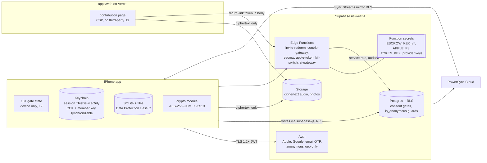
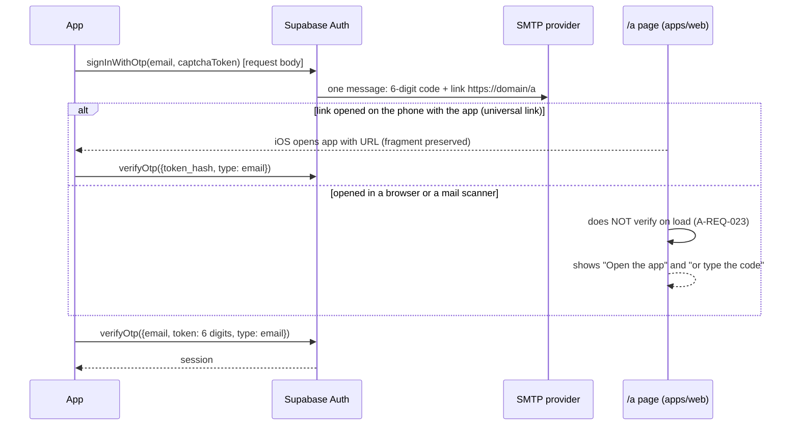
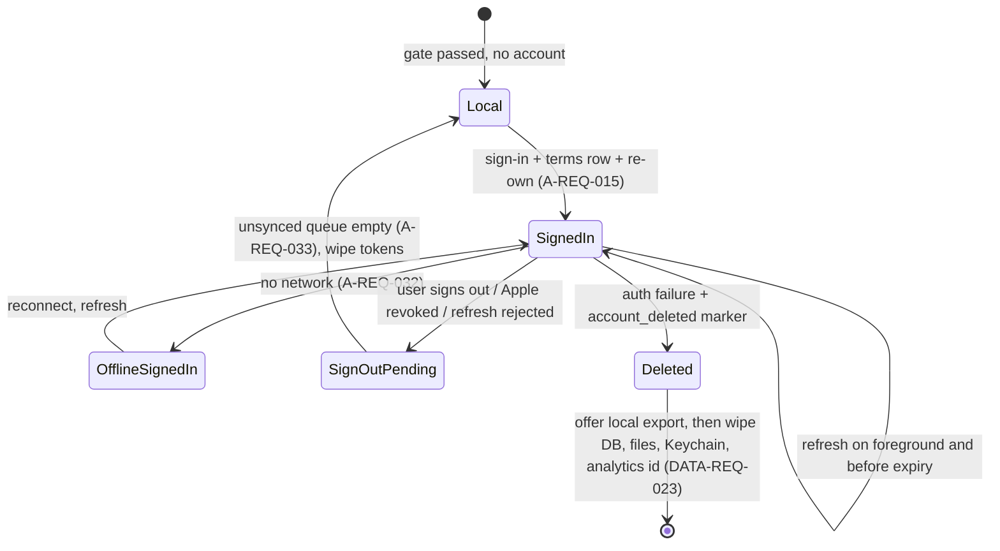
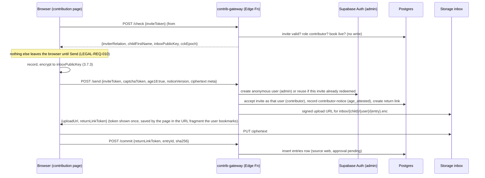
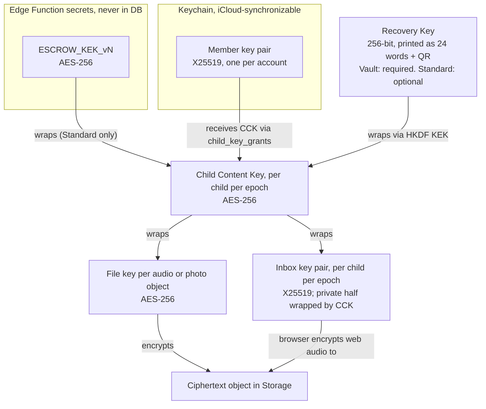

# TDD 04: Security and identity (auth, sessions, keys, encryption, access control)

Status: Proposed, 3 Oct 2026. Persona: principal security engineer (identity, encryption, key management). Audience: founder, Claude Code sessions, future engineers, the pen tester, counsel (sections 2, 7 and 9 only).
Inputs read: `CLAUDE.md`; `docs/prd/PRD.md` 1.2 (sections 1 to 7, 9), `A-entry-and-auth.md`, `B-first-run-and-family.md` (F5 to F9, section 5 RLS mapping, section 6 deltas); `docs/ARCHITECTURE.md` sections 3, 8, 11; `docs/adr/0004`, `0006`, `0010`; `docs/legal/ENGINEERING_REQUIREMENTS.md` (all 60), `DATA_CLASSIFICATION.md` 1.1.0, `data-policy.md` (grep), `DELETION_AND_EXPORT_SPEC.md` (sections 2 to 5), `privacy-policy.md` (sections 1, 7, 11, CN-8); `docs/BACKLOG.md`; `supabase/APPLY.md`; all four migrations; `supabase/tests/harness.mjs`, `rls.test.mjs` (grep), `data_governance.test.mjs` (grep); `apps/mobile/app.json`, `package.json`, `src/lib/store.ts`, `src/app/onboarding.tsx` (grep); sibling TDDs 01, 02, 03 (skimmed for alignment).

Labels: **Fact** (read in the repo), **Assumption** (believed, not verified), **Rec** (recommendation), **Risk**, **OQ** (open question). **Unverified** marks a vendor or platform claim not confirmed on an opened page this session. Nothing in this TDD was tested against a live Supabase project.

Alignment with sibling TDDs: table and function names follow TDD 02 (`child_keys`, `child_key_grants`, `audio_blobs`, `escrow_unwraps`, `kill_switches`, `ops_audit_log`, `rate_limits`, `profiles.content_sync_allowed`, `book_access`, `invite-redeem`, buckets `entry-audio` and `inbox`). Where this TDD differs from TDD 02 it says so (D-1 to D-3 in section 1.3). New work items are labelled `SEC-##` as proposals for the backlog owner; this TDD does not edit `BACKLOG.md`.

---

## 0. Ten findings that matter most

1. **Critical, still open: privilege escalation through invites.** `create_child_invite(uuid)` (core migration) lets any member, contributors included, mint an invite whose role defaults to `parent`. A grandparent, or an anonymous web contributor (finding 2), can make themselves or anyone a co-parent with full book rights. No migration replaces it. LEGAL-REQ-024 makes this a P0 fix before any non-founder data. (Fact)
2. **Critical once the web page ships: anonymous identities pass every `to authenticated` rule.** Supabase anonymous sign-ins get the `authenticated` Postgres role with an `is_anonymous` JWT claim (Assumption, consistent with Supabase docs; POLICY_VERSIONING marks it Unverified). Not one policy or RPC checks `is_anonymous`. An anonymous web session could call `create_child`, `create_child_invite`, `accept_child_invite` for a parent invite, `request_account_deletion`, and write dictionary terms. (Fact for the code)
3. **High: what the Privacy Policy promises about family visibility is not what the database does.** Privacy Policy section 7 says family members read other letters only when "Family can read the book" is on, and family letters enter the book only after a parent approves. Today `book_entries` shows every in-book letter to every member regardless of role, and a contributor can set `in_book = true` on their own letter. Both are deception-claim risk (CR-010) as well as privacy bugs. (Fact; TDD 02 finding 2 owns the fix, this TDD owns the access tests.)
4. **High: the staff-access promise has no mechanism.** Privacy Policy section 7 says "Each access is logged and reviewed" and CN-8 says engineering must build it or soften the sentence. There is no `ops_audit_log`, no read logging, no MFA enforcement record, and the service-role key has no custody rule. (Fact) Section 3.10 designs it.
5. **High: consent and Terms are client-enforced only.** LEGAL-REQ-001 (no synced row before a `terms` acceptance) and LEGAL-REQ-006 (no content upload without `sensitive-data` consent) have no server check. A client bug or a hand-written API call uploads letters without consent. (Fact) TDD 02 section 2.6 designs `content_sync_allowed`; this TDD adds `age_attested` and anonymous rules to it.
6. **High: the 6-digit email code cannot be rate-limited per address on the server.** A-REQ-027 asks for 5 wrong codes per address per 15 minutes. Supabase Auth's verify endpoint is public and limited per IP (30 per 5 minutes per IP per A-REQ-027's own citation); a proxy Edge Function does not help because an attacker can call Auth directly. A distributed attacker can try a 10^6 code space inside its 1-hour life. (Fact for the design gap; vendor limits Unverified.) Section 3.1.4 gives the mitigation and an OQ.
7. **Medium: the kill switch "revoke all sessions within 5 minutes" (LEGAL-REQ-040) does not fit default token lifetimes.** Supabase access tokens default to 1 hour (Assumption) and stay valid after refresh tokens are revoked. Section 3.2.3 meets the 5-minute clock with signing-key revocation plus a pre-request epoch check.
8. **Medium: the consent pepper fails open and lives in the database.** `policy_acceptances_pseudonymise()` uses `coalesce(current_setting('app.consent_pepper', true), '')`: an unset pepper silently produces unpeppered, reversible hashes of profile ids. The pepper is a database setting, so it sits in `pg_db_role_setting` and database backups, against LEGAL-REQ-026 ("secrets in platform secret stores"). (Fact)
9. **Medium: three documents disagree with what the platform can do.** (a) DATA_CLASSIFICATION section 2 bans L3 from all log streams, but Supabase's own Auth, API and Storage logs contain user ids, IPs and object paths by construction; (b) LEGAL-REQ-023 says the escrow key lives "only as an Edge Function secret", which is right for v1 but blocks moving to a KMS later; (c) photos are L4 but are not client-encrypted, so their only encryption control is Supabase at rest, which is still Unverified in writing (LEGAL-REQ-022(c), PRD 7.10 item 3 release block). Section 9.3 lists the doc changes.
10. **Design gaps in ADR 0006 that block building backup and the web page:** no key for web contributor audio (B-NFR-005 says "the child's inbox public key"; nothing defines it), no key-version (epoch) model for revocation, no rule that escrow responses never return a plaintext key, and an identity model (per device or per account) that the Privacy Policy ("approved family devices") and TDD 02 (`device_public_key`) read differently. Sections 3.6 to 3.8 close them.

What is premature for v1 (decided in this TDD): end-to-end encryption of letter text, SQLCipher for the local database, a hosted KMS, passkeys, device attestation (App Attest), certificate pinning, a WAF beyond Vercel defaults, a bug bounty, SOC 2. Each has a "when" in section 3.13.

---

## 1. Scope and traceability

### 1.1 Scope

**In scope.** Sign in with Apple, Google sign-in, email link plus code; session storage, refresh, sign-out and revocation; the 18+ entry gate's security properties; invites, codes and return links; the anonymous web contributor identity; RLS and security-definer function rules (the access matrix and its tests); the per-child key hierarchy, escrow, Vault mode and Recovery Kit; encryption in transit and at rest per classification level; secrets management; staff and service-role access with logging; rate limiting and abuse controls; kill switches (security part); security testing, scanning, pen test and MASVS mapping; release gates.

**Out of scope** (owned elsewhere): the schema migrations themselves and PowerSync streams (TDD 02, which this TDD constrains), recorder and file layout (TDD 01, 03), the AI gateway's provider logic (TDD 03; this TDD only sets its auth and consent check), analytics SDK wiring (analytics engineer), deletion workflow mechanics (DELETION_AND_EXPORT_SPEC, TDD 02).

### 1.2 Requirement traceability

Status: **Gap** (nothing built), **Partial**, **Met** (built and tested). Section numbers point into this TDD.

| Requirement | P | What it needs from security | Section | Status today |
|---|---|---|---|---|
| A-REQ-016, A-NFR-009 | P0 | Native Apple sign-in with hashed nonce; Apple key owner and rotation | 3.1.1, 3.9 | Gap |
| A-REQ-017 | P0 | Google native ID token exchange | 3.1.2 | Gap |
| A-REQ-018, -023, -024, -025, -027 | P0 | Email link plus 6-digit code, 1 h single use, scanner-safe page, resend and attempt limits | 3.1.3, 3.1.4, 3.11 | Gap; per-address attempt limit not achievable natively (finding 6) |
| A-REQ-019 | P1 | Link and unlink methods, manual linking on | 3.1.5 | Gap |
| A-REQ-022, A-NFR-010 | P0 | Universal links only for tokens; redirect allowlist; scheme from `packages/brand` | 3.1.6 | Gap; scheme still `lumiraletters` (Fact) |
| A-REQ-028, A-NFR-008 | P0 | Invite and session tokens in Keychain before UI; deleted after use | 3.2.1, 3.4 | Gap |
| A-REQ-032, A-REQ-033 | P1, P0 | Offline session restore; Apple revocation signs out only after sync | 3.2.2 | Gap |
| A-NFR-011, DATA-REQ-033 | P0 | Apple refresh token stored encrypted for revocation at deletion | 3.1.1, 3.9 | Gap |
| A-NFR-012, LEGAL-REQ-014 | P0 | No tokens or content in logs, URLs, analytics | 3.2.1, 3.11, 8.6 | Partial (allowlist package in progress) |
| PRD-REQ-019, LEGAL-REQ-002 | P0 | 18+ gate before any creation; age signal in memory only; server proof of attestation | 3.3 | Partial (UI exists in `onboarding.tsx`, Fact; no server rule) |
| PRD-REQ-002, LEGAL-REQ-001, -006 | P0 | Server refuses content writes before Terms with `age_attested` and before `sensitive-data` consent | 3.5.3 | Gap |
| B-REQ-007, B-NFR-002, B-NFR-004, K-18 | P0 | Parent-only invites with explicit role; tokens in fragments, hashes only; rate limits; 7 and 14 day expiry | 3.4 | Gap (finding 1) |
| K-08, PRD-REQ-007, LEGAL-REQ-010 | P0 | Anonymous identity on web only, created at Send; return link; CAPTCHA if needed | 3.4.3 | Gap (finding 2) |
| B-NFR-003, LEGAL-REQ-024, PRD-REQ-004, PRD-REQ-014 | P0 | RLS on every table; access and parity tests; author-only working material; cross-child isolation | 3.5, 8.1 | Partial (36+ tests, `book_entries` author-only done; roles and approval not) |
| B-NFR-005, LEGAL-REQ-022(a) | P0 | Web contributor audio encrypted in the browser; backup audio client-encrypted | 3.7, 3.8 | Gap |
| LEGAL-REQ-022(b), (c), (d) | P0 | Device Data Protection class; Supabase at rest in writing; SQLCipher decision | 3.8 | Gap (decision recommended: no SQLCipher, TDD 01 agrees) |
| LEGAL-REQ-021 | P0 | TLS 1.2+, no ATS exceptions, HSTS on web | 3.8.2, 8.5 | Partial (no exceptions in `app.json` today, Fact; no lint) |
| LEGAL-REQ-023, ADR 0006 | P0 | Escrow key only in function secret; unwrap log; per-child limit; rotation; Vault never escrowed | 3.6, 3.7 | Gap |
| LEGAL-REQ-025, CN-8 | P0 | Break-glass service-role access through runbooks with an audit row; no staff tool shows L4 | 3.10 | Gap (finding 4) |
| LEGAL-REQ-026 | P0 | Secrets only in platform stores; scanner clean; Apple key owner | 3.9, 8.3 | Partial (no secrets found in repo, Fact; pepper in DB, finding 8) |
| LEGAL-REQ-027 | P1 | SBOM, vulnerability scanning, SDK inventory | 8.2 | Gap |
| LEGAL-REQ-028 | P0 | Written information security programme (`docs/security/WISP.md`) | 10, SEC-20 | Gap |
| LEGAL-REQ-037, -038 | P0, P1 | Security event logging without content; alerts to the founder's phone | 3.12 | Gap |
| LEGAL-REQ-039 | P0 | Affected-user enumeration incl. Standard vs Vault and escrow exposure | 3.12.3 | Gap |
| LEGAL-REQ-040 | P0 | Kill switches within 5 min: sessions, AI gateway, web page, signed URLs, escrow rotation | 3.2.3, 3.12.2 | Gap (finding 7) |
| LEGAL-REQ-016, -019 | P0 | No tracking SDKs; no voiceprints (dependency and config lint) | 8.2 | Gap |
| LEGAL-REQ-007 | P0 | Manifest lint: only microphone and notification permissions | 8.5 | Gap |
| DATA-REQ-003, -015, -047 | P0 | Ownership enforced in DB; object paths scoped by child and author | 3.5 | Partial (photos scoped; other buckets planned) |
| DATA-REQ-023 | P0 | Device wipe of Keychain and data when the account was deleted | 3.2.4 | Gap |
| DATA-REQ-055 | P1 | 18-year key durability; decrypt Standard audio before shutdown | 3.6.6 | Gap |
| DATA_CLASSIFICATION section 2 | P0 | Handling floor per level, incl. "release blocks if any L4 store lacks a recorded encryption control" | 3.8.1 | Partial |

### 1.3 Conflicts and deviations found (decision owner named)

| # | Conflict | Rec | Owner |
|---|---|---|---|
| X-1 | A-REQ-027 per-address code limit vs Supabase Auth's public, IP-limited verify endpoint | Accept residual risk for launch with layered mitigations (3.1.4); counsel and founder note it; revisit with an Auth hook or 8-digit codes | Founder |
| X-2 | LEGAL-REQ-040 "revoke all sessions within 5 minutes" vs 1-hour access tokens | Signing-key revocation plus `db_pre_request` epoch check (3.2.3) | Engineering |
| X-3 | DATA_CLASSIFICATION section 2: L3 never in log streams vs vendor platform logs that contain ids, IPs and object paths | Split "our application logs" (rule stands) from "vendor platform logs" (allowed, access-restricted to named staff, retention recorded in data map) | Data governance lead, counsel |
| X-4 | LEGAL-REQ-023 "only as an Edge Function secret" vs a later KMS | Keep for v1; reword to "held only in a managed secret or key service outside the database and its backups" | Counsel |
| X-5 | PRD 7.10 "L4 encrypted at rest on server" vs photos and letter text protected only by Supabase at-rest encryption (Unverified) | Record provider at-rest encryption as the control once confirmed in writing (human task SEC-01); photos client-encrypted under the CCK in P1 (3.8.1) | Founder, counsel |
| X-6 | PRD-REQ-007 / K-08 "anonymous session restored by return link" vs Supabase: no supported way to mint a session for an existing anonymous user from a server-held token (Unverified) | Contributor gateway: return-link token authorises web calls through narrow functions; anonymous user is the identity, not the session (3.4.3) | Product (B owner), engineering |
| X-7 | K-08 "linkable to a full account later" + "app never uses anonymous auth" + `author_id` immutable | Upgrade on the web: contributor adds an email to the anonymous user through the gateway; the app then signs in with that email and gets the same user id (3.4.3) | Product, engineering |
| X-8 | LEGAL-REQ-033 security logs 12 months vs DATA-REQ-066 `audit_events` 24 months (also TDD 02 finding 10) | `audit_events` is product and dispute evidence (24 months stands); `ops_audit_log`, `escrow_unwraps`, `security_events` are security logs (12 months) | Data governance lead |
| X-9 | ADR 0006 "wrapped to each approved member's public key" read as per device (TDD 02 `device_public_key`, Privacy Policy "approved family devices") | Per account member key, synchronised by iCloud Keychain (3.6.2); Privacy Policy wording "approved family members' devices" still true | Founder (ADR 0006 amendment) |

D-1 to D-3, differences from TDD 02: **D-1** member key is per account, not per device (X-9); TDD 02 `child_key_grants.device_public_key` becomes `member_public_key` plus `key_id`. **D-2** web return visits use the contributor gateway (X-6), not a restored anonymous session; TDD 02 4.3 `invite-redeem` keeps its role for app redemptions. **D-3** escrow responses re-wrap the CCK to the caller's member key and never return plaintext key bytes (3.6.4).

---
## 2. Threat model

### 2.1 Assets by classification level

| Level | Asset | Where it lives | Worst realistic harm |
|---|---|---|---|
| L4 | Letter text, raw transcripts, machine edits, versions, search index | Device SQLite; Postgres (RLS, provider at rest); PowerSync bucket storage | Intimate family writing (health, relationship, grief) read by an ex-partner, a stranger or a vendor; embarrassment (62% worry, UR 2.1); MHMDA consumer health data exposure |
| L4 | Audio (the child's and parents' voices) | Device files; `entry-audio` and `inbox` ciphertext | Voice is irreplaceable (loss) and biometric-adjacent (misuse); loss of the only copy is the product's worst failure |
| L4 | Photos of the baby | Device; `entry-photos`, `child-photos` (not client-encrypted) | Child images leaked; location metadata (stripped, LEGAL-REQ-013) |
| L4 | Child name, birthday, due date (health) | Device; `children` row (readable by all members today) | Child identity plus date of birth, enough for identity misuse later |
| L4 secrets | CCK, file keys, member private keys, Recovery Kit, escrow KEK, session and refresh tokens, invite and return-link tokens, Apple refresh token, provider API keys, service-role key, consent pepper | Keychain; Edge Function secrets; nowhere else unwrapped | Escrow KEK + DB dump = every Standard-mode recording. Service-role key = all text. Session token = one account |
| L3 | Emails, display names, signatures, memberships, invite hashes, object paths, purchase state, auth logs with IP | Supabase Auth and Postgres; vendor logs | Stalking (who is in which family); account takeover target lists |
| L2 | Enums, counts, analytics events | PostHog, Sentry, Postgres | Low; becomes L3 if joined to an id |

### 2.2 Adversaries

| # | Adversary | Capability | Goal | Primary controls |
|---|---|---|---|---|
| A1 | **Ex-partner co-parent** (equal parent on a shared book, F8) | Legitimate session; may know the other parent's email, phone passcode, Apple ID password (couples share), and still hold an old device | Read the other parent's private letters, learn their new circumstances, remove them, delete or alter their words, add hostile family members | Author-only RLS for private letters and working material; no parent can remove a parent or delete another's words (DATA-REQ-015); no email, phone or location of members is ever exposed to members; "Sign out other devices" and sign-in alert email; support safety runbook (B F8.3); honest copy that in-book letters are readable by the co-parent and played recordings stay on their phone |
| A2 | **Hostile or careless contributor** (grandparent, forwarded invite) | Contributor session or web return link | Escalate to parent, read the whole book, spam the inbox | Parent-only invite creation (finding 1); role-aware `book_entries`; approval; per-token quotas; removal revokes return links |
| A3 | **Lost or stolen phone** | Physical device, maybe unlocked once, maybe passcode-less | Read letters, play audio, act as the user | iOS Data Protection; session tokens `ThisDeviceOnly`; remote "sign out this device" from another signed-in device or support; DATA-REQ-023 wipe on next launch after account deletion. Residual: a phone with no passcode is readable by whoever holds it (stated in Help) |
| A4 | **Account takeover attacker** (phishing, email compromise, credential reuse) | Controls the victim's email inbox, or guesses an email code | Sign in as the user, exfiltrate the book | Short-lived single-use links and codes; no passwords; Apple and Google MFA inherited; sign-in alert email (P1); session list; per-IP limits; CAPTCHA on email OTP request (3.1.4) |
| A5 | **Malicious insider** (founder account compromised, future engineer, contractor) | Supabase dashboard, service-role key, Edge Function secrets, Vercel, GitHub | Read text in bulk; decrypt Standard audio via escrow | MFA on every console; service-role key never on laptops; runbooks only; pgaudit read logging on content tables; escrow unwrap log and rate limit; deploys only from CI; alerts on new admin login and on function deploys. Honest residual: at founder stage the founder is root (section 2.4) |
| A6 | **Vendor or vendor breach** (Supabase, PowerSync, Vercel, email provider, AI providers) | Their infrastructure | Plaintext text, ciphertext audio; for Supabase, the Edge runtime that holds the escrow KEK | DPAs; minimal data; audio ciphertext; Vault mode for those who want E2EE; email provider sees magic links (links expire in 1 h); Vercel page integrity (CSP, SRI, no third-party scripts) |
| A7 | **Opportunistic internet attacker** | Public API URL and anon key (both public by design) | Enumerate, brute force tokens or codes, abuse storage, DoS | RLS deny by default; 256-bit tokens; rate limits; CAPTCHA on anonymous sign-in; size and MIME caps; kill switches |
| A8 | **Supply chain** (npm, Expo OTA updates, CI) | Malicious package or hijacked update | Exfiltrate keys and content from the app | Lockfile, Dependabot, OSV scan, minimal deps; EAS Update code signing; GitHub branch protection and required reviews on `main`; CI secrets scoped |
| A9 | **Under-18 user** (not hostile; legal exposure) | Can answer Yes | Use the app | Neutral gate, store age signal, under-13 runbook (LEGAL-REQ-002). Security cannot verify age; the gate is an attestation |

### 2.3 STRIDE per component

| Component | S Spoofing | T Tampering | R Repudiation | I Information disclosure | D Denial of service | E Elevation of privilege |
|---|---|---|---|---|---|---|
| Sign-in (Apple, Google, email) | ID token replay; magic link phishing; code guessing (finding 6) | Redirect manipulation to a lookalike domain | User denies having accepted Terms | Email enumeration through different error copy | Email bombing through resend | Linking an attacker identity to a victim account (A-REQ-019) |
| Session on device | Stolen refresh token from a backup | Modified local DB rows uploaded | n/a | Tokens in logs, crash reports, Sentry breadcrumbs | Refresh-token reuse detection logging the user out on flaky networks | n/a |
| Invites and codes | Forwarded link redeemed by a stranger (B F5: allowed, parent can remove) | Role parameter tampering | Who invited whom (audited) | Invite list visible to contributors (Fact) | Code brute force | **Contributor mints parent invite (finding 1)** |
| Web contribution page | Return link shared or leaked | Ciphertext replaced in `inbox` | Contributor denies sending | Page JS exfiltrates audio before encryption (A6, A8) | Storage abuse with large or many uploads | **Anonymous principal passes `authenticated` rules (finding 2)** |
| Postgres + RLS | JWT for another user (not feasible without key) | Immutable column changes (blocked by trigger, Fact) | Staff reads without trace (finding 4) | `book_entries` over-sharing (finding 3); `children` row with due date to contributors | Expensive policies under load (perf test exists, Fact) | Security-definer function without `search_path` or with missing checks (all current ones set `search_path`, Fact) |
| PowerSync | Token from another tenant (not feasible) | Upload bypassing RLS (not possible: writes go through supabase-js, ADR 0004) | n/a | Streams drifting from RLS (ARCH R4) | Bucket explosion | Stream rule broader than RLS |
| Storage | Signed URL forwarded | Overwrite of own objects after removal (Fact: update policy checks only folder) | n/a | Plaintext photos at vendor | Bulk download | Path traversal into another child's folder (prevented by path checks, Fact) |
| Escrow function | Caller impersonating a member | Wrapped CCK swapped between children (prevented by AAD binding, 3.6.3) | Unwrap without a log row | KEK leak through logs or error messages | Unwrap flooding | Unwrap for a Vault-mode child |
| AI gateway | Calls without consent | n/a | n/a | Content in gateway logs | Cost exhaustion | Bypassing `has_active_consent` |
| Staff tooling | Phished founder console | Ad hoc SQL edits | No audit row | Dashboard table editor showing `final_text` | n/a | Shared service-role key |

### 2.4 Honest residual risks (stated, not hidden)

- **Letter text is readable by the service.** ADR 0006 point 5 and the Privacy Policy say so. Controls reduce and detect access; they do not prevent a determined insider with project-owner rights.
- **Standard-mode audio is readable by whoever controls the escrow KEK and the database together.** That is Supabase (runtime and storage) and the project owner. Vault mode removes this.
- **A co-parent can always screenshot or export what they can read.** Revocation never claws back.
- **The 18+ gate is a self-attestation** plus Apple's signal where required.
- **The founder is a single point of compromise** for every console. MFA with hardware-backed factors (passkeys or security keys on the founder's Apple ID, Google, GitHub, Supabase) is the most valuable control in this TDD per hour spent.

---
## 3. Design

### 3.0 Overview



Principles: (1) RLS is the only data authority; Edge Functions that use the service role re-check membership and write an audit row. (2) No key material, token or content in any URL, log, analytics event or error message. (3) Secrets are either on the device in the Keychain or in the function secret store; the database holds hashes and wrapped keys only. (4) Every security decision that could lose a family's words fails toward keeping them (fail-open for memories, C-NFR-004), and every decision that could expose them fails closed.

### 3.1 Authentication

Supabase Auth settings (production; recorded in `docs/security/auth-config.md`, SEC-03): manual linking on (A-REQ-019); anonymous sign-ins on (web only; the app never calls it, enforced by a lint rule banning `signInAnonymously` under `apps/mobile`); email OTP expiry 3600 s (A-REQ-018); OTP length 6 (see 3.1.4); refresh token rotation on with reuse detection (Supabase default reuse interval, Unverified value); JWT expiry 900 s (Rec: 15 min, down from the 1 h default, to shorten any stolen-token window without battery cost: one refresh per foreground quarter hour); redirect allowlist: `https://{brand.company.domain}/**` and the brand scheme only (A-NFR-010); CAPTCHA on anonymous sign-in and on email OTP request (provider joins `subprocessors.md`; Cloudflare Turnstile or hCaptcha, both supported by Supabase, Unverified for Turnstile pricing); custom SMTP on the brand domain with SPF, DKIM, DMARC `p=quarantine` then `reject` (A-REQ-026).

#### 3.1.1 Sign in with Apple (iOS, A-REQ-016)

```mermaid
sequenceDiagram
  participant App
  participant iOS as AuthenticationServices
  participant SA as Supabase Auth
  participant AT as apple-token (Edge Fn)
  participant DB as Postgres
  App->>App: rawNonce = 32 random bytes (base64url)
  App->>iOS: request(scopes: name, email; nonce = SHA256(rawNonce))
  iOS-->>App: identityToken, authorizationCode, fullName (first time only)
  App->>SA: signInWithIdToken(provider apple, token, nonce = rawNonce)
  SA-->>App: session (access 15 min, refresh)
  App->>App: store session in Keychain (ThisDeviceOnly)
  App->>AT: POST {authorizationCode} with user JWT (body, never URL)
  AT->>Apple: exchange code (client_secret JWT signed with APPLE_P8)
  Apple-->>AT: refresh_token
  AT->>DB: upsert apple_tokens(profile_id, AES-GCM(TOKEN_KEK, refresh_token, aad=profile_id), key_version)
  AT-->>App: 204 (no token echoed)
  App->>DB: record_policy_act('terms', accept, context {age_attested:true, auth:'apple'})
```

- `fullName` is saved to `profiles.display_name` immediately (Apple returns it once); never logged.
- The authorization code is single use and valid about 5 minutes (Assumption); `apple-token` failure is retried on next launch only while the code is valid; after that, revocation at deletion falls back to "user removes the app in Apple ID settings", recorded as `apple_token_revoke = not_applicable` with reason, and the deletion receipt says so. Rec: make the exchange part of the sign-in transaction UI (spinner until 204 or a 5 s timeout).
- `apple_tokens` (new, L4 ciphertext, L3 profile id): service role only, no client policies; row deleted after successful revocation (DATA-REQ-033).
- Credential state: on launch, `getCredentialStateAsync(user)`; `revoked` triggers A-REQ-033 (sign out after unsynced letters sync).
- Hide-my-email: the relay address is the account email; the Apple relay must have the SMTP domain registered with Apple (human task in BL-053), or magic links to relay addresses bounce.

#### 3.1.2 Google sign-in (A-REQ-017)

Native Google Sign-In for iOS returns an ID token; `signInWithIdToken(provider: 'google', token, nonce?)`. Supabase verifies issuer, audience (iOS client id listed in Supabase's Google provider "authorized client ids") and signature. Rec: pass a nonce if the Google iOS SDK in use supports it (Unverified); otherwise rely on audience and the short token life. Android (later): Credential Manager, same exchange.

#### 3.1.3 Email link and code (A-REQ-018, -023, -024)



- The token hash travels in the URL fragment (`#th=`), so Vercel and mail-scanner fetches never send it to a server and logs never see it (LEGAL-REQ-014, B-NFR-002 pattern). The page reads the fragment only to build the "Open the app" link, never to call Auth.
- Same error copy for unknown and known emails (no account enumeration); the response to `signInWithOtp` never reveals whether the address exists. Rec: `shouldCreateUser: true` only from the Keep the book sheet; "I already have an account" uses the same call (users cannot tell).
- Resend: client disables 60 s; Supabase per-address send limit set to 5 per hour where the setting exists (A-REQ-025; Supabase's email rate limit is per project and per address, exact knobs Unverified).

#### 3.1.4 Code brute force (A-REQ-027, finding 6, X-1)

Fact: the 6-digit code has 10^6 values and lives 1 h. Assumption: Supabase limits verify calls per IP (30 per 5 min) and has no per-address failure lockout or verify hook. A botnet of about 1,400 IPs gets a 50% success chance within the hour against one targeted address.

Layered mitigation for launch:
1. CAPTCHA on OTP **request** (`signInWithOtp`): the attacker cannot mint fresh codes for many victims cheaply.
2. Client lockout after 5 wrong codes per address per 15 minutes (A-REQ-027 copy); honest users never hit the server limit.
3. Detection: a scheduled job reads Auth logs for `verify` failures grouped by email hash; more than 20 failures per address per hour pages the founder and triggers `auth.admin.signOut(user, 'global')` plus a forced new code (security_events row).
4. Targeted users matter most in this product (A1 ex-partner knows the email): sign-in alert email to the account address on every new session (P1, SEC-14); "Sign out other devices" in Settings (P0, cheap).
5. **OQ-S1:** move to 8-digit codes (100x the work; one string change in A-REQ-018 copy) if Supabase allows OTP length 8 (Unverified). Rec: yes, before public launch; product decides because A-REQ-018 says 6.

#### 3.1.5 Account linking (A-REQ-019, P1)

`linkIdentity` while signed in; unlinking allowed while at least two identities remain. Risk: linking an identity whose email matches another account. Rule: never auto-merge accounts by email; the "Hide-my-email user later uses a real email" case creates a new account and the user links manually (A F6 edge). Each link and unlink writes a `security_events` row and sends a notice email.

#### 3.1.6 Deep links and scheme (A-REQ-022, A-NFR-010)

- Tokens (auth, invite, return link) travel only in `https://{domain}` universal links with the token in the fragment. The custom scheme (derived from `packages/brand`, BL-031) is used only to reopen the app with no secret in it: any app can register a custom scheme, so a scheme URL carrying a token can be hijacked (Fact about iOS custom schemes).
- AASA and `assetlinks.json` served by `apps/web` with `Content-Type: application/json`, paths limited to `/a`, `/i`, `/j`, `/r`.
- Clipboard is read only on the explicit Paste tap (A-REQ-029), never polled.

### 3.2 Session handling

#### 3.2.1 Storage on the device

| Item | Store | Accessibility | Synced to iCloud | Deleted when |
|---|---|---|---|---|
| Supabase session (access + refresh) | Keychain item holding an AES-256 key; session JSON encrypted with it in app storage (the "large secure store" pattern, because Keychain values over about 2 KB are discouraged in expo-secure-store, Unverified limit) | `AFTER_FIRST_UNLOCK_THIS_DEVICE_ONLY` | No | Sign-out, account deletion detected, Apple revocation |
| Pending invite token (A-REQ-028) | Keychain | `AFTER_FIRST_UNLOCK_THIS_DEVICE_ONLY` | No | Acceptance, expiry error, or 14 days |
| Member private key, CCKs | Keychain, custom native module (ADR 0006) | `AFTER_FIRST_UNLOCK` (synchronizable requires non-ThisDeviceOnly, [S43]) | Yes (iCloud Keychain, end-to-end encrypted by Apple, Assumption) | Account deletion wipe; CCK of a purged book |
| 18+ gate state | Local settings table | file Data Protection | Only with the device backup | Never (install-scoped) |

`ThisDeviceOnly` for sessions means a restored iCloud backup on a new phone never carries a live session: the user signs in again, which is the moment the Terms and age line is shown (good for LEGAL-REQ-001).

#### 3.2.2 Lifecycle



- Refresh rejected because of reuse detection or revocation: the app keeps working locally, shows "Sign in again to keep your book in sync", and never discards the upload queue. Recording and reading never depend on the session (C-NFR-004).
- Telling "account deleted" from "session revoked": no unauthenticated status endpoint (it would be an account oracle). Rec: a deleted user's refresh fails with a "user not found" class (Assumption); the app shows the deleted state (DATA-REQ-023) only if it also holds a local `deletion_requested_at`, synced from `deletion_requests` while the account was alive. Otherwise it shows the generic "sign in again". **OQ-S2**: confirm the Supabase error codes.

#### 3.2.3 Revocation and kill switch (LEGAL-REQ-040, X-2)

| Scope | Mechanism | Effect time |
|---|---|---|
| One device (user) | `signOut({scope: 'local'})` | Immediate on that device |
| Other devices (user, Settings, P0) | `signOut({scope: 'others'})` | Refresh fails at next refresh; access token valid up to 15 min |
| One account (support, safety runbook) | `auth.admin.signOut(user_id, 'global')` + insert `revoked_sessions(user_id, before)` | Refresh immediately; REST and RPC within seconds via the pre-request check |
| Everyone (kill switch) | Set `security_epoch.all_before = now()`; rotate the JWT signing key and revoke the old one (asymmetric signing keys, Unverified detail) | Within 5 min including PowerSync, which validates JWTs against the published keys |

Pre-request check: a `public.check_request()` function registered as PostgREST `db_pre_request` (Supabase support for setting it on the `authenticator` role is Unverified; SEC-07 spike) raises `401`-mapped errors when `auth.jwt()->>'iat'` is older than `security_epoch.all_before` or than `revoked_sessions.before` for that user. Cost: one primary-key lookup per request, cached per transaction. If `db_pre_request` is not available, the fallback is the 15-minute JWT plus signing-key revocation (meets the 5-minute clock only through key revocation).

#### 3.2.4 Device wipe (DATA-REQ-023)

On confirmed account deletion: offer one local export, then delete `scribe.db`, `audio/`, photos, caches, every Keychain item for this account (session, member key, CCKs only if no other signed-in account uses them; v1 has one account per install), analytics id. The synchronizable member key and CCKs also live on the user's other Apple devices: wiping them from Keychain on one device removes them from iCloud Keychain everywhere (Assumption about synchronizable delete semantics; SEC-11 test).

### 3.3 The 18+ entry gate (PRD-REQ-019, LEGAL-REQ-002)

Fact: `onboarding.tsx` stores `ageAttested='yes'` and `ageAttestedAt` in local settings. Security properties required:

1. **Order.** The gate runs before any code path that can create a child, letter, recording, dictionary term, auth user or network request. Enforced by a router guard plus a store-level guard: `LocalStore.createChild` and `recorder.start` throw `GateNotPassed` when the flag is absent (defence in depth; a deep link cannot skip the router).
2. **No age data.** Declared Age Range results are held in memory only; a unit test asserts the module never calls the store, logger or analytics with the value (LEGAL-REQ-002 Texas line). `ageAttestedAt` is not needed by any requirement; Rec: drop it (DATA_CLASSIFICATION 4.6 lists only a boolean or the No time; the timestamp of Yes is extra data, minor).
3. **Anti-retry.** The No time is stored in the local DB; a reinstall resets it. That is accepted: the gate is neutral by design (counsel Q6) and a determined minor can answer Yes anyway. Do not use the Keychain to survive reinstall (it would persist an under-18 signal about a person beyond the install, against minimisation).
4. **Server proof.** The server cannot see the gate. What it can enforce: no content write, child creation or invite redemption by a non-anonymous user whose latest current `terms` acceptance lacks `context.age_attested = true` (section 3.5.3). The web page records the same in `contributor-notice` context at Send.
5. **After an account exists** (store signal or report of under 18): support runbook `close_underage_account` (service role, audited) starts deletion with `source='support'` and skips grace when counsel requires (DATA-REQ-027).

### 3.4 Invites, codes and return links

#### 3.4.1 Token formats

| Credential | Format | Entropy | Stored as | Life | Travels |
|---|---|---|---|---|---|
| Invite token | 32 bytes from `gen_random_bytes` (pgcrypto), base64url | 256 bits | `sha256(token)` in `child_invites.token_hash` | Co-parent 7 d, Family 14 d (K-18); hash deleted 90 d after expiry, use or revocation | `https://domain/j#t=...` |
| Invite code (A-REQ-029) | 8 chars, Crockford base32 without ambiguous letters, shown as `XXXX-XXXX` | about 40 bits | `hmac_sha256(CODE_PEPPER, normalised code)` in `child_invites.code_hash` (pepper in function secrets, so a database dump cannot brute-force 40-bit codes offline) | Same as the token | Spoken or typed |
| Return link (web contributor) | 32 bytes, base64url | 256 bits | `sha256` in `member_return_links.token_hash` | Until revoked, or 24 months inactive (LEGAL-REQ-033 proposed) | `https://domain/r#t=...` |
| Email OTP | Supabase | 6 digits (see 3.1.4) | Supabase | 1 h | Email |

Fact: today's token is two UUIDv4s concatenated (244 random bits; `rls.test.mjs` asserts 64 hex chars). Adequate entropy; replace with `gen_random_bytes(32)` for clarity in the invite migration (TDD 02 M5), and update the test.

Codes are low-entropy, so every code lookup goes through `invite-redeem` (TDD 02 4.3) with limits from 3.11; the RPC `accept_child_invite_by_code` is not granted to `authenticated` directly (only to the function's service role, which passes the caller's user id after verifying the caller's JWT).

#### 3.4.2 Rules (finding 1 fix, TDD 02 M5)

- `create_child_invite(p_child, p_role, p_signs_as, p_relation, ...)`: caller must be a parent of a live book, not anonymous, `content_sync_allowed`; `p_role` explicit, no default; 20 per parent per day (B-NFR-004); returns token and code once; writes `audit_events('invite_created')` (new enum value).
- `accept_child_invite`: refuses tombstoned books, revoked or expired invites, anonymous callers for `parent` role, callers who are already members (no role change through invites; a role change is a separate parent act, P1), and the inviter themselves. Audited.
- `revoke_invite`, `remove_child_member` (parents remove contributors only), `leave_child`: audited; removal revokes the member's return links and bumps the book's key epoch (3.6.5).

#### 3.4.3 Web contributor identity (K-08, X-6, X-7)



- **Rec (deviation D-2):** after the first Send the browser never holds a Supabase session. Every later call (`/letters`, `/send`, `/delete`, `/upgrade`) presents the return-link token in the body; the gateway hashes it, finds `(profile_id, child_id)`, checks not revoked and the book live, applies limits, and acts through narrow security-definer RPCs that take the resolved profile id and write `audit_events`. This avoids minting sessions for anonymous users, which Supabase does not support from a server token (Unverified), and keeps a leaked return link scoped to one contributor in one book.
- If product prefers the literal K-08 design (client-side `signInAnonymously` at Send), the anonymous session lives only in that browser; return visits on another browser still need the gateway. So the gateway is needed either way; the anonymous Supabase session adds nothing. Creating the anonymous user server-side (admin API) also lets CAPTCHA and limits sit in one place.
- **Upgrade (X-7):** "Get the app" asks for an email on the web page; the gateway sets it on the anonymous user (admin update) and Supabase sends a confirmation link; the user then signs in in the app with that email and gets the same user id, so `author_id` never changes. A contributor who instead signs in with Apple gets a new account; support can merge only by re-authoring, which the immutability trigger forbids; product copy must steer to the email path (OQ-S3).
- Return link revocation: "Send {signsAs} a new link" (parent) and removal revoke all of that member's links in the book.
- Page integrity (A6, A8): strict CSP (`default-src 'self'`; `connect-src` the Supabase project and the gateway only; no inline script; `require-trusted-types-for 'script'` where supported), Subresource Integrity is moot without third-party scripts (none allowed on this page), no analytics on this page in v1, HSTS with preload once the domain is final (LEGAL-REQ-021), only strictly necessary storage (LEGAL-REQ-058).

---
### 3.5 Authorisation: RLS and security-definer rules

#### 3.5.1 Principals

| Principal | How identified | Notes |
|---|---|---|
| Parent (P) | `child_members.role='parent'` for that child | Two parents are equals (B F8) |
| App contributor (F) | `role='contributor'`, not anonymous | Grandparent with the app |
| Web contributor (W) | `role='contributor'`, `auth.users.is_anonymous` | Acts only through `contrib-gateway` after first Send |
| Former member (R) | No membership row; still `author_id` on their letters | Reads and exports own letters only |
| Stranger (X) | Signed in, no membership | Sees nothing of the book |
| `anon` role | No JWT | Reads `policy_documents`, `policy_versions` only |
| `service_role` | Edge Functions and runbooks only | Bypasses RLS; every use audited (3.10) |

#### 3.5.2 Access matrix (target; "today" column shows the delta)

| Object | P | F | W | R | X | Today (Fact) |
|---|---|---|---|---|---|---|
| Own entries, all columns incl. `raw_transcript`, `stt_meta`, `machine_edits`, versions | RW (tombstone via `delete_entry`) | RW | via gateway: R own text, delete | R, export, delete | none | Met (author-only `entries_select`) |
| Others' in-book letters (`book_entries` columns) | R | R only if `family_can_read` | none in v1 (OQ-S4) | none | none | **F and W read all** (finding 3) |
| Pending family letters | R, approve, set aside | own only | own only | own only | none | **No approval exists** |
| Others' private letters | none | none | none | none | none | Met |
| `children` row: name, nickname, photo | R/W (parents) | R | R first name only, via gateway | none | none | Met for writes (`children_guard`), reads all members |
| `children.date_of_birth`, `due_date` (L4, health) | R/W | **Rec: none** (OQ-S5, DATA_CLASSIFICATION open issue 3) | none | none | none | All members read |
| `child_members`, co-member profiles (display name, signature) | R | R | none | none | none | Met; W would read (finding 2) |
| `child_invites` | R (parents) | **Rec: none** | none | none | none | All members read |
| Create or accept parent invite | P only | no | no | no | accept only with token | **Any member creates** (finding 1) |
| `dictionary_terms` | own; child-level terms shared R (B delta 10) | own | none | own | none | Owner only |
| `child_key_grants` own row; `child_keys` metadata | R own grant | R own grant | none | none | none | Not built |
| `apple_tokens`, `ops_audit_log`, `escrow_unwraps`, `security_events`, `rate_limits`, `kill_switches`, `legal_holds` | none | none | none | none | none | Not built (legal_holds Met) |
| Storage `entry-photos` | own folder; in-book letter photos of live books | same, gated like letters | none | own folder | none | Met except role gating; update policy lets a removed author overwrite own objects (Low) |
| Storage `entry-audio` | own; in-book letters with a grant | same, gated like letters | none | own | none | Not built |
| Storage `inbox/{child}/{contributor}/` | R (to transcribe), delete after move | write own via signed URL | write own via signed URL | none | none | Not built |

#### 3.5.3 Cross-cutting predicates (one place, reused by every policy)

```sql
-- Sketches; TDD 02 owns the migration. All: language sql stable security definer set search_path = public, pg_catalog.
is_anonymous()          := coalesce((auth.jwt() ->> 'is_anonymous')::boolean, false)
can_write_content()     := not is_anonymous() and (select content_sync_allowed from profiles where id = auth.uid())
-- content_sync_allowed (TDD 02 2.6) = latest current 'terms' accept with context.age_attested = true
--                                     and latest 'sensitive-data' act = accept
can_read_book(child)    := is_child_parent(child)
                           or (is_child_contributor(child) and children.family_can_read and child_is_live(child))
```

Rules for every new policy and function (checked by test, 8.1):
1. RLS enabled on every `public` table; default deny; no `using (true)` except `policy_documents`, `policy_versions`.
2. Every `security definer` function sets `search_path = public, pg_catalog`, checks `auth.uid() is not null`, checks `is_anonymous()` unless it is on the anonymous allowlist (`record_policy_act` with `method='web_contributor_page'` only, and the gateway RPCs which are granted to `service_role` only), and is revoked from `public, anon` (Fact: all current ones are).
3. Insert and update `WITH CHECK` on `entries`, `children` (via `create_child`), `dictionary_terms`, invites and Storage uploads call `can_write_content()`.
4. Views exposed to clients are `security_barrier`; any view owned by the migration role (bypassing RLS, like `book_entries`) needs an explicit access test per principal.
5. PowerSync stream definitions are generated from or tested against this matrix (parity test, ADR 0004; TDD 02 3.3).

### 3.6 Key hierarchy, escrow, Vault mode and recovery

#### 3.6.1 Keys



| Key | Generated by | Stored | Wrapped copies in Postgres | Level |
|---|---|---|---|---|
| Member key (X25519) | Device at first sign-in, if none in iCloud Keychain | Keychain synchronizable | Public half in `member_keys(profile_id, key_id, public_key, created_at, retired_at)` | Public L3, private L4 |
| CCK (per child, per epoch) | First parent device that creates the book | Keychain synchronizable (one item per `child_id:epoch`) | `child_key_grants(child_id, epoch, profile_id, key_id, wrapped_cck)`; `child_keys(child_id, epoch, mode, escrow_wrapped_cck, escrow_kek_version, recovery_wrapped_cck)` | L4 |
| Inbox key (X25519, per child per epoch) | Same device, with the CCK | Private half only as `child_keys.inbox_private_wrapped` (wrapped by CCK) | Public half `child_keys.inbox_public_key` | Public L3, private L4 |
| File key | Device per file (or browser for web audio, see 3.7.3) | Never stored unwrapped | `audio_blobs.wrapped_file_key`, `photo_blobs` (P1) | L4 |
| Escrow KEK (versioned) | Founder via CLI, 32 random bytes | Supabase function secrets `ESCROW_KEK_V{n}`, plus an offline sealed copy (3.9) | None | L4 secret |
| Recovery Key | Device, on Vault opt-in (or Standard opt-in Kit) | Paper or password manager, never on our servers | `child_keys.recovery_wrapped_cck` per child per epoch | L4 |

Why a per-account member key (X-9, D-1): parents are non-technical; per-device keys would need a "approve this new phone" flow every time a phone changes, and in Vault mode a lost phone would orphan grants. iCloud Keychain already synchronises the member key and CCKs across the user's Apple devices end to end (Assumption, Apple's documented design for synchronizable items). Cost: anyone with the user's Apple ID and device passcode gets the keys, which is the same trust the user already places in iCloud. Android (later) needs a different sync path (Block Store or escrow, OQ-S6).

#### 3.6.2 Grants (who can decrypt a book's audio)

- On joining (invite accepted) the member's public key is visible to parents of that book. A grant is created by: **Standard mode**: the `escrow` function (reason `grant`), immediately, so family can play on day one; **Vault mode**: any parent device holding the CCK, the next time it is online (a pending grant row shows "Waiting for {parent}'s phone"; copy owned by B).
- Contributors get grants for the current epoch only; audio of letters not in the book is still unreadable to them because Storage RLS refuses the object (key and object are both required).
- Removal or leave (3.6.5) triggers a new epoch.

#### 3.6.3 Wrapping formats (versioned, documented in `packages/crypto/FORMAT.md`, SEC-08)

- All symmetric wrapping: AES-256-GCM, 96-bit random nonce, AAD = `"el/v1|" || purpose || "|" || child_id || "|" || epoch || "|" || object_id`. Binding child, epoch and object in AAD stops a wrapped key or ciphertext from being swapped into another book or letter (tampering row in 2.3).
- Grant wrap: X25519 ECDH (ephemeral sender key, recipient member key) then HKDF-SHA256 (info `"el/v1/grant"`, salt = both public keys) to an AES-256-GCM key; this is HPKE-like base mode. Rec: use RFC 9180 HPKE (DHKEM X25519, HKDF-SHA256, AES-256-GCM) through a maintained library if one is available for RN and the browser (react-native-quick-crypto for primitives [S44]; `@noble/curves` and `@noble/hashes` as audited pure-JS fallbacks; library choice is SEC-08 spike).
- Audio file encryption: chunked AES-256-GCM (64 KiB segments, per-segment nonce derived from a file nonce and counter, final-segment flag in AAD) so uploads resume, web playback streams, and truncation is detected. Header: magic `ELA1`, format version, epoch, key id, file nonce. ADR 0005 keeps M4A inside.
- Recovery wrap: KEK = HKDF-SHA256(RK, salt = child_id, info `"el/v1/recovery"`); no password stretching needed because RK is 256 random bits.
- Escrow wrap: AES-256-GCM(ESCROW_KEK_vN, CCK, AAD as above with purpose `escrow`) plus `escrow_kek_version`.

#### 3.6.4 Escrow function (LEGAL-REQ-023)

```mermaid
sequenceDiagram
  participant App as App (new phone, Standard mode)
  participant ES as escrow (Edge Fn)
  participant DB as Postgres
  App->>ES: POST {child_id, epoch, reason: restore|grant|export|web_playback, member key_id} + JWT
  ES->>DB: kill switch escrow_unwrap off? child mode = standard? caller member (or parent for grant)? rate under 100/child/h?
  alt any check fails
    ES-->>App: 403 / 429 generic; security_events row; alert on rate breach
  else ok
    ES->>DB: insert escrow_unwraps(profile_id, child_id, reason, at)  -- first, in same txn as the read
    ES->>ES: CCK = unwrap(ESCROW_KEK_vN); wrapped = HPKE-seal(member public key, CCK); zero CCK buffer
    ES-->>App: {wrapped_cck}  (never plaintext key bytes, D-3)
  end
```

- `web_playback` (ADR 0010) is the one path where the function decrypts content: it unwraps the file key, streams plaintext audio over TLS for one object with `Cache-Control: no-store`, and logs the unwrap. It requires `can_read_book` for that letter and the book in Standard mode.
- Logs: the function logs request id, reason, latency and outcome only; a test feeds the canary family through and scans logs (LEGAL-REQ-014).
- Rotation: new `ESCROW_KEK_V{n+1}` secret; a re-wrap job (service role, audited, batched 500 rows) unwraps with v{n} and wraps with v{n+1}; v{n} is removed after the job reports zero rows left. No user action (LEGAL-REQ-023). Rotation is also kill switch 5 (LEGAL-REQ-040): after a suspected KEK leak, rotate, then mark all Standard books for a **new epoch** at next parent device open, because the leaked KEK already exposed old CCKs; LEGAL-REQ-039 enumeration reports the affected books.
- Vault children: `child_keys.mode='vault'` rows have `escrow_wrapped_cck is null` enforced by a check constraint; switching to Vault deletes escrow wraps for every epoch in one transaction and writes `backup-recovery` acceptance (the user confirms the loss risk, ADR 0006). Switching back to Standard re-escrows from a parent device.

#### 3.6.5 Revocation and epochs

Removing or losing a member starts epoch e+1: the next parent device online creates CCK(e+1) and inbox key(e+1), grants it to remaining members (or the escrow function does in Standard mode), and new files use e+1. Old files stay under their epoch; remaining members hold old CCKs, so nothing is re-encrypted (cost and loss risk). The removed member keeps what they had: stated honestly in UI and Privacy Policy section 7 (Fact: already written). Two parents rotating at once: `child_keys` primary key `(child_id, epoch)` makes the second insert fail; that device fetches and uses the winner.

#### 3.6.6 Recovery paths and durability

| Situation | Standard | Vault |
|---|---|---|
| New iPhone, same Apple ID, iCloud Keychain on | Keys arrive by Keychain sync; no server call | Same |
| New phone, Keychain off or new Apple ID | Sign in, `escrow` reason `restore` re-wraps CCKs to the new member key | Recovery Kit (24 words or QR) unwraps `recovery_wrapped_cck` per child |
| Co-parent still has the keys | Grant from escrow | Grant from co-parent's device (pending grant) |
| All devices and Kit lost | Escrow restores | Unrecoverable; the app said so at opt-in |
| Company shutdown (DATA-REQ-055, PRD-REQ-009) | 90-day window: an app update decrypts Standard audio into the local export | Users hold keys; export works on device |

Yearly "you can still open your backup" check (ARCH R3): the app silently test-decrypts one segment per book after a Keychain change; failure shows the recovery screen. Recovery Kit verification at creation: the user must re-enter 3 of the 24 words.

### 3.7 Encryption of content in flight from the web (B-NFR-005)

1. The page fetches `inbox_public_key` and `epoch` for the invite's child through `/check`.
2. The browser generates a file key, encrypts the recording with the same chunked format as 3.6.3, and seals the file key to the inbox public key (HPKE-like, X25519; WebCrypto X25519 support varies by browser, Unverified; fall back to `@noble/curves`, bundled in the page, no CDN).
3. The parent's device, which holds the CCK, unwraps `inbox_private` and then the file key, transcribes on device (B F6.7), and re-wraps the file key under the CCK into `audio_blobs` with no re-encryption of the audio. The contributor's text is visible to the contributor through the gateway; their own audio is not playable back to them after Send in Vault mode (stated on the page, OQ-S7).
4. Typed web letters are plain text over TLS into Postgres, like app letters (same handling as all L4 text).

### 3.8 Encryption at rest and in transit per level

#### 3.8.1 Matrix

| Level | In transit | Server at rest | Device at rest | App-layer encryption | Recorded control status |
|---|---|---|---|---|---|
| L1 | TLS 1.2+ | n/a | n/a | none | n/a |
| L2 | TLS 1.2+ | Provider default | Data Protection | none | Met once Supabase written confirmation recorded |
| L3 | TLS 1.2+, no ATS exceptions | Supabase at rest (**Unverified in writing**, SEC-01) | Data Protection class C | invite and return-link tokens hashed; code hashes peppered | Pending SEC-01 |
| L4 text (letters, transcripts, dictionary, child name and dates) | TLS 1.2+ | Supabase at rest; PowerSync bucket storage at rest (Unverified) | Data Protection class C (`NSFileProtectionCompleteUntilFirstUserAuthentication`), no SQLCipher in v1 | none (not E2EE, ADR 0006 point 5; Privacy Policy states it) | Pending SEC-01 and PowerSync confirmation (OQ-S8) |
| L4 audio | TLS 1.2+ | Client ciphertext (AES-256-GCM) + provider at rest | Data Protection class C (background upload needs access while locked, so not class A) | CCK hierarchy (3.6) | Design ready; build with backup |
| L4 photos | TLS 1.2+ | Provider at rest only | Data Protection class C | **Rec P1:** encrypt under the CCK like audio | Gap vs PRD 7.10 strict reading (X-5) |
| L4 secrets | TLS 1.2+ | Function secrets (platform-encrypted, Unverified); wrapped keys in DB | Keychain | wrapping as 3.6.3; Apple refresh token AES-GCM under `TOKEN_KEK` | Design ready |
| Exports | n/a (local share sheet) or signed URL, 7 days | `exports` bucket, provider at rest | App temp, deleted after share | none, plaintext by design (DATA-REQ-056) | Met by design |

Why no SQLCipher in v1 (LEGAL-REQ-022(d), agrees with TDD 01 OQ-9): on a passcode-protected iPhone, class C Data Protection already encrypts the database file with a key derived from the passcode until first unlock; a SQLCipher key would live in the Keychain at the same accessibility, so it adds little against theft, while adding migration, performance and PowerSync compatibility risk (op-sqlite SQLCipher support Unverified, ADR 0004). Claims must match: "protected by your phone's lock", never "encrypted on your phone" for text (claims registry, LEGAL-REQ-044). Revisit if Android ships (device encryption varies) or if counsel requires it.

Device backups: the app database and audio are included in the user's iCloud device backup (the only copy for Free users who do not back up; durability first). iCloud Backup is encrypted, but Apple holds the keys unless the user enabled Advanced Data Protection (Assumption from Apple's documentation). Privacy Policy section 11 should say copies in the user's own device backups are under their and Apple's control (aligns with DATA-REQ-023 second bullet).

#### 3.8.2 In transit

- iOS ATS with no exceptions (Fact: `app.json` has none today); CI lint on the generated Info.plist (LEGAL-REQ-021).
- Android later: `usesCleartextTraffic=false`, network security config with no user CAs in release.
- Web: HTTPS only, HSTS `max-age=31536000; includeSubDomains`, preload after the domain is final.
- Certificate pinning: not in v1. Supabase, PowerSync and Vercel rotate certificates; a pinning mistake bricks sync for every family, which is worse than the MITM risk it removes on a TLS-validated, ATS-enforced client (MASVS-NETWORK-2 is an L2/R control; see 8.4).
- Edge Function to provider calls: TLS with system roots; provider keys in secrets.

### 3.9 Secrets management

| Secret | Where | Who can read | Rotation | Owner |
|---|---|---|---|---|
| Supabase service-role key | Supabase function env (auto-injected), CI deploy secret for runbooks only | Functions; CI runbook job | On staff change or suspected leak (also kill switch) | Founder |
| Supabase JWT signing keys | Supabase managed | Supabase | Kill switch; yearly | Founder |
| `ESCROW_KEK_V{n}` | Function secrets; one offline sealed copy (printed QR in a safe, or a hardware-backed password manager with only the founder and one named backup person) | `escrow`, re-wrap job | Yearly and on suspicion | Founder |
| `TOKEN_KEK` (Apple refresh tokens) | Function secrets | `apple-token`, deletion worker | Yearly (re-wrap job) | Founder |
| `CODE_PEPPER`, `CONSENT_PEPPER` | Function secrets; consent pepper moved out of `app.consent_pepper` into Supabase Vault so the trigger can read it (Vault ciphertext is in backups but its root key is not, Unverified) | Trigger, gateway | Never for consent pepper (hashes must stay comparable); code pepper on suspicion | Founder |
| Apple Sign in with Apple `.p8`, Services ID | Function secrets; client secret JWT generated per call | `apple-token`, deletion worker | Client secret max 6 months (A-NFR-009), owner and calendar reminder | Founder (named) |
| Google OAuth client ids | Supabase Auth config (public ids) | n/a | n/a | Founder |
| AI provider keys | Function secrets | `ai-gateway` | 90 days | Founder |
| RevenueCat webhook auth, secret API key | Function secrets | `rc-webhook`, deletion worker | 180 days | Founder |
| SMTP credentials | Supabase Auth SMTP settings, function secrets for notice mail | Auth, notice sender | 180 days | Founder |
| PowerSync instance credentials | PowerSync dashboard, CI | CI | On staff change | Founder |
| EAS credentials, App Store Connect API key, EAS Update code-signing private key | EAS secrets and the founder's password manager | CI | Yearly | Founder |
| Public identifiers (Supabase URL and publishable key, PostHog project key, Sentry DSN, RevenueCat public SDK key) | App bundle, web bundle | Everyone | n/a | Not secrets; listed so scanners can allowlist them |

Rules: secrets are never in the repo, `.env` files are gitignored and never committed, nothing secret goes in `EXPO_PUBLIC_*` or `NEXT_PUBLIC_*`, and function code reads secrets only at the call site, never logs them, and never returns them in errors. Fact: a scan of tracked files found no secret-like strings except a dummy JWT fixture in `packages/analytics/test/analytics.test.ts` (allowlist it explicitly).

The pepper fix (finding 8, SEC-05): `policy_acceptances_pseudonymise()` must raise when the pepper is missing instead of hashing with an empty string; a test asserts the raise.

### 3.10 Staff and service-role access (LEGAL-REQ-025, CN-8)

1. **Who.** v1: the founder and at most one named engineer. Every console (Supabase, Vercel, GitHub, Apple Developer, App Store Connect, Google, RevenueCat, PostHog, Sentry, SMTP, PowerSync, the domain registrar) has MFA, ideally passkeys or security keys; Supabase organisation MFA enforcement on (plan availability Unverified). Quarterly access review (WISP).
2. **No staff tool shows L4.** No admin UI is built. Supabase Table Editor and SQL editor are not used on content tables except in break-glass; the runbook says so.
3. **Runbooks only.** `scripts/runbook.mjs <name> --ticket <ref> --reason <code> --target <ids>` runs from CI (manually dispatched GitHub Actions workflow with required approval) using the service role. It writes `ops_audit_log` first and refuses without a ticket. Runbooks: `support_delete`, `safety_remove_member`, `close_underage_account`, `legal_preserve` (LEGAL-REQ-057), `restore_replay`, `escrow_rotate`, `kill_switch`, `affected_users` (LEGAL-REQ-039). None prints content; outputs are ids and counts.
4. **Detection for everything else.** Enable `pgaudit` (Supabase supports the extension, per its docs; settings Unverified) with object-level `read` auditing on `entries`, `entry_versions`, `dictionary_terms`, `children`, `apple_tokens`, `child_keys` for roles `postgres`, `supabase_admin` and `service_role`, `pgaudit.log_parameter = off` (statement text only, never bound values). A daily job compares pgaudit read events against `ops_audit_log` rows; any unmatched read pages the founder and is listed in the quarterly review. This is what makes Privacy Policy section 7 "Each access is logged and reviewed" true; until SEC-10 ships, the sentence must be softened (CN-8 option).
5. **Platform logs** (X-3): Supabase Auth, API and Storage logs hold user ids, IPs and paths; access is limited to the named staff, retention is the vendor's (record it in the data map), and nothing from them is exported to other tools.

### 3.11 Rate limiting and abuse

Mechanism: `rate_limits(bucket, key_hash, window_start, count)` with a security-definer `consume_rate(bucket, key, limit, window)` returning allow or deny (TDD 02 2.7). Keys are hashed with a daily rotating salt (no raw IPs stored, LEGAL-REQ-058). Supabase built-in Auth limits stay on.

| Surface | Limit | Where | Source |
|---|---|---|---|
| Email OTP request | 1 per 60 s per address (client), 5 per hour per address, CAPTCHA | Client, Supabase Auth | A-REQ-025 |
| Email code verify | 5 wrong per address per 15 min (client); Supabase per-IP; detection job | Client, Auth, job | A-REQ-027, 3.1.4 |
| Anonymous user creation | Only inside `contrib-gateway /send`; 10 per IP per hour; CAPTCHA | Gateway | K-08 |
| Invite creation | 20 per parent per day | `create_child_invite` | B-NFR-004 |
| Invite code attempts | 10 per hour per user and per hashed IP; global 1,000 failures per hour then pause and alert | `invite-redeem` | B-NFR-004, TDD 02 2.4 |
| Return-link calls | 60 per hour per link; 20 letters per link per day; 25 MB per object; 200 MB per link per month | Gateway, bucket limits | Abuse (A7) |
| Escrow unwrap | 100 per child per hour (refuse and alert); 20 `web_playback` per member per hour | `escrow` | LEGAL-REQ-023 |
| Signed URL issuance | Counted per account per hour; alert above 500; kill switch | Functions issuing URLs | LEGAL-REQ-037, -040 |
| AI gateway | Per-user daily minutes cap (TDD 03) | `ai-gateway` | Cost abuse |
| Write RPCs generally | 120 per user per minute | `consume_rate` in RPCs that fan out | DoS |

Abuse cases outside rate limits: (1) using `inbox` to host arbitrary files: ciphertext cannot be scanned, so objects must match the `ELA1` header and size caps, unclaimed inbox objects are deleted after 30 days and the parent sees what arrived; (2) apparent CSAM reports follow the counsel-led runbook (LEGAL-REQ-056); (3) invite links shared publicly: parents see joins and can remove; Family invites are single use.

### 3.12 Security logging, alerting, kill switches, incident hooks

#### 3.12.1 `security_events` (LEGAL-REQ-037)

New table, service-role write only, 12 months, L3: `at`, `kind` (`signin`, `signin_failed_burst`, `identity_linked`, `identity_unlinked`, `session_revoked`, `escrow_unwrap_refused`, `rate_limited`, `rls_denied_burst`, `signed_url_burst`, `admin_login`, `function_deploy`, `kill_switch`), `profile_id`, `child_id`, `detail` (enums and counts, 512 bytes). Sources: an Auth hook or log drain job (Auth events), functions, a daily pgaudit job, Supabase organisation audit log for admin logins and deploys (availability Unverified).

#### 3.12.2 Kill switches (LEGAL-REQ-040)

| Switch | Effect | Mechanism | Local features |
|---|---|---|---|
| Revoke all sessions | Everyone signs in again | 3.2.3 | Record, read, play, export keep working |
| AI gateway off | On-device only | `kill_switches.ai_gateway` read with 60 s cache | Same |
| Web contribution off | Page shows a calm closed message; gateway refuses | `kill_switches.web_contribution` | n/a |
| Signed URLs paused | No new backup downloads or uploads (queued) | `kill_switches.signed_urls` in issuing functions; Storage RLS helper reads it for direct reads | Local audio plays |
| Escrow unwrap off and rotate | No restores, grants or web playback; KEK rotated | `kill_switches.escrow_unwrap`; runbook `escrow_rotate` | Same |

Each flip writes `ops_audit_log` and `security_events`; a staging drill measures the 5-minute clock (8.1).

#### 3.12.3 Breach enumeration (LEGAL-REQ-039)

`affected_users` runbook takes `{tables, buckets, window, child_ids|profile_ids}` and returns profile ids, emails (from `auth.users`, read by the runbook only), data categories, per-book `mode` (Standard or Vault) and whether the escrow KEK version in use was in scope; output goes to a restricted bucket with 7-day expiry, never to chat or email.

### 3.13 Deferred, with triggers

| Control | Why not v1 | Revisit when |
|---|---|---|
| End-to-end encryption of letter text | Needs client-side search, book rendering and web reader with keys; breaks support and server export | Vault-mode demand is real, or counsel asks for it for health data |
| Hosted KMS (AWS KMS, GCP KMS) for the escrow KEK | New subprocessor, latency, IAM; LEGAL-REQ-023 satisfied by secrets | 10k Standard books, or a second engineer gets console access |
| App Attest / DeviceCheck | Little value without a server-side abuse target that needs device proof | Abuse of web or invite endpoints appears |
| Certificate pinning | Outage risk (3.8.2) | Never by default; only for a specific threat |
| Passkeys for users | Out of scope per PRD 2.2 | Post-launch auth review |
| Bug bounty, SOC 2 | Cost; pen test first | After launch with paying users, or a B2B ask |
| SQLCipher | 3.8.1 | Android launch or counsel requirement |

---
## 4. Interface contracts and budgets

Budgets are PRD 7.2 classes measured at the client (p95 / p99). Every endpoint: inputs in the request body, never in the URL; errors are generic classes (`unauthorised`, `forbidden`, `not_found`, `expired`, `rate_limited`, `paused`, `invalid`) with no detail that distinguishes "exists" from "not allowed"; no content, token or key in logs.

| Interface | Caller | Input | Output | Authorisation | Limits | Budget |
|---|---|---|---|---|---|---|
| `signInWithIdToken` (Apple, Google) | App | ID token, raw nonce | Session | Provider signature, audience, nonce | Supabase defaults | 1.5 s / 3 s (gate) |
| `signInWithOtp` | App, web delete page | email, captchaToken | 200 always | CAPTCHA | 5/h/address | 1.5 s / 3 s |
| `verifyOtp` | App | email + code, or token_hash | Session | Code | 3.1.4 | 1.5 s / 3 s |
| `apple-token` (Edge, new) | App after Apple sign-in | `{authorizationCode}` | 204 | User JWT, not anonymous | 5/user/day | 600 ms / 1.5 s |
| `record_policy_act` (RPC, exists) | App, gateway | document, version, action, method, context (`age_attested`) | id | Signed in; web method only for anonymous | 30/user/h | 300 ms / 800 ms |
| `create_child_invite` (RPC, replace) | App | child, role, signs_as, relation, display_name, large_print | `{token, code, expires_at}` once | Parent of live book, `can_write_content` | 20/parent/day | 500 ms / 1.2 s |
| `invite-redeem` (Edge, TDD 02) | App | `{token}` or `{code}` | `{child_id, role}` | User JWT, not anonymous for parent role | 3.11 | 600 ms / 1.5 s |
| `revoke_invite`, `remove_child_member`, `leave_child` (RPC) | App | ids | ok | Parent (remove: contributors only) or self (leave) | 120/min | 500 ms / 1.2 s |
| `contrib-gateway /check` (Edge, new) | Web | `{inviteToken}` | relation, child first name, inbox public key, epoch, notice version | Token valid, family role, book live, switch on | 30/IP/h | 600 ms / 1.5 s |
| `contrib-gateway /send`, `/commit` | Web | invite or return token, captcha (first), age18, notice version, sizes, sha256 | upload URL, return token (first Send only) | Token; CAPTCHA first time | 3.11 | 600 ms / 1.5 s; upload start 1 s / 2.5 s |
| `contrib-gateway /letters`, `/delete`, `/upgrade` | Web | return token, ids, email (upgrade) | own letters and statuses | Return token not revoked, book live | 60/link/h | 300 ms / 800 ms |
| `member_keys` publish (RPC, new) | App | public key, key id | ok | Self, not anonymous | 10/user/day | 500 ms / 1.2 s |
| `upsert_key_grant` (RPC, new) | Parent device (Vault) | child, epoch, member, key id, wrapped CCK | ok | Parent of that child; member is a member | 120/min | 500 ms / 1.2 s |
| `create_child_epoch` (RPC, new) | Parent device | child, epoch, inbox public key, wrapped inbox private, escrow wrap (Standard, produced by `escrow` reason `epoch`) or recovery wrap | ok or `conflict` | Parent; epoch = current + 1 | 10/child/day | 500 ms / 1.2 s |
| `escrow` (Edge, new) | App | child, epoch, reason, key id | `{wrapped_cck}` | 3.6.4 | 100/child/h | 600 ms / 1.5 s (gate) |
| `escrow /play` (Edge, web reader, P1 with web reader) | Web reader | entry id | audio stream, `no-store` | `can_read_book`, Standard | 20/member/h | first byte 1 s |
| `kill-switch` (runbook) | CI workflow | switch, on/off, ticket | ok | Founder approval in CI | n/a | effect within 5 min |
| `account_status` | none | | | Not built: would be an account oracle (3.2.2) | | |

Client contracts:
- `SecureSession` (TDD 01 owns the module): `get()`, `set(session)`, `clear()`; throws `KeychainUnavailable` before first unlock; never logs.
- `packages/crypto` (new, pure TS over a primitives adapter so tests run in Node): `sealFileKey`, `openFileKey`, `encryptStream`, `decryptStream`, `wrapForMember`, `unwrapGrant`, `recoveryWrap`, `recoveryUnwrap`, `encodeRecoveryKit` (24 words BIP-39 English wordlist plus checksum, and QR payload `el-rk1:<base32>`). Known-answer test vectors checked in (8.1).

---

## 5. Failure modes

| # | Failure | Detection | Behaviour | Data lost? | Test |
|---|---|---|---|---|---|
| F-01 | Keychain not readable (device locked since boot, background task) | `errSecInteractionNotAllowed` | Sync waits; recording and reading of local data continue (files are class C, readable after first unlock) | No | Device test |
| F-02 | Refresh rejected (reuse detection on a flaky network, revoked, deleted user) | Refresh error | Local mode banner; queue kept; sign-in sheet on tap | No | Integration with fault injection |
| F-03 | Apple credential revoked | Credential state at launch | A-REQ-033: sync first, then sign out | No | Unit with mocked state |
| F-04 | `apple-token` exchange fails | Non-204 | Retry while code valid; else record `not_applicable` revoke path | No | Function test |
| F-05 | Escrow function down or switch off | 5xx / `paused` | "Preparing voice" stays; text and local audio unaffected | No | Kill-switch drill |
| F-06 | Escrow KEK secret missing or wrong version | Unwrap auth tag failure | Refuse, page founder; never fall back to another key | No (keys intact in DB) | Function test with wrong key |
| F-07 | CCK missing on a new phone, Vault, no Kit | No grant, no escrow | Clear screen: recordings in backup cannot be opened without the Kit; text and new recordings fine | Old backed-up audio unreadable (by design, disclosed) | E2E |
| F-08 | Two parents create epoch e+1 at once | PK conflict | Loser fetches winner's epoch, re-wraps its pending files | No | DB test |
| F-09 | Ciphertext corrupted or truncated | GCM tag failure per segment | Flag `integrity: mismatch` (DATA-REQ-046), keep the object, try other copies | Possibly that file | Unit with fuzzed segments |
| F-10 | Consent withdrawn while uploads queued | RLS `42501` from `can_write_content` | Uploads pause with "paused by consent" state, not rejected (TDD 02 3.5) | No | Integration |
| F-11 | Rate limiter row contention at peak | Lock waits in perf test | Per-window sharding of key; limiter fails open for reads, closed for code attempts | No | Perf test |
| F-12 | `db_pre_request` misconfigured | Every API call fails | Rollback of the setting via runbook; app stays local-first | No | Staging smoke on every config change |
| F-13 | JWT signing key revoked by mistake | All sessions fail | Users sign in again; local work kept | No | Drill |
| F-14 | Consent pepper missing | Trigger raises (SEC-05) | Account purge step fails and retries; alert | No | DB test |
| F-15 | Return link leaked | Unusual call volume per link | Limits, parent revokes, new link | No | Gateway test |
| F-16 | Supabase anonymous-user cleanup deletes a contributor | Supabase may auto-clean anonymous users (Unverified) | Disable any automatic anonymous cleanup; contributors are real authors | Would orphan letters | Config check in SEC-03 |
| F-17 | iCloud Keychain off on the user's phone | Item not synchronizable in practice | Standard: escrow covers; Vault: Recovery Kit screen at opt-in requires confirming Keychain state | No | Manual |

---

## 6. Environments and pipeline security

- Three Supabase projects (dev, staging, prod; TDD 02 6.1); prod secrets never present in dev or staging; escrow KEKs differ per environment; staging uses only the fictional Asha family (CLAUDE.md).
- Migrations to prod only from CI with `supabase db push` after `test:db` passes; nobody runs DDL in the prod SQL editor except under a runbook.
- Edge Functions deployed only from CI on `main`; `security_events.function_deploy` from the Supabase org audit log, or from the CI job itself if the log is unavailable.
- GitHub: branch protection on `main` (required CI, no force push), required review on `supabase/migrations/**`, `supabase/functions/**`, `packages/crypto/**` and this TDD's security config files via CODEOWNERS (the founder until a second engineer exists; a second reviewer for crypto code is OQ-S9).
- EAS Update: code signing on (Expo supports signed updates, Unverified for SDK 57 specifics); runtime version pinned per binary; updates cannot change native modules or entitlements.
- CI secrets: only the runbook workflow and deploy jobs see the service-role key, behind a GitHub environment with required approval.

---

## 7. Privacy and claims alignment (for counsel)

| Claim (Privacy Policy 1.1.0) | Mechanism | Status |
|---|---|---|
| "Family members ... read other letters in the book only if a parent turns on Family can read" | `can_read_book` in `book_entries` and streams | **False today** (finding 3); SEC-04 tests plus TDD 02 M6 |
| "Family letters go into the book only when a parent approves them" | Approval state, parent-only `review_family_letter` | **False today**; TDD 02 M6 |
| "Each access is logged and reviewed" (staff) | 3.10 runbooks, pgaudit reconciliation | **False today**; soften until SEC-10 ships |
| "Staff access is limited to the founder and named engineers, with two-factor authentication" | MFA on every console, access review | Unrecorded; SEC-02 evidence |
| "Data on our servers is encrypted at rest by our hosting provider" | Supabase written confirmation | Unverified (SEC-01) |
| "Recordings are encrypted on your phone with AES-256-GCM before backup" | 3.6.3 | Design ready |
| "Invite links and return links are stored only as scrambled fingerprints, travel in the part of the link that servers don't log" | 3.4.1, fragments | True for invites in code (hash), fragment routing not built |
| "In Standard mode our server can unlock them to restore them or play them on the web page" | 3.6.4 | Accurate |
| Vault: "no one can open those backups, including us" | No escrow wrap for Vault rows (check constraint) | Accurate once built; Recovery Kit wraps are useless without the Kit |

---
## 8. Security test strategy

Test titles carry the requirement id in brackets (BACKLOG DoD 1). Fixtures: Asha family only.

### 8.1 Database access tests (`npm run test:db`, PGlite; plus the Supabase CLI stack in staging)

**Persona fixtures** (extend `harness.mjs` `users`): A parent (creator), B co-parent, N app contributor, W anonymous web contributor (`request.jwt.claims` with `is_anonymous: true`; harness must set the full claims JSON, not only `sub`), R removed member, C stranger, S solo parent with a sibling-free book, plus a second book for A (sibling) for cross-child leaks. The harness must also stop granting `all tables` blindly once Supabase's default grants for new projects are confirmed (TDD 02 SB-06).

**Generated matrix test (SEC-04).** A table in `supabase/tests/access-matrix.json` encodes section 3.5.2 (principal x object x operation -> allow/deny). The test runs every cell: select count, insert, update, delete, RPC call, Storage read and write by path. Adding a table without matrix rows fails.

**Structural tests (SEC-04):**
- `[LEGAL-REQ-024]` every `public` table has RLS enabled and at least one policy or an explicit "service role only" comment.
- every `security definer` function has `search_path` set and no `execute` for `public` or `anon` unless on an allowlist file.
- every function granted to `authenticated` contains `is_anonymous` handling or is on the anonymous allowlist (static check of `prosrc`).
- no view without `security_barrier` or `security_invoker`.
- no column named like `*token*`, `*key*`, `*secret*` without an L4 comment and a non-plaintext type (bytea hash or wrapped).

**Behaviour tests (examples, all new):**
- `[LEGAL-REQ-024][B-REQ-007]` N, W, R and C cannot call `create_child_invite`; A and B can, only with an explicit role.
- `[K-08]` W cannot `create_child`, create or accept a parent invite, request account deletion, write dictionary terms.
- `[B-REQ-011]` N reads no co-parent letter while `family_can_read` is false; reads in-book letters when true; never pending letters of others. Replaces `data_governance.test.mjs` line 92 (Fact: currently asserts the opposite, per TDD 02).
- `[B-REQ-009]` N cannot set `in_book`; only a parent's `review_family_letter` adds it.
- `[LEGAL-REQ-001][LEGAL-REQ-006]` a user without current `terms` (with `age_attested`) or with `sensitive-data` declined cannot insert entries, children, terms or invites.
- `[PRD-REQ-014]` sibling book: N invited to book 1 sees nothing of book 2 through tables, views and Storage.
- `[LEGAL-REQ-023]` no column contains escrow KEK bytes (staging dump grep in CI); Vault rows reject `escrow_wrapped_cck`.
- `[LEGAL-REQ-025]` runbook functions refuse without an `ops_audit_log` row in the same transaction.
- `[LEGAL-REQ-033]` `security_events`, `ops_audit_log`, `escrow_unwraps` purged after 12 months; `apple_tokens` row deleted after revoke.
- pepper missing raises (finding 8).

**Parity (ADR 0004, TDD 02 TC-15):** for every persona, rows from Sync Streams equal rows from the matrix's allowed set. Gate.

### 8.2 Static analysis and dependencies (SEC-12)

| Check | Tool (Rec) | Runs | Fails the build on |
|---|---|---|---|
| SAST TypeScript (app, web, functions, packages) | Semgrep OSS with `p/typescript`, `p/react`, `p/secrets` plus custom rules: no `signInAnonymously` in `apps/mobile`; no `console.log` in `supabase/functions`; no token or `final_text` identifiers in log calls; no `fetch(` with template URLs containing `token`; no `Math.random` in `packages/crypto` | Every PR | Any high finding or custom rule hit |
| SQL lint | Custom script over migrations: `security definer` without `search_path`; `grant ... to anon`; `using (true)` | Every PR | Any hit not allowlisted |
| Dependency vulnerabilities | `npm audit --audit-level=high` and OSV-Scanner on `package-lock.json`; Dependabot alerts and weekly PRs | Every PR, nightly | High or critical with a fix available |
| SDK denylist (LEGAL-REQ-016) | Script over the lockfile and iOS Podfile.lock: Meta, AppsFlyer, Adjust, Branch, Google Mobile Ads, AdSupport, AppTrackingTransparency | Every PR | Any hit |
| Voice-feature lint (LEGAL-REQ-019) | grep provider request builders for diarization or speaker params | Every PR | Any hit |
| SBOM (LEGAL-REQ-027) | CycloneDX from the lockfile, attached to each release; diff against `data-map.yaml` SDK list | Release | New networked SDK without a data-map row |
| Licences | `license-checker` allowlist | Release | Copyleft in app bundle |

### 8.3 Secret scanning (SEC-12)

- GitHub secret scanning and push protection on the repo (availability for private repos on the founder's plan Unverified); gitleaks in a pre-commit hook and in CI over the full history once, then per PR, with an allowlist file for the analytics test fixture and the public identifiers in 3.9.
- Bundle scan: unzip the built `.ipa` and the `apps/web` build output; run gitleaks and a check that only the public identifiers appear (LEGAL-REQ-026 "built app bundle"). Release gate.
- Log canary (LEGAL-REQ-014): staging E2E with debug logging; scan Supabase function logs, Vercel logs, Sentry test project and PostHog test project for "Asha", fixture letter text, dictionary words, fixture tokens and the test KEK bytes. Release gate.

### 8.4 OWASP MASVS mapping

Fact about the standard: MASVS v2 (2023 onward) replaced L1/L2 with control groups and MAS testing profiles (MAS-L1 baseline, MAS-L2 defence in depth, MAS-R resilience) in MASTG (Assumption from OWASP's published change, not re-opened this session). Target: **MAS-L1 for the whole app, MAS-L2 for storage, crypto and auth**, MAS-R not targeted (no anti-tamper; there is no secret in the app worth reversing).

| Control | Target | How met | Evidence | Gates release? |
|---|---|---|---|---|
| MASVS-STORAGE-1 sensitive data stored securely | L2 | Keychain classes 3.2.1; Data Protection class C; no SQLCipher (justified) | Device inspection on a jailbroken test device or Simulator file dump; unit test of keychain options | Yes |
| MASVS-STORAGE-2 no leakage (logs, backups, keyboard cache, screenshots, pasteboard) | L2 | Scrubbed logs; `secureTextEntry` not needed (no passwords); no content in notifications by default (C-REQ-009); pasteboard only on tap | Log canary; manual | Yes |
| MASVS-CRYPTO-1 strong, current crypto | L2 | AES-256-GCM, X25519, HKDF-SHA256, CSPRNG only | KAT vectors; Semgrep `Math.random` rule | Yes |
| MASVS-CRYPTO-2 key management per best practice | L2 | 3.6; keys never in DB unwrapped; rotation | Design review by pen tester; DB dump grep | Yes |
| MASVS-AUTH-1 secure auth and authorisation | L2 | 3.1, 3.5 | RLS matrix; pen test | Yes |
| MASVS-AUTH-2 local auth (biometrics) | n/a | No app lock in v1 (OQ-S10: optional Face ID lock P1 for A1 scenarios) | n/a | No |
| MASVS-AUTH-3 step-up for sensitive ops | L1 | Account deletion re-auth within 5 min of last sign-in; Vault switch and Recovery Kit view require device owner auth (`LocalAuthentication` with passcode fallback) | Manual | Yes for deletion |
| MASVS-NETWORK-1 secure traffic | L1 | ATS, TLS 1.2+ | Plist lint | Yes |
| MASVS-NETWORK-2 identity pinning | L2 | Not adopted (3.8.2) | Documented deviation | No |
| MASVS-PLATFORM-1 IPC and deep links | L2 | Universal links only for tokens; scheme carries no secrets; input validation on deep link params | Manual and unit | Yes |
| MASVS-PLATFORM-2 WebViews | L1 | Legal docs in `SFSafariViewController`/in-app browser, no JS bridge | Code review | Yes |
| MASVS-PLATFORM-3 UI (screenshots, overlays) | L1 | Recovery Kit screen hides content in app switcher snapshot | Manual | Yes |
| MASVS-CODE-1, -2 up-to-date platform and enforced updates | L1 | Minimum iOS per TDD 01; remote config can require a minimum app version for security fixes | Config test | Yes |
| MASVS-CODE-3 dependency hygiene | L1 | 8.2 | CI | Yes |
| MASVS-CODE-4 input validation | L1 | Zod on every function input; length caps in DB (Fact: present) | Unit and fuzz | Yes |
| MASVS-RESILIENCE-1 to -4 | not targeted | | Documented | No |
| MASVS-PRIVACY-1 to -4 | L1 | LEGAL-REQ-003, -012, -016, -017; data map; consent | Existing legal gates | Yes |

### 8.5 Platform configuration lint (SEC-12)

Generated Info.plist and entitlements: no `NSAppTransportSecurity` exceptions, only `NSMicrophoneUsageDescription` plus photo-picker-compatible keys and notifications (LEGAL-REQ-007), no HealthKit (LEGAL-REQ-060), associated domains equal the brand domain, Keychain access group set for the custom module. Web: response headers test (CSP, HSTS, `X-Content-Type-Options`, `Referrer-Policy: no-referrer` on `/j`, `/r`, `/a` so fragments and paths never leak through Referer, `Permissions-Policy` microphone only on the contribution page).

### 8.6 Dynamic and manual tests

- **Crypto KATs and fuzz** (`packages/crypto`): RFC 7748 X25519 vectors, AES-GCM vectors, HKDF RFC 5869 vectors, our own format vectors (frozen files under `packages/crypto/test/vectors/`), truncation and reordering of segments, AAD swap between children. Every PR.
- **Kill-switch drill** in staging: each switch, stopwatch to effect, local features verified offline (LEGAL-REQ-040). Before launch and quarterly.
- **Escrow abuse**: 101 unwraps in an hour for one child refused and alerted (LEGAL-REQ-023). Every PR (function test).
- **Account takeover drill**: code brute force from one IP hits Supabase limits; detection job fires on the burst. Before launch.
- **Ex-partner scenario script** (manual, A1): co-parent B tries to read A's private letters, raw transcripts, versions, A's email, A's devices; tries to remove A, delete A's letters, delete the book, change A's signature; tries to escalate a grandparent. All must fail or be visible to A. Before launch.

### 8.7 Penetration test plan

- **When:** after invites, approval, consent gates, escrow and the web page exist in staging, and before TestFlight beyond the founding family (which LEGAL-REQ preamble counts as public). Re-test after fixes; then yearly and after any auth or crypto change.
- **Who:** an external firm with mobile, Supabase or PostgREST, and applied crypto experience; grey-box (source, this TDD, staging credentials for each persona).
- **Scope:** (1) Supabase REST, RPC, Storage and Auth with persona JWTs: horizontal and vertical escalation, anonymous-role abuse, policy bypass through views and functions, Storage path tricks; (2) Edge Functions: `escrow`, `contrib-gateway`, `invite-redeem`, `apple-token`, `ai-gateway`, `rc-webhook` (auth, injection, SSRF in provider calls, log leakage); (3) web contribution page: token handling, CSP, XSS, CSRF, upload abuse; (4) iOS app at MAS-L2 for storage, crypto, auth, platform (jailbroken device file and keychain inspection, deep-link fuzzing, backup extraction); (5) crypto design review of 3.6 to 3.7 and `packages/crypto`; (6) PowerSync stream rules against the matrix.
- **Out of scope:** DoS, social engineering of vendors, physical attacks beyond a lost unlocked phone.
- **Exit:** no open critical or high; mediums have a dated fix or a founder-signed acceptance in `docs/security/risk-register.md`.

### 8.8 Release gates

| Gate | Blocks |
|---|---|
| `test:db` incl. access matrix, structural tests, parity | Every merge |
| SAST, SQL lint, dependency high/critical, SDK denylist, secret scan | Every merge |
| Crypto KATs and fuzz | Every merge touching `packages/crypto` or functions |
| Bundle secret scan, plist and header lint, log canary | Every release build |
| Kill-switch drill, escrow abuse test, account takeover drill, ex-partner script | First public release, then quarterly |
| External pen test exit criteria | First public release (TestFlight beyond founding family) |
| SEC-01 written Supabase at-rest confirmation recorded in data map | First public release (PRD 7.10 item 3) |
| WISP exists and reviewed (LEGAL-REQ-028) | First public release |
| MFA evidence for every console (SEC-02) | First public release |

---

## 9. Critique of the current schema, code and documents

### 9.1 Schema and migrations (Fact unless marked)

| # | Severity | Finding | Where | Fix |
|---|---|---|---|---|
| S-1 | Critical | Any member mints a parent invite; role defaults to `parent`; no rate limit; no audit | `20260930000000_scribe_core.sql` `create_child_invite` | TDD 02 M5, tests in SEC-04 |
| S-2 | Critical (before web page) | No `is_anonymous` handling anywhere; anonymous web users would pass every `to authenticated` policy and RPC | all migrations | 3.5.3 predicates; TDD 02 M8 |
| S-3 | High | `book_entries` ignores role and `family_can_read`; contributors read all in-book letters | `20261002020000_data_governance.sql` 1a | TDD 02 M6 |
| S-4 | High | Contributors can set `in_book` on their own letters (no approval) | core `entries_author_insert`, `entries_author_update` | TDD 02 M6 |
| S-5 | High | No server consent or Terms gate on content writes | all | TDD 02 M8 with `age_attested` (3.5.3) |
| S-6 | High | `accept_child_invite` accepts for tombstoned books, lets the inviter accept their own invite, does not refuse anonymous callers for parent invites, and has no audit | core | TDD 02 M5 |
| S-7 | Medium | Consent pepper fails open (`coalesce(..., '')`) and is stored as a DB setting | governance 6 | SEC-05 |
| S-8 | Medium | Contributors read `children.date_of_birth` and `due_date` (L4, health) | core `children_member_select` | Column-scoped view for contributors (OQ-S5) |
| S-9 | Medium | `child_invites` readable by every member including contributors | core `child_invites_select` | Parents only |
| S-10 | Low | `entry_photos_author_update` and `_delete` check only the author folder, not current membership or the entry; a removed author can overwrite their old photo in a book they left | core | Bind to `entries` row ownership and live book; or forbid update (photos are immutable; replace = new object) |
| S-11 | Low | Invite token from two UUIDv4s; fine entropy, unusual construction | core | `gen_random_bytes(32)` |
| S-12 | Low | `audit()` records `actor_kind='user'` for any JWT holder, including anonymous ones | governance 3 | Add `anonymous` actor kind |
| S-13 | Low | Test harness grants all privileges on all tables to `authenticated`; if Supabase's real defaults differ, tests pass while prod fails or vice versa | `harness.mjs` | Mirror real grants (TDD 02 SB-06) |
| S-14 | Info | All current security-definer functions set `search_path` and revoke from `anon` | all | Keep; enforce by test |

### 9.2 Code

| # | Severity | Finding | Where | Fix |
|---|---|---|---|---|
| C-1 | Medium | Custom scheme `lumiraletters` (scaffold) and app name `lumira-letters` | `apps/mobile/app.json` | BL-031; tokens never via scheme (3.1.6) |
| C-2 | Medium | Local store is expo-sqlite with default file protection; no explicit Data Protection class set or tested | `src/lib/store.ts` | TDD 01; assert class in a device test (LEGAL-REQ-022(b)) |
| C-3 | Low | Gate stores `ageAttestedAt` (not required; extra data) | `onboarding.tsx` line 104 | Drop or justify in DATA_CLASSIFICATION 4.6 |
| C-4 | Info | No Supabase client, no auth code, no secure storage yet; `expo-crypto` present, no AES-GCM library yet | `package.json` | SEC-08 spike picks the crypto library |
| C-5 | Info | No secrets in tracked files; one dummy JWT in an analytics test | repo | Allowlist in gitleaks config |

### 9.3 Documents

| # | Severity | Finding | Document | Proposed change (owner) |
|---|---|---|---|---|
| D-1 | High | Privacy Policy claims on family visibility, approval and logged staff access are not true of the system today (section 7) | `privacy-policy.md` 7, 11; CN-8 | Keep the text; block launch on SEC-04, TDD 02 M6, SEC-10; or soften the staff line now (counsel) |
| D-2 | Medium | ADR 0006 lacks: inbox key for web audio, epochs, re-wrap-only escrow responses, per-account member key, chunked format | ADR 0006 | Amend ADR 0006 or add ADR 0013 "Key management v1" from 3.6 (founder) |
| D-3 | Medium | L3-in-logs rule cannot hold for vendor platform logs | DATA_CLASSIFICATION 2 | Split application logs from platform logs (X-3) |
| D-4 | Medium | LEGAL-REQ-023 wording blocks a later KMS | ENGINEERING_REQUIREMENTS | Reword (X-4) |
| D-5 | Medium | LEGAL-REQ-040 5-minute session revocation needs a specific mechanism; none named | ENGINEERING_REQUIREMENTS | Reference 3.2.3 |
| D-6 | Medium | A-REQ-027 per-address code limit not enforceable with Supabase alone | PRD A | Note residual risk; consider 8-digit codes (OQ-S1) |
| D-7 | Low | PRD 7.10 says L4 "encrypted at rest on server and device"; photos and text rely on provider and OS encryption only | PRD 7.10 | State that provider and OS encryption count as the recorded control for L4 text and photos in v1 (X-5) |
| D-8 | Low | K-08 / PRD-REQ-007 describe restoring an anonymous session from the return link | PRD | Gateway model (X-6) |
| D-9 | Low | Security log retention 12 months vs `audit_events` 24 months | LEGAL-REQ-033, DATA-REQ-066 | X-8 |
| D-10 | Low | ARCHITECTURE 8 "C1 Voice ... iOS Data Protection (Unverified class default)" | ARCHITECTURE | Class C, asserted by test |

---

## 10. Build plan

Sizes: S (under a day), M (1 to 3 days), L (about a week). `SEC-##` are new proposals for the backlog owner. Where TDD 02 owns the migration, this TDD owns the tests and the review.

| Order | Task | Size | Backlog | Satisfies | Depends on |
|---|---|---|---|---|---|
| 1 | SEC-02 MFA on every console, record evidence; Apple key owner and rotation reminder; GitHub branch protection and CODEOWNERS | S | new (human) | LEGAL-REQ-026, -028, A-NFR-009 | none |
| 2 | SEC-01 Get Supabase (and PowerSync) encryption-at-rest in writing; record in data map | S | new (human) | LEGAL-REQ-022(c), PRD 7.10 item 3 | none |
| 3 | SEC-12 CI security jobs: Semgrep, SQL lint, OSV and npm audit, SDK denylist, gitleaks, plist lint stub | M | extends BL-004 | LEGAL-REQ-016, -019, -026, -027, -007, -021 | BL-004 |
| 4 | SEC-04 Access-matrix generator, persona fixtures (incl. anonymous claims), structural tests; rewrite the contributor-visibility assertion | M | new; pairs with TDD 02 SB-06 | LEGAL-REQ-024, B-NFR-003, PRD-REQ-004, -014 | 3 |
| 5 | Invite fix: parent-only, explicit role, token and code formats, limits, audit (TDD 02 M5) | M | TDD 02 SB-02 | B-REQ-007, B-NFR-002, -004, K-18, LEGAL-REQ-024 | 4 |
| 6 | Anonymous guards and consent gates incl. `age_attested` (TDD 02 M8) | M | TDD 02 SB-05; with BL-054 | K-08, LEGAL-REQ-001, -002, -006 | 4 |
| 7 | SEC-05 Pepper fail-closed and move to Vault; `security_events`, `ops_audit_log`, `rate_limits`, `kill_switches` tables | M | new; with TDD 02 M10, BL-022 | LEGAL-REQ-025, -026, -037, -040 | 4 |
| 8 | BL-031 brand scheme, AASA paths, redirect allowlist | S | BL-031 | A-NFR-010, A-REQ-022 | domain (BL-053) for AASA |
| 9 | BL-037 gate hardening: store-level guard, drop `ageAttestedAt`, Declared Age Range in-memory test | S | BL-037 | PRD-REQ-019, LEGAL-REQ-002 | none |
| 10 | SEC-03 Auth configuration as code and doc: JWT 15 min, rotation, OTP, CAPTCHA, SMTP, anonymous settings and cleanup off | S | with BL-053 | A-REQ-018, -025, -026, K-08 | BL-053 |
| 11 | Secure session module (large secure store pattern), sign-out guard, "sign out other devices" | M | with BL-051 | A-NFR-008, A-REQ-032, -033 | 10 |
| 12 | Apple native sign-in plus `apple-token` function and `apple_tokens` table | M | "Later: Apple and Google native sign-in" | A-REQ-016, A-NFR-009, -011, DATA-REQ-033 | 10, 7 |
| 13 | Google native sign-in | S | same | A-REQ-017 | 10 |
| 14 | SEC-06 OTP detection job and sign-in alert email (alert P1) | M | new | A-REQ-027 (residual), LEGAL-REQ-037 | 7, 10 |
| 15 | SEC-07 `db_pre_request` epoch check spike, signing-key revocation runbook, kill-switch drill | M | new; with BL-022 | LEGAL-REQ-040 | 7 |
| 16 | SEC-10 Runbook wrapper, CI runbook workflow, pgaudit configuration and daily reconciliation | M | new | LEGAL-REQ-025, -057, CN-8 | 7 |
| 17 | SEC-08 `packages/crypto`: library spike (quick-crypto vs noble), format spec, KATs, fuzz | L | new; before backup work | LEGAL-REQ-022(a), ADR 0006 | 3 |
| 18 | SEC-09 Keychain synchronizable native module, member key publish, wipe semantics test | M | new (the one native module, ADR 0006) | ADR 0006, DATA-REQ-023 | 17 |
| 19 | Key tables and RPCs (`member_keys`, `child_keys`, `child_key_grants`, `create_child_epoch`, `upsert_key_grant`), Vault check constraint (TDD 02 M12) | M | TDD 02 SB-18 | ADR 0006, LEGAL-REQ-023 | 4, 17 |
| 20 | `escrow` function: re-wrap, log, limits, switch, rotation job | M | TDD 02 SB-18 | LEGAL-REQ-023, -040 | 7, 19 |
| 21 | Recovery Kit and Vault opt-in flow, yearly decrypt check | M | new (with backup) | ADR 0006, DATA-REQ-055 | 18, 19 |
| 22 | `contrib-gateway` plus inbox encryption in the browser, return links, upgrade-by-email, page CSP and headers | L | TDD 02 SB-19, web page work | K-08, B-NFR-005, LEGAL-REQ-005, -010, -035, -058 | 5, 6, 17, 19 |
| 23 | SEC-11 Device security tests: Data Protection class assertions, Keychain options, wipe on deletion, snapshot masking | M | new (human device) | LEGAL-REQ-022(b), DATA-REQ-023, MASVS | 11, 18 |
| 24 | SEC-13 Log canary and bundle secret scan in the release pipeline | M | with BL-021 | LEGAL-REQ-014, -026 | 3 |
| 25 | SEC-14 `affected_users` runbook and breach templates | S | new | LEGAL-REQ-039 | 16 |
| 26 | SEC-20 `docs/security/WISP.md`, `risk-register.md`, auth-config doc | S | new | LEGAL-REQ-028 | 1 |
| 27 | SEC-15 External pen test and fixes | L | new (human, vendor) | LEGAL-REQ-024, MASVS | 5 to 24 |
| 28 | P1: photos under the CCK; Face ID app lock option; sign-in alert email if not in 14 | M each | new | X-5, OQ-S10 | 20 |

Critical path to a co-parent beta with real families: 1, 2, 3, 4, 5, 6, 7, 10, 11, 12, 16, 24, 26. Backup and web page add 17 to 22. Public launch adds 15, 23, 25, 27.

---

## 11. Open questions

| # | Question | Owner | Rec |
|---|---|---|---|
| OQ-S1 | 8-digit email codes instead of 6 (A-REQ-018)? | Product, founder | Yes, if Supabase supports it |
| OQ-S2 | Exact Supabase refresh error codes for deleted vs revoked users | Engineering spike | Needed for DATA-REQ-023 UX |
| OQ-S3 | Contributor upgrade path: email only, or support re-authoring with counsel sign-off? | Product, counsel | Email only in v1 |
| OQ-S4 | Can web contributors read in-book letters when `family_can_read` is on, or only their own? | Product (B owner) | Own only in v1 (minimise; no session on web) |
| OQ-S5 | Contributors see the child's birthday and due date? (DATA_CLASSIFICATION open issue 3) | Product, counsel | Birthday month and day only for celebrations; never the due date |
| OQ-S6 | Android key sync (no iCloud Keychain) | Engineering, at Android planning | Escrow for Standard; Recovery Kit for Vault |
| OQ-S7 | May a Vault-mode contributor replay their own sent audio? | Product | No; say so on the page |
| OQ-S8 | PowerSync Cloud at-rest encryption and region for bucket storage | Founder (vendor ask) | Get it in writing with SEC-01 |
| OQ-S9 | Second reviewer for crypto and RLS changes while the team is one person | Founder | Pen-test firm's crypto review plus a paid review of `packages/crypto` before backup ships |
| OQ-S10 | Optional Face ID lock for the app (shared family iPad, ex-partner with physical access) | Product | P1, off by default |
| OQ-S11 | Is `db_pre_request` settable on Supabase hosted, and are asymmetric JWT keys with revocation available on the plan? | Engineering spike SEC-07 | Decides X-2 mechanism |
| OQ-S12 | Does Supabase auto-delete anonymous users after inactivity? | Engineering | Must be off (F-16) |

---

## Sources

Repo documents and migrations listed under "Inputs read". Vendor and standard behaviour cited from general knowledge is marked Unverified or Assumption inline: Supabase anonymous-auth role claims, JWT expiry defaults, asymmetric signing keys, `db_pre_request` support, pgaudit settings, Vault root key handling, OTP length options and rate limits; Apple iCloud Keychain synchronizable semantics and backup encryption; WebCrypto X25519 browser support; OWASP MASVS v2 profile structure; EAS Update code signing. ADR 0006 sources [S42] to [S44] were relied on as cited there.
