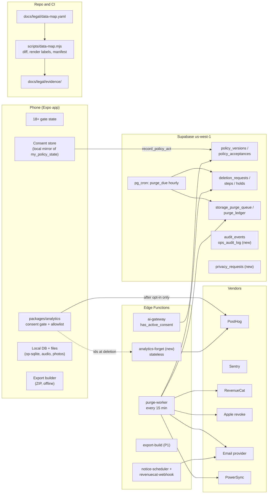
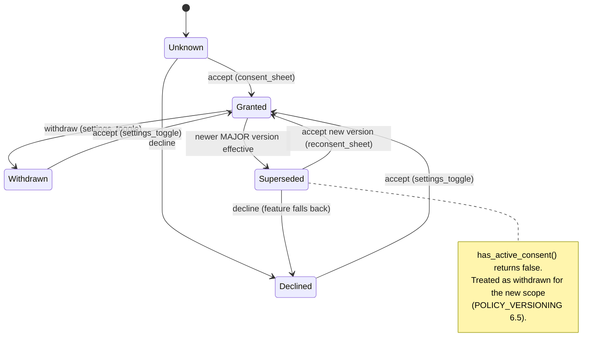
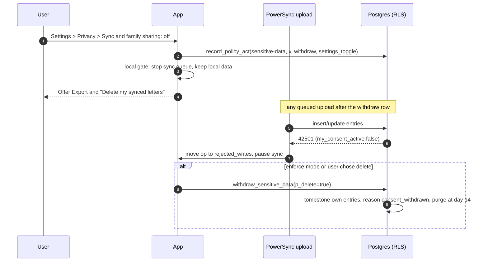
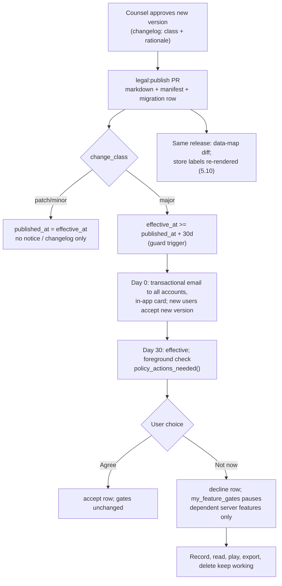
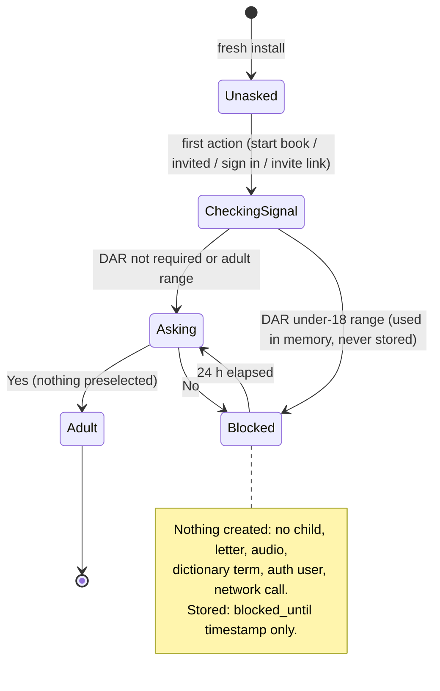
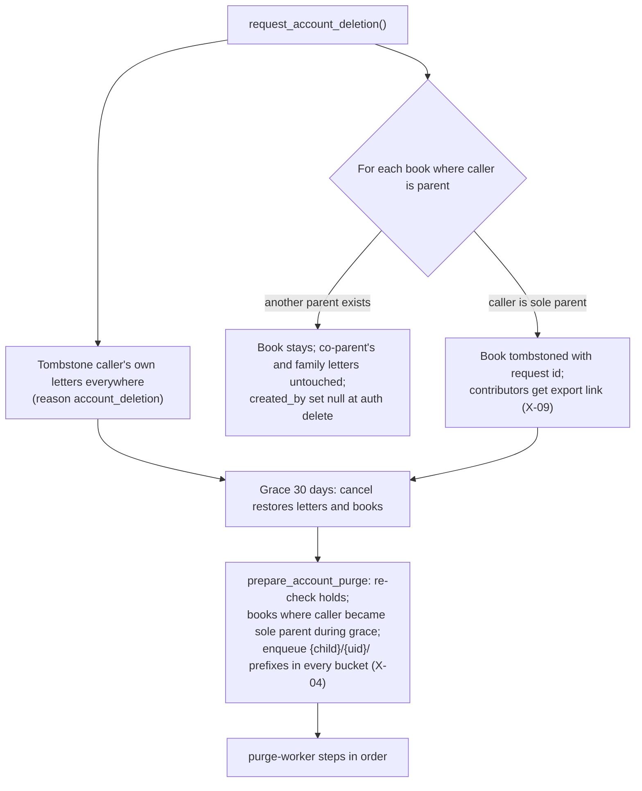
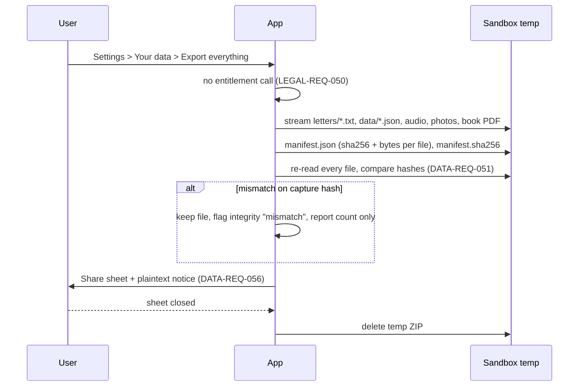
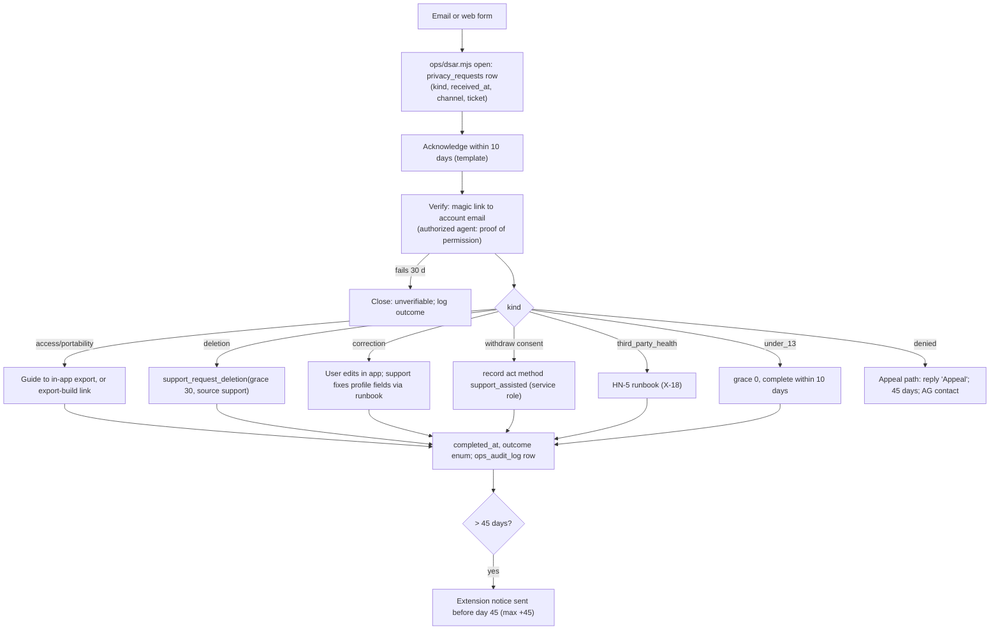
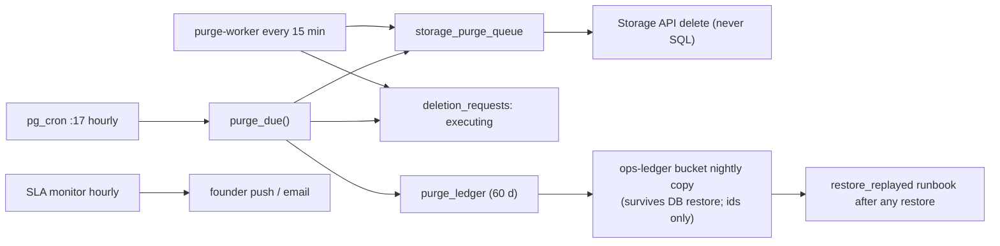
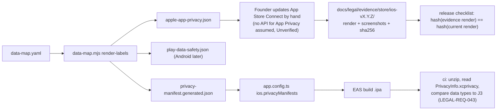

> **Note, 4 Oct 2026 (D-051, `docs/DECISIONS.md`):** the founder changed the business model. Plus is now the membership that unlocks the product: the free version is the first 2 letters per account, then new letters need Plus; letters already made stay readable, playable and exportable; one membership covers the book. Anywhere this file treats writing as free or Plus as optional, that is superseded; open edges are listed in D-051 and not decided here. Compliance impact: LEGAL-REQ-050 (free paths never call entitlement) now applies to reading, playing and exporting existing letters only; the subscription disclosures, ARL notices and counsel review need the new promise wording (owners: legal, counsel). `docs/legal/**` was not changed.

# TDD 05: Privacy and compliance engineering

> **Not legal advice.** This is an engineering design written to implement requirements that were themselves AI-drafted for counsel review. Every place where the design rests on an unsettled legal reading is listed in section 13 for a licensed attorney.

## 0. Summary

Early Letters already has an unusually strong legal paper trail: 60 `LEGAL-REQ`s, 55 `DATA-REQ`s, a versioned-consent model and a data-governance migration with 70+ database tests. What it does not have yet is most of the running machinery around that migration. The migration itself is **not applied** to the live project. Nothing has been built for the `purge-worker`, export, the data map, store-label rendering, the notice engine, DSAR tracking, the 18+ gate or the consent screens. This TDD maps every requirement to a component and a test, designs the missing systems, and flags 30 conflicts or gaps. Five of them block launch:

1. **Sign-ups break during every major policy change.** `policy_actions_needed()` offers new users the old *effective* version, which `record_policy_act()` then refuses because a newer version needing re-consent is already published. Sign-up fails for the whole 30-day notice window (section 3, X-01).
2. **Analytics deletion has nowhere to live.** The analytics id must never be stored server-side (so the "not linked" label holds), but processor deletion runs on day 30. Recommendation: delete PostHog persons at request time through a stateless function (X-02).
3. **Sensitive-data consent is enforced only on the client.** No server check stops content from syncing without `sensitive-data` consent, and web contributors never give it (X-03).
4. **The purge only reaches one Storage bucket.** Audio, inbox, child photos, avatars and exports are never enqueued, so the 31-day promise is false for them once they ship (X-04).
5. **The inventory has three competing sources of truth.** These are `data-policy.md` section 4, the column comments and the still-missing `data-map.yaml`. One must be canonical before CI can gate on it (X-05).

Notation used throughout: **[F]** fact (read in the repo), **[A]** assumption, **[R]** recommendation, **[RISK]**, **[OQ]** open question. "Unverified" means it was not checked against an opened vendor or legal source.

## 1. Scope and boundaries

In scope: consent management (analytics, sensitive data, AI processing, contributor notice, backup acknowledgment), policy versioning and acceptance, the 18+ gate, deletion (letter, book, account, contributor, support), export, DSAR handling, retention and purge, the data map, vendor DPAs, App Store privacy labels and manifest sync, auto-renewal notices, and privacy-relevant logging and kill switches.

Owned elsewhere (referenced, not redesigned): RLS and sync-stream parity (TDD 02), key escrow and audio encryption (TDD 03/04), identity and sessions (TDD 04), mobile screens (TDD 01). Where this TDD needs something from them, it states the interface in section 7.

### 1.1 Ground truth on 3 Oct 2026 [F]

| Area | State |
|---|---|
| `20261002020000_data_governance.sql` | Written, tested in PGlite (`npm run test:db`), **pending live apply** (APPLY.md; BL-015 human). The cron line is not scheduled. The pepper is not set. |
| Tables present in the migration | `legal_holds`, `audit_events`, `deletion_requests`, `deletion_request_steps`, `storage_purge_queue`, `purge_ledger`, `policy_documents` (13 seeded), `policy_versions` (no rows), `policy_acceptances`, `child_member_prefs`, `book_entries` view, `my_policy_state` view. `safety_events` dropped. |
| Functions | `request/cancel_account_deletion`, `request/cancel_book_deletion`, `delete_entry`, `restore_entry`, `purge_due`, `prepare_account_purge`, `finalize_account_deletion`, `record_policy_act`, `policy_actions_needed`, `has_active_consent` (service role only) |
| `packages/analytics` | Consent gate (unknown, granted, denied), random id with retired ids (max 20), allowlist validator, PostHog adapter with required options, 39 tests. No Sentry scrubber yet (BL-021). No consent *version* stored. |
| Not started | `purge-worker`, export (device and server), `data-map.yaml` and its CI checks, claims registry, store label renderer, `PrivacyInfo.xcprivacy`, notice scheduler, RevenueCat webhook, `ops_audit_log`, DSAR log, kill switches, web deletion page, return links, age gate (BL-037 ready), consent screens (BL-023, BL-054 blocked), Apple refresh-token capture |
| Vendor state | PowerSync has no no-training clause (launch gate CN-7). DeepInfra has no DPA. Groq ZDR is not confirmed on. The email provider is not chosen. The company name and domain are placeholders. |

## 2. Architecture overview



Design rules that hold across every component:

1. **The server is authoritative for anything that leaves the device.** Client consent checks are UX. Server checks (RLS, Edge Functions) are the control.
2. **Content-free machinery.** Deletion, consent, audit, DSAR and notice records hold ids, enums, counts and hashes, never L4 (DATA-REQ-004, -045).
3. **Every clock is a scheduled job with a test that uses time travel.** No retention rule depends on a person remembering it. Vendor-console retention is the one exception, and it is evidenced by a screenshot in the runbook.
4. **One machine-readable inventory** (`data-map.yaml`) drives the store labels, privacy manifest, subprocessor list and CI gates (section 5.9).

---

## 3. Conflicts and gaps found

Severity: **Critical** blocks launch or makes a published statement false; **High** must be fixed before the related feature reaches non-founder users; **Medium** before GA or the first audit; **Low** hygiene.

| # | Sev | Finding | Evidence | Resolution [R] |
|---|---|---|---|---|
| X-01 | Critical | `policy_actions_needed()` selects the latest **effective** version. During a major change's notice window (published, not yet effective), a new user is offered the old version, and `record_policy_act()` refuses it ("a newer version requires acceptance") because the new one has `new_users_from <= now()` and `requires_reconsent`. Sign-up then fails for up to 30 days. | migration lines 745 to 764 versus 715 to 721 | For callers with no `accept` row, return the newest version with `new_users_from <= now()`. For existing acceptors, keep the latest effective version. Add a DB test for "new user during the notice window". New migration; the old one is never edited. |
| X-02 | Critical | Analytics-id deletion. DATA-REQ-033 says to store the analytics id server-side in an owner-only column. Lawyer 2 H1, Privacy Policy CN-18, labels 1.3 and TRACKING_PLAN 7 say never store it, and pass it at deletion "in memory". But processor steps run at **day 30**, so the ids would have to persist on the server for 30 days, which links them to the profile and undermines "not linked". | DELETION spec 2.6.3 step 5; `deletion_request_steps.step='posthog'` | Delete in PostHog **at request time** through the stateless `analytics-forget` function (7.4). It holds no state, does not join the ids to a profile, and logs only counts. Mark the `posthog` step `not_applicable` at execution. Cancelling deletion does not restore analytics (disclose in the Privacy Policy; counsel OQ-L3). Amend DATA-REQ-033. |
| X-03 | Critical | `sensitive-data` consent gates sync only in the client (LEGAL-REQ-006). No RLS or upload check calls a consent function. `has_active_consent` is revoked from `authenticated`, so RLS cannot use it. Web contributors accept `contributor-notice` only, but their letters can hold health data too (CHD policy HN-4). | migration section 6 and section 9 grants | Add `my_consent_active(doc)` (security definer, `auth.uid()` only) and an insert/update RLS clause on `entries`, plus Storage insert policies, requiring `sensitive-data` **or**, for web-origin rows, the contributor's `contributor-notice` version whose text includes the sensitive-data line. PowerSync `uploadData` treats a 42501 rejection from this as "consent missing": it pauses sync and shows the Settings row. |
| X-04 | Critical | The purge only enqueues bucket `entry-photos`. Backup audio, `inbox` (web audio), `child-photos` (column already exists), `avatars` and `exports` are never enqueued. No job expires `exports` after 7 days. | `purge_due`, `prepare_account_purge` | Add a `bucket_registry` (static SQL function returning bucket, path template and owner scope). `purge_due` and `prepare_account_purge` enqueue every registered bucket. A CI test fails if a bucket in `data-map.yaml` is missing from the registry. Add an `export_expiry` sweep. |
| X-05 | High | Three inventories: `data-policy.md` section 4 (DATA-REQ-001; BL-016 parses it), SQL column comments (DATA_CLASSIFICATION; enforced), and `data-map.yaml` (LEGAL-REQ-012, -041, PRD 7.10; not built). They will drift. | DATA_CLASSIFICATION section 0 | `data-map.yaml` is canonical for **everything**. Column comments stay as a DB-side assertion, and CI checks that they equal the map's level. `data-policy.md` section 4 and DATA_CLASSIFICATION section 4 become generated tables (or are checked against the map). Re-scope BL-016 to the map. |
| X-06 | High | ARL notice timings disagree. LEGAL-REQ-047 says annual trial 7 and 3 days; K-04 says 18 and 3; Lawyer 1 says 16 to 21 days and "at least 3 days before the last day to cancel" (trial end minus 24 h, so D-4). LEGAL-REQ-047's "+/- 1 day" tolerance on the D-30 renewal notice allows D-29, which is outside Virginia's 30 to 60 day window. Massachusetts' 5 to 30 days before the cancellation deadline caps it at about D-31. | LEGAL-REQ-047; PRD K-04; lawyer-1 H1 | The scheduler targets the **renewal instant minus 30 days 12 h** (UTC). It is accepted only within [D-31, D-30], never later. The trial short notice goes at **trial end minus 4 days**, and the long trial notice at D-18. Encode the windows as data with a unit test per state rule. Counsel OQ-L7. |
| X-07 | High | `ops_audit_log` (LEGAL-REQ-025, CN-8: operator, runbook, reason, 12 months) does not exist. `audit_events` cannot carry an operator who is not a profile, explicitly does not log reads, and keeps rows 24 months. The Privacy Policy promises "each access is logged". | migration section 3; CN-8 | New append-only `ops_audit_log` (7.7), written only by runbook scripts, with its own retention (12 months per LEGAL-REQ-033; counsel may prefer 24). Service-role SQL against content outside runbooks is forbidden by process. **[OQ]** pgaudit on Supabase for read logging (Unverified support). |
| X-08 | High | Sensitive-data withdrawal. LEGAL-REQ-006 *offers* deletion of synced letters. Connecticut may require processing to stop within 15 days (CN-16, Unverified). It is also undefined what happens to the withdrawer's letters already in a co-parent's book. | CN-16; HN-4 | Build both modes behind config `sensitive_withdrawal_mode = offer | enforce`. `enforce` schedules a letters-only deletion (all own entries tombstoned, purge at day 14, not 30). Co-parents lose those letters from the book, as with account deletion. Default `offer` until counsel answers OQ-L1. |
| X-09 | High | The contributor export link on a sole-parent book deletion (DATA-REQ-014, -053, P0) depends on the server-built export (DATA-REQ-054, P1). | DELETION spec 2.3 | Either promote DATA-REQ-054 to P0, or ship v1 with "Save a copy" served from the contributor's own device or return link (their letters are on their phone or in the inbox). [R] Promote a **reduced** server export (text and photos only, no audio decrypt) to P0. |
| X-10 | High | Under-13 handling (LEGAL-REQ-002: delete within 10 days; DATA-REQ-027: skip grace). `request_account_deletion` hard-codes 30 days and has no service-role variant. | migration | Add `support_request_deletion(profile, reason_code, grace interval, ticket)`, service role only, writing `ops_audit_log`. `reason='under_13'` uses grace 0 and the worker runs within 1 h. |
| X-11 | Medium | `request_account_deletion(p_source)` lets a client claim `source='support'`. | migration | Reject `support` for `authenticated` callers. Accept only `ios`, `android` and `web`. |
| X-12 | Medium | The pepper fails open. If `app.consent_pepper` is unset, `subject_hash = sha256(uuid)`, which is reversible by anyone holding a list of profile ids. | `policy_acceptances_pseudonymise` | Raise if the pepper is empty or shorter than 32 hex characters. A DB test asserts the refusal. APPLY step 6 becomes a precondition of the cron. |
| X-13 | Medium | The local `ConsentStore` keeps no consent **version**. A major `analytics` version cannot trigger re-consent for that switch. Pre-account analytics acts cannot be uploaded with evidence. | consent.ts | Store `{status, version, decided_at}`. On sign-in, upload pending acts via `record_policy_act` with `client_recorded_at`. Treat a newer major version as `unknown`. |
| X-14 | Medium | Invite hash retention. LEGAL-REQ-033 says 30 days; K-18, DATA-REQ-060 and the migration say 90 after `expires_at`. Return links are not covered (no table yet). Used or revoked invites before expiry are kept to `expires_at` + 90, which matches "expiry, use or revocation" only loosely. | purge_due step 4 | Keep 90 days, keyed on `coalesce(revoked_at, accepted_at, expires_at)`. Amend LEGAL-REQ-033. Cover `member_return_links` when it ships. |
| X-15 | Medium | DATA-REQ-006's acceptance criterion still tests "a safety event 13 months old". The table is dropped. | spec 1 | Replace it with invite, audit and acceptance retention cases (already partly tested). |
| X-16 | Medium | A proposed second-provider copy of backup ciphertext with 35-day versioning (spec OQ-4) would break the published 38-day backup promise (31 + 35 = 66 days). | DATA-REQ-055; data-policy 5 | If adopted, versioning is 7 days or less. Otherwise the promise changes, which is a **major** `privacy` version. Premature for v1. |
| X-17 | Medium | RevenueCat `appUserID`: data-policy 4.6 says profile uuid; K-28 and subprocessors say random. | | Random id, mapped in `entitlements`. Fix data-policy. Test that the RevenueCat configure call never receives `profiles.id`. |
| X-18 | Medium | HN-5: someone else's health in another author's letter, versus "nobody deletes another person's words" (DATA-REQ-015). A Washington deletion request could conflict with author ownership. | CHD policy HN-5 | `privacy_requests.kind='third_party_health'` runbook: ask the author; at day 30 with no action, set the letter aside (`in_book=false`) by service role with an `ops_audit_log` row. Delete only on counsel instruction. OQ-L4. |
| X-19 | Medium | PowerSync deletion verification is Unverified, and PowerSync holds L4 with no no-training clause (CN-7). | spec 2.6.3 step 10; subprocessors 4.1 | Vendor gate in 5.10. The fallback check is Postgres-empty plus a fresh-install sync probe in staging (TC-15). |
| X-20 | Medium | `policy_actions_needed()` only demands `terms` and `contributor-notice`. LEGAL-REQ-009 needs "decline pauses only dependent server features", but no server function says which features are paused. | | Add `my_feature_gates()` returning `{sync, family, backup, ai}` booleans computed from acceptances. Edge Functions and RLS helpers read the same rules (7.2). |
| X-21 | Medium | LEGAL-REQ-029 says "Sentry user context", but Sentry carries no identity. Deletion relies on 90-day retention. | data-policy 4.5 | Align LEGAL-REQ-029 wording. Test that Sentry `setUser` is never called. |
| X-22 | Low | The two-taps rule for consents is a UI test only. Settings currently has no consent list (BL-023). | | Covered in BL-023 and NEW-07. |
| X-23 | Low | DATA_CLASSIFICATION open issue 1: `goals_set{keys}` sends L4 goal keys. | | Do not ship the property until it is resolved (catalogue test asserts it is absent). |
| X-24 | Medium | DSAR (LEGAL-REQ-036) needs logged receipt, verification and completion dates. No table exists. Email-originated access requests have no server export path until DATA-REQ-054. | | `privacy_requests` table (7.8) plus the `ops/dsar.mjs` runbook. Interim access fulfilment: the user exports on device, guided by support. |
| X-25 | Medium | Apple refresh-token capture is Unverified for `signInWithIdToken`. Without the token, revocation (DATA-REQ-019) is impossible. | spec DATA-REQ-033 | Phase-0 spike (NEW-12). If Supabase cannot yield it, an `apple-token-store` Edge Function exchanges the authorization code at sign-in. |
| X-26 | Low | LEGAL-REQ-031 says "backups within 35 days of hard delete". The published promise is 38 days from request (K-23). | | Already reconciled by K-23. Update LEGAL-REQ-031 wording. |
| X-27 | Medium | LEGAL-REQ-033 lists ops and security logs at 12 months, while `audit_events` keeps 24 (DATA-REQ-066). They are different tables, but the Privacy Policy section 10 must list both. | | Two clocks, both disclosed. |
| X-28 | Low | `audit_events` keeps `child_id` for 24 months after a book is purged. That is an L3 id with no surviving referent. | | Acceptable (an id of a deleted record). Null `child_id` at book purge if counsel prefers (OQ-L10). |
| X-29 | Medium | Device copies after deletion. DATA-REQ-023 wipes local data on next launch. iCloud and device backups may retain the local DB (CN-19, undecided). | | Exclude `scribe.db` and `audio/` from iCloud backup **only if** the product accepts losing them on a phone restore without sync. [R] Keep them included; disclose (Privacy Policy section 9 already does). Founder decision. |
| X-30 | Low | The 18+ anti-retry is per install. Reinstalling resets the 24 h block. | PRD-REQ-019 | Accept. Keychain persists across reinstall on iOS, so store the gate timestamp in Keychain if counsel wants it stronger. |

---

## 4. Traceability matrix

Status: **B** built and tested in repo (migration pending live apply, BL-015); **P** partially built; **D** designed in this TDD, not built; **N** not started and not designed beyond its source; **C** conflict open (see section 3); **NA** not applicable. Test file shorthand: `dg` = `supabase/tests/data_governance.test.mjs`, `rls` = `supabase/tests/rls.test.mjs`, `cls` = `supabase/tests/classification.test.mjs`, `an` = `packages/analytics/test/*`, `e2e` = mobile E2E with a network-capture proxy (section 9.4), `stg` = staging cross-system script, `ci` = static check in CI. New test files are named in section 9. Every test title starts with its ID in brackets (BACKLOG DoD 1).

### 4.1 LEGAL-REQ

| ID | P | Requirement (short) | Component | Test | Status |
|---|---|---|---|---|---|
| 001 | P0 | Terms acceptance at account creation; no account without a `terms` row | Sign-in sheet (BL-050); `record_policy_act`; `policy_actions_needed`; sync guard "no upload before terms row" | dg "acceptance records policy..."; new `dg` "new user during notice window can accept" (X-01); e2e "terms row before first sync" | P, C (X-01) |
| 002 | P0 | 18+ gate before first use; Declared Age Range in memory; 24 h anti-retry; under-13 runbook within 10 days | `packages/core/ageGate` (pure); `ageGate.*` screens (BL-037); `terms` context `age_attested`; `support_request_deletion` grace 0 | unit `ageGate.test.ts` (states, 24 h, nothing created); e2e network shows zero requests on No; Apple sandbox (manual); dg "under-13 support deletion executes within 1 h" | D, C (X-10) |
| 003 | P0 | Analytics and crash opt-in; nothing leaves before a choice | `packages/analytics` gate; Sentry bootstrap reads `analytics.consent()`; ask sequencer (BL-023) | an (no-consent drop, revoke clears queue); e2e host-capture: zero PostHog/Sentry requests before consent | P |
| 004 | P0 | Per-feature AI consent checked server-side by gateway | `ai-gateway` calls `has_active_consent(uid,'ai-processing')` | edge integration `ai-gateway.test.ts`: 403 without consent; withdrawn; superseded major | N (TDD 03 owns gateway; contract 7.3) |
| 005 | P0 | Web contributor content never to AI on someone else's consent | Gateway refuses `source='web'` unless contributor consent row | edge test "web entry refused with parent consent" | N |
| 006 | P0 | Separate sensitive-data consent; decline keeps local; withdrawal stops sync | Consent screen (BL-054); `my_consent_active` RLS clause; `my_feature_gates()`; withdrawal modes | dg "insert refused without sensitive-data" (X-03); e2e "decline: zero uploads to Supabase/PowerSync"; dg "withdraw enforce schedules letters-only deletion at 14 days" | D, C (X-03, X-08) |
| 007 | P0 | Permission priming; purpose strings; forbidden permission keys | `scripts/manifest-lint.mjs` on prebuilt Info.plist and manifest | ci manifest-lint; e2e "no OS prompt before Tonight" | N |
| 008 | P0 | Every consent visible and withdrawable in 2 taps; Legal list | Settings > Privacy rows bound to `my_consents()` | e2e tap-count test per consent; dg `method='settings_toggle'` row | D |
| 009 | P0 | Policy change notice, re-consent, never gate export/delete | `policy_actions_needed`; re-consent sheet; `my_feature_gates`; notice email job | dg major/minor cases; e2e "decline: export works, sync paused" | P, C (X-01, X-20) |
| 010 | P0 | Notice at collection on web page; nothing leaves before Send | `apps/web` contribution page; anonymous sign-in at Send | web e2e (Playwright): no mic prompt, only invite check request before Send; one acceptance row | N |
| 011 | P1 | Recording-consent line; stop on background | Recorder (TDD 01) | e2e "background stops and saves" | N |
| 012 | P0 | Field allowlist; never-collected list | `data-map.yaml` + `scripts/data-map.mjs diff-schema`; `cls` | ci schema-to-map diff; ci denylist of field names (`gender`, `surname`, `dob`, `phone`, ...) | D, C (X-05) |
| 013 | P0 | Strip GPS/device EXIF before upload | `packages/core/photoSanitize` + native re-encode | unit with GPS fixture; stg "stored object has no GPS tags" | N |
| 014 | P0 | No content in URLs, logs, push, email subjects, support prefill | Log canary (section 9.5); push builder tests; RPC-only search | ci canary scan over E2E logs; unit push payload tests | N |
| 015 | P0 | Safety tiers on device only | `safety_events` dropped; local table only | dg/cls "no safety_events table" (TC-14); e2e network: no tier field leaves | B (server), N (device) |
| 016 | P0 | No ad, attribution or tracking SDKs; no ATT | `scripts/sdk-denylist.mjs` | ci denylist (package-lock + iOS Pods + imports) | N |
| 017 | P0 | Analytics allowlist; PostHog config flags | `validate.ts`, `REQUIRED_POSTHOG_OPTIONS`, `posthogBeforeSend` | an catalog and sanitize tests; ci assert bootstrap spreads required options last | P (SDK option names Unverified) |
| 018 | P0 | Ephemeral name clips never persisted | Name-check task temp dir | e2e sandbox inspection after cancel | N |
| 019 | P0 | No voiceprints, diarization, face analysis (extend to photos, Lawyer 2 H3) | Request-builder lint; PR checklist; denylist `Vision` face APIs | ci config lint; ci import denylist (`VNDetectFaceRectanglesRequest` etc.) | N |
| 020 | P0 | AI providers ZDR, no training, ids stripped | Gateway request builder; `data-map.yaml` vendor entries with DPA ref | edge test at provider boundary; ci each AI vendor has `dpa` and `retention` | N |
| 021 | P0 | TLS 1.2+; no ATS exceptions; HSTS | manifest-lint; web headers test | ci | N |
| 022 | P0 | Encryption at rest (client audio, Data Protection, Supabase confirmed) | TDD 03/04; map field `encryption` required for L4 | stg "audio object not a valid M4A"; ci every L4 store has `encryption` | N |
| 023 | P0 | Escrow key controls | TDD 04 | TDD 04 tests | N |
| 024 | P0 | RLS on every table, access tests, parity | migrations; `rls`, `dg`, `cls` | `cls` "every table has RLS"; TC-15 parity (TDD 02) | P |
| 025 | P0 | Break-glass staff access with audit row | `ops_audit_log` + runbook CLI wrapper | unit "runbook writes exactly one audit row, no content"; quarterly review | D, C (X-07) |
| 026 | P0 | Secrets out of repo and bundle | gitleaks in CI; bundle scan | ci | N (TDD 04) |
| 027 | P1 | SBOM and SDK inventory; new SDK needs map entry | `scripts/data-map.mjs diff-deps` | ci | D |
| 028 | P0 | Written information security programme | `docs/security/WISP.md` | manual release check | N (TDD 04) |
| 029 | P0 | In-app account deletion end to end incl. processors, Apple revoke, receipt | Deletion flow (TDD 01); `request_account_deletion`; `purge-worker`; `analytics-forget` | dg TC-07, TC-11; edge `purge-worker.test.ts` with fake vendors; stg `verify-deletion.mjs` | P, C (X-02, X-04) |
| 030 | P0 | Web deletion page | `apps/web/delete-account` | web e2e | N |
| 031 | P0 | Deletion SLAs | `purge_due` cron; worker; SLA monitor query | dg TC-05 with clock; edge retry tests; stg monitor alert drill | P |
| 032 | P0 | Honest deletion across devices | PowerSync REMOVE handler; launch sweep (TC-20) | e2e two-device test | N |
| 033 | P0 | Retention schedule enforced by code | `purge_due` step 4; vendor settings evidence | dg time-travel cases per row (section 9.3) | P, C (X-14) |
| 034 | P0 | Export complete, free, offline | Device export builder; `account.json` | unit ZIP schema check; e2e lapsed offline export | N |
| 035 | P1 | Contributor rights via return link | `apps/web` return page; `delete_entry` for anon identity | web e2e | N |
| 036 | P1 | Verified rights requests logged | `privacy_requests` + `ops/dsar.mjs` | unit runbook; dg RLS (service only) | D (X-24) |
| 037 | P0 | Security event logging | Supabase auth logs; `ops_audit_log`; signed-URL counters | stg per event type | N (TDD 04) |
| 038 | P1 | Alerting incl. processor deletion failures | Monitor queries + push to founder | stg drill | D (deletion parts) |
| 039 | P0 | Affected-user enumeration within 1 h | `ops/incident-scope.mjs` reading `data-map.yaml` categories | script test on fixtures | D |
| 040 | P0 | Kill switches within 5 min | Remote config (BL-022 undecided) | stg flip test | N (blocked BL-022) |
| 041 | P0 | One data map drives disclosures; new host or SDK fails without map entry | `data-map.yaml`; `scripts/data-map.mjs` | ci host allowlist diff, deps diff | D, C (X-05) |
| 042 | P0 | Store disclosures rendered and evidenced per release | `data-map.mjs render-labels`; `docs/legal/evidence/store/<version>/` | ci hash of evidence equals render | D |
| 043 | P0 | Apple privacy manifest matches map | `app.config.ts` `ios.privacyManifests` generated | ci on built `.ipa` | D |
| 044 | P0 | Claims registry and content rule | `docs/legal/claims-registry.yaml`; rule in `rules.test.ts` | content test; ci "claim depends on changed map fact" | N |
| 045 | P0 | Adult audience copy | content rules | content test (banned child-directed terms) | P (copy fixed 2 Oct; rule not yet added) |
| 046 | P0 | Paywall disclosures near button | Plus sheet (TDD 01) | snapshot + a11y | N |
| 047 | P0 | Notice timing engine | `notice-scheduler` + `revenuecat-webhook` (7.9) | unit per state window; edge clock-controlled scheduler test | D, C (X-06) |
| 048 | P0 | Easy cancellation | `showManageSubscriptions` | e2e one tap | N |
| 049 | P0 | Purchase consent records | `record_policy_act('auto-renewal-terms', method 'paywall_purchase')`; webhook reconciliation | edge "exactly one acceptance within 10 min of transaction" | D |
| 050 | P0 | Keep-and-leave: free paths never call entitlement | `packages/core` capability map | unit + e2e with entitlement service down | N |
| 051 | P0 | WCAG 2.2 AA on consent, legal, deletion, paywall | All surfaces | axe (web), AX5 snapshots, manual VoiceOver script | N |
| 052 | P1 | Accessibility statement | `accessibility` document | manual | N |
| 053 | P0 | Email classification; CAN-SPAM; no child names in subjects | Template metadata in `packages/content` | content test | N |
| 054 | P0 | Push payloads carry no content | Push builder | unit | N |
| 055 | P0 | Apple/Google sign-in and account rules | PRD A | PRD A tests | N |
| 056 | P1 | Report a concern; member removal | Support form; `remove_child_member` | manual | N |
| 057 | P1 | Preservation snapshot | `ops/preserve.mjs` + `legal_holds` | script test: snapshot exists, restricted, audit row | P (holds B) |
| 058 | P0 | US-only geography; no cookies beyond necessary on web | Store checklist; web cookie test | manual + Playwright cookie assertion | N |
| 059 | P1 | `child-input` flag off without counsel link | Flag registry check | ci | N |
| 060 | P1 | No health-feature drift | Entitlement and dependency denylist | ci | N |

### 4.2 DATA-REQ

| ID | P | Requirement (short) | Component | Test | Status |
|---|---|---|---|---|---|
| 001 | P0 | Inventory is the source of truth | `data-map.yaml` (canonical, X-05); BL-016 re-scoped | ci schema, bucket, deps and hosts diff | D, C (X-05) |
| 002 | P0 | Classification drives handling | Map `level` plus column comments | `cls`; ci map level equals comment level | P |
| 003 | P0 | Ownership enforced in DB | RLS, guards, `delete_entry`/`restore_entry` | dg TC-02 to TC-04, TC-10 | B |
| 004 | P0 | No content outside content stores (audit, receipts) | `audit_events.detail` 512 B enum check; receipt 2 KB | dg "delete audited without content"; new dg "receipt with text rejected by shape check"; log canary | P |
| 005 | P0 | Region us-west-1; PowerSync US | Map `region` field; vendor gate | ci every vendor has `region`; manual console evidence | P |
| 006 | P0 | Retention automated | `purge_due` hourly cron; `purge-worker` 15 min | dg time travel (fix stale safety case, X-15) | P (cron not scheduled; worker N) |
| 010 | P0 | Letter delete and restore, server clock | `delete_entry`, `restore_entry`, guard | dg TC-02, TC-04 | B |
| 011 | P0 | Purge reaches every copy | Queue for all buckets; device sweep | dg per bucket (X-04); e2e TC-20 | P, C (X-04) |
| 012 | P0 | No cascade across authors | FK `set null` | dg TC-07 | B |
| 013 | P0 | Server-clock tombstones; explicit restore | Guard | dg TC-02, TC-03 | B |
| 014 | P0 | Book deletion equals rule | `request_book_deletion` | dg TC-08, TC-10; contributor notice step | P, C (X-09) |
| 015 | P0 | Nobody deletes another's words | No API path; `delete_entry` author-only | dg "co-parent cannot delete another author's letter" | B |
| 016 | P0 | Leaving never deletes or orphans | `child_members_guard` | dg TC-09 | B |
| 017 | P0 | Contributor removal preserves words | `remove_child_member` (PRD B, pending) | new dg | N |
| 018 | P0 | Contributors delete without app | Return-link page; anon-identity deletion | web e2e | N |
| 019 | P0 | In-app account deletion (Apple 5.1.1(v)) | Flow + RPC + worker | e2e 2 taps; edge Apple revoke step | P |
| 020 | P0 | Execution order and completeness | Worker step order; `finalize` refuses while profile exists | dg TC-11; edge order test | P |
| 021 | P0 | Web deletion URL | `apps/web/delete-account` | web e2e | N |
| 022 | P0 | Subscription notice before confirm | Flow step 4; `had_active_subscription` | e2e; dg column set | P |
| 023 | P0 | Device data wiped after execution | Auth-failure handler; local wipe | e2e | N |
| 024 | P1 | Delete without account | Local wipe | e2e | N |
| 025 | P0 | Receipts (3 emails + in-app) | Worker `receipt_email`; templates | edge test; content test (no content, no child names) | N (email provider N) |
| 026 | P0 | Cancel during grace | `cancel_account_deletion` | dg "cancel restores" | B |
| 027 | P0 | Support-initiated deletion | `support_request_deletion` (new) | dg + runbook test | D (X-10) |
| 030 | P0 | Backup windows match promise | Supabase Pro 7-day daily, PITR off or 7 | manual console evidence each release; ledger replay script | P |
| 031 | P1 | Quarterly restore drill | `ops/restore-drill.mjs` | drill log | N |
| 032 | P0 | Sync layer deletion | PowerSync REMOVE + compaction | TC-15 parity incl. tombstones (TDD 02); stg fresh-install probe | N |
| 033 | P0 | Third-party deletion | Worker steps; `analytics-forget` | edge fake-vendor tests (TC-19) | D, C (X-02, X-25) |
| 034 | P0 | Deletion verification before finalize | `verify-deletion` step inside worker + stg script | stg | D |
| 035 | P0 | Legal holds | `legal_holds`, `is_held` | dg TC-06; new dg "held account request stays held" | B |
| 036 | P0 | Published SLA 31/38/45 + monitor | SLA monitor query + alert | dg monitor query returns overdue fixtures | D |
| 040 | P0 | Immutability | guard | dg TC-01 | B |
| 041 | P0 | Version history | trigger | dg TC-13 | B |
| 042 | P0 | Machine edits reversible | core + versions | core tests; dg TC-13 | P |
| 043 | P0 | Sync conflict rules; `SC***` permanent | PowerSync `uploadData` (TDD 02) | TC-16 | N |
| 044 | P0 | Idempotent writes and steps | UUIDv7; idempotent RPCs; worker | dg "request is idempotent"; TC-19 | P |
| 045 | P0 | Audit log without content | `audit_events` | dg; `cls` | B |
| 046 | P0 | Corruption detection | `raw_sha256`; audio hashes; scrub | dg TC-01; device tests | P |
| 047 | P0 | Cross-family object isolation | path constraint; Storage policies; bucket registry | dg TC-12; per-bucket access test | P |
| 048 | P0 | Atomic local saves | Local store (BL-032) | device test | N |
| 049 | P0 | Integrity suite TC-01 to TC-20 | `dg` + mobile + edge | as listed | P (TC-01 to -14 B) |
| 050 | P0 | Export contents | Export builder | ZIP schema golden test (9.6) | N |
| 051 | P0 | Checksums and self-verification | Builder re-read pass | unit TC-17 | N |
| 052 | P0 | Export always available, offline, < 2 min for 230 MB | Builder, no entitlement call | e2e iPhone SE 3 perf (human) | N |
| 053 | P0 | Export before deletion | Flow step 3 | e2e | N |
| 054 | P1 | Server-built export | `export-build` (P0 reduced, X-09) | edge test | D |
| 055 | P1 | 18-year durability | Format semver, readers kept | ci fixtures parse | N (premature parts noted 11) |
| 056 | P0 | Export privacy notice; temp deleted | Share sheet handler | e2e sandbox check | N |
| 060 | P0 | Invites purged 90 days | `purge_due` | dg "invite expired 91 days ago is gone" (add) | P, C (X-14) |
| 061 | P0 | Safety events | Not applicable (dropped) | dg TC-14 | NA |
| 062 | P0 | PostHog 12 months; Sentry 90 days | Vendor settings | manual evidence; `REQUIRED_PROJECT_SETTINGS` checklist | N |
| 063 | P1 | Support mail 2 years | Mailbox retention rule | manual | N |
| 064 | P0 | Consent records pseudonymised, 3 years | trigger + `purge_due` | dg "acceptances pseudonymised"; add dg "deleted after 3 years"; dg "pepper missing refuses" (X-12) | P |
| 065 | P1 | Transaction records 7 years | `entitlements` ledger | dg | N |
| 066 | P0 | Operational records retention | `purge_due` step 4/5 | add dg per table | P |

### 4.3 Coverage summary

| | Total | B | P | D | N | NA |
|---|---|---|---|---|---|---|
| LEGAL-REQ | 60 | 1 | 10 | 14 | 35 | 0 |
| DATA-REQ | 55 | 11 | 18 | 6 | 19 | 1 |

Counts use each row's first status. LEGAL-REQ-015 counts as B, but only its server half is built; its device half is not. "B" in every case still needs the live apply (BL-015) before it is true in production. **Only about 10% of requirements are fully built, and none are live.**

---

## 5. Design

### 5.1 Consent management

**Documents** (seeded in the migration [F]): `terms`, `privacy`, `health-privacy`, `sensitive-data`, `ai-processing`, `analytics`, `auto-renewal-terms`, `contributor-notice`, `backup-recovery`, plus public notices. Each consent is a versioned document. The current state is the latest `policy_acceptances` row per document (append-only, server time).

**Where each consent is checked**

| Consent | Asked | Client effect | Server control (authoritative) |
|---|---|---|---|
| `analytics` | 3rd ask after the first letter (PRD-REQ-001); Settings | `packages/analytics` gate; Sentry init only when granted | None needed: no analytics reaches our servers. PostHog project `defaultOptIn:false`. Evidence row via `record_policy_act` when signed in. |
| `sensitive-data` | After account creation, before first sync (PRD-REQ-002) | Sync engine stays off; Settings explains | **New:** RLS insert/update clause on `entries`, `dictionary_terms`, Storage inserts: `my_consent_active('sensitive-data')` (X-03). `my_feature_gates().sync` |
| `ai-processing` | Before the first server transcription | Route to on-device | `ai-gateway`: `has_active_consent(uid,'ai-processing')` on every request; `source='web'` needs contributor's own row |
| `contributor-notice` | "Send" on the web page | n/a | Anonymous-session insert RLS requires a current `contributor-notice` row; text includes the sensitive-data line (X-03) |
| `backup-recovery` | Turning backup on | Choose Standard or Vault | Audio upload policy requires an `acknowledge` row (TDD 03) |
| `auto-renewal-terms` | Purchase | n/a | Webhook reconciliation (7.9) |



**Withdrawal effects and budgets**

| Consent | Effect | Budget |
|---|---|---|
| `analytics` | Queue cleared, `optOut()`, `reset()`, id retired; Sentry closed | Same session, before the next event (an test) |
| `ai-processing` | Gateway refuses; client routes on device | Next request (server check is per request) |
| `sensitive-data` (`offer` mode) | Sync uploads stop; offer export and "delete my synced letters" | One sync cycle (at most 60 s online) |
| `sensitive-data` (`enforce` mode, X-08) | As above, and all own entries tombstoned with `deleted_reason='consent_withdrawn'`, purge at 14 days, Storage queued | Server copy gone within 15 days |
| `backup-recovery` | No new uploads; existing backups kept until the user deletes them | Immediate |



**Pre-account acts.** Only `analytics` can be decided before an account exists. The client stores `{document, version, action, client_recorded_at}`. On sign-in it uploads that in the same transaction as letter re-ownership (BL-052) with `method='consent_sheet'` (X-13).

### 5.2 Policy versioning and acceptance

The data model and SQL are as in POLICY_VERSIONING 7.2, already in the migration [F]. What this TDD adds:

1. **Fix X-01**: in `policy_actions_needed()`, a user with no `accept` row for a document is offered `max(version) where new_users_from <= now()`. A user who has one is compared against `max(version) where effective_at <= now()`.
2. **Publish pipeline** (`npm run legal:publish`): markdown in `packages/content/legal/<key>/<version>.md` goes into `manifest.json` (sha256 per locale), then a new migration inserting the `policy_versions` row, then CI checks (hash immutability, manifest-to-migration parity, versioned in-app URLs).
3. **`my_feature_gates()`** (X-20) returns `{sync, family, backup, ai, analytics_evidence}`. `sync` and `family` need a current `terms` accept and an active `sensitive-data`. `backup` also needs `backup-recovery`. `ai` needs `ai-processing`. Export and deletion are never gated (LEGAL-REQ-009).
4. **Offline**: `my_policy_state` syncs to the device. The bundled `manifest.json` renders text offline. The server remains authoritative.



### 5.3 18+ gate

The gate is a pure module in `packages/core` (BL-037), so it can be tested without a phone.



Stored on the device: `age_gate = {state: 'adult' | 'blocked', blocked_until}` (L2). Stored on the server: `{"age_attested": true, "age_signal": "declared_range" | "none"}` inside the `terms` acceptance context only. Web page: the confirmation is part of Send, recorded in the `contributor-notice` row. After an account exists, actual knowledge of under-18 (store signal or report) triggers `support_request_deletion(reason 'under_18' | 'under_13')`. Under 13 uses grace 0 and completion within 10 days (X-10).

### 5.4 Account deletion (co-parent survival, 31/38/45)

The state machine is as in the spec 2.1 and the migration. The timeline with budgets:

```mermaid
gantt
  title Account deletion clocks (T0 = request)
  dateFormat  X
  axisFormat  day %s
  section User
  Grace, cancel possible, export works      :a1, 0, 30
  section Live systems
  purge_due marks executing (<= 1 h)         :milestone, m1, 30, 0
  Worker: storage, Apple, RC, email, auth   :a2, 30, 1
  Live erase deadline (31)                   :milestone, m2, 31, 0
  section Backups
  Daily backups roll off (7 d)               :a3, 31, 7
  Backup deadline (38)                       :milestone, m3, 38, 0
  section Processors
  PostHog deleted at request (X-02)          :a4, 0, 14
  RevenueCat, email provider async           :a5, 31, 7
  Processor deadline (45)                    :milestone, m4, 45, 0
```

**Co-parent survival** (DATA-REQ-012, -014; tested TC-07, TC-08):



**Worker steps** (contract in 7.5): `storage_objects` (all registered buckets), `apple_token_revoke`, `revenuecat`, `posthog` (`not_applicable` if done at request), `email_provider`, `contributor_export_notice` (sole-parent books), `receipt_email`, `auth_user`, `verify` (new, DATA-REQ-034), `finalize`, then `powersync_verify` after compaction. Each step is idempotent, retried with backoff from 1 min to 6 h for 7 days, then `failed` and the founder is paged.

**SLA monitor** (DATA-REQ-036), run hourly. It alerts if any of these hold:
- an unheld tombstone is older than 31 days;
- an account request has been `executing` for more than 24 h, or any request is past `scheduled_for` + 1 day;
- a processor step is not `done` by T0 + 38 days (7 days of margin before 45);
- a queue row has gone undone for more than 24 h.

### 5.5 Export

There are two builders sharing one format (spec 4.2, `format_version` 1.0.0).

| Builder | Scope | Where | Budget |
|---|---|---|---|
| Device (P0) | Everything on the phone plus backed-up audio if online | `packages/export` (pure TS writer) + native ZIP streaming | 230 MB (1 year) under 2 min offline on iPhone SE 3 (DATA-REQ-052); memory under 150 MB peak [A] by streaming |
| Server (P0 reduced: text, photos, `account.json`; P1 full with Standard-mode audio via escrow) | Web deletion page, contributors, DSAR by email | `export-build` Edge Function as a queued job; object `exports/{profile}/{id}.zip` | p95 under 15 min for 2 GB [A]; signed URL 7 days; object purged at 7 days (`export_expiry`). The Edge Function wall-clock limit is Unverified, so chunk per child-year and resume |



`account.json` holds the profile fields, memberships, dictionary terms, `my_policy_state` and every acceptance row, plan status, the person's own `audit_events` and `deletion_requests` rows, and the list of processors that received data (Washington access right; generated from `data-map.yaml`).

### 5.6 DSAR handling

Channels are in-app (self-serve export and deletion), `/delete-account`, `/privacy-choices`, and `{PRIVACY_EMAIL}`. Everything that is not self-serve becomes a `privacy_requests` row (7.8).



Email-only requests cannot reach analytics (there is no id). The Privacy Policy already says so (CN-18).

### 5.7 Retention and purge jobs

| Record | Rule | Enforcer | Status |
|---|---|---|---|
| Tombstoned letters | 30 d after server `deleted_at`, unless held | `purge_due` step 2 | B |
| Tombstoned books | 30 d | `purge_due` step 1 | B |
| Account requests | due at `scheduled_for` | `purge_due` step 3 + worker | P |
| Consent-withdrawn letters (enforce) | 14 d | new `purge_due` branch on `deleted_reason` | D |
| Invites / return-link hashes | 90 d after expiry, use or revocation | step 4 | P (X-14) |
| `audit_events` | 24 months | step 4 | B |
| `ops_audit_log` | 12 months (LEGAL-REQ-033) | new step | D |
| `deletion_requests` done | 3 years | step 4 | B |
| `policy_acceptances` pseudonymised | 3 years after `pseudonymised_at` | step 4 | B |
| `privacy_requests` | 3 years after completion [R] (proof of compliance) | new step | D |
| `purge_ledger` | 60 days | step 5 | B |
| `storage_purge_queue` done | 7 days | step 5 | B |
| `exports` objects | 7 days | new `export_expiry` enqueue | D |
| Database backups | 7 days (Pro, PITR off or 7) | Vendor setting; evidence | P |
| PostHog events | 12 months | Vendor setting; evidence | N |
| Sentry events | 90 days | Vendor setting; evidence | N |
| Support mail | 2 years | Mailbox rule | N |
| Transaction records | 7 years (proposed) | `entitlements` ledger job | N |



**Restore safety.** `purge_ledger` lives inside the database, so restoring a backup also rolls the ledger back. The nightly `ops-ledger` copy (spec 4.4 bucket) is what makes replay possible. It must keep at least 8 days, which is longer than the backup window. 60 days is fine.

### 5.8 Data map (`docs/legal/data-map.yaml`)

The map is canonical (X-05). It is one file, split by `kind`, and validated by a JSON Schema in `docs/legal/data-map.schema.json`.

```yaml
schema_version: 1
generated_views:            # files rendered or checked from this map by scripts/data-map.mjs
  - docs/legal/data-policy.md#4          # table check
  - docs/legal/DATA_CLASSIFICATION.md#4  # table check
  - docs/legal/evidence/store/<version>/apple-app-privacy.json
  - apps/mobile/privacy-manifest.generated.json
  - docs/legal/subprocessors.public.md
vendors:
  - id: supabase
    legal_name: Supabase Pte. Ltd.        # confirm contracting entity (subprocessors 4.8)
    role: processor                      # processor | independent | not_processor
    purposes: [hosting, auth, storage, edge_functions]
    region: us-west-1
    dpa: {url: "https://supabase.com/legal/dpa", signed_on: null, evidence: "company-records/dpa/supabase.pdf"}
    no_training: {status: yes, source: V1}
    health_data_terms: likely            # yes | likely | gap
    deletion_route: own_purge_and_deleteUser
    retention: "until we delete; backups 7 d"
    contact: "privacy contact URL or email"   # MHMDA requires it on the public list
    launch_gate: false
  - id: powersync
    role: processor
    no_training: {status: gap}
    launch_gate: true                    # CN-7: blocks the Privacy Policy section 6 claim
hosts:                                   # every network destination the app or web may call
  - {host: "*.supabase.co", vendor: supabase, from: [ios, web]}
  - {host: us.i.posthog.com, vendor: posthog, from: [ios], requires_consent: analytics}
sdks:
  - {package: posthog-react-native, vendor: posthog, collects: [usage_data], privacy_manifest_required: true}
elements:
  - id: entries.final_text
    kind: column                         # column | bucket | device_store | device_file | analytics_property | log_stream | sdk_field
    store: postgres.public.entries
    level: L4                            # must equal the SQL column comment prefix
    data_class: C                        # data-policy class kept for continuity
    description: "Letter text after faithful edits"
    purpose: [app_functionality]
    source: user
    leaves_device: true
    recipients: [supabase, powersync]
    linked_to_identity: true
    retention: {rule: until_author_deletes, tombstone_days: 30}
    deletion: {enforcer: purge_due, export: own_full}
    encryption: {in_transit: tls12, at_rest: provider}   # required for L4 (LEGAL-REQ-022)
    consent: [sensitive-data]
    health_data: possible                # MHMDA/CHD policy row
    apple_label: {category: user_content, type: other_user_content, linked: true, tracking: false, purposes: [app_functionality]}
    play_label: {category: app_activity, type: other_user_generated_content, shared: false, optional: false}
    claims: [claims.syncs_when_signed_in]  # claims-registry keys that rely on this element
  - id: analytics.child_count_bucket
    kind: analytics_property
    level: L2
    leaves_device: true
    recipients: [posthog]
    linked_to_identity: false
    consent: [analytics]
    retention: {rule: vendor_setting, days: 365}
    apple_label: {category: usage_data, type: product_interaction, linked: false, tracking: false, purposes: [analytics]}
```

CI checks (`scripts/data-map.mjs`, run by `npm test`):

| Check | Fails when |
|---|---|
| `diff-schema` | A `public` table, column or view is missing from `elements`, or its level differs from the column comment (extends `cls`) |
| `diff-buckets` | A Storage bucket in migrations or `bucket_registry` is missing, or a mapped bucket is not in the registry (X-04) |
| `diff-deps` | A dependency in `package-lock.json` or Pods that is on the "transmits data" list has no `sdks` entry (LEGAL-REQ-027) |
| `diff-hosts` | A host in the app or web network allowlist (`apps/*/network-allowlist.json`) has no `hosts` entry (LEGAL-REQ-041) |
| `l4-rules` | An L4 element lacks `encryption`, or any element with `level: L4` appears as an `analytics_property` or `log_stream` |
| `vendor-gates` | A vendor used by a `hosts` or `elements` recipient has `launch_gate: true` while the release profile is `public` |
| `render-labels` | Rendered Apple and Play answers differ from the committed evidence for this version (5.10) |
| `claims` | A claim key in `claims-registry.yaml` depends on an element whose relevant fields changed in this PR (LEGAL-REQ-044) |

### 5.9 Vendor DPAs

Each vendor carries a `launch_gate` flag in the map, and the release profile `public` fails while any used vendor is gated. This is a mechanical control for a contractual fact.

| Vendor | Gate today | Why | Clears when |
|---|---|---|---|
| PowerSync | **yes** | Holds L4, with no no-training clause (CN-7) | Written clause on file, or self-hosted Open Edition |
| DeepInfra | **yes** | No DPA | DPA signed, or removed from `AI_ROUTES` (a CI test asserts the route list) |
| Groq | **yes** | ZDR not evidenced | Screenshot in the runbook with a date |
| Email provider | **yes** | Not chosen | DPA, US region, tracking off for auth mail |
| Vercel | conditional | Paid Pro plus training opt-out | Evidence screenshot |
| Supabase, PostHog, Sentry, RevenueCat | no | DPA in place (RevenueCat accepted with disclosure) | n/a |

Evidence (DPA PDFs, screenshots) lives in company records, **not** in the repo (subprocessors 4.9). The map stores only the evidence path label.

### 5.10 App Store privacy labels and manifest sync



[A] There is no App Store Connect API for the App Privacy questionnaire, so a person keeps the console in sync and the CI check proves only that the evidence matches the render. The release tag `ios-v*` cannot be created by the release script unless the evidence folder for that version exists. The PostHog `disableGeoip` flag decides the Coarse Location answer (labels 1.3), so `render-labels` reads `REQUIRED_POSTHOG_OPTIONS` and fails if GeoIP is not disabled while the map says Location: No.

### 5.11 Auto-renewal notices

Server-driven from RevenueCat webhooks. Notice windows are data, not code (X-06).

```mermaid
sequenceDiagram
  participant RC as RevenueCat
  participant WH as revenuecat-webhook
  participant DB as subscriptions_mirror + notice_schedule
  participant NS as notice-scheduler (hourly)
  participant EM as Email provider
  RC->>WH: INITIAL_PURCHASE / RENEWAL / PRODUCT_CHANGE / CANCELLATION / EXPIRATION
  WH->>WH: verify auth header; idempotency key = event id
  WH->>DB: upsert mirror (random app user id, product, period end, trial end)
  WH->>DB: (re)compute notice_schedule rows from windows table
  WH->>DB: reconcile auto-renewal-terms acceptance (+/- 10 min) (LEGAL-REQ-049)
  NS->>DB: due rows (send_at <= now, not sent, still valid)
  NS->>EM: transactional template, idempotency key (sub, kind, period)
  NS->>DB: mark sent; in-app card row
```

| Notice | Target send time (UTC) | Hard window enforced by code | Source |
|---|---|---|---|
| Purchase/trial acknowledgment | immediately | within 1 h | ARL (CR-050) |
| Monthly trial ending | trial end - 7 d, and - 4 d | [-7 d, -4 d] | K-04, Lawyer 1 (D-4) |
| Trial over 31 days ending | - 18 d, and - 4 d | long notice in [-21 d, -16 d] | K-04, Lawyer 1 |
| Annual renewal | renewal - 30 d 12 h, and - 7 d | long notice in [-31 d, -30 d] (VA floor 30, MA cap about 31) | X-06 |
| Annual reminder (all subs) | anniversary | +/- 1 d | AB 2863 |
| Price increase | effective - 25 d | [-30 d, -7 d] | ARL, K-04 |

The child's-birthday shift (K-04) moves a notice one day **earlier** only if the result stays inside the hard window. Otherwise the notice is sent on its target day. Push goes only on the 3- or 4-day trial notice.

---

## 6. Budgets (one table)

| Interface | Budget | Measured by | Gate |
|---|---|---|---|
| Letter delete visible to members | within one sync (p95 under 60 s online) | e2e two devices | G1 |
| Letter hard delete | server `deleted_at` + 30 d + at most 1 h (Postgres); Storage + 15 min | dg time travel; worker metrics | G0/G1 |
| Account deletion, live systems | T0 + 31 d | SLA monitor | G2 |
| Account deletion, backups | T0 + 38 d (7-day backup window) | console evidence | G2 |
| Account deletion, processors | calls by T0 + 31 d (PostHog at T0), confirmed by T0 + 45 d; alert at T0 + 38 d | worker steps; follow-up checks | G2 |
| Under-13 deletion | complete within 10 days of knowledge | `privacy_requests` dates | G2 |
| DSAR | ack 10 d; complete 45 d (+45 with notice) | `privacy_requests` | G2 |
| Device export | 230 MB under 2 min offline, iPhone SE 3; re-hash included | device perf run (human) | G1 |
| Server export | queued at once; p95 ready under 15 min for 2 GB [A]; URL 7 d; object deleted at 7 d + 1 h | edge test + staging timing | G2 (reduced), P1 full |
| Consent withdrawal | analytics same session; AI next request; sensitive-data next sync (60 s), enforce 15 d | an; edge; dg | G1 |
| Re-consent check | each foreground with network; adds no awaited work on launch (A-NFR-002) | e2e startup trace | G1 |
| Policy notice | email on `published_at`; major effective at 30 d or more | trigger guard (dg) | G0 |
| Breach enumeration | under 1 h | script test | G2 |
| Kill switches | effect within 5 min | staging flip | G2 |
| Notice engine | long annual notice in [-31 d, -30 d]; trial short notice at -4 d | unit per window | before Plus ships |

## 7. Interface contracts

### 7.1 Existing RPCs (migration, authenticated)

| Function | Contract | Change proposed |
|---|---|---|
| `record_policy_act(document, version, action, method, surface, app_version, platform, locale?, client_recorded_at?, rendered_sha256?, context?) -> uuid` | Refuses: unauthenticated, `support_assisted`, unknown or unpublished version, accepting a superseded version that needs re-consent. `context` 512 B or less, enums only | Validate `context` keys per document (allowlist: `auth`, `age_attested`, `age_signal`, `scope`, `crash`, `usage`, `product`, `intro_offer`, `storefront`, `mode`) |
| `policy_actions_needed() -> (document, version, effective_at, summary)` | Documents the caller must act on now | Fix X-01 |
| `request_account_deletion(source, had_active_subscription?) -> (request_id, scheduled_for)` | Idempotent; tombstones own letters; sole-parent books; steps created | Refuse `source='support'` (X-11); drop the `posthog` step when `analytics-forget` succeeded (client passes `analytics_forgotten boolean`) |
| `cancel_account_deletion() -> boolean` | Only in `scheduled` | none |
| `request_book_deletion(child, source)`, `cancel_book_deletion(child)` | Equals rule | none |
| `delete_entry(id)`, `restore_entry(id)` | Author only, idempotent | none |

### 7.2 New database functions

```sql
-- Caller-only consent check usable inside RLS (X-03). Never takes a profile id.
my_consent_active(p_document text) returns boolean          -- security definer, stable, authenticated
-- Feature gates from acceptances (X-20); mirrored to the device.
my_feature_gates() returns table (sync boolean, family boolean, backup boolean, ai boolean)
-- Settings > Privacy rows (LEGAL-REQ-008).
my_consents() returns table (document text, accepted_version text, action text, at timestamptz,
                             current_version text, needs_reconsent boolean, url text)
-- Withdrawal with optional deletion of synced letters (X-08). Mode read from server config.
withdraw_sensitive_data(p_delete boolean) returns table (request_id uuid, purge_at timestamptz)
-- Service role only (X-10): grace 0 for under_13; writes ops_audit_log.
support_request_deletion(p_profile uuid, p_reason text, p_grace interval, p_ticket text, p_operator text)
  returns uuid
-- Service role only: Storage buckets and their path templates (X-04).
bucket_registry() returns table (bucket text, owner_template text, child_template text)
```

### 7.3 `ai-gateway` (owned by TDD 03; privacy contract only)

`POST /ai-gateway` with body `{entry_id, task: 'transcribe'|'edit_pass', source}`. All content travels in the body, never the URL. Before any provider call: (1) `has_active_consent(uid, 'ai-processing')`, (2) if `source='web'`, the contributor's own consent row, (3) kill switch off. Otherwise it returns `403 {code:'consent_required'}` and calls no provider. Logs carry `{provider, model, ms, tokens, status}` only.

### 7.4 `analytics-forget` (new, stateless)

`POST /analytics-forget`, `Authorization: Bearer <session>`, body `{ids: string[] (1 to 21 UUIDs), reason: 'account_deletion'|'device_after_deletion'}`.
- Auth: a valid session **or** a short-lived signed "deleted account" token returned by the auth-failure path (DATA-REQ-023), so that a phone finding its account already deleted can still send its ids (TRACKING_PLAN 7 open item).
- Effect: for each id, PostHog person delete with `delete_events=true`. Returns `202 {accepted: n}`.
- Stores nothing. Logs `{n, status}`. Never logs the ids and never writes them to Postgres, which keeps the "not linked" label true.
- Rate limit: 5 calls per session per day.
- Failure: the client retries on next launch until a 202 arrives, then calls `forgetIds()`.

### 7.5 `purge-worker` (new)

Trigger: cron every 15 min, plus manual run by the service role. Per run it handles at most 500 queue rows and 10 executing requests (stays inside Edge Function limits; Unverified).

| Input | Output | Errors |
|---|---|---|
| `storage_purge_queue` rows not done | Storage API delete; `done_at`; prefix listed until empty | 404 counts as done; other errors increment `attempts`; alert at 24 h |
| `deletion_requests` `executing` | Steps in order (5.4); `prepare_account_purge`; `verify`; `finalize_account_deletion(receipt)` | Step `failed` after 7 days of backoff; request stays `executing`; page founder |
| Receipt | `{request_id, requested_at, completed_at, counts:{letters,books,objects}, steps:{name:status}}`, 2 KB or less | Shape validated before write |

`verify` step queries (DATA-REQ-034): (a) every uuid column listed as `person_id: true` in `data-map.yaml` has 0 rows equal to the uid; (b) every enqueued prefix lists 0 objects; (c) RevenueCat GET returns 404; (d) Apple revoke recorded 200 or `not_applicable`. It runs before `finalize`.

### 7.6 `export-build` (new)

`POST /export-build {scope:'self'|'contributor', include_recently_deleted:boolean}` returns `202 {export_id}`. `GET /export-build/{id}` returns `{status: queued|building|ready|failed, url?, expires_at?}`. The audit event `export_created` holds `{format_version, files, size_bucket, manifest_sha256}`. The URL is a 7-day signed URL, which is never logged.

### 7.7 `ops_audit_log` (new table, service role only)

```sql
create table public.ops_audit_log (
  id bigint generated always as identity primary key,
  at timestamptz not null default now(),
  operator text not null check (char_length(operator) <= 80),      -- staff handle, L3
  runbook text not null check (runbook in ('deletion','dsar','legal_process','preservation',
          'safety_removal','under_13','third_party_health','restore_replay','incident_scope','break_glass')),
  reason_code text not null,
  ticket text not null check (char_length(ticket) <= 80),
  target_profile uuid, target_child uuid, target_entry uuid,
  detail jsonb not null default '{}' check (jsonb_typeof(detail)='object' and octet_length(detail::text) <= 512)
);  -- RLS on, no policies; update/delete trigger refuses except retention purge (12 months)
```

All runbook scripts go through `ops/lib/runbook.mjs`, which opens one transaction, writes exactly one row, then performs the action.

### 7.8 `privacy_requests` (new table, service role only)

Columns: `id`, `kind` (access, deletion, correction, withdraw_consent, appeal, third_party_health, under_13), `channel` (email, web, in_app_help), `received_at`, `acknowledged_at`, `verified_at`, `verification` (magic_link, agent_proof, none), `extended_at`, `completed_at`, `outcome` (fulfilled, partially, denied_unverified, denied_exempt, withdrawn), `profile_id` (nulled at deletion), `ticket`. There is no free text, so content stays in the mailbox. Retention is 3 years after completion.

### 7.9 Notice engine tables (new)

`subscriptions_mirror(rc_app_user_id L3, profile_id L3, product, period_end, trial_end, auto_renew, store, updated_at)`, `notice_windows(kind, min_offset, max_offset, target_offset, source_ref)` (seeded, L1), `notice_schedule(id, rc_app_user_id, kind, period_key, send_at, sent_at, channel_mask, idempotency_key unique)`. The webhook needs the RevenueCat shared secret (Edge secret).

---

## 8. Failure modes

| # | Failure | Detection | Effect if missed | Mitigation |
|---|---|---|---|---|
| FM-01 | Cron not scheduled after apply (APPLY step 7 skipped) | SLA monitor: tombstones over 31 d; `purge_run` audit gap over 2 h | Published deletion promise false | Release checklist item; monitor alerts on a missing `purge_run` |
| FM-02 | `purge-worker` down or failing | Queue age over 24 h; executing over 24 h | Storage and processors lag | Alert; idempotent replays; manual run |
| FM-03 | Supabase refuses `deleteUser` (user still owns objects) | Step `auth_user` failed | Request stuck | Order enforced: `storage_objects` must be `done`; prefix listing check |
| FM-04 | Vendor API down or changed (RevenueCat, PostHog, email) | Step attempts | Processor SLA breach | 7-day backoff; alert at 24 h; T0 + 38 d alarm; PostHog moved to T0 |
| FM-05 | No Apple refresh token stored | `apple_token_revoke` cannot run | Apple 5.1.1(v) non-compliance | X-25 spike before sign-in ships; step reports `failed` (not `not_applicable`) for Apple users without a token |
| FM-06 | Pepper unset or changed | X-12 raise; config check in monitor | Re-identifiable or unmatchable consent records | Fail closed; pepper in password manager |
| FM-07 | Database restored to before a purge | `restore_replayed` runbook | Purged letters resurrected | Ops-ledger replay before reopening (DATA-REQ-030); restore drill |
| FM-08 | Stale offline device re-uploads a purged letter | Insert of a known purged id | Deleted words come back | `entries_before_insert` refuses ids present in `purge_ledger` (add; 60-day ledger is longer than the PowerSync offline horizon [A]); launch sweep |
| FM-09 | Device clock wrong | Server sets `deleted_at` and `accepted_at` | None (server time authoritative) | Already designed; client time kept separately |
| FM-10 | Consent sheet tapped offline | Pending act queue | Missing evidence row | Local queue uploads on reconnect; server gate stays closed until the row lands |
| FM-11 | Client bypasses the sensitive-data UI | RLS 42501 | Content synced without consent | X-03 server clause |
| FM-12 | New SDK or host added without map entry | `diff-deps`, `diff-hosts` | Wrong store labels (FTC, Apple) | CI gate |
| FM-13 | Store console not updated after a data change | Evidence hash mismatch | Label misrepresentation | Release script refuses tag |
| FM-14 | Legal hold forgotten (never released) | `review_by` passed | Data kept past promise | Weekly hold review query; alert on `review_by < today` |
| FM-15 | Export partially written (app killed, disk full) | Re-hash pass fails | User keeps a broken archive believing it is complete | Ready message only after verification; free-space precheck at estimated size x 1.1 |
| FM-16 | Analytics ids lost on reinstall before deletion | n/a | PostHog events survive up to 12 months | Disclosed (CN-18); 12-month retention bounds it |
| FM-17 | Contributor anonymous session lost (cleared browser) | Return link restores | Contributor cannot delete | Return link is the identity; support path via inviting parent |
| FM-18 | Notice sent outside the legal window (TZ, DST) | Window check before send | ARL class-action exposure | Compute in UTC from store instants; hard-window refusal; unit tests at DST edges |
| FM-19 | Sole parent deletes a book while contributors are offline | Export link email or return-page banner | Contributor loses words | 30-day link; reduced server export at P0 (X-09) |
| FM-20 | Major policy published, sign-up broken | dg test X-01 | Lost sign-ups for 30 days | Fix X-01 |
| FM-21 | Logs capture content through an error message | Log canary | L4 in a processor | Errors carry codes only; canary in CI |

---

## 9. Test strategy

### 9.1 Layers

| Layer | Runner | Where | What it proves |
|---|---|---|---|
| L0 static | `npm test` (node scripts) | `scripts/data-map.mjs`, `scripts/manifest-lint.mjs`, `scripts/sdk-denylist.mjs`, `scripts/trace.mjs` (BL-002), content rules | Map completeness, permissions, no ad SDKs, claims, traceability |
| L1 unit | vitest | `packages/analytics`, `packages/core` (ageGate, notice windows, feature gates mirror, export manifest), `packages/export` | Pure logic incl. time windows |
| L2 database | `npm run test:db` (PGlite) | `dg`, `rls`, `cls`, new `consent.test.mjs`, `retention.test.mjs` | RLS, guards, purge, consent semantics with a controllable clock (`purge_due(p_now)`) |
| L3 Edge Functions | Deno test with fake vendors | `supabase/functions/*/test` | Worker order, idempotency (TC-19), gateway 403s, webhook reconciliation |
| L4 E2E | Maestro (iOS simulator) + mitmproxy capture; Playwright for `apps/web` | `apps/mobile/e2e`, `apps/web/e2e` | Network-level consent gating, flows, tap counts, export ZIP |
| L5 staging cross-system | `ops/verify-deletion.mjs`, `ops/restore-drill.mjs` | staging project + vendor sandboxes | Deletion actually reaches every system |
| L6 manual and evidence | Checklists | `docs/legal/evidence/` | Console settings, store labels, VoiceOver |

### 9.2 Consent gating (network-level)

The E2E proxy records every request host. Its assertions:

| Scenario | Assertion |
|---|---|
| Fresh install, under-18 answer | zero network requests of any kind; no files beyond the gate state |
| Fresh install through first letter, Keep the book "Later", reminder prime | zero requests to `*.posthog.com`, `*.ingest.sentry.io`; no analytics queue file on disk |
| Consent declined, 7 simulated days of use | same zero; every Plus feature reachable |
| Granted then withdrawn | after the withdraw tap, zero analytics requests for the remainder |
| Signed in, `sensitive-data` declined | zero `POST/PATCH` to Supabase REST or PowerSync upload carrying entries; Settings shows "Keep on this phone" |
| Client patched to skip the check (test build flag) | Supabase returns 42501 for entry insert (proves server control, X-03) |
| AI consent absent | gateway 403; no request to Groq/DeepInfra hosts from the gateway (edge log assertion) |

### 9.3 Retention (time-travel DB tests, `retention.test.mjs`)

Using `purge_due(p_now)`, each rule gets a pair of cases, "just inside" (kept) and "just past" (gone): letters 30 d, books 30 d, invites 90 d after expiry/use/revocation, `audit_events` 24 months, `deletion_requests` 3 years, pseudonymised acceptances 3 years, `purge_ledger` 60 d, queue 7 d after done, consent-withdrawn letters 14 d, export expiry 7 d, `ops_audit_log` 12 months, `privacy_requests` 3 years. Plus: held scopes survive; `audit_events` survive at 23 months.

### 9.4 Deletion verification (`ops/verify-deletion.mjs`, staging)

Fixture: the Asha family. Parent A (creator, Apple sign-in, Plus sandbox subscription, analytics granted), co-parent B, contributor Nani (web, anonymous), sole-parent book S with contributor C, photos in every bucket, backup audio, an export object.

1. A requests deletion; the script records analytics ids and calls `analytics-forget`.
2. Time travel: in staging, call `purge_due(now() + 30 d)`, then run the worker to completion.
3. Assert:
   - no row in any mapped person-id column equals A's uid;
   - every bucket prefix `*/A/` is empty, and the whole of `S/` is empty;
   - B's book, B's and Nani's letters, and their versions survive, with `created_by` null;
   - `policy_acceptances` for A exist only pseudonymised, with `pseudonymised_at` set;
   - `audit_events.actor_id` never equals A;
   - RevenueCat GET returns 404, and the Apple revoke log shows 200;
   - the PostHog person lookup returns 404 (polled up to 14 days; a separate nightly job);
   - a fresh PowerSync client signed in as B receives no A rows after compaction (TC-15);
   - the receipt JSON has counts only, and the email template rendered with no child name.
4. Negative cases: a legal hold on A (request goes to `held`, nothing deleted); cancel at day 29 (everything restored); a co-parent's deletion while A is mid-grace.

Gate: G2 and every release after that touches deletion, auth, buckets or vendors.

### 9.5 Log canary

The full E2E suite runs with debug logging. Then `scripts/log-canary.mjs` scans app logs, Edge Function logs (local), Postgres logs (`log_statement` default), the mitmproxy capture of analytics, Sentry test DSN and push payload snapshots for: "Asha", the fixture letter sentences, fixture dictionary words, invite tokens, magic-link tokens. Zero matches outside the database are allowed (LEGAL-REQ-014, DATA-REQ-004).

### 9.6 Export completeness (golden)

A fixture database (Asha: 400 own letters with 2 private, 30 family letters in book, 2 audio not on device, 1 corrupted audio, 57 photos, 3 versions on some letters, dictionary, 6 acceptance rows) produces a ZIP. Assertions:
- the ZIP validates against `schema/export-v1.schema.json`;
- `entries.json` has 432 objects;
- family letters lack `raw_transcript`, `machine_edits` and `stt_meta`;
- `audio_missing.reason` values are correct;
- the corrupted file has `integrity:"mismatch"`;
- every file is listed in the manifest with a correct sha256;
- `index.html` has no network references (regex for `http`);
- `account.json` contains all acceptances and the processor list from the map;
- no Plus UI or entitlement call is made in the lapsed state (spy).

The test runs in vitest against `packages/export` with an in-memory FS (G0) and on-device for timing (G1, human).

### 9.7 Release gates

| Gate | When | Must pass |
|---|---|---|
| **G0** every PR | CI | L0, L1, L2, L3 suites; data-map diffs; content rules incl. claims; canary over unit logs |
| **G1** release candidate (any TestFlight) | release script | G0 + L4 E2E consent gating (9.2), export golden on device, two-device deletion propagation, tap counts, manifest-lint on built app, privacy manifest vs map |
| **G2** first build to anyone outside the founding family (public per ENGINEERING_REQUIREMENTS) and every later release | release checklist | G1 + 9.4 staging deletion verification + evidence folder hash + vendor `launch_gate` all false + cron and worker live + pepper set + console retention evidence (Supabase backups 7 d, PostHog 12 mo, Sentry 90 d, Groq ZDR) + counsel sign-off on documents |
| **G3** quarterly | calendar | restore drill (DATA-REQ-031), hold review, map vs schema signed review (PRD 7.10 item 7), `ops_audit_log` review, tabletop (LEGAL-REQ-039) |

Rule: a G2 failure blocks the tag `ios-v*`. A G3 miss pages the founder but does not block an emergency fix release.

---

## 10. Critique

| Sev | Item | Why it matters | Action |
|---|---|---|---|
| Critical | X-01 sign-up during the notice window | Every major policy change silently breaks acquisition for 30 days | Fix before the first `policy_versions` row is inserted |
| Critical | X-03 consent enforced only in the client | Connecticut and MHMDA consent is the legal basis for syncing health-bearing text. A bug or old client makes it false | Server clause before the first non-founder sync |
| Critical | X-04 purge covers one bucket | 31/38/45 is a published promise | Bucket registry before audio backup, inbox or avatars ship |
| Critical | Migration not applied; worker not built | Everything marked B is only true in PGlite | BL-015 now; the worker before any non-founder deletion (APPLY.md says the same) |
| High | X-02 analytics deletion design contradicts "not linked" | Store label accuracy is an FTC and Apple issue | Adopt `analytics-forget` |
| High | X-05 three inventories | Drift makes the store labels and Privacy Policy wrong without anyone noticing | Make the map canonical; generate the rest |
| High | X-06 notice windows | ARL is a class-action magnet; a "+/- 1 day" tolerance breaks Virginia | Windows as data with per-state tests |
| High | Vendor gates (PowerSync, DeepInfra, Groq ZDR, email) | Privacy Policy section 6 and the CHD processor duties cannot be published while open | Contract work is on the founder's critical path, not engineering's |
| High | Dependence on unverified vendor mechanics (Apple refresh token via Supabase, PowerSync bucket verification, Edge Function time limits, PostHog option names) | Each can break a P0 | Phase-0 spikes NEW-12, NEW-13 |
| Medium | Operational load on a solo founder | DSAR, holds, alerts, console evidence and quarterly drills are human work | Keep self-serve paths first; batch G3 into one half-day per quarter; alerts limited to deletion SLA and security |
| Medium | 30-day undo plus a 30-day major notice plus 45-day processor clocks interact | Edge cases (deletion requested during a re-consent decline) are easy to get wrong | Explicit test: declined terms never blocks deletion or export |
| Medium | Audit and acceptance pseudonymisation relies on a DB setting readable by the DB owner | Fine for pseudonymisation, wrong if anyone treats it as anonymisation | Never describe pseudonymised records as anonymous in copy |
| Low | Many requirements are written as UI tests that need a device farm | Slow feedback | Push logic into pure packages (gate, windows, export) per BACKLOG DoD |

What is good and should be kept: append-only consents with server time; author-only working material; server-clock tombstones; holds and ledger replay; enum-only audit; the analytics package design (no queue before consent, retired ids, sampling per id).

## 11. Premature for v1 (explicitly deferred)

- GDPR, UK and DPDP programmes. The US-only storefront and minimal contributor collection are enough until counsel answers CN-14 (DPDP obligations from about May 2027).
- Second-provider backup copy (X-16) and the PDF/A durability work (DATA-REQ-055). Keep the format semver and readers.
- pgaudit-based read logging. Runbook-only access plus `ops_audit_log` is v1. Revisit at the first staff hire.
- Automated App Store label submission. Manual console update plus evidence hash.
- Play Data safety rendering. The schema field exists; rendering waits for Android.
- Transparency report (CN-9). Decide wording; build nothing.
- An "anonymous aggregate safety telemetry" bucket. Do not build it (K-06).
- Full server export with escrow audio decrypt (P1). Ship the reduced P0 export (X-09).
- Self-serve DSAR portal. Email plus a runbook is enough at launch volume.

## 12. Build plan

Sizes: **S** at most 1 day, **M** 2 to 3 days, **L** about 1 week (one PR may be split per BACKLOG rules). Existing BACKLOG IDs are used where a task already exists. New tasks are labelled `NEW-##` for the planner to number into `docs/BACKLOG.md`. This TDD does not edit the backlog.

| # | Task | Size | BACKLOG | Satisfies | Depends on | Gate |
|---|---|---|---|---|---|---|
| 1 | Apply migrations to live, set pepper, schedule cron | S (human) | BL-015 | DATA-REQ-005, -006 | none | now |
| 2 | Fix-forward migration: X-01 `policy_actions_needed`; X-11 source check; X-12 pepper fail-closed; X-14 invite clock; FM-08 refuse purged ids on insert; DATA-REQ-006 stale test | M | NEW-01 | LEGAL-REQ-001, -009; DATA-REQ-006, -060, -064 | 1 | G0 |
| 3 | `my_consent_active`, `my_feature_gates`, `my_consents`; entries and Storage RLS consent clause; `consent.test.mjs` | M | NEW-02 (feeds BL-054) | LEGAL-REQ-006, -008, -009 | 2 | G0 |
| 4 | `data-map.yaml` + schema + `scripts/data-map.mjs` (diff-schema, buckets, deps, hosts, l4-rules, vendor-gates) | L | BL-016 (re-scope) + NEW-03 | DATA-REQ-001, -002; LEGAL-REQ-012, -027, -041 | BL-002 | G0 |
| 5 | Label and manifest render + evidence hash + release-script check | M | NEW-04 | LEGAL-REQ-042, -043 | 4 | G1/G2 |
| 6 | Bucket registry; purge and account purge enqueue all buckets; export expiry | M | NEW-05 | DATA-REQ-011, -047, -066 | 2 | G0 |
| 7 | `purge-worker` Edge Function with fake-vendor tests (TC-19), verify step, SLA monitor and alerts | L | NEW-06 (BACKLOG "Later: purge-worker") | DATA-REQ-019 to -027, -033, -034, -036; LEGAL-REQ-029, -031, -038 | 6, 12, 13 | G2 |
| 8 | `analytics-forget` + client hook in the deletion flow + post-deletion device path | S | NEW-07 | DATA-REQ-033; PRD-REQ-018 | BL-020 | G2 |
| 9 | Consent version in `ConsentStore`; pending-act upload on sign-in; Sentry gated on the same switch | S | BL-020 follow-up + BL-021 | LEGAL-REQ-003; X-13 | BL-020 | G1 |
| 10 | Ask sequencer and analytics sheet; Settings > Privacy rows from `my_consents()` | M | BL-023 | PRD-REQ-001; LEGAL-REQ-003, -008 | 3, 9 | G1 |
| 11 | 18+ gate module and screens | M | BL-037 | PRD-REQ-019; LEGAL-REQ-002 | none | G1 |
| 12 | Spike: Apple refresh token capture with Supabase; `apple-token-store` if needed | S | NEW-12 | DATA-REQ-019, -033 | BL-053 | before sign-in ships |
| 13 | Spike: PowerSync deletion verification and parity incl. tombstones | S | NEW-13 (with TDD 02) | DATA-REQ-032 | TDD 02 | G2 |
| 14 | Sensitive-data screen + withdrawal (offer and enforce modes) | M | BL-054 + NEW-08 | LEGAL-REQ-006; X-08 | 3, BL-050 | G1 |
| 15 | Device export builder + golden test + perf run | L | NEW-09 (BACKLOG "Later: Export") | LEGAL-REQ-034; DATA-REQ-050 to -053, -056 | BL-032 | G1 |
| 16 | Reduced server export (text, photos, account.json) | M | NEW-10 | DATA-REQ-054 (partial), -014 (X-09) | 6, 15 | G2 |
| 17 | `ops_audit_log`, `privacy_requests`, `ops/lib/runbook.mjs`, `dsar.mjs`, `support_request_deletion` | M | NEW-11 | LEGAL-REQ-025, -036; DATA-REQ-027; X-07, X-10, X-24 | 2 | G2 |
| 18 | Web `/delete-account` and `/privacy-choices` | M | NEW-14 | LEGAL-REQ-030; DATA-REQ-021 | 7, domain (BL-053) | G2 (Android first-release hard gate) |
| 19 | E2E network-capture harness + consent gating suite + log canary | M | NEW-15 | LEGAL-REQ-003, -014; DATA-REQ-004 | BL-040 | G1 |
| 20 | `verify-deletion.mjs` staging script | M | NEW-16 | LEGAL-REQ-029; DATA-REQ-034 | 7 | G2 |
| 21 | Manifest lint, SDK denylist, face/diarization import denylist | S | NEW-17 | LEGAL-REQ-007, -016, -019, -021, -060 | none | G0 |
| 22 | Notice engine: webhook, mirror, windows table, scheduler, templates | L | NEW-18 (BACKLOG "Later: Plus") | LEGAL-REQ-047, -049; PRD-REQ-003 | email provider, Plus | before Plus ships |
| 23 | Claims registry + content rule | M | NEW-19 | LEGAL-REQ-044 | 4 | G2 |
| 24 | Vendor evidence pack (DPAs, ZDR, Vercel opt-out, retention screenshots) | S (human, recurring) | NEW-20 | DATA-REQ-062; LEGAL-REQ-020 | none | G2 |

Critical path to G2: 1 to 2 to 3, 6, then 7, 8, 12, 13, 20, plus 4 to 5 and 24 in parallel. That is about 5 to 6 engineer-weeks of agent-sized PRs, plus the founder's vendor work, which is the real long pole.

## 13. Open questions for a human lawyer

Each question names the design choice that waits on it. Questions already in the register are referenced, not repeated.

| # | Question | Blocks | Default if unanswered |
|---|---|---|---|
| OQ-L1 | Connecticut revocation: must already-synced letters be **erased** within 15 days of withdrawing `sensitive-data`, or is stopping new sync and offering deletion enough (CN-16, register Q13)? | X-08 mode | `offer` |
| OQ-L2 | Can one `contributor-notice` act (with an embedded sensitive-data line) serve as a web contributor's MHMDA and CTDPA consent, or is a separate tick needed (HN-4)? | X-03 web clause | Separate unticked checkbox at Send |
| OQ-L3 | Deleting PostHog data at request time (not at day 30) means cancelling deletion cannot restore analytics. Any issue, and is the disclosure sentence sufficient? | X-02 | Proceed and disclose |
| OQ-L4 | Third-party health data inside another author's letter: is "ask the author, then set aside from the book" enough for an MHMDA deletion request, or must we delete (HN-5)? | X-18 runbook | Set aside; delete on instruction |
| OQ-L5 | Is a peppered hash of the profile id with 3-year retention acceptable under MHMDA's deletion right for consent records (register Q7)? Is it "deidentified" under any statute, or only pseudonymised? | DATA-REQ-064 | Pseudonymised only; keep 3 years |
| OQ-L6 | Under-13 discovery: is deletion within 10 days with no grace correct, and what may we keep (the `privacy_requests` row, the audit row)? | X-10 | 10 days, ids-only records kept |
| OQ-L7 | Confirm the notice windows: annual renewal at D-30 to D-31 (VA floor, MA cap), trial short notice at D-4 relative to trial end, long-trial notice at D-18. Does Massachusetts require repeating key terms on monthly renewals (Lawyer 1 M8)? | X-06, NEW-18 | As designed |
| OQ-L8 | Self-attested 18+ plus Declared Age Range: enough for Texas SB 2420 now and California AB 1043 from 1 Jan 2027? Is storing `age_attested=true` in the terms context sufficient proof? | 5.3 | As designed |
| OQ-L9 | Retention of `ops_audit_log` (12 months per LEGAL-REQ-033) versus `audit_events` (24 months): does either need to be longer for breach-investigation or limitation periods? | 5.7 | 12 / 24 |
| OQ-L10 | After a book is purged, may `audit_events.child_id` (an id with no surviving record) be kept for 24 months? | X-28 | Keep |
| OQ-L11 | On-device safety tiering as "collection" (HN-3, register Q12). It affects whether the sensitive-data consent text must mention support cards. | consent copy | Mention it in the consent text (HN-3 option b) |
| OQ-L12 | Device backups: are local letters in a user's iCloud backup within our deletion duty once the account is deleted (CN-19)? | X-29 | No; disclose |
| OQ-L13 | Email-only DSARs: is "analytics cannot be reached because we hold no link" an acceptable answer to an access request under CCPA and MHMDA? | 5.6 | Yes, disclosed |
| OQ-L14 | Is the reduced server export (no audio) acceptable as the "save a copy" offer to contributors before a sole-parent book deletion, given their audio is already in their own browser or phone? | X-09 | Yes for v1 |
| OQ-L15 | Can PowerSync be used at all for L4 before a written no-training clause, given the DPA's "improvement of the Service" language (CN-7)? | vendor gate | No (gate stays on) |

---

## Changelog

| Version | Date | Change |
|---|---|---|
| 0.1.0 | 2026-10-03 | First draft. Traceability for LEGAL-REQ-001 to -060 and DATA-REQ-001 to -066; designs for consent, policy versioning, 18+ gate, deletion, export, DSAR, retention, data map, vendor gates, label sync and notices; 30 findings (X-01 to X-30); test strategy with gates G0 to G3; build plan; counsel questions. |
