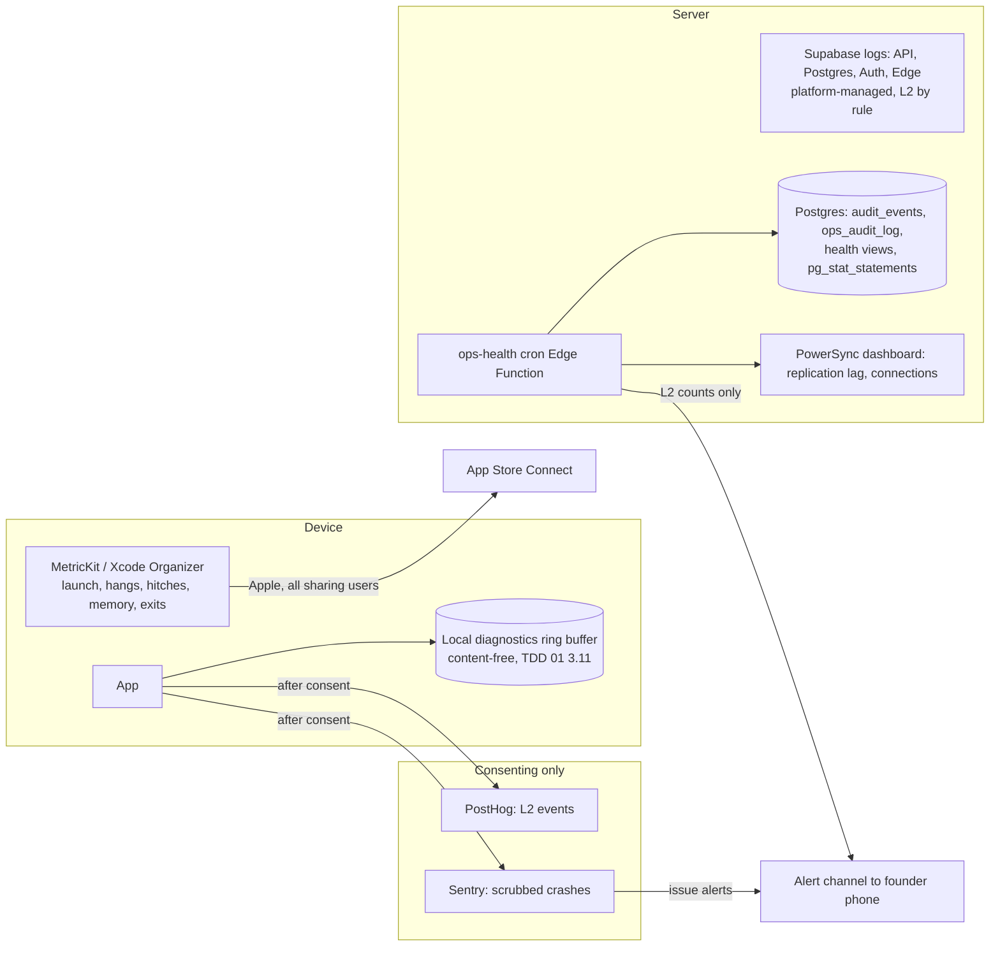

# TDD 06: Performance and reliability

Status: Draft for review, 3 Oct 2026. Persona: site reliability and performance engineer. Owner: founder (operator), with the data architect (TDD 02) and mobile engineer (TDD 01).
Inputs read: `CLAUDE.md`, `docs/prd/PRD.md` 1.2 (section 7), `docs/ARCHITECTURE.md`, ADR 0002, 0004, 0005, 0006, 0008, 0010, 0012, `docs/legal/ENGINEERING_REQUIREMENTS.md`, `docs/legal/DATA_CLASSIFICATION.md`, `docs/legal/DELETION_AND_EXPORT_SPEC.md`, `docs/legal/subprocessors.md`, `docs/analytics/TRACKING_PLAN.md`, `docs/BACKLOG.md`, `supabase/migrations/*`, `supabase/tests/perf.test.mjs`, `supabase/APPLY.md`, and TDDs 01 to 05 where they touch this area.

Evidence labels: **F** fact (read in the repo or on a page cited by an ADR), **A** assumption, **R** recommendation, **U** unverified (vendor behaviour or price not checked in this session), **E** estimate (arithmetic on F and A). Prices are list prices cited by ARCHITECTURE section 7 on 1 Oct 2026 unless marked U.

Privacy constraint that shapes every section: no entry text, transcript, audio or child name in any log, metric, crash report or alert (CLAUDE.md, LEGAL-REQ-014); person, book and letter ids are L3 and are not allowed in log streams either (DATA_CLASSIFICATION section 2, "Logging" row). Observability here is therefore built on enums, counts, durations, SQLSTATEs and random per-request ids, never on user ids.

---

## 0. Summary of findings

| # | Severity | Finding | Section |
|---|---|---|---|
| P-1 | **High** | A database restore followed by PowerSync's normal resync can **delete letters from every family device**: rows uploaded after the backup point are gone from the server, so the server stream removes them locally. RPO on paper is 24 h; in practice it would erase the newest letters everywhere. Needs a restore epoch and a reconcile-upload mode on the client before any non-founder data exists. | 6.3 |
| P-2 | **High** | Postgres echoes the failing row in error `DETAIL` ("Failing row contains (...)") for CHECK and NOT NULL violations. An over-length letter (`entries_final_text_length`, 20,000 chars) puts L4 text in Postgres logs and in the PostgREST error the app may forward to Sentry. | 5.4, conflict C-2 |
| P-3 | **High** | DATA_CLASSIFICATION bans L3 ids in Supabase API logs and in URLs, but supabase-js reads put ids in query strings (`?child_id=eq.<uuid>`) and Storage paths are `{child_id}/{author_id}/{entry_id}.jpg`. Supabase platform logs record request paths (U: exact fields and retention). The rule cannot be met as written; needs a counsel decision. | 5.4, conflict C-1 |
| P-4 | **High** | `perf.test.mjs` measures single-connection reads on 24-word synthetic letters with no `stt_meta` or `machine_edits`. Real rows are 10 to 50 times larger, the write path (immutability, version and audit triggers) is untimed, and nothing runs concurrently. Good regression guard; not evidence for PRD 7.2 or 7.8. | 9 |
| P-5 | **High** | The `uploadData` budget (50 ops, p95 800 ms at the client) only holds if inserts go as one bulk upsert and edits are batched. One PATCH per op is 50 sequential round trips (E: 2.5 to 5 s on LTE). | 3.2, 9 |
| P-6 | Medium | PowerSync concurrent-client cost is understated: PRD 7.8 targets 11k concurrent at 100k families; Pro includes 1,000, $30 per extra 1,000 (F, ADR 0004) = about $300/month, not the $60 in ARCHITECTURE section 7. | 4 |
| P-7 | Medium | Crash-free gates (PRD 7.5) are computed from consenting users only (about 40%, A). Use Xcode Organizer / App Store Connect crash rates as the gate source; Sentry is for diagnosis. | 2, 9 |
| P-8 | Medium | Full-text search GIN index (`entries_search_idx`) is global, not child-scoped. At 100k families a common-word query walks a large posting list before the child filter. Untested beyond 1k families. | 3.3, 9 |
| P-9 | Medium | Model file egress (574 MB per install) is missing from the cost model; on Supabase egress it is about $11k to $12k at 220k installs (E, agrees with TDD 03 C-8). | 4 |
| P-10 | Medium | No SLOs exist for playback, search, backup lag or deletion timing as user journeys; PRD 7.2 error budget "under 0.1% 5xx per endpoint class per day" is statistically meaningless at launch volume. | 2, 9 |

What is good and should be kept: offline-first design (capture, save, read and export never depend on the server, so most outages cost freshness, not data); plan-shape assertions in `perf.test.mjs` (catch the 2 ms to 200 ms index regression that matters most); the partial `entries_book_page_idx`; membership resolved once per query in `book_entries`; server-clock tombstones and the purge ledger; the zero-data-loss kill test (PRD 7.4) as a gate.

What is premature for v1 (R): multi-region or a warm standby; read replicas (revisit at 25k families or DB CPU above 60% sustained); a Prometheus/Grafana stack; distributed tracing and Sentry performance tracing; chaos testing beyond the scenarios in section 8; an on-call rotation (one founder, phone alerts); synthetic monitoring beyond one uptime check per public endpoint; self-hosted GPUs for ASR.

---

## 1. Scope and traceability

**In scope.** Service level objectives per user journey; API budgets at 1k, 10k and 100k families; capacity and cost; observability under the logging rules; backups and disaster recovery; load, soak and device performance testing; failure modes; review of existing budgets and tests; build plan.

**Out of scope (owned elsewhere).** Sync contract and schema (TDD 02); app boot design and screen budgets implementation (TDD 01); ASR model choice and transcription pipeline (TDD 03); keys, escrow, kill switches (TDD 04); consent, retention settings and the log canary design (TDD 05). This document sets targets and test gates for those and does not redesign them.

| Requirement | P | What this TDD adds | Section | State today |
|---|---|---|---|---|
| A-NFR-001, A-NFR-003, B-NFR-008, C-NFR-007, PRD 7.1 | P0 | Measurement method and production telemetry for device budgets | 7 | Budgets defined; no harness (BL-044 human) |
| PRD 7.2 | P0 | Per-endpoint p50/p95/p99, payload and rate limits at three scales | 3 | Budgets for classes only |
| PRD 7.3, DATA-REQ-043, -044 | P0 | Sync SLIs, freshness and backlog alerts | 2, 5 | No telemetry |
| PRD 7.4, DATA-REQ-048 | P0 | Kill-during-save test as a release gate; restore reconcile | 6, 8 | Not built |
| PRD 7.5 | P0 | Crash-free source of truth | 2, 7 | Sentry not wired (correct, BL-021) |
| PRD 7.7 | P0 | Battery, memory, storage measurement | 7 | Transcription budget Unverified |
| PRD 7.8 | P0 | Load and soak plan, gates at 2x 1k before launch | 8 | Not built |
| LEGAL-REQ-014, -017, DATA_CLASSIFICATION 2 | P0 | Log schema, scrubbing layers, two conflicts | 5 | Scrubber BL-021 ready to build; canary not built |
| LEGAL-REQ-031, DATA-REQ-036 | P0 | Deletion pipeline SLOs and alerts | 2, 5 | `purge_due` exists; worker not built |
| LEGAL-REQ-037, -038 | P0 / P1 | Which security signals are logs and which are audit rows | 5.5 | Partly in `audit_events` |
| LEGAL-REQ-040 | P0 | Kill switch propagation measured as an SLI | 2 | TDD 04 design |
| DATA-REQ-030, -031 | P0 / P1 | RPO and RTO per data class; drill | 6 | Not configured (BL-015) |
| DATA-REQ-046 | P0 | Integrity scrub as a reliability signal | 5.3 | Not built |
| C-NFR-002, C-NFR-004 | P0 | Entitlement latency SLO; fail-open check in load test | 2, 8 | TDD 02 webhook design |

---

## 2. SLOs, SLIs and error budgets per user journey

### 2.1 Principles (R)

1. **Durability is not an SLO with a budget.** "Letters lost or silently changed: zero, ever" (PRD 7.5, ARCH attribute 1) is an invariant. Any confirmed loss is a Sev 1 incident with a postmortem, whatever the error budget says.
2. **Device journeys are measured on the device, server journeys at the server.** The phone is the system of record for capture and save; the server cannot see failures that happen offline. Device SLIs come from three sources: consenting analytics events (L2, about 40% of users, A), App Store Connect / Xcode Organizer metrics (aggregate, all users who share diagnostics with developers), and the release-candidate device run (section 7).
3. **28-day rolling windows** with a minimum event count before a budget is judged (1,000 events; below that, every failure is reviewed by hand). Daily windows at launch volume are noise.
4. **Freshness SLOs only count online time.** A co-parent offline for a week is not a sync failure.

### 2.2 Journey SLOs

| Journey | SLI (good events / valid events) | Target (28 days) | Latency objective | Source | Gate |
|---|---|---|---|---|---|
| **Capture** | Recordings started that end as a saved letter, a kept draft, or a user discard (not an error) | 99.95% | Tap record to microphone live p95 500 ms (PRD 7.1) | `capture_started` vs `letter_saved` + `capture_discarded` + `error_shown{save_failed, mic_denied}`; device run | Latency yes; ratio watched |
| **Transcription** (on device) | Spoken letters with `transcription_completed{outcome: ok}` within 24 h of model availability | 99% | 2-min letter 30 s or less on iPhone SE 3 (PRD 7.7, U) | `transcription_completed` | Latency per TDD 03 |
| **Save** | Save attempts that commit row plus fsynced audio | 100% (invariant); alert on any `save_failed` | Local commit p95 200 ms (DATA-REQ-048) | `error_shown{save_failed}`; kill test (500 iterations, PRD 7.4) | Yes |
| **Sync upload** | Queued ops that reach the server or `rejected_writes` (never dropped) | 100% eventually; 99.9% within 5 min of connectivity | `uploadData` batch p95 800 ms, p99 2 s (PRD 7.2) | Server: PostgREST status per route template; device: `sync_failed{reason}` | Yes |
| **Sync freshness** | Co-parent online device shows a new letter | p95 5 s, p99 30 s (PRD 7.3) | as left | Load test probe (two synthetic clients); production: PowerSync replication lag as proxy | Yes |
| **Book load** | Book or chapter rendered from local data without error | 99.9% | Chapter of 60 letters p95 500 ms (PRD 7.1, not gate); switch child p95 300 ms (gate) | Device run; `error_shown{generic}` on book routes | Switch child yes |
| **Search** (new) | Local FTS query returns | 99.9% | Device FTS p95 150 ms over 5 years of letters (R, new); server search (web, later) p95 300 ms at client | Device run with year-5 fixture | No (R: gate once search ships) |
| **Playback** (new) | Play taps that start audio | 99.5% local; 99% backed-up | Local file first audio p95 300 ms (R); backed-up file first audio p95 2 s on LTE including signed URL, download start and decrypt of the first chunk (R) | Device run; `error_shown{generic}` on listen routes (R: add `playback_failed{source}` to catalogue) | No |
| **Backup** (new) | Recordings with backup on that are confirmed in Storage (sha256 verified) | 99% within 24 h of save on Wi-Fi; 100% eventually | Upload start p95 1 s (PRD 7.2) | Server: `audio_blobs` rows vs device count (aggregate only) | No |
| **Deletion** | Author deletes hidden from members within one sync | p95 60 s online (PRD 7.3) | | Load-test probe | Yes |
| | Tombstones purged by day 31; account requests completed by day 31; processors called within 24 h of hard delete | 100% (legal SLA, DATA-REQ-036) | | Health query (5.6): count of tombstones older than 31 days not held = 0; requests `executing` over 7 days = 0 | Yes (page) |
| **Entitlement** | Store success to client sees Plus | p95 5 s, p99 10 s (C-NFR-002) | | Edge Function duration; RevenueCat event timestamp to row `updated_at` | Yes |
| **Kill switch** | Switch flip to effect on all clients | 100% within 5 min (LEGAL-REQ-040) | | Staging drill per release | Yes |
| **Stability** | Crash-free sessions 99.8%; crash-free users (7 day) 99.5% (PRD 7.5) | | | **App Store Connect / Xcode Organizer** as gate source (all sharing users); Sentry (consenting) for stack traces | Yes |

### 2.3 Server availability and error budgets

| Surface | SLO (28 days) | Budget | Notes |
|---|---|---|---|
| Write RPCs and `uploadData` (PostgREST) | 99.9% non-5xx, excluding `429` and client `4xx` | 0.1%: about 40 failed requests per 40k (E at 1k families) | Retries hide most failures from users; the budget protects against silent server bugs |
| Read RPCs | 99.9% | 0.1% | |
| Auth token exchange | 97% success per method weekly (A-NFR-013) | 3% | Includes user abandonment; split server errors from user errors in the SLI |
| Edge Functions (light) | 99.5% | 0.5% | Cold starts and platform incidents (U: Supabase Pro has no published uptime SLA; verify before quoting one) |
| Server transcription gateway (consented) | 99% | 1% | Fallback chain Groq then DeepInfra (ADR 0002); the audio stays on the phone on failure |

**Error budget policy (R).** Budget more than 50% spent in 7 days: feature work on that path stops until a fix ships. Budget exhausted: release freeze for that surface except fixes. Vendor-wide incidents count against the budget (users feel them) but trigger a vendor review, not a freeze. Any durability incident, any L3/L4 log leak, or any deletion SLA miss is Sev 1 regardless of budget.

**Severity levels (R).** Sev 1: data loss, privacy leak, deletion SLA breach, sign-in down for all. Sev 2: sync or backup down more than 1 h, crash-free below gate, purchase failures over 5%. Sev 3: degraded latency, single-feature failures. The founder is the only responder in v1; Sev 1 and 2 page the phone, Sev 3 is a daily email digest.

---

## 3. API performance budgets

### 3.1 Scale assumptions (A, from PRD 7.8 and ARCH section 7)

| Input | 1k families | 10k families | 100k families |
|---|---|---|---|
| MAU (2.2 per family) | 2.2k | 22k | 220k |
| Letters per month (20 per family) | 20k | 200k | 2M |
| Average letter write rate | 0.008/s | 0.08/s | 0.77/s |
| Evening peak (10x average, 15 min) | 0.08/s | 0.8/s | 7.7/s |
| PRD 7.8 test load (kept as the gate; 6.5x to 65x headroom covers reconnect storms) | 5/s | 15/s (interpolated, R) | 50/s |
| Concurrent sync clients (5% of MAU at peak; PRD uses 200 at 1k) | 200 | 1.1k | 11k |
| Letters in DB after 12 months at that size (240 per family) | 240k | 2.4M | 24M |
| Audio minutes per month (40 per family) | 40k | 400k | 4M |

### 3.2 Per-endpoint budgets

Latency is measured at the client (US, good LTE) unless marked "server", consistent with PRD 7.2 and TDD 02 section 4. The same p95/p99 must hold at all three scales; the "server time" column is what the database or function may spend so the client budget survives one LTE round trip (A: 80 to 150 ms). Rate limits are per user unless stated; Supabase PostgREST has no built-in per-user rate limiter (U), so limits are enforced in RPCs, Edge Functions or not at all, as marked.

| Endpoint / query | Class | p50 / p95 / p99 (client) | Server time p95 | Payload cap | Rate limit | Notes at 10k / 100k |
|---|---|---|---|---|---|---|
| `signInWithIdToken`, `verifyOtp` | Auth | 600 ms / 1.5 s / 3 s | 400 ms | 4 KB | Supabase Auth limits (U: defaults) plus 5 codes per email per hour (A-REQ) | GoTrue scales with compute; no change expected |
| PowerSync initial sync, book list | Sync | 3 s / 10 s / 20 s (PRD 7.3) | n/a | n/a | PowerSync plan | One year of text about 2.4 MB at realistic rows (E, 3.4) |
| PowerSync one year of text (240 letters) | Sync | 10 s / 30 s / 60 s | n/a | about 10 KB per letter row (E) | | 5-year families (1,200 letters, about 12 MB) need p95 60 s (R, new budget) |
| `uploadData` batch, up to 50 ops | Write | 300 ms / 800 ms / 2 s | 250 ms per batch | 256 KB (TDD 02) | 60 batches per user per minute (A, enforce in client; server limit U) | Requires batching design below |
| Single entry upsert (insert path with triggers) | Write | 150 ms / 400 ms / 1 s | 15 ms (R, to measure, 9) | 60 KB worst row | as above | Trigger cost constant per row |
| `delete_entry`, `restore_entry` | Write RPC | 150 / 500 ms / 1.2 s | 20 ms | 1 KB | 120 per user per hour | |
| `create_child`, `create_child_invite`, `accept_child_invite`, `review_family_letter`, `leave_child` | Write RPC | 200 / 500 ms / 1.2 s | 30 ms | 2 KB | 20 invites per parent per day (B-NFR-004), 120 others per user per hour | |
| `policy_actions_needed`, `record_policy_act` | Read / write RPC | 100 / 300 ms / 800 ms | 10 ms | 512 B context | 60 per user per hour | Called on launch after first frame; never blocks |
| `book_entries` page (60 letters), web reader later | Read | 120 / 300 ms / 800 ms | 15 ms (PGlite budget) / 10 ms on Supabase (R) | 60 rows, about 120 KB (E, 2 KB final text each) | none (RLS-bounded) | Plan must stay index-only per child; verify at 10k (task R-03) |
| `book_entries` full book | Read | 300 / 800 ms / 2 s | 25 ms | about 0.5 MB per year of letters (E) | none | App does not call it (local DB); web export only. Paginate over 1,000 rows (R) |
| Server search (web, later) | Read | 150 / 300 ms / 800 ms | 12 ms | 50 ids | 30 per user per minute (R, in RPC) | **Risk P-8**: GIN posting lists grow with all families; see 3.3. Query text in the POST body, never the URL (LEGAL-REQ-014) |
| `invite-redeem`, `escrow-unwrap`, notice calls | Edge, light | 300 / 600 ms / 1.5 s (cold start included) | 200 ms warm | 1 KB | 10 per device per hour (invites); 100 unwraps per child per hour then refuse and alert (LEGAL-REQ-023) | Cold-start distribution U; measure in S9 |
| AI gateway transcription (consented) | Edge, heavy | 2 s / 4 s / 10 s for 2 min audio | provider time + 300 ms | 25 MB (Groq free tier file limit, F ADR 0002); 2 min AAC 64 kbps = 0.96 MB (E) | 30 per user per day (R); global spend breaker (kill switch, LEGAL-REQ-040) | Provider rate limits U; DeepInfra second in chain |
| Storage signed upload (encrypted audio) | Storage | first byte 400 ms / 1 s / 2.5 s | n/a | 25 MB ciphertext; typical 1 MB | 10 per second globally at 100k (PRD 7.8); 200 per user per day (R) | Resumable (TUS) uploads for files over 6 MB (U: Supabase threshold) |
| Storage download (backed-up audio) | Storage | first byte 300 ms / 1 s / 2.5 s | n/a | 1 MB typical | 500 per user per hour (R; above it, alert as mass download, LEGAL-REQ-038) | Egress cost line, section 4 |
| `rc-webhook` | Edge | entitlement row p95 5 s, reconcile p99 60 s | 300 ms | 64 KB | shared secret; 300 per minute at 100k | Idempotent by event id |
| `purge_due` (cron hourly) | Job | one call under 10 s with `p_limit 500` (TDD 02 4.1) | | | | Loop until zero, max 10 calls |
| `purge-worker` | Job | one run under 150 s (TDD 02) | | 1,000 objects per run | | At 100k families about 3k deleted letters per day (A: 5% of letters), well inside |
| Web contribution page | Web | LCP 2.5 s on 4G; 300 KB or less (B-NFR-008) | TTFB 600 ms on Vercel | | anonymous sign-in rate limit (U) | Static plus one RPC |

**Batching `uploadData` (R, closes P-5).** PostgREST accepts an array upsert to one table in one request (F, supabase-js `upsert([...])`), so group a batch as: one bulk upsert per table for inserts; edits grouped into one bulk upsert of full editable column sets per entry (TDD 02 already requires `final_text`, `machine_edits` and `edit_level` to travel together); RPC ops (`delete_entry`, `restore_entry`) last, sequentially. That keeps a typical batch at 2 to 4 round trips. If measurements in S1 miss the budget, add a `security invoker` RPC `apply_entry_ops(jsonb)` that applies an op list in one transaction under the caller's RLS; it must return per-op SQLSTATEs so `rejected_writes` still works per op (DATA-REQ-043). Do not build it before S1 says it is needed.

### 3.3 Database query budgets (server, existing perf test) and what changes with scale

| Query | PGlite p95 budget (F, APPLY.md) | Expected at 10k / 100k | Risk |
|---|---|---|---|
| `book_page`, `book_full` | 15 / 25 ms | Flat: `entries_book_page_idx` is per child and membership is resolved from `child_members_profile_idx` | Low |
| `letter_member`, `letter_author` | 4 / 4 ms | Flat (primary key) | Low |
| `search_common`, `search_rare` | 12 / 12 ms | **Unknown.** `entries_search_idx` is a plain GIN on `search` across all families. At 1k the planner can still choose the child index and recheck; at 100k (24M rows) a common word maps to millions of tuple ids. | Medium (P-8) |

R for search: (1) the app searches its local FTS only (ARCH section 5), so server search exists only for the web reader (Phase 1.x) and is not a launch path; (2) before the web reader ships, run R-03 at 10k and 100k-equivalent row counts; (3) if the plan degrades, replace with a composite index on `(child_id, search)` using `btree_gin` (U: extension availability on Supabase; it is a standard contrib module) or a per-child `tsvector` query that forces the child index first. Do not change it now.

### 3.4 Row size reality (E)

A 2-minute letter is about 300 words: `raw_transcript` and `final_text` about 1.8 KB each, `search` tsvector about 1.5 KB, `machine_edits` about 0.5 KB, `stt_meta` with per-token timestamps about 300 tokens x 40 bytes = 12 KB of JSON before TOAST compression (A: about 4 to 6 KB compressed). With indexes and one `entry_versions` row on average, about 10 KB per letter. The perf test seeds about 0.9 KB per letter (F: 354 MB for 400k rows). So:

| | 1k | 10k | 100k |
|---|---|---|---|
| Letters after 12 months | 240k | 2.4M | 24M |
| Database size (10 KB per letter plus 20% other tables) | about 3 GB | about 29 GB | about 290 GB |

That is about twice ARCHITECTURE's 150 GB at 100k (it did not count `stt_meta`). R: decide in TDD 02/03 whether per-token timestamps belong in Postgres at all (they are author-only working material and could stay on the device plus the export); if they move out, the 100k figure drops to about 120 GB.

---

## 4. Capacity and cost model

### 4.1 Storage growth for audio (AAC-LC mono 64 kbps, ADR 0005)

0.48 MB per minute (F, arithmetic in ADR 0005); 40 minutes per family per month (A) = 19.2 MB per family per month recorded on phones. Server storage holds only backed-up audio. ARCHITECTURE assumes 50% of families back up; since backup is part of Plus (PRD 7.8 "Plus backup"), 50% is conservative (A: a 10 to 20% Plus share would cut these figures by 60 to 80%).

| | 1k | 10k | 100k |
|---|---|---|---|
| Backed-up audio added per month (50%) | 9.6 GB | 96 GB | 960 GB |
| Cumulative after 12 months at that size | 115 GB | 1.15 TB | 11.5 TB |
| Storage cost after 12 months ($0.0213/GB over 100 GB included, F) | about $0.30 | about $22 | about $243, growing about $20/month |
| On-device per family per year (all audio) | 230 MB | | |

### 4.2 Egress

| Driver | Volume per month at 100k (E) | Cost at $0.09/GB over 250 GB included (F) |
|---|---|---|
| Family members playing backed-up recordings (K-33: family hear audio only via backup), each file downloaded once per other member device (1.2 on average, A) and cached | about 1.15 TB | about $81 |
| New-phone restores (5% of members per year restore their full history, A) | about 0.1 TB | about $9 |
| Sync of text via PowerSync | billed by PowerSync, not Supabase | see 4.3 |
| **Speech model download if hosted on Supabase** (574 MB per install; 220k installs plus reinstalls) | about 126 TB once, then about 10 TB/month at 8% monthly new installs (A) | **about $11k once, then about $900/month.** R: host on a free or zero-egress host with pinned revision and sha256 (TDD 03 OQ-3); it is a new processor that sees device IPs (data-map row, L3 at host) |
| Web reader (Phase 1.x) | not modelled | |

At 1k and 10k families egress stays inside the 250 GB allowance except the model download (1k: 2.2k installs x 0.574 GB = 1.3 TB, about $100 once on Supabase, E).

### 4.3 Monthly run-rate (E)

| Line | 1k | 10k | 100k | Basis |
|---|---|---|---|---|
| Supabase Pro base | $25 | $25 | $25 | F |
| Supabase MAU over 100k | $0 | $0 | $390 | 120k x $0.00325 (F) |
| Supabase compute | $0 (credits cover Micro, U) | $50 to $110 (Small/Medium, U) | $200 to $400 (Large/XL, U) | Working set: 3 / 29 / 290 GB DB; size by load test, not by guess |
| Supabase DB disk over 8 GB | $0 | about $3 | about $35 | 3.4 sizes x $0.125/GB (F) |
| Supabase Storage | $0 | $22 | $243 | 4.1 |
| Supabase egress | $0 | $0 | $90 | 4.2 (model hosted elsewhere) |
| PITR (when turned on, TDD 02: after 1,000 paying families) | $0 | about $100 (U) | about $100 to $400 (U, scales with compute) | DATA-REQ-030 window 7 days |
| PowerSync | $0 to $49 | $49 + 1 x $30 = $79 | $49 + 10 x $30 + sync GB over 30 (about 44 GB, $14) = **about $360** | F prices; P-6 |
| Server ASR fallback (20% of minutes, A; only consenting users) | Groq $5 / DeepInfra $2 | $53 / $16 | $533 / $160 | 8 min x F prices |
| LLM edit pass | $0 (off at launch, PRD 2.2) | $0 | $0 | ADR 0012: rules only |
| PostHog | $0 (130k events < 1M free, F) | $0 to low tens (1.3M events, U) | 13M events: **U**, order of a few hundred dollars a month at paid tiers (not verified; open the pricing page before budgeting) | Founder accepted the volume (PRD K-01) |
| Sentry | $0 Developer or $26 Team | $26 | $26 + overage (U) | 88k consenting users x 20 sessions x 0.2% crash = about 3.5k crash events/month (E), inside 50k |
| Uptime and alert channel | $0 (free tier, U) | $0 to $20 | $20 | 5.6 |
| Vercel (web) | $20 (U, Pro) | $20 | $20+ | ADR 0010 |
| Second-provider ciphertext copy (OQ-4, Phase 1) | about $2 | about $20 | about $200 + egress out of Supabase for the nightly copy (about $86, E) | R in 6.2; provider U |
| **Total (excluding model hosting, PITR)** | **about $100 to $150** | **about $300 to $450** | **about $2.3k to $3.1k** | ARCH said $1.8k to $2.4k at 100k; the gap is PowerSync concurrency, DB size and the backup copy |

**Cost guardrails (R).** Spend caps and billing alerts at 150% of the month's model in every console (Supabase spend cap off only deliberately; U whether Supabase allows a cap with Storage overage); a gateway-level daily spend breaker for ASR (kill switch flag `ai_gateway_enabled`, LEGAL-REQ-040); a monthly 15-minute cost review against this table (task R-14).

---

## 5. Observability design

### 5.1 Signal sources



| Source | Who it covers | Level | What it answers | Retention |
|---|---|---|---|---|
| App Store Connect / Xcode Organizer (MetricKit aggregates) | Users who share analytics with developers in iOS settings (Apple's consent) | L2 aggregate | Crash rate (gate source, P-7), launch time histograms, hang rate, disk writes, memory, battery | Apple-managed |
| Sentry (mobile) | Consenting users (LEGAL-REQ-003; TDD 01 gates Sentry on the analytics switch) | L2 after scrubbing | Stack traces, release health | 90 days (LEGAL-REQ-033) |
| PostHog | Consenting users | L2 | Journey SLIs in 2.2 (`capture_started`, `letter_saved`, `transcription_completed`, `sync_failed`, `error_shown`, `app_cold_start{ttfi_bucket}`) | 12 months |
| Local diagnostics ring buffer (TDD 01) | Everyone, stays on phone; user can attach to a support request | L2 | Unclean exits, queue depth, last sync error SQLSTATE, model state | On device, capped |
| Supabase logs | All server traffic | Should be L2; see conflicts C-1, C-2 | 5xx, latency, auth failures | Platform plan (U: Pro log retention; DELETION spec OQ-5) |
| Postgres health views | All | L2 counts | Purge backlog, deletion requests stuck, storage queue, replication slot size, top queries | n/a |
| PowerSync dashboard | All | L2 | Replication lag, concurrent connections, sync volume | Vendor |
| `audit_events`, `ops_audit_log` | All | L3 (ids), in the database only | Security events per account (LEGAL-REQ-037) | 12 to 24 months |

Not in v1 (R): Sentry performance tracing (spans capture request URLs with L3 ids and add a second scrubbing surface; startup is measured by MetricKit and `app_cold_start` instead); session replay (banned, ADR 0008); Supabase log drains to a third party (new processor, more L3 exposure).

### 5.2 Logging rules by level (applied)

| Level | Edge Function and Vercel logs | Sentry (mobile and server) | Metrics and alerts | Device diagnostics |
|---|---|---|---|---|
| L1 | Allowed | Allowed | Allowed | Allowed |
| L2 | Allowed: route templates, enums, SQLSTATE, HTTP status, durations, counts, provider and model ids, token counts, random per-request id | Allowed | Allowed | Allowed |
| L3 (profile, child, entry ids, emails, object paths, IPs) | **Never** (DATA_CLASSIFICATION 2). Correlate through a random `req_id`; if an operator needs the account, they look it up through an audited runbook (LEGAL-REQ-025) | Never: `sendDefaultPii: false`, no `setUser`, ids replaced by `<id>` | Never; alerts carry counts | Never |
| L4 (letter text, transcripts, audio, child name, dates, dictionary, tokens, keys) | Never | Never | Never | Never |

### 5.3 Structured log schema (Edge Functions and scripts)

One typed logger in a pure-TS module (R: `packages/analytics/src/ops-log.ts`, beside the scrubber from BL-021, so the same tests guard both):

```ts
type OpsLog = {
  ts: string;                 // ISO time
  fn: 'invite-redeem' | 'escrow-unwrap' | 'ai-gateway' | 'rc-webhook' | 'purge-worker' | 'notice-scheduler' | 'ops-health' | 'export-job';
  version: string;            // function build
  req_id: string;             // random per request, never derived from a user
  route: string;              // template only, e.g. 'POST /ai/transcribe'
  outcome: 'ok' | 'client_error' | 'server_error' | 'refused' | 'retry';
  status?: number;
  sqlstate?: string;          // 5 chars, e.g. 'SCTMB'
  duration_ms: number;
  counts?: Record<'rows' | 'objects' | 'retries' | 'tokens_in' | 'tokens_out' | 'audio_ms', number>;
  provider?: 'groq' | 'deepinfra' | 'cloudflare' | 'revenuecat' | 'apple' | 'posthog';
  cold_start?: boolean;
};
```

No free-form `message` field. Exceptions are logged as `{name, sqlstate}` only; `error.message`, `details`, `hint` and stack frames with argument values are dropped. A unit test feeds the Asha fixtures (letter text, child name, dictionary words, tokens, a UUID, an email) through every logger path and asserts none survive (extends the log canary, LEGAL-REQ-014). `console.*` is banned in functions by lint, as TDD 01 bans it in the app.

### 5.4 Scrubbing layers and two conflicts

Defence in depth, each layer tested on its own:
1. **Types**: the logger and `track()` accept only typed L2 fields.
2. **Runtime redaction** (BL-021 `scrubEvent`, `scrubBreadcrumb`, extended): drop HTTP bodies and query strings; replace UUIDs, emails and JWT-shaped strings with placeholders; drop any string over 40 characters; navigation breadcrumbs use route templates (`/letter/[id]`), never resolved paths; **PostgREST and Postgres errors keep only `code` (SQLSTATE) and HTTP status**, dropping `message`, `details` and `hint` (closes the Sentry half of C-2).
3. **Server-side settings**: Sentry "prevent storing IP", data scrubbing with extra fields (subprocessors.md item 4); PostHog discard IP.
4. **Log canary** (LEGAL-REQ-014, TDD 05 9.x): the E2E suite at debug level, then scan every log stream for the Asha fixtures; R: add a **UUID canary** (fixture ids must not appear in Edge Function, Vercel or Sentry output) and an **oversize-letter case** (a 20,001-character fixture letter uploaded, then Postgres logs scanned).

**Conflict C-1 (High): L3 ids in Supabase platform logs and URLs.** DATA_CLASSIFICATION section 2 says L3 is "not in log streams (Supabase API, Edge Function, Vercel, Sentry)" and "never in paths or query strings". Facts: supabase-js `select().eq('child_id', x)` sends `GET /rest/v1/...?child_id=eq.<uuid>`; Storage objects are addressed by `{child_id}/{author_id}/{entry_id}.jpg` (DATA-REQ-047 requires the id prefix); Supabase's API gateway logs record request paths, and possibly JWT claims and client IPs (U: exact fields and retention on Pro). We control neither the gateway log schema nor its retention. Options: (a) counsel accepts processor-managed platform logs holding L3 under the Supabase DPA with the shortest retention available, recorded in the data map; (b) move app reads that are not sync (most reads are PowerSync streams, which carry no ids in URLs) to POST RPCs so ids sit in bodies, and request Storage objects through short-lived signed URLs (the path is still in the URL); (c) opaque random object keys, which breaks the DATA-REQ-047 prefix rule. **R: (a) plus (b) for the few REST reads; keep (c) out.** Owner: privacy counsel and data architect. Until decided, the rule as written cannot pass an honest audit.

**Conflict C-2 (High): Postgres echoes failing rows.** For CHECK and NOT NULL violations Postgres adds `DETAIL: Failing row contains (...)` with every column value, and unique violations add `Key (id)=(...)`. On `entries` that is letter text (L4) in the Postgres log and in the PostgREST error body returned to the app. Triggers fire: `entries_final_text_length` (over 20,000 chars), `entries_raw_length`, the `kind`/`capture_mode` checks. **R**: (1) the app validates lengths and enums before enqueueing (TDD 01 store); (2) a migration adds a `BEFORE INSERT OR UPDATE` trigger on `entries` (and other content tables) that checks the same limits and raises a custom SQLSTATE with a fixed message and no values, so the CHECK constraint never gets to fire (BEFORE triggers run before constraint checks, F Postgres semantics); (3) ask Supabase whether `log_error_verbosity = terse` can be set on the project (U), which drops DETAIL from logs; (4) the Sentry rule in layer 2. Owner: data architect (migration), SRE (canary case).

**Other conflicts and notes.**
- C-3: LEGAL-REQ-037 asks for "Storage bulk reads and signed-URL creation counts per account" and "RLS-denied spikes". Per-account counts are L3 and belong in a database table, not log streams. RLS on SELECT filters rows silently and raises nothing, so read denials are unobservable; only write denials (`42501`) can be counted. R: signed-URL issuance and download counts per account go to a daily `security_counters` table (L3, service role only, 12 months) written by the Edge Function that issues URLs; LEGAL-REQ-037 wording should say "write denials". Owner: security (TDD 04).
- C-4: PRD 7.5 crash gates from consenting users only (P-7). R in 2.2.
- TDD 05 X-21 (Sentry has no user context, so deletion relies on retention) is agreed; a test asserts `setUser` is never called.

### 5.5 Metrics catalogue (server, L2)

Computed by SQL views and read by `ops-health`; no person ids leave the query.

| Metric | Query source | Why |
|---|---|---|
| `tombstones_overdue` | `entries` and `children` with `deleted_at < now() - 31 days` not held | DATA-REQ-036 (page) |
| `deletion_requests_stuck` | `deletion_requests` `executing` over 7 days | DATA-REQ-036 (page) |
| `storage_purge_backlog` | `storage_purge_queue` not done, oldest age | Worker health |
| `purge_last_run_age` | `audit_events` action `purge_run` max(at) | Cron alive |
| `replication_slot_bytes` | `pg_replication_slots` with `pg_wal_lsn_diff` | PowerSync lag; disk fill (TDD 02 FM5, alert at 1 GB) |
| `db_size_bytes`, `largest_tables` | `pg_database_size`, `pg_total_relation_size` | Capacity, 3.4 |
| `top_queries` | `pg_stat_statements` mean and total time, calls (query text is parameterised; R: confirm no literals appear, U) | Regressions |
| `rejected_writes_reported` | Count from devices' `sync_failed` events (consenting) | Sync contract health |
| `escrow_unwraps_per_hour` (max per child, count only) | `ops_audit_log` | LEGAL-REQ-023 |
| `webhook_lag_p95` | RevenueCat event time to entitlement `updated_at` | C-NFR-002 |
| `backup_confirmations_daily` | `audio_blobs` inserts per day | Backup SLO |
| `ai_gateway_spend_daily` | token and audio-second counts by provider | Cost breaker |

### 5.6 Alerts (R)

`ops-health` runs every 5 minutes (Supabase cron calling an Edge Function, or `pg_cron` plus `pg_net`, U which is simpler on Pro). It sends L2-only messages to one alert channel. Channel choice is a new processor decision (Sentry alerts and crons already exist under its DPA and are the default R; an SMS or push service needs a data-map row). One external uptime check per public endpoint (API health, web page, invite-redeem) from a free monitor (U).

| Alert | Condition | Severity | Runbook |
|---|---|---|---|
| Deletion SLA at risk | `tombstones_overdue > 0` or `deletion_requests_stuck > 0` | Sev 1 | RB-1 |
| Purge cron silent | `purge_last_run_age > 2 h` | Sev 2 | RB-1 |
| Replication slot growing | `replication_slot_bytes > 1 GB`, page at 5 GB | Sev 2 / Sev 1 | RB-2 |
| PostgREST 5xx | over 1% for 10 minutes with 100+ requests | Sev 2 | RB-3 |
| Auth failures | success under 90% for 30 minutes | Sev 2 | RB-3 |
| Escrow unwrap anomaly | any child over 100 per hour (LEGAL-REQ-023) | Sev 1 | RB-5 (TDD 04) |
| Mass download | any account over 500 Storage downloads per hour | Sev 1 | RB-5 |
| Crash spike | Sentry new issue in release with 20+ users, or crash-free sessions under 99.5% for 24 h | Sev 2 | RB-4 |
| Webhook lag | `webhook_lag_p95 > 60 s` for 30 minutes | Sev 2 | RB-6 |
| Spend | ASR daily spend over 3x the 7-day average | Sev 3 (auto-breaker at 5x) | RB-7 |
| Disk | DB disk over 80% of provisioned | Sev 2 | RB-2 |
| Uptime | public endpoint down 3 checks in a row | Sev 2 | RB-3 |

### 5.7 Runbooks (to write in `docs/runbooks/`, task R-16)

| ID | Title | Core steps |
|---|---|---|
| RB-1 | Deletion pipeline behind | Check cron, run `purge_due(p_limit)` loop by hand, check worker logs by `req_id`, check holds, record an audit row |
| RB-2 | Replication slot or disk growth | Check PowerSync status; if PowerSync is down over 12 h, decide with TDD 02 FM5 whether to drop and recreate the slot (clients resync); never let disk fill |
| RB-3 | API errors or outage | Check Supabase status page, recent migration or deploy, `top_queries`; roll back the function or migration; post the in-app status line (no promises of times) |
| RB-4 | Crash spike | Halt phased release in App Store Connect; EAS Update rollback for JS-only regressions (TDD 01 OTA policy); never ship an update mid-recording |
| RB-5 | Suspected data exposure | Kill switches (LEGAL-REQ-040), affected-user enumeration (LEGAL-REQ-039), counsel |
| RB-6 | Entitlement lag | Run reconcile job; entitlement never gates core (LEGAL-REQ-050), so no user loses access to their book |
| RB-7 | AI spend | Flip `ai_gateway_enabled` off; on-device path continues; audio waits locally |
| RB-8 | Database restore | Section 6.3, including the reconcile epoch |

---

## 6. Backups and disaster recovery

### 6.1 RPO and RTO per data class

| Data | Where the copies are | RPO (launch) | RTO | Notes |
|---|---|---|---|---|
| Audio, Free plan or backup off | The author's phone only (F, K-33) | Device loss = loss of what was not exported | n/a | Honest copy already says so (`settings.recordings.onPhoneBody`). R: an export reminder in Settings, never a fear prompt (content rules) |
| Audio, backup on | Phone + Supabase Storage ciphertext | Phone: 0. Storage: no backup of Storage exists (F, DATA-REQ-030); object loss at the provider is unrecoverable without a second copy | Restore to a new phone: p95 background, resumable (PRD 7.3) | R: second-provider ciphertext copy, nightly, 35-day versioning (DELETION spec OQ-4) before backup ships to Plus users. Ciphertext only; new processor row |
| Letter text and metadata | Author devices, co-member devices (book letters), Postgres, PowerSync bucket storage | Postgres: 24 h (daily backup, PITR off at launch, TDD 02). Effective: 0 for letters still on any device **only if** 6.3 is built | 4 h (DATA-REQ-031) for a database under about 50 GB (A: restore time scales with size; U at 290 GB) | Turn PITR on at 7 days with the TDD 02 trigger (1,000 paying families): RPO about 2 min (U) |
| Child content keys (CCK) | iCloud Keychain, escrow-wrapped copy in Postgres, member grants | As Postgres | as Postgres | Wrapped keys restore with the database |
| **Escrow key** (Edge Function secret) | Supabase secret store only | **Must be 0.** Losing it makes every Standard-mode backup unreadable on a new phone without iCloud Keychain | Minutes | R: sealed offline copy in two places (password manager plus printed sealed envelope), rotation procedure tested in staging (TDD 04 owns the key; this is the DR requirement) |
| Consent pepper (`app.consent_pepper`) | Database setting (F, APPLY.md step 6) | Restores with the database | | Also in the password manager (APPLY.md says so) |
| Policy documents, migrations, content | Git | 0 | Minutes | |
| Ops ledger (`ops-ledger` bucket) | Storage | Not in backups (F) | | R: copy the ledger with the second-provider job; replay needs it (DATA-REQ-030) |

Region outage (us-west-1) is accepted in v1 (R): capture, save, read, playback of local audio and export keep working offline; sync resumes. Multi-region is premature.

### 6.2 Vendor and component failure

| Component down | User impact | Data risk | Response |
|---|---|---|---|
| Supabase (API, Auth) | No sign-in, invites, uploads; app otherwise works | None (queue persists, PRD 7.4) | RB-3; status line in app |
| PowerSync Cloud | Co-parents do not see new letters; uploads still succeed (they go through Supabase, F ADR 0004) | Replication slot grows (5.6) | RB-2 |
| Storage only | Backup and family playback of backed-up audio pause | None for local copies | Attachment queue retries (ADR 0004) |
| AI providers | Consented server transcription waits; on-device path unaffected | None | Fallback chain, then queue |
| RevenueCat | Purchases and restore fail; core free features unaffected (C-NFR-004) | None | 7-day cached entitlement (TDD 02) |
| PostHog / Sentry | No product or crash data | None | Nothing blocks on them (A-NFR-002) |
| Model host | New installs cannot download the speech model; typed letters and audio capture work (PRD 7.4) | None | Second mirror URL in the manifest (TDD 03), sha256 checked |
| Apple push | Reminders are local notifications (C), unaffected | None | |

### 6.3 The restore problem (P-1) and the fix

**Scenario.** Postgres is restored to time T (corruption, a bad migration, or an operator error). Every letter uploaded after T is gone from the server. PowerSync re-replicates from the restored database (TDD 02 OQ-B11 assumes a full resync). Devices whose upload queue already drained hold those letters as synced rows; the new server state does not contain them, so the sync engine removes them locally (A: standard PowerSync bucket semantics, where the server is the source of truth for downloaded rows; U: verify exact behaviour in the first drill). The newest letters, and on co-parents' phones, the newest family letters, disappear. This breaks attribute 1 on the one day it matters most.

**Fix (R), designed with TDD 01 and 02.**
1. A server value `restore_epoch` (single row, L2) delivered in the user's `me` stream and returned by `policy_actions_needed`.
2. Before reopening the project after a restore, the operator bumps `restore_epoch` and records T (RB-8), after the ledger replay (DATA-REQ-030) so purged letters stay purged.
3. A client that sees a new epoch **pauses downloads that delete rows**, then re-uploads every local row it authored with `updated_at` or `synced_at` later than T minus 1 hour (idempotent upsert by UUIDv7 id, DATA-REQ-044; immutable columns are identical so `SCIMM` cannot fire), plus its tombstones; only then resumes normal sync. Letters authored by others that the device holds are re-uploaded by their authors' devices; if an author's device is gone, the co-member's copy is kept locally and marked "waiting for its author" rather than deleted (R: open question OQ-6 on whether a co-member device may re-upload another author's letter; RLS forbids it today, correctly).
4. Raw transcript hashes (`raw_sha256`) let the server verify re-uploaded text matches what it once held (DATA-REQ-046).
5. The quarterly drill (DATA-REQ-031) restores to a scratch project, runs this reconcile with two synthetic Asha devices, and checks that zero letters are lost.

Until this ships, R: do not restore production to an earlier point while non-founder families exist; prefer forward fixes (APPLY.md already prefers fix-forward).

### 6.4 Drill cadence

| Drill | Cadence | Pass |
|---|---|---|
| Database restore to scratch project, ledger replay, reconcile with two synthetic devices | Quarterly (DATA-REQ-031) | RPO observed 24 h or less (0 after reconcile), RTO 4 h or less, `rls.test.mjs` and `data_governance.test.mjs` pass on the restored copy, `raw_sha256` sample matches |
| Second-provider ciphertext restore of 100 objects | Quarterly, once built | sha256 match |
| Escrow key recovery from the sealed copy in staging | Yearly | Unwrap succeeds |
| Kill switches (LEGAL-REQ-040) | Every release candidate | Effect within 5 min |

---

## 7. Mobile performance

Budgets are PRD 7.1 and 7.7; TDD 01 owns the boot design that meets them. This section defines how they are measured, in the lab and in production, without content leaving the phone.

### 7.1 Reference devices and fixtures

- iPhone SE (3rd gen, 4 GB RAM, A15) for budgets; a current iPhone for regressions; Android mid-tier 60 Hz when Android ships (PRD 7).
- **Year-1 and year-5 fixtures (R, new):** synthetic Asha books with 240 and 1,200 letters, 230 MB and 1.15 GB of audio, 2 children, 4 members. Durability is an 18-year promise; the app must stay fast with years of data, so cold start, book render, switch child, search and export are measured on both fixtures.

### 7.2 What is measured and how

| Metric | Budget | Lab method (release-candidate run, 200 samples unless noted) | Production signal |
|---|---|---|---|
| Cold start to first interactive frame | p50 1.2 s, p90 2.0 s (gate) | `perf` build profile (TDD 01): native process-start timestamp to first `onLayout` of the first route, scripted relaunch loop on SE 3; Xcode Instruments App Launch for investigations | MetricKit launch histogram in Xcode Organizer; `app_cold_start{ttfi_bucket}` (consenting) |
| Warm start | p50 400 ms (gate) | Same harness, background then foreground | Organizer resume time |
| Screen transitions | start within 100 ms, complete within 350 ms, no frame over 16.7 ms on the UI thread (gate) | Instruments Animation Hitches template on scripted navigation; Reanimated runs on the UI thread | MetricKit hitch time ratio (R target under 5 ms/s) |
| Tap record to mic live | p95 500 ms (gate) | Marker at tap to first non-zero meter callback | none (lab only) |
| Local save commit | p95 200 ms (gate) | Marker around the transaction including fsync of audio and row commit (`synchronous=FULL`, TDD 01) | `error_shown{save_failed}` |
| Kill during save | zero loss in 500 iterations (gate) | Scripted `kill -9` at random offsets during save on Simulator plus 50 on device; then `PRAGMA integrity_check` and file sha256 checks | Diagnostics unclean-exit count |
| Book chapter of 60 letters | p95 500 ms | Marker from route focus to list layout with year-5 fixture | |
| Switch child | p95 300 ms offline (gate) | Same | |
| Search (new) | p95 150 ms (R) | 50 queries on year-5 fixture | |
| 1-year export (230 MB) offline | under 2 minutes (gate) | Airplane mode, year-1 fixture; also year-5 (R: under 10 minutes, with progress and resumable) | `export_completed{size_bucket}` |
| On-device transcription, 2-min letter | 30 s or less, 2% battery or less (U, TDD 03) | 20 runs on SE 3 at 100% to 80% charge, thermal state logged; battery from `UIDevice.batteryLevel` delta averaged over 20 letters (1% resolution makes single-letter reads meaningless) | `transcription_completed{latency_bucket}` |
| Peak memory while transcribing | R: footprint under 1.5 GB on SE 3 with turbo, else the small model (U: measure, TDD 03) | Instruments Allocations / `os_proc_available_memory`; 50 runs, zero jetsam kills | MetricKit `MXAppExitMetric` memory-limit exits = 0 per release (R gate) |
| Idle memory | R: under 150 MB resident after first run | Instruments | |
| Background energy | idle drain 1% per day or less; no own wake-ups (PRD 7.7) | 24 h idle with the app backgrounded, Energy Log | MetricKit CPU and background exits |
| Thermal behaviour | R: pause the transcription queue at `thermalState >= .serious`, resume at `.fair` | Instruments | `transcription_completed{outcome}` |
| App size | 80 MB or less without model (PRD 7.7) | CI check on the IPA (EAS build artefact) | |
| Analytics overhead | batched, at most every 60 s, queue 1 MB (PRD 7.7) | Network inspector during a scripted session | |

**Production device telemetry without content (R).** On launch after first frame, the app reads yesterday's MetricKit payload (via a small native hook, U whether an Expo module exists; otherwise rely on Organizer only) and keeps only bucketed launch time, hitch ratio, peak memory and exit reasons in the local diagnostics ring buffer. Nothing is sent except, for consenting users, the existing `app_cold_start{ttfi_bucket}`. MetricKit payloads include no user content (F, Apple documents them as performance and diagnostics data; their call-stack trees are symbolic only).

### 7.3 Device gates in CI (R)

Cold start and transitions need a real phone, so they stay a `human` task per release candidate (BL-044 pattern) until a device farm is justified (premature for v1). What CI can gate today: IPA size, bundle eval cost (no heavy top-level imports, TDD 01 lint), intro asset sizes (BL-041), and the pure-TS timings of `packages/core` (clean and verify of a 300-word letter p95 under 20 ms on CI hardware, R).

---

## 8. Load and soak test plan

### 8.1 Environment

- **Staging Supabase project** on the same plan and compute size as production (R; a smaller staging instance gives false comfort), same region, PowerSync staging instance, Edge Functions deployed from the release branch. Human task: create it and its secrets (BL-005 style, never by an agent).
- **Data**: synthetic Asha families only (CLAUDE.md), seeded with realistic rows (3.4: 300-word letters, `stt_meta` with token timestamps, `machine_edits`, one version each) at 1k scale for the launch gate and 10k and 100k-equivalent scales before those milestones. Seed via SQL in the staging project (the `perf.test.mjs` generator, extended), never by copying production.
- **Identities**: synthetic users created through the Auth admin API in staging; JWTs minted by signing in, not by sharing the production signing key. Staging keys never leave the staging project.
- **Tools**: k6 (open source, JavaScript scenarios, HTTP and WebSocket) for PostgREST, RPC, Edge Functions and Storage. PowerSync streaming is not a plain protocol k6 can speak; R: a Node harness running N instances of the PowerSync JS client with an in-memory SQLite (U: whether the PowerSync Node SDK supports headless use at this concurrency; fallback is to measure connections with fewer real clients plus PowerSync's own metrics). pgbench with custom scripts for database-only concurrency in CI (8.4).

### 8.2 Scenarios

| ID | Scenario | Load at launch gate (2x 1k targets, PRD 7.8) | Load before 25k families (2x 100k) | Pass criteria |
|---|---|---|---|---|
| S1 | Evening peak writes: `uploadData` batches (mix 60% inserts, 30% edits, 10% deletes and restores) | 10 letter writes/s for 15 min | 100/s for 15 min | PRD 7.2 write and batch budgets; 5xx under 0.1%; zero lost ops (server row count equals ops sent minus expected rejections) |
| S2 | Read mix: `policy_actions_needed`, member list, invite lookup, `book_entries` page | 20 req/s | 200 req/s | Read p95 300 ms, p99 800 ms |
| S3 | Sync connect storm: all clients reconnect within 60 s (post-outage) | 400 clients | 22k clients (or the largest PowerSync allows in staging, U) | Book list visible p95 10 s; no 5xx; DB CPU under 80% |
| S4 | Backlog flush: 50% of S3 clients each hold 200 queued ops | 200 x 200 ops | scaled | All ops land or are rejected with a code within 15 min; queue order kept |
| S5 | Encrypted audio uploads, 1 MB objects | 2/s for 15 min | 20/s | Upload start p95 1 s; sha256 verified on read-back |
| S6 | Family playback downloads | 5/s | 50/s | First byte p95 1 s |
| S7 | Purge under load: 10k tombstones due while S1 runs | 10k | 300k | `purge_due` loop completes; S1 p95 unchanged within 10%; replication slot drains within 5 min |
| S8 | Account deletion of a 5,000-letter account while S1 runs | 1 | 10 | `request_account_deletion` p95 500 ms; no lock waits over 1 s on other families |
| S9 | Edge Function cold start: 30 min idle, then burst of 50 invite redemptions | 50 | 500 | p99 1.5 s including cold start |
| S10 | Webhooks | 20/min | 600/min | Entitlement p95 5 s |
| S11 | Freshness probe: two synthetic clients in the same book; A writes, B measures arrival | during S1 to S4 | same | p95 5 s, p99 30 s |
| S12 | Kill switch during load: flip `ai_gateway_enabled` and session revoke | once | once | Effect within 5 min (LEGAL-REQ-040); local features unaffected (device check) |
| S13 | Fail-open: entitlement service unreachable | once | once | Write, read, play, export succeed (C-NFR-004, PRD 6.5) |

**Soak.** 4 hours at 1x 1k peak (S1 + S2 + S5 + 200 connected clients) before launch, 8 hours before 25k families. Pass: flat p95 across the run (no upward drift over 10%), no growing connection count, replication slot returns to baseline, Edge Function memory stable, no growth in `storage_purge_queue` beyond what was enqueued.

### 8.3 Gates

| Gate | When | Blocks |
|---|---|---|
| G-L1 | Public launch (PRD 7.8: 2x 1k targets, gate) | S1 to S13 pass at launch loads; 4-hour soak passes; kill test 500 iterations passes; device budgets in 7.2 pass |
| G-L2 | Before 10k families (R, new) | S1 to S3 and S7 at 10k-equivalent data and 2x 10k loads; search plan check at 2.4M rows |
| G-L3 | Before 25k families (PRD) | All scenarios at 2x 100k targets; 8-hour soak; PowerSync concurrency plan sized before 1k concurrent clients (PRD 7.8) |
| G-DB | Every PR touching `supabase/` | `perf.test.mjs` (existing) plus R-01 and R-02 extensions |
| G-DB-nightly | Nightly on `main` (R) | 10k-family PGlite run (R-03) and pgbench concurrency run (R-04) |

### 8.4 Database concurrency in CI (R)

PGlite is single-connection, so it cannot show lock contention, connection pressure or trigger cost under concurrency. Add a nightly GitHub Actions job with a Postgres service container (same major version as Supabase, U: confirm), the stubbed `auth` and `storage` schemas from `harness.mjs`, the migrations, and `pgbench` custom scripts that `set local request.jwt.claim.sub` per transaction and run as `authenticated` so RLS applies: 16 clients, 5 minutes, write mix of S1 plus `purge_due` every 30 s. Assert TPS floor and p95 latency, and zero deadlocks. Cost: free on GitHub-hosted runners for a public repo, minutes count against the plan for private (U).

---

## 9. Failure modes

| ID | Failure | Detection | Impact | Mitigation |
|---|---|---|---|---|
| FM-R1 | Restore to an earlier point deletes newest letters on devices | Drill | Data loss (Sev 1) | 6.3 restore epoch and reconcile |
| FM-R2 | Over-length letter echoes text in Postgres error DETAIL | Log canary oversize case | L4 in logs (Sev 1) | C-2 trigger, client validation, Sentry scrub |
| FM-R3 | Reconnect storm after an outage (11k clients, queued ops) | S3, S4; PostgREST 5xx | Slow sync, 429s, possible DB CPU saturation | Client backoff with jitter 1 s to 5 min (TDD 02); PRD headroom (65x average); connection limits sized in G-L3 |
| FM-R4 | Replication slot grows while PowerSync is down | `replication_slot_bytes` | Disk fills, database read-only | Alert at 1 GB, RB-2 |
| FM-R5 | Purge backlog after a long outage | `purge_last_run_age`, `tombstones_overdue` | Deletion SLA breach | `p_limit` batching (TDD 02 4.1), RB-1 |
| FM-R6 | Index lost in a migration (plan regresses to seq scan) | `perf.test.mjs` plan assertions in CI | Book reads 100x slower | Keep plan checks as the primary DB gate |
| FM-R7 | Search plan degrades at scale (global GIN) | G-L2 | Web reader search slow | 3.3 |
| FM-R8 | Transcription OOM (jetsam) on SE 3 | MetricKit exits, lab run | Crash during transcription; audio safe (saved before transcription) | Small model tier on low RAM; queue resumes; thermal pause |
| FM-R9 | Model download fails repeatedly or host disappears | `model_download{failed}` | No on-device text for new installs | Resumable range download, mirror URL, sha256 (TDD 03) |
| FM-R10 | Server ASR provider outage or price change | Gateway `server_error` rate, spend metric | Consented users wait for text | Second provider; breaker; on-device path |
| FM-R11 | Storage object loss at provider | Integrity scrub (DATA-REQ-046), download sha256 mismatch | Backup copy lost | Second-provider copy (6.1); device copy usually remains |
| FM-R12 | Local SQLite corruption | `PRAGMA integrity_check` after update and weekly (DATA-REQ-046) | Local reads fail | Stop writes, recovery ZIP, resync (DATA-REQ-046); WAL with `synchronous=FULL` (TDD 01) |
| FM-R13 | Escrow key lost | Yearly recovery drill | Standard-mode backups unreadable on new phones without iCloud Keychain | Sealed offline copies (6.1) |
| FM-R14 | Analytics or Sentry SDK slows launch | Cold start regression in RC run | Budget breach | Lazy init after first frame (A-NFR-002, TDD 01) |
| FM-R15 | Edge Function cold starts exceed p99 | S9 | Invite and unwrap slow | Keep functions small; one warm-up ping is not allowed to carry user data; accept if within 1.5 s |
| FM-R16 | Clock skew on device | Server-clock rules (TDD 02 3.6) | none | Server time for tombstones and versions |
| FM-R17 | Vendor bill shock (egress, events) | Billing alerts, monthly review | Cost | 4.3 guardrails; model host decision |
| FM-R18 | App update mid-recording (OTA) | n/a | Lost take | Updates apply on next cold start only (TDD 01) |

---

## 10. Critique of current budgets and tests

| # | Severity | Item | Problem | Recommendation |
|---|---|---|---|---|
| CR-1 | High | `perf.test.mjs` data realism | 24-word letters, empty `stt_meta`, empty `machine_edits` (F). Row size is about 1/10 of real (3.4); TOAST, search recheck and buffer cache behaviour are untested. | R-01: realistic generator; keep current budgets, re-measure, and record new baselines |
| CR-2 | High | Write path untimed | Seeding uses `session_replication_role = replica` (F), so the immutability, version, audit and insert-guard triggers never run in the perf test. Inserts and edits are the hot path at peak. | R-02: time upsert, PATCH, `delete_entry`, `restore_entry`, `purge_due` with triggers on |
| CR-3 | High | No concurrency | PGlite is single-threaded, one connection (F). No lock, contention or connection-pool evidence for PRD 7.8. | R-04 pgbench job; S1 to S8 in staging |
| CR-4 | High | `uploadData` budget vs design | 50 ops p95 800 ms at the client needs batching (3.2); TDD 02's contract does not say how PATCHes are grouped. | 3.2 batching rule; measure in S1 |
| CR-5 | High | DR assumption | TDD 02 OQ-B11 "assume full resync" after restore deletes device copies of post-backup letters. | 6.3 before non-founder data |
| CR-6 | High | Logging rules vs platform | C-1 and C-2 | 5.4 |
| CR-7 | Medium | Error budget definition | "Server 5xx under 0.1% per endpoint class per day" (PRD 7.2): at 1k families a write class may see a few thousand requests a day, so one bad minute fails the day and a quiet day hides a bug. Supabase Pro publishes no uptime SLA (U). | 28-day windows with a 1,000-event minimum (2.3) |
| CR-8 | Medium | p99 from 200 samples | PRD 7 uses at least 200 samples; a p99 from 200 is the second-worst sample and swings run to run. | Gate p99 only where samples are 1,000 or more (load tests); device runs gate p50/p90/p95 |
| CR-9 | Medium | Crash-free source | Consenting-only Sentry sample (P-7) | Organizer/ASC as gate source |
| CR-10 | Medium | Search at scale | Global GIN (P-8); only tested at 1k families | G-L2 check; 3.3 |
| CR-11 | Medium | Cost model gaps | Model egress (P-9), PowerSync concurrency (P-6), `stt_meta` DB size (3.4), Storage second copy | 4.3 table replaces ARCH 7 figures for planning |
| CR-12 | Medium | Missing journey budgets | No budgets for playback start, search, backup lag, 5-year data; PRD 7.1 "book chapter renders" not a gate | 2.2 and 7.2 add them as R; founder decides which become gates |
| CR-13 | Low | Absolute PGlite timings in CI | 2.5x headroom on shared CI runners may flake (F: budgets are about 2.5x measured). Plan-shape checks are the reliable signal. | Keep budgets; on failure, re-run once and compare medians before failing (or run 3 and take the median) |
| CR-14 | Low | PRD 7.8 1k write target | 5/s is 65x the expected evening peak (3.1); fine as a stress target, but do not size compute from it | Size compute from S1 at 1x plus soak |
| CR-15 | Low | Transcription budget Unverified | "30 s and 2% battery" has no device data yet (PRD 7.7) | BL-043 measures; 7.2 method |
| CR-16 | Low | Auth audit log retention | DELETION spec OQ-5 open; affects what platform logs hold (L3 IPs) | Verify in console with C-1 |

---

## 11. Build plan

Sizes: S under a day, M 1 to 3 days, L over 3 days. IDs `BL-R##` are proposed new backlog tasks (this TDD does not edit `docs/BACKLOG.md`); "Maps to" names the existing task they extend or depend on.

| # | Task | Size | Maps to | Satisfies | Depends on | Mode | Gate |
|---|---|---|---|---|---|---|---|
| BL-R01 | Realistic perf data generator: 300-word letters, `stt_meta` token timestamps, `machine_edits`, one version per letter, contributor reads; re-baseline budgets in APPLY.md | S | extends `perf.test.mjs` (E1) | PRD 7.2, 7.8 | none | agent | G-DB |
| BL-R02 | Write-path perf test with triggers on: upsert, PATCH group, `delete_entry`, `restore_entry`, `purge_due(p_limit)` on 10k due rows | M | E1; TDD 02 4.1 `p_limit` | PRD 7.2, DATA-REQ-036 | TDD 02 `p_limit` migration | agent | G-DB |
| BL-R03 | Nightly 10k-family perf run and search plan check; decide child-scoped search index | M | BL-004 | PRD 7.8 | BL-004, BL-R01 | agent | G-DB-nightly |
| BL-R04 | Nightly pgbench concurrency job under RLS (Postgres service container) | M | BL-004 | PRD 7.8 | BL-004 | agent | G-DB-nightly |
| BL-R05 | Typed ops logger (`ops-log.ts`) with redaction and tests; UUID canary and oversize-letter canary cases | S | BL-021 | LEGAL-REQ-014, DATA_CLASSIFICATION 2 | BL-021 | agent | G-L1 |
| BL-R06 | Sentry scrub rules for PostgREST errors (SQLSTATE only) and route-template breadcrumbs | S | BL-021 | LEGAL-REQ-014, A-NFR-012 | BL-021 | agent | G-L1 |
| BL-R07 | Migration: value-free length and enum validation trigger on content tables (C-2) | S | E1 follow-up | LEGAL-REQ-014 | data architect review | agent | G-L1 |
| BL-R08 | Health views (5.5) and `ops-health` cron function; alert channel wiring | M | BL-024 (server aggregates share the pattern) | DATA-REQ-036, LEGAL-REQ-038, TDD 02 FM5 | BL-013, alert channel decision (OQ-2) | agent + human (channel, secrets) | G-L1 |
| BL-R09 | Console settings evidence: backups 7 days, PITR state, log retention, Sentry 90 days, PostHog 12 months, billing alerts and spend caps | S | BL-015 | DATA-REQ-030, LEGAL-REQ-033 | BL-015 | human | G-L1 |
| BL-R10 | Restore epoch: server row, `me` stream field, client reconcile-upload mode, RB-8, drill script with two synthetic devices | L | TDD 02 item 23 (restore drill), TDD 01 sync client | DATA-REQ-030, -031, PRD 7.5 | sync client exists | pair | G-L1 (before non-founder data) |
| BL-R11 | Staging project, k6 suite S1, S2, S5 to S10, S12, S13, seeding at 1k; soak run | L | none | PRD 7.8 gate | staging project (human), sync contract | agent + human | G-L1 |
| BL-R12 | PowerSync client load harness for S3, S4, S11 | M | ADR 0004 | PRD 7.3, 7.8 | BL-R11 | agent | G-L1 |
| BL-R13 | Device perf harness and fixtures (year-1, year-5), MetricKit readout into diagnostics, release-candidate script | M | BL-044 | A-NFR-001, -003, B-NFR-008, C-NFR-007, PRD 7.1, 7.7 | BL-040, TDD 01 `perf` profile | agent + human (device) | G-L1 |
| BL-R14 | Cost sheet (4.3) as a monthly checklist; billing alert thresholds | S | none | ARCH quality attribute 5 | none | human | none |
| BL-R15 | Second-provider ciphertext and ops-ledger copy, nightly, 35-day versioning; data-map and subprocessor rows | M | Later list: backup work | DATA-REQ-030, DELETION OQ-4 | provider choice (founder), counsel | agent + human | Before backup ships |
| BL-R16 | Runbooks RB-1 to RB-8 in `docs/runbooks/` | S | LEGAL-REQ-028 (WISP links them) | LEGAL-REQ-039, -040 | BL-R08 | agent | G-L1 |
| BL-R17 | Analytics catalogue additions: `playback_failed{source}`, `backup_confirmed{lag_bucket}` (L2) | S | BL-020 | PRD-REQ-016 | analytics engineer, counsel event review | agent | none |
| BL-R18 | Escrow key sealed offline copy and yearly recovery drill | S | TDD 04 | LEGAL-REQ-023 | escrow function | human | Before backup ships |

Order for the current window (5 to 30 Oct, per BACKLOG): BL-R01 and BL-R07 now (no dependencies); BL-R05 and BL-R06 with BL-021 in week 2; BL-R03 and BL-R04 after BL-004; the rest with the sync client and backup work.

---

## 12. Open questions

| # | Question | Owner | Default if unanswered |
|---|---|---|---|
| OQ-1 | C-1: may Supabase platform logs hold L3 ids and IPs under the DPA, and at what retention? | Privacy counsel | (a) + (b) in 5.4 |
| OQ-2 | Alert channel: Sentry alerts only, or an SMS/push service (new processor)? | Founder | Sentry alerts and crons, email digest |
| OQ-3 | Speech model host (TDD 03 OQ-3) | Founder + counsel | Pinned Hugging Face revision with a zero-egress mirror |
| OQ-4 | Turn PITR on at launch instead of at 1,000 paying families, given P-1? (About $100/month, U) | Founder | TDD 02 default; P-1 fix makes the 24 h RPO safe for devices |
| OQ-5 | Do per-token timestamps (`stt_meta`) belong in Postgres? Moving them out halves DB size at scale | Data architect, TDD 03 | Keep; re-decide at G-L2 |
| OQ-6 | After a restore, may a co-member device re-upload another author's book letter (with the author's id) if the author's devices are gone? RLS forbids it today | Founder + counsel | No; keep locally, marked "waiting for its author" |
| OQ-7 | Can `log_error_verbosity = terse` be set on Supabase Pro? | Engineering (Supabase support) | Rely on the BL-R07 trigger |
| OQ-8 | Supabase Pro uptime commitment and log retention | Engineering | Treat as no SLA; plan for outages offline-first |
| OQ-9 | PowerSync headless client for load testing, and its concurrency limits in staging | Engineering | Fewer real clients plus PowerSync metrics |
| OQ-10 | Which new budgets in 2.2 and 7.2 become launch gates (search, playback, backup lag, year-5 fixture)? | Founder | Not gates for v1; watched |

## Changelog

| Version | Date | Change |
|---|---|---|
| Draft 1 | 2026-10-03 | First performance and reliability TDD: journey SLOs, per-endpoint budgets at 1k/10k/100k, capacity and cost, observability under the L1 to L4 logging rules (conflicts C-1 to C-4), RPO/RTO and the restore-epoch fix, load and soak plan, device measurement, failure modes, critique, build plan BL-R01 to BL-R18. |
